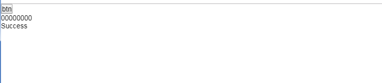

## u接口

```
/**
 * @auth chengrui
 * 2019/12/3
 */

//数据查询
public class OweQueryController {

    @GetMapping("/oweInfo")
    @ResponseBody
    public OweQueryResponseDto queryResponse(String queryType, String inputNo
    ,HttpServletResponse response1) throws Exception {

        checkParam(queryType,inputNo);

        List<Map<String,String>> accountNos = new ArrayList<Map<String,String>>();

        OweQueryResponse response = new OweQueryResponse();

        if("0".equals(queryType)){
            Map<String,String> map = new HashMap<String,String>();
            map.put("accountNo", inputNo);
            //根据分账序号查询
            accountNos.add(map);
        }else {
            throw new Exception("查询失败");
        }

        response.setErrcode("00000000");
        response.setErrDesc("Success");

		//允许所有来源访问
        response1.addHeader("Access-Control-Allow-Origin","*");
        //允许访问的方式 
        response1.addHeader("Access-Control-Allow-Method","POST,GET");
        response1.addHeader("cache-control","no-cache");

        System.out.println("-----");
        System.out.println(response);
        return response;
    }
}

```

## 实体

```
@Data
public class OweQueryResponse {

    private String errcode;

    private String errDesc;
    }
```

## html

```
<!DOCTYPE html>
<html>
	<head>
		<meta charset="utf-8" />
		<meta http-equiv="Access-Control-Allow-Origin" content="*" />
		<title>ajax测试</title>
	</head>
	<link rel="stylesheet" href="css/layui.css">
	<script src="js/jquery-3.3.1.min.js"></script>
	
	<body>
		
		<button id="btn">btn</button>
		
		<div id="divs">
		</div>
		
		<script type="text/x-javascript">
			
				$('#btn').click(function(){	
					$.ajax({
				                type:"GET",
				                url:"http://127.0.0.1:8080/oweInfo",
				                data:{
				                    "queryType":1,
				                    "inputNo":1234
				                },
				                dataType:"json",
				                success:function(data){
									//alert(data["errcode"]);
				      //              alert(data.errcode);
								  //   alert(data.errDesc);
									 // alert(data.record);
									 $("#divs").append(data.errcode+"<br/>");
									 $("#divs").append(data.errDesc+"<br/>");
									 $("#divs").append(data.record);
				                },
				                error:function(){
				                    alert("错了");
				                }
				    });
				})

		</script>
	</body>
</html>

```


调用成功！




## 常见使用

### 执行前后

```
$('#btn').click(function(){	
				$.ajax({
				    type:"GET",
				    url:"http://127.0.0.1:8080/oweInfo",
				    data:{
				        "queryType":1,
				         "inputNo":1234
				    },
				     dataType:"json",
						//返回数据之前执行
					beforeSend: function () {
						alert("start!")
					},
				    success:function(data){
						$("#divs").append(data.errcode+"<br/>");
						$("#divs").append(data.errDesc+"<br/>");
						$("#divs").append(data.record);
				    },
					//返回数据之后执行
					complete: function () {
						alert("end!")
					},
				        error:function(){
				    alert("错了");
				    }
				});
			})
```

### 添加请求头 

```
$.ajax({
         type: type,
         headers: {
            'hName':'Hvalue'
         },
         url: url,
         data: data,
         beforeSend: function () {
						alert("start!")
		},
         success: function(data) {
         },
         error: function(err) {
         },
         complete: function(XMLHttpRequest, status) { //请求完成后最终执行参数　
   
```


