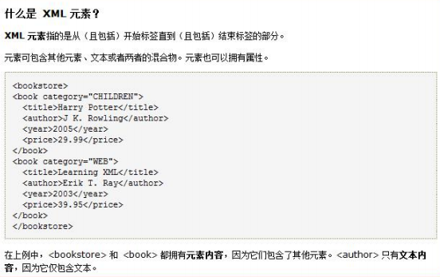

## 什么是XML

xml 是可扩展的标记性语言。 


## 作用

1、用来保存数据，而且这些数据具有自我描述性 

2、它还可以做为项目或者模块的配置文件 

3、还可以做为网络传输数据的格式（现在 JSON 为主）。


## **xml** **语法**

\1. 文档声明。 

\2. 元素（标签） 

\3. xml 属性 

\4. xml 注释 

\5. 文本区域（CDATA 区


## 文档声明

```xml
<?xml version="1.0" encoding="UTF-8"?>
<books>
    <book sn="sn123">
        <name>三国</name>
        <author>罗贯中</author>
        <price>100</price>
    </book>
    <book sn="sn12311">
        <name>红楼</name>
        <author>曹雪芹</author>
        <price>100</price>
    </book>
</books>
```

<?xml version=*"1.0"* encoding=*"UTF-8"*?> xml 声明。 

<!-- xml 声明 version 是版本的意思 

encoding 是编码 --> 

而且这个<?xml 要连在一起写，否则会有报错 

**属性**

version 

是版本号 

encoding 

是 xml 的文件编码 

standalone="yes/no" 

表示这个 xml 文件是否是独立的 xml 文件


## **xml** **注释** 

html 和 XML 注释 一样 : <!-- html 注释 -->


## **元素（标签）** 

### **什么是** **xml** **元素**



**元素是指从开始标签到结束标签的内容。** 

**例如：**<title>java **编程思想**</title>

**元素** 

**我们可以简单的理解为是** 

**标签。** 

**Element** **翻译 元素**


### **XML** **命名规则**

名称可以含字母、数字以及其他的字符 

名称不能以数字或者标点符号开始 

名称不能以字符 “xml”（或者 XML、Xml）开始 （它是可以的）

名称不能包含空格


xml中的元素（标签）也 分成 单标签和双标签：

​	单标签

​				格式： <标签名 属性=”值” 属性=”值” ...... /> 

​	双标签

​				格式：< 标签名 属性=”值” 属性=”值” ......>文本数据或子标签</标签名>


## **xml** **属性**

xml 的标签属性和 html 的标签属性是非常类似的，**属性可以提供元素的额外信息** 

​	在标签上可以书写属性： 

​			一个标签上可以书写多个属性。**每个属性的值必须使用 引号 引起来**。 

​			的规则和标签的书写规则一致


**属性必须使用引号引起来，不引会报错示例代码**


## **语法规则：**

**所有** **XML** **元素都须有关闭标签（也就是闭合）** 

**XML** **标签对大小写敏感**

**XML** **必须正确地嵌套**

**XML** **文档必须有根元素** 

**XML** **的属性值须加引号**

**XML** **中的特殊字符** 

**文本区域（**CDATA **区）**

​		CDATA 语法可以告诉 xml 解析器，我 CDATA 里的文本内容，只是纯文本，不需要 xml 语法解析 

​		CDATA 格式： 

​		**<![CDATA[** 这里可以把你输入的字符原样显示，不会解析 xml **]]>**


## **xml** **解析技术介绍**

xml 可扩展的标记语言。 

不管是 html 文件还是 xml 文件它们都是标记型文档，都可以使用 w3c 组织制定的 dom 技术来解析。


document 对象表示的是整个文档（可以是 html 文档，也可以是 xml 文档）


**早期** **JDK** **为我们提供了两种** **xml** **解析技术** **DOM** **和** **Sax** **简介（**已经过时)


dom 解析技术是 W3C 组织制定的，而所有的编程语言都对这个解析技术使用了自己语言的特点进行实现。 

Java 对 dom 技术解析标记也做了实现。 

sun 公司在 JDK5 版本对 dom 解析技术进行升级：SAX（ Simple API for XML ） 

SAX 解析，它跟 W3C 制定的解析不太一样。它是以类似事件机制通过回调告诉用户当前正在解析的内容。 

它是一行一行的读取 xml 文件进行解析的。不会创建大量的 dom 对象。 

所以它在解析 xml 的时候，在内存的使用上。和性能上。都优于 Dom 解析。 


第三方的解析： 

jdom 在 dom 基础上进行了封装 、 

**dom4j** 又对 jdom 进行了封装。 

pull 主要用在 Android 手机开发，是在跟 sax 非常类似都是事件机制解析 xml 文件。 


这个 Dom4j 它是第三方的解析技术。我们需要使用第三方给我们提供好的类库才可以解析 xml 文件。


## **Dom4j** **类库的使用** 

第一步： 先加载 xml 文件创建 Document 对象 

第二步：通过 Document 对象拿到根元素对象 

第三步：通过根元素.elelemts(标签名); 可以返回一个集合，这个集合里放着。所有你指定的标签名的元素对象 

第四步：找到你想要修改、删除的子元素，进行相应在的操作 

第五步，保存到硬盘上

```xml
        <dependency>
            <groupId>dom4j</groupId>
            <artifactId>dom4j</artifactId>
            <version>1.6.1</version>
        </dependency>
```


```java
 public static void main(String[] args) throws DocumentException {
        // 要创建一个 Document 对象，需要我们先创建一个 SAXReader 对象
        SAXReader reader = new SAXReader();
        // 这个对象用于读取 xml 文件，然后返回一个 Document。
        Document document = reader.read("src\\main\\resources\\test.xml");
        // 打印到控制台，看看是否创建成功
        System.out.println(document);

        //通过Document对象拿到根元素对象
        Element root = document.getRootElement();
        //System.out.println("根元素：" + root.asXML());
        //<books>
        //    <book sn="sn123">
        //        <name>三国</name>
        //        <author>罗贯中</author>
        //        <price>100</price>
        //    </book>
        //    <book sn="sn12311">
        //        <name>红楼</name>
        //        <author>曹雪芹</author>
        //        <price>100</price>
        //    </book>
        //</books>


        //通过根元素对象。获取所有的 book 标签对象
        //root.elements("book");返回多个元素
        //root.element("book");返回单个元素
        List<Element> books = root.elements("book");

        //遍历每个 book 标签对象。然后获取到 book 标签对象内的每一个元素，
        for (Element book : books) {
            // 测试
            // System.out.println(book.asXML());
            // 拿到 book 下面的 name 元素对象
            Element nameElement = book.element("name");
            // 拿到 book 下面的 price 元素对象
            Element priceElement = book.element("price");
            // 拿到 book 下面的 author 元素对象
            Element authorElement = book.element("author");
            // 再通过 getText() 方法拿到起始标签和结束标签之间的文本内容
            System.out.println("书名" + nameElement.getText() + " , 价格:" + priceElement.getText() + ", 作者：" + authorElement.getText());
            //直接获取指定标签明的文本
            System.out.println(book.elementText("name"));
            //获取属性值的内容

            System.out.println(book.attributeValue("sn"));

            System.out.println();
        }


    }
```


```
书名三国 , 价格:100, 作者：罗贯中
三国
sn123

书名红楼 , 价格:100, 作者：曹雪芹
红楼
sn12311

```


