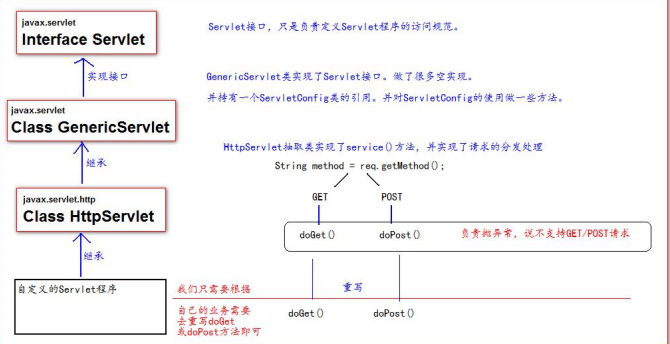
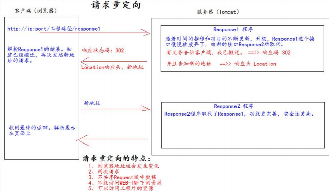

## **什么是** **Servlet**

1、Servlet 是 JavaEE 规范之一。规范就是接口 

2、Servlet 就 JavaWeb 三大组件之一。三大组件分别是：Servlet 程序、Filter 过滤器、Listener 监听器。 

3、Servlet 是运行在服务器上的一个 java 小程序，它可以**接收客户端发送过来的请求，并响应数据给客户端**。


## 手写一个Servlet程序

```java
package com.mrchengs.servlet;

import javax.servlet.*;
import java.io.IOException;

public class HelloServlet implements Servlet {
    @Override
    public void init(ServletConfig servletConfig) throws ServletException {

    }

    @Override
    public ServletConfig getServletConfig() {
        return null;
    }

    /**
     * 专门用来处理请求和响应的方法
     * @param servletRequest
     * @param servletResponse
     * @throws ServletException
     * @throws IOException
     */
    @Override
    public void service(ServletRequest servletRequest, ServletResponse servletResponse) throws ServletException, IOException {
        System.out.println("service ... ");
    }

    @Override
    public String getServletInfo() {
        return null;
    }

    @Override
    public void destroy() {

    }
}

```


```xml
    <!--servlet标签给tomcat配置servlet程序 -->
    <servlet>
        <servlet-name>helloServlet</servlet-name>
        <servlet-class>com.mrchengs.servlet.HelloServlet</servlet-class>
    </servlet>
    <!--给servlet程序配置访问地址-->
    <servlet-mapping>
        <servlet-name>helloServlet</servlet-name>
        <!--配置访问地址-->
        <!--
         斜杠在服务器解析的时候，表示地址为：http://ip:port/工程路径 <br/> /hello 表示地址为：http://ip:port/工程路径/hello <br/>
        -->
        <url-pattern>/hello</url-pattern>
    </servlet-mapping>
```

http://localhost:8080/web_war_exploded/hello

service ... 


## **Servlet** **的生命周期**

1、执行 Servlet 构造器方法 


2、执行 init 初始化方法 

第一、二步，是在第一次访问，的时候创建 Servlet 程序会调用。 


3、执行 service 方法 

第三步，每次访问都会调用。 


4、执行 destroy 销毁方法 

第四步，在 web 工程停止的时候调用


```java
package com.mrchengs.servlet;

import javax.servlet.*;
import java.io.IOException;

public class HelloServlet implements Servlet {
    @Override
    public void init(ServletConfig servletConfig) throws ServletException {
        System.out.println("init ... ");
    }

    @Override
    public ServletConfig getServletConfig() {
        return null;
    }

    /**
     * 专门用来处理请求和响应的方法
     * @param servletRequest
     * @param servletResponse
     * @throws ServletException
     * @throws IOException
     */
    @Override
    public void service(ServletRequest servletRequest, ServletResponse servletResponse) throws ServletException, IOException {
        System.out.println("service ... ");
    }

    @Override
    public String getServletInfo() {
        return null;
    }

    @Override
    public void destroy() {
        System.out.println("destroy ...");
    }
}

```

http://localhost:8080/web_war_exploded/hello

```
init ... 
service ... 
service ... 
service ... 
D:\apache-tomcat-8.5.34\bin\catalina.bat stop
Using CATALINA_BASE:   "D:\Tools3\IDEA\iDeaIU_v201922\ideaIU-2019.2.2.win\bin\IdeaConfig\system\tomcat\Tomcat_8_5_34_javaweb"
Using CATALINA_HOME:   "D:\apache-tomcat-8.5.34"
Using CATALINA_TMPDIR: "D:\apache-tomcat-8.5.34\temp"
Using JRE_HOME:        "C:\Program Files\Java\jdk1.8.0_101"
Using CLASSPATH:       "D:\apache-tomcat-8.5.34\bin\bootstrap.jar;D:\apache-tomcat-8.5.34\bin\tomcat-juli.jar"
21-Jun-2020 18:10:00.412 信息 [main] org.apache.catalina.core.StandardServer.await A valid shutdown command was received via the shutdown port. Stopping the Server instance.
21-Jun-2020 18:10:00.412 信息 [main] org.apache.coyote.AbstractProtocol.pause Pausing ProtocolHandler ["http-nio-8080"]
21-Jun-2020 18:10:01.131 信息 [main] org.apache.coyote.AbstractProtocol.pause Pausing ProtocolHandler ["ajp-nio-8009"]
21-Jun-2020 18:10:01.833 信息 [main] org.apache.catalina.core.StandardService.stopInternal Stopping service [Catalina]
destroy ...
```


## **GET** **和** **POST** **请求的分发处理**

```html
<!DOCTYPE html>
<html lang="en">
<head>
    <meta charset="UTF-8">
    <title>Title</title>
</head>
<body>
    <form action="http://localhost:8080/web_war_exploded/hello" method="post">
        <input type="submit">

    </form>

</body>
</html>
```

http://localhost:8080/web_war_exploded/a.html  

init ... 
service ... 
service ... 


```java
  /**
     * 专门用来处理请求和响应的方法
     * @param servletRequest
     * @param servletResponse
     * @throws ServletException
     * @throws IOException
     */
    @Override
    public void service(ServletRequest servletRequest, ServletResponse servletResponse) throws ServletException, IOException {
        System.out.println("service ... ");

        //得到请求方式
        HttpServletRequest httpServletRequest = (HttpServletRequest) servletRequest;
        //获取请求方式
        String method = httpServletRequest.getMethod();
        System.out.println("method:" + method);

        if ("GET".equals(method)){
            doGet();
        }else if ("POST".equals(method)){
            doPost();
        }
    }

    /*** 做 get 请求的操作 */
    public void doGet(){
        System.out.println("get 请求");
        System.out.println("get 请求");
    }
    /*** 做 post 请求的操作 */
    public void doPost(){
        System.out.println("post 请求");
        System.out.println("post 请求");
    }
```

点击按钮：

init ... 
service ... 
method:POST
post 请求
post 请求


http://localhost:8080/web_war_exploded/hello

service ... 
method:GET
get 请求
get 请求


## **通过继承** **HttpServlet** **实现** **Servlet** **程序**

一般在实际项目开发中，都是使用继承 HttpServlet 类的方式去实现 Servlet 程序。 

1、编写一个类去继承 HttpServlet 类 

2、根据业务需要重写 doGet 或 doPost 方法 

3、到 web.xml 中的配置 Servlet 程序的访问地址


```java
package com.mrchengs.servlet;

import javax.servlet.ServletException;
import javax.servlet.http.HttpServlet;
import javax.servlet.http.HttpServletRequest;
import javax.servlet.http.HttpServletResponse;
import java.io.IOException;

public class HelloServletTwo extends HttpServlet {

    /**
     * 在Get请求时调用
     * @param req
     * @param resp
     * @throws ServletException
     * @throws IOException
     */
    @Override
    protected void doGet(HttpServletRequest req, HttpServletResponse resp) throws ServletException, IOException {
        //super.doGet(req, resp);
        System.out.println("doGet....");
    }

    /**
     * 在post请求时进行调用
     * @param req
     * @param resp
     * @throws ServletException
     * @throws IOException
     */
    @Override
    protected void doPost(HttpServletRequest req, HttpServletResponse resp) throws ServletException, IOException {
       //super.doPost(req, resp);
        System.out.println("doPost....");
    }
}

```


```xml
   <servlet>
        <servlet-name>helloServlet2</servlet-name>
        <servlet-class>com.mrchengs.servlet.HelloServletTwo</servlet-class>
    </servlet>
    <servlet-mapping>
        <servlet-name>helloServlet2</servlet-name>

        <url-pattern>/hello2</url-pattern>
    </servlet-mapping>
```


```html
    <form action="http://localhost:8080/web_war_exploded/hello2" method="post">
        <input type="submit">

    </form>
```


http://localhost:8080/web_war_exploded/hello2

doGet....


点击按钮

doPost....


## **使用** **IDEA** **创建** **Servlet** **程序**


```java
package com.mrchengs.servlet;

import javax.servlet.ServletException;
import javax.servlet.http.HttpServlet;
import javax.servlet.http.HttpServletRequest;
import javax.servlet.http.HttpServletResponse;
import java.io.IOException;

/**
 * @author ccrr
 */
public class HttpServlet3 extends HttpServlet {
    @Override
    protected void doPost(HttpServletRequest request, HttpServletResponse response) throws ServletException, IOException {
        System.out.println("hello3 ");
    }

    @Override
    protected void doGet(HttpServletRequest request, HttpServletResponse response) throws ServletException, IOException {
        doPost(request,response);
    }
}

```

http://localhost:8080/web_war_exploded/hello3

hello3 


## **Servlet** **类的继承体系**




## **ServletConfig**

ServletConfig 类从类名上来看，就知道是 Servlet 程序的配置信息类。 

Servlet 程序和 ServletConfig 对象都是由 Tomcat 负责创建，我们负责使用。 

Servlet 程序默认是第一次访问的时候创建，ServletConfig 是每个 Servlet 程序创建时，就创建一个对应的 ServletConfig 对 象。


### **ServletConfig** **类的三大作用**

1、可以获取 Servlet 程序的别名 servlet-name 的值 

2、获取初始化参数 init-param 

3、获取 ServletContext 对象


```xml
 <servlet>
        <servlet-name>helloServlet</servlet-name>
        <servlet-class>com.mrchengs.servlet.HelloServlet</servlet-class>
        <!--初始胡参数 -->
        <init-param>
            <param-name>username</param-name>
            <param-value>mrchengs</param-value>
        </init-param>
    </servlet>
    <servlet-mapping>
        <servlet-name>helloServlet</servlet-name>
        <url-pattern>/hello</url-pattern>
    </servlet-mapping>
```


```java
public class HelloServlet implements Servlet {
    @Override
    public void init(ServletConfig servletConfig) throws ServletException {
        System.out.println("init ... ");

        //1获取servlet程序的别名servlet-name
        System.out.println("init servlet-name :" + servletConfig.getServletName());

        //2获取初始化参数
        System.out.println("初始化参数值：" + servletConfig.getInitParameter("username"));

        //3获取 ServletContext 对象
        System.out.println(servletConfig.getServletContext());
    }
    
    ....
    }
```

http://localhost:8080/web_war_exploded/hello

init ... 
init servlet-name :helloServlet
初始化参数值：mrchengs
org.apache.catalina.core.ApplicationContextFacade@71ad8b1


**重写init方法里面一定要调用父类的init(ServletConfig)操作**


## **ServletContext** **类**

### **什么是** **ServletContext?**

1、ServletContext 是一个接口，它表示 Servlet 上下文对象 

2、一个 web 工程，只有一个 ServletContext 对象实例。 

3、ServletContext 对象是一个域对象。 

4、ServletContext 是在 web 工程部署启动的时候创建。在 web 工程停止的时候销毁。 

什么是域对象? 

域对象，是可以像 Map 一样存取数据的对象，叫域对象。 

这里的域指的是存取数据的操作范围，整个 web 工程。


​			存数据        取数据      删除 数据 

Map     put()         get()         remove() 

域对象 setAttribute()    getAttribute()    removeAttribute();


### **ServletContext** **类的四个作用**

1、获取 web.xml 中配置的上下文参数 context-param 

2、获取当前的工程路径，格式: /工程路径 

3、获取工程部署后在服务器硬盘上的绝对路径 

4、像 Map 一样存取数据 


验证123

```xml
   <!--context-param 是上下文参数(它属于整个 web 工程)-->
    <context-param>
        <param-name>username</param-name>
        <param-value>mrchengs</param-value>
    </context-param>
    <context-param>
        <param-name>password</param-name>
        <param-value>1234</param-value>
    </context-param>

    <servlet>
        <servlet-name>Servlet3</servlet-name>
        <servlet-class>com.mrchengs.servlet.HttpServlet3</servlet-class>
    </servlet>
    <servlet-mapping>
        <servlet-name>Servlet3</servlet-name>
        <url-pattern>/hello3</url-pattern>
    </servlet-mapping>
```


```java
public class HttpServlet3 extends HttpServlet {
    @Override
    protected void doPost(HttpServletRequest request, HttpServletResponse response) throws ServletException, IOException {
        //获取web.xml中的context-param
        ServletContext servletContext = getServletConfig().getServletContext();

        System.out.println("context username:" +servletContext.getInitParameter("username"));
        System.out.println("context password:"+servletContext.getInitParameter("password"));

        //获取当前的工程路径，格式: /工程路径
        System.out.println("获取当前的工程路径:" + servletContext.getContextPath());
        /*** / 斜杠被服务器解析地址为:http://ip:port/工程名/ 映射到 IDEA 代码的 web 目录<br/> */
        System.out.println("工程部署的路径是:" + servletContext.getRealPath("/"));
        System.out.println("工程下 css 目录的绝对路径是:" + servletContext.getRealPath("/css"));

    }

    @Override
    protected void doGet(HttpServletRequest request, HttpServletResponse response) throws ServletException, IOException {
        doPost(request,response);
    }
}

```


context username:mrchengs
context password:1234
获取当前的工程路径:/web_war_exploded
工程部署的路径是:D:\SecondProject\javaweb\out\artifacts\web_war_exploded\
工程下 css 目录的绝对路径是:D:\SecondProject\javaweb\out\artifacts\web_war_exploded\css


验证4

```java
public class HttpServlet3 extends HttpServlet {
    @Override
    protected void doPost(HttpServletRequest request, HttpServletResponse response) throws ServletException, IOException {
        // 获取 ServletContext 对象
        ServletContext context = getServletContext();
        System.out.println(context);
        System.out.println("保存之前: Context1 获取 key1 的值是:"+ context.getAttribute("key1"));
        context.setAttribute("key1", "value1");
        System.out.println("Context1 中获取域数据 key1 的值是:"+ context.getAttribute("key1"));

    }

    @Override
    protected void doGet(HttpServletRequest request, HttpServletResponse response) throws ServletException, IOException {
        doPost(request,response);
    }
}

```

org.apache.catalina.core.ApplicationContextFacade@11cf82d7
保存之前: Context1 获取 key1 的值是:null
Context1 中获取域数据 key1 的值是:value1


## **HttpServletRequest**


### **类有什么作用**

每次只要有请求进入 Tomcat 服务器，Tomcat 服务器就会把请求过来的 HTTP 协议信息解析好封装到 Request 对象中。 

然后传递到 service 方法（doGet 和 doPost）中给我们使用。我们可以通过 HttpServletRequest 对象，获取到所有请求的 信息。 


### **类的常用方法**

i.     getRequestURI()      获取请求的资源路径 

ii.    getRequestURL()     获取请求的统一资源定位符（绝对路径） 

iii.   getRemoteHost()     获取客户端的 ip 地址 

iv.    getHeader()            获取请求头 

v.     getParameter()      获取请求的参数 

vi.    getParameterValues()     获取请求的参数（多个值的时候使用） 

vii.    getMethod()         获取请求的方式 GET 或 POST 

viii.     setAttribute(key, value);      设置域数据 

ix.     getAttribute(key);     获取域数据 

x.    getRequestDispatcher()     获取请求转发对象


```java
package com.mrchengs.servlet;

import javax.servlet.ServletException;
import javax.servlet.http.HttpServlet;
import javax.servlet.http.HttpServletRequest;
import javax.servlet.http.HttpServletResponse;
import java.io.IOException;

/**
 * @author ccrr
 */
public class RequestAPIServlet extends HttpServlet {

    @Override
    protected void doGet(HttpServletRequest req, HttpServletResponse resp) throws ServletException, IOException {

        //获取请求的资源路径
        System.out.println("URI => " + req.getRequestURI());
        //获取请求的统一资源定位符（绝对路径）
        System.out.println("URL => " + req.getRequestURL());
        //获取客户端的 ip 地址
        System.out.println("客户端 ip 地址 => " + req.getRemoteHost());
        //获取请求头
        System.out.println("请求头 User-Agent ==>> " + req.getHeader("User-Agent"));
        //获取请求的方式 GET 或 POST
        System.out.println( "请求的方式 ==>> " + req.getMethod() );

    }

    @Override
    protected void doPost(HttpServletRequest req, HttpServletResponse resp) throws ServletException, IOException {
       doGet(req,resp);
    }
}

```

```xml
    <servlet>
        <servlet-name>Servlet4</servlet-name>
        <servlet-class>com.mrchengs.servlet.RequestAPIServlet</servlet-class>
    </servlet>
    <servlet-mapping>
        <servlet-name>Servlet4</servlet-name>
        <url-pattern>/requestservlet</url-pattern>
    </servlet-mapping>

```

http://localhost:8080/web_war_exploded/requestservlet


URI => /web_war_exploded/requestservlet
URL => http://localhost:8080/web_war_exploded/requestservlet
客户端 ip 地址 => 0:0:0:0:0:0:0:1
请求头 User-Agent ==>> Mozilla/5.0 (Windows NT 10.0; Win64; x64) AppleWebKit/537.36 (KHTML, like Gecko) Chrome/80.0.3987.149 Safari/537.36
请求的方式 ==>> GET


### **如何获取请求参数** 


```java
package com.mrchengs.servlet;

import javax.servlet.ServletException;
import javax.servlet.http.HttpServlet;
import javax.servlet.http.HttpServletRequest;
import javax.servlet.http.HttpServletResponse;
import java.io.IOException;
import java.util.Arrays;

/**
 * @author ccrr
 */
public class RequestAPIServlet extends HttpServlet {

    @Override
    protected void doGet(HttpServletRequest req, HttpServletResponse resp) throws ServletException, IOException {
        // 获取请求参数
        String username = req.getParameter("username");
        String password = req.getParameter("password");
        String[] hobby = req.getParameterValues("hobby");
        System.out.println("用户名：" + username);
        System.out.println("密码：" + password);
        System.out.println("兴趣爱好：" +  Arrays.asList(hobby));
    }

    @Override
    protected void doPost(HttpServletRequest req, HttpServletResponse resp) throws ServletException, IOException {
       doGet(req,resp);
    }
}

```


```html
    <form action="http://localhost:8080/web_war_exploded/requestservlet" method="get">
        用户名：<input type="text" name="username"><br/>
        密码：<input type="password" name="password"><br/>
        兴趣爱好：<input type="checkbox" name="hobby" value="cpp">C++
        <input type="checkbox" name="hobby" value="java">Java
        <input type="checkbox" name="hobby" value="js">JavaScript<br/>
        <input type="submit">
    </form>
```


[http://localhost:8080/web_war_exploded/requestservlet?username=mrchengs&password=%601234&hobby=java](http://localhost:8080/web_war_exploded/requestservlet?username=mrchengs&password=`1234&hobby=java)


用户名：mrchengs
密码：`1234
兴趣爱好：[java]


http://localhost:8080/web_war_exploded/requestservlet?username=mrchengs&password=4332334&hobby=cpp&hobby=java

用户名：mrchengs
密码：4332334
兴趣爱好：[cpp, java]


### **doGet** **请求的中文乱码解决：** 

```java
    // 获取请求参数
        String username = req.getParameter("username");

        //1 先以 iso8859-1 进行编码
        // 2 再以 utf-8 进行解码
       username = new String(username.getBytes("iso-8859-1"), "UTF-8");
```


### **POST** **请求的中文乱码解决**

```java
    protected void doPost(HttpServletRequest req, HttpServletResponse resp) throws ServletException, IOException {
        //// 设置请求体的字符集为 UTF-8，从而解决 post 请求的中文乱码问题
        req.setCharacterEncoding("UTF-8");
       doGet(req,resp);
    }
```


### **请求的转发**

请求转发是指，服务器收到请求后，从一次资源跳转到另一个资源的操作叫请求转发。


```java
public class HttpServlet3 extends HttpServlet {
    @Override
    protected void doPost(HttpServletRequest request, HttpServletResponse response) throws ServletException, IOException {
        // 获取请求的参数查看
        String username = request.getParameter("username");
        System.out.println("在 Servlet1（柜台 1）中查看参数（材料）：" + username);

        // 给材料 盖一个章，并传递到 Servlet2（柜台 2）去查看
        request.setAttribute("key1","柜台 1 的章");

        //请求转发必须要以斜杠打头，/ 斜杠表示地址为：http://ip:port/工程名/ , 映射到 IDEA 代码的 web 目录
        RequestDispatcher requestDispatcher = request.getRequestDispatcher("/hello2");

        // 走向 Sevlet2（柜台 2）
        requestDispatcher.forward(request,response);
    }

```


```java
  @Override
    protected void doGet(HttpServletRequest req, HttpServletResponse resp) throws ServletException, IOException {

        String username = req.getParameter("username");
        System.out.println("在 Servlet2（柜台 2）中查看参数（材料）：" + username);

        Object key1 = req.getAttribute("key1");
        System.out.println("柜台 1 是否有章：" + key1);

        // 处理自己的业务
        System.out.println("Servlet2 处理自己的业务 ");
    }
```

http://localhost:8080/web_war_exploded/hello3?username=mrchengs

在 Servlet1（柜台 1）中查看参数（材料）：mrchengs
在 Servlet2（柜台 2）中查看参数（材料）：mrchengs
柜台 1 是否有章：柜台 1 的章
Servlet2 处理自己的业务 


### **base** **标签的作用**

```html
<html lang="zh_CN">
<head>
    <meta charset="UTF-8">
    <title>Title</title>
    <!--base 标签设置页面相对路径工作时参照的地址 href 属性就是参数的地址值 -->
    <base href="http://localhost:8080/07_servlet/a/b/">
</head>
<body>
    这是 a 下的 b 下的 c.html 页面<br/>
    <a href="../../index.html">跳回首页</a>< br/> 
</body> 
</html>
```


### **Web** **中的相对路径和绝对路径** 

在 javaWeb 中，路径分为相对路径和绝对路径两种： 

相对路径是： 

.                   表示当前目录 

..                  表示上一级目录 

资源名        表示当前目录/资源名 


绝对路径： 

http://ip:port/工程路径/资源路径 


在实际开发中，路径都使用绝对路径，而不简单的使用相对路径。 

1、绝对路径 

2、base+相对


### **web** **中** **/** **斜杠的不同意义** 


在 web 中 / 斜杠 是一种绝对路径。 

/ 斜杠 如果被浏览器解析，得到的地址是：http://ip:port/ 

\<a href="/">斜杠\</a>


/ 斜杠 如果被服务器解析，得到的地址是：http://ip:port/工程路径 

1、<**url-pattern**>/servlet1</**url-pattern**> 

2、servletContext.getRealPath(“/”); 

3、request.getRequestDispatcher(“/”);


特殊情况： response.sendRediect(“/”); 

把斜杠发送给浏览器解析。得到 http://ip:port/


## **HttpServletResponse**

### **类的作用**

HttpServletResponse 类和 HttpServletRequest 类一样。每次请求进来，Tomcat 服务器都会创建一个 Response 对象传 

递给 Servlet 程序去使用。HttpServletRequest 表示请求过来的信息，HttpServletResponse 表示所有响应的信息， 

我们如果需要设置返回给客户端的信息，都可以通过 HttpServletResponse 对象来进行设置


### **两个输出流的说明。**

字节流   getOutputStream();   常用于下载（传递二进制数据） 

字符流   getWriter();      常用于回传字符串（常用）


两个流同时只能使用一个。 

使用了字节流，就不能再使用字符流，反之亦然，否则就会报错。


### **如何往客户端回传数据** 

```java
    @Override
    protected void doGet(HttpServletRequest req, HttpServletResponse resp) throws ServletException, IOException {
        // 要求 ： 往客户端回传 字符串 数据。
        PrintWriter writer = resp.getWriter();
        writer.write("response's content!!!");
    }

```


### **响应的乱码解决** 

解决响应中文乱码方案一（不推荐使用）：

```java
// 设置服务器字符集为 UTF-8 
resp.setCharacterEncoding("UTF-8"); 
// 通过响应头，设置浏览器也使用 UTF-8 字符集 
resp.setHeader("Content-Type", "text/html; charset=UTF-8");
```


解决响应中文乱码方案二（推荐）： 	

```java
// 它会同时设置服务器和客户端都使用 UTF-8 字符集，还设置了响应头 
// 此方法一定要在获取流对象之前调用才有效 
resp.setContentType("text/html; charset=UTF-8");
```


### **请求重定向**

请求重定向，是指客户端给服务器发请求，然后服务器告诉客户端说。我给你一些地址。你去新地址访问。叫请求 

重定向（因为之前的地址可能已经被废弃）。





请求重定向的第一种方案： 

*//* *设置响应状态码* *302* *，表示重定向，（已搬迁）* 

resp.setStatus(302); 

*//* *设置响应头，说明 新的地址在哪里* 

resp.setHeader(**"Location"**, **"http://localhost:8080"**); 


请求重定向的第二种方案（推荐使用）： 

resp.sendRedirect(**"http://localhost:8080"**);