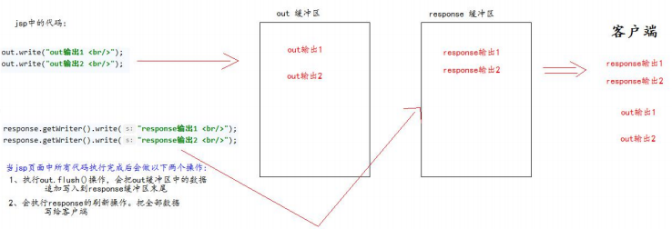

## **什么是** **jsp**

jsp 的全换是 java server pages。Java 的服务器页面。 

jsp 的主要作用是代替 Servlet 程序回传 html 页面的数据。 

因为 Servlet 程序回传 html 页面数据是一件非常繁锁的事情。开发成本和维护成本都极高。


Servlet 回传 html 页面数据的代码：

```java
// 通过响应的回传流回传 html 页面数据 
resp.setContentType("text/html; charset=UTF-8"); 

PrintWriter writer = resp.getWriter(); 
writer.write("<!DOCTYPE html>\r\n"); 
writer.write(" <html lang=\"en\">\r\n");
writer.write(" <head>\r\n"); 
writer.write(" <meta charset=\"UTF-8\">\r\n"); 
writer.write(" <title>Title</title>\r\n");
writer.write(" </head>\r\n"); 
writer.write(" <body>\r\n"); 
writer.write(" 这是 html 页面数据 \r\n"); 
writer.write(" </body>\r\n"); 
writer.write("</html>\r\n"); 
writer.write("\r\n");
```


## **本质是什么**

jsp 页面本质上是一个 Servlet 程序。 

当我们第一次访问 jsp 页面的时候。Tomcat 服务器会帮我们把 jsp 页面翻译成为一个 java 源文件。并且对它进行编译成为.class 字节码程序。我们打开 java 源文件不难发现其里面的内容是：

```java
public final class index_jsp extends HttpJspBase implements JspSourceDependent, JspSourceImports {
    private static final JspFactory _jspxFactory = JspFactory.getDefaultFactory();
    private static Map<String, Long> _jspx_dependants;
    private static final Set<String> _jspx_imports_packages = new HashSet();
    private static final Set<String> _jspx_imports_classes;
    private volatile ExpressionFactory _el_expressionfactory;
    private volatile InstanceManager _jsp_instancemanager;
    ...
}
```


我们跟踪原代码发现，HttpJspBase 类。它直接地继承了 HttpServlet 类。也就是说。jsp 翻译出来的 java 类，它间接了继 承了 HttpServlet 类。也就是说，翻译出来的是一个 Servlet 程序


总结：通过翻译的 java 源代码我们就可以得到结果：jsp 就是 Servlet 程序。 

大家也可以去观察翻译出来的 Servlet 程序的源代码，不难发现。其底层实现，也是通过输出流。把 html 页面数据回传 给客户端。 

```java
 public void _jspService(final javax.servlet.http.HttpServletRequest request, final javax.servlet.http.HttpServletResponse response)
      throws java.io.IOException, javax.servlet.ServletException {

    final java.lang.String _jspx_method = request.getMethod();
    if (!"GET".equals(_jspx_method) && !"POST".equals(_jspx_method) && !"HEAD".equals(_jspx_method) && !javax.servlet.DispatcherType.ERROR.equals(request.getDispatcherType())) {
      response.sendError(HttpServletResponse.SC_METHOD_NOT_ALLOWED, "JSPs only permit GET POST or HEAD");
      return;
    }

    final javax.servlet.jsp.PageContext pageContext;
    javax.servlet.http.HttpSession session = null;
    final javax.servlet.ServletContext application;
    final javax.servlet.ServletConfig config;
    javax.servlet.jsp.JspWriter out = null;
    final java.lang.Object page = this;
    javax.servlet.jsp.JspWriter _jspx_out = null;
    javax.servlet.jsp.PageContext _jspx_page_context = null;


    try {
      response.setContentType("text/html;charset=UTF-8");
      pageContext = _jspxFactory.getPageContext(this, request, response,
      			null, true, 8192, true);
      _jspx_page_context = pageContext;
      application = pageContext.getServletContext();
      config = pageContext.getServletConfig();
      session = pageContext.getSession();
      out = pageContext.getOut();
      _jspx_out = out;

      out.write("\n");
      out.write("\n");
      out.write("<html>\n");
      out.write("  <head>\n");
      out.write("    <title>$Title$</title>\n");
      out.write("  </head>\n");
      out.write("  <body>\n");
      out.write("  $END$\n");
      out.write("  </body>\n");
      out.write("</html>\n");
    } catch (java.lang.Throwable t) {
      if (!(t instanceof javax.servlet.jsp.SkipPageException)){
        out = _jspx_out;
        if (out != null && out.getBufferSize() != 0)
          try {
            if (response.isCommitted()) {
              out.flush();
            } else {
              out.clearBuffer();
            }
          } catch (java.io.IOException e) {}
        if (_jspx_page_context != null) _jspx_page_context.handlePageException(t);
        else throw new ServletException(t);
      }
    } finally {
      _jspxFactory.releasePageContext(_jspx_page_context);
    }
  }
}
```


## jsp的三种语法

### jsp头部的page指令

jsp 的 page 指令可以修改 jsp 页面中一些重要的属性，或者行为。

```java
<%@ page contentType="text/html;charset=UTF-8" language="java" %>
```


| 1    | language 属性     | 表示 jsp 翻译后是什么语言文件。暂时只支持 java。             |
| ---- | ----------------- | ------------------------------------------------------------ |
| 2    | contentType 属性  | 表示 jsp 返回的数据类型是什么。也是源码中 response.setContentType()参数值 |
| 3    | pageEncoding 属性 | 表示当前 jsp 页面文件本身的字符集。                          |
| 4    | import 属性       | 跟 java 源代码中一样。用于导包，导类。                       |


========================两个属性是给 out 输出流使用============================= 

| 5    | autoFlush      | 设置当 out 输出流缓冲区满了之后，是否自动刷新冲级区。默认值是 true。 |
| ---- | -------------- | ------------------------------------------------------------ |
| 6    | buffer         | 设置 out 缓冲区的大小。默认是 8kb                            |
| 7    | errorPage 属性 | 设置当 jsp 页面运行时出错，自动跳转去的错误页面路径。        |


| 9    | isErrorPage | 设置当前 jsp 页面是否是错误信息页面。默认是 false。如果是 true 可以 获取异常信息。 |
| ---- | ----------- | ------------------------------------------------------------ |
| 10   | session     | 设置访问当前 jsp 页面，是否会创建 HttpSession 对象。默认是 true。 |
| 11   | extends     | 设置 jsp 翻译出来的 java 类默认继承谁                        |


### **jsp** **中的常用脚本** 

#### 声明脚本(极少使用)

声明脚本的格式是： **<%!** 声明 java 代码 

**%>** 

作用：可以给 jsp 翻译出来的 java 类定义属性和方法甚至是静态代码块。内部类等。 

练习：

1、声明类属性 

2、声明 static 静态代码块 

3、声明类方法 

4、声明内部类 

```jsp
<%@ page import="java.util.HashMap" %>
<%@ page import="java.util.Map" %>
<%@ page contentType="text/html;charset=UTF-8" language="java" %>
<html>
  <head>
    <title>首页</title>
  </head>
  <body>
  $END$

  <%--1、声明类属性--%>
  <%!
    private Integer id;
    private String name;
    private static Map<String,Object> map;
  %>
  <%--2、声明 static 静态代码块--%>
  <%! static {
    map = new HashMap<String,Object>();
    map.put("key1", "value1");
    map.put("key2", "value2");
    map.put("key3", "value3"); }
  %>

  <%--3、声明类方法--%>
  <%!
    public int abc(){ return 12; }
  %>
      
      <%--4、声明内部类--%> 
      
      <%! public static class A { 
   			 private Integer id = 12; private String abc = "abc"; 
		} 
      %>


  </body>
</html>

```

编译之后

```java
public final class index_jsp extends org.apache.jasper.runtime.HttpJspBase
    implements org.apache.jasper.runtime.JspSourceDependent,
                 org.apache.jasper.runtime.JspSourceImports {


    private Integer id;
    private String name;
    private static Map<String,Object> map;
  
 static {
    map = new HashMap<String,Object>();
    map.put("key1", "value1");
    map.put("key2", "value2");
    map.put("key3", "value3"); }
  

    public int abc(){ return 12; }
                     
                     ...
                 }
```


#### 表达式脚本（常用）

表达式脚本的格式是：**<%=**表达式**%>** 

表达式脚本的作用是：的 jsp 页面上输出数据。 

表达式脚本的特点： 

1、所有的表达式脚本都会被翻译到_jspService() 方法中 

2、表达式脚本都会被翻译成为 out.print()输出到页面上 

3、由于表达式脚本翻译的内容都在_jspService() 方法中,所以_jspService()方法中的对象都可以直接使用。 

4、表达式脚本中的表达式不能以分号结束。 


```jsp
<%@ page import="java.util.HashMap" %>
<%@ page import="java.util.Map" %>
<%@ page contentType="text/html;charset=UTF-8" language="java" %>
<html>
  <head>
    <title>首页</title>
  </head>
  <body>
  $END$
  <%!
    private Integer id;
    private String name;
    private static Map<String,Object> map;
  %>
  <%--2、声明 static 静态代码块--%>
  <%! static {
    map = new HashMap<String,Object>();
    map.put("key1", "value1");
    map.put("key2", "value2");
    map.put("key3", "value3"); }
  %>

  <%=12 %> <br>
  <%=12.12 %> <br>
  <%="我是字符串" %> <br>
  <%=map%> <br>
  <%=request.getParameter("username")%>


  </body>
</html>

```

$END$ 12
12.12
我是字符串
{key1=value1, key2=value2, key3=value3}
null


源码：

```java
  public void _jspService(final javax.servlet.http.HttpServletRequest request, final javax.servlet.http.HttpServletResponse response)
      throws java.io.IOException, javax.servlet.ServletException {

    final java.lang.String _jspx_method = request.getMethod();
    if (!"GET".equals(_jspx_method) && !"POST".equals(_jspx_method) && !"HEAD".equals(_jspx_method) && !javax.servlet.DispatcherType.ERROR.equals(request.getDispatcherType())) {
      response.sendError(HttpServletResponse.SC_METHOD_NOT_ALLOWED, "JSPs only permit GET POST or HEAD");
      return;
    }

    final javax.servlet.jsp.PageContext pageContext;
    javax.servlet.http.HttpSession session = null;
    final javax.servlet.ServletContext application;
    final javax.servlet.ServletConfig config;
    javax.servlet.jsp.JspWriter out = null;
    final java.lang.Object page = this;
    javax.servlet.jsp.JspWriter _jspx_out = null;
    javax.servlet.jsp.PageContext _jspx_page_context = null;


    try {
      response.setContentType("text/html;charset=UTF-8");
      pageContext = _jspxFactory.getPageContext(this, request, response,
      			null, true, 8192, true);
      _jspx_page_context = pageContext;
      application = pageContext.getServletContext();
      config = pageContext.getServletConfig();
      session = pageContext.getSession();
      out = pageContext.getOut();
      _jspx_out = out;

      out.write("\n");
      out.write("\n");
      out.write("\n");
      out.write("<html>\n");
      out.write("  <head>\n");
      out.write("    <title>首页</title>\n");
      out.write("  </head>\n");
      out.write("  <body>\n");
      out.write("  $END$\n");
      out.write("  ");
      out.write('\n');
      out.write(' ');
      out.write(' ');
      out.write('\n');
      out.write(' ');
      out.write(' ');
      out.write("\n");
      out.write("\n");
      out.write("  ");
      out.print(12 );
      out.write(" <br>\n");
      out.write("  ");
      out.print(12.12 );
      out.write(" <br>\n");
      out.write("  ");
      out.print("我是字符串" );
      out.write(" <br>\n");
      out.write("  ");
      out.print(map);
      out.write(" <br>\n");
      out.write("  ");
      out.print(request.getParameter("username"));
      out.write("\n");
      out.write("\n");
      out.write("\n");
      out.write("  </body>\n");
      out.write("</html>\n");
    } catch (java.lang.Throwable t) {
      if (!(t instanceof javax.servlet.jsp.SkipPageException)){
        out = _jspx_out;
        if (out != null && out.getBufferSize() != 0)
          try {
            if (response.isCommitted()) {
              out.flush();
            } else {
              out.clearBuffer();
            }
          } catch (java.io.IOException e) {}
        if (_jspx_page_context != null) _jspx_page_context.handlePageException(t);
        else throw new ServletException(t);
      }
    } finally {
      _jspxFactory.releasePageContext(_jspx_page_context);
    }
  }
}

```


#### **代码脚本**

代码脚本的格式是： 

**<%** 

java 语句 

**%>** 


代码脚本的作用是：可以在 jsp 页面中，编写我们自己需要的功能（写的是 java 语句）。 

代码脚本的特点是： 

1、代码脚本翻译之后都在_jspService 方法中 

2、代码脚本由于翻译到_jspService()方法中，所以在_jspService()方法中的现有对象都可以直接使用。 

3、还可以由多个代码脚本块组合完成一个完整的 java 语句。 

4、代码脚本还可以和表达式脚本一起组合使用，在 jsp 页面上输出数据


```jsp
<%@ page import="java.util.HashMap" %>
<%@ page import="java.util.Map" %>
<%@ page contentType="text/html;charset=UTF-8" language="java" %>
<html>
  <head>
    <title>首页</title>
  </head>
  <body>
  <%--1.代码脚本----if 语句--%>
  <%
    int i = 13 ; if (i == 12) { %>
    <h1>国哥好帅</h1>
  <% } else { %>
    <h1>国哥又骗人了！</h1> <% } %> <br>

  <%--2.代码脚本----for 循环语句--%>
  <table border="1" cellspacing="0">
    <% for (int j = 0; j < 10; j++) { %>
    <tr>
      <td>第 <%=j + 1%>行
      </td>
    </tr>
    <% } %>
  </table>

  <%--3.翻译后 java 文件中_jspService 方法内的代码都可以写--%>
  <%
    String username = request.getParameter("username");
    System.out.println("用户名的请求参数值是：" + username);
  %>

  </body>
</html>

```


国哥又骗人了！

| 第 1行  |
| ------- |
| 第 2行  |
| 第 3行  |
| 第 4行  |
| 第 5行  |
| 第 6行  |
| 第 7行  |
| 第 8行  |
| 第 9行  |
| 第 10行 |

```java
      response.setContentType("text/html;charset=UTF-8");
      pageContext = _jspxFactory.getPageContext(this, request, response,
      			null, true, 8192, true);
      _jspx_page_context = pageContext;
      application = pageContext.getServletContext();
      config = pageContext.getServletConfig();
      session = pageContext.getSession();
      out = pageContext.getOut();
      _jspx_out = out;

      out.write("\n");
      out.write("\n");
      out.write("\n");
      out.write("<html>\n");
      out.write("  <head>\n");
      out.write("    <title>首页</title>\n");
      out.write("  </head>\n");
      out.write("  <body>\n");
      out.write("  ");
      out.write('\n');
      out.write(' ');
      out.write(' ');

    int i = 13 ; if (i == 12) { 
      out.write("\n");
      out.write("    <h1>国哥好帅</h1>\n");
      out.write("  ");
 } else { 
      out.write("\n");
      out.write("    <h1>国哥又骗人了！</h1> ");
 } 
      out.write(" <br>\n");
      out.write("\n");
      out.write("  ");
      out.write("\n");
      out.write("  <table border=\"1\" cellspacing=\"0\">\n");
      out.write("    ");
 for (int j = 0; j < 10; j++) { 
      out.write("\n");
      out.write("    <tr>\n");
      out.write("      <td>第 ");
      out.print(j + 1);
      out.write("行\n");
      out.write("      </td>\n");
      out.write("    </tr>\n");
      out.write("    ");
 } 
      out.write("\n");
      out.write("  </table>\n");
      out.write("\n");
      out.write("  ");
      out.write('\n');
      out.write(' ');
      out.write(' ');
```


### **注释**

**html** **注释** 

*<!--* *这是* *html* *注释* *-->*

html 注释会被翻译到 java 源代码中。在_jspService 方法里，以 out.writer 输出到客户端


**java** **注释**

**<%** 

*//* *单行* *java* *注释* 

*/** *多行* *java* *注释* **/* 

**%>** 

java 注释会被翻译到 java 源代码中。


**jsp** **注释**

*<%--* *这是* *jsp* *注释* *--%>* 

jsp 注释可以注掉，jsp 页面中所有代码。


## **九大内置对象**

jsp 中的内置对象，是指 Tomcat 在翻译 jsp 页面成为 Servlet 源代码后，内部提供的九大对象，叫内置对象。

```java
  public void _jspService(final javax.servlet.http.HttpServletRequest request, final javax.servlet.http.HttpServletResponse response)
      throws java.io.IOException, javax.servlet.ServletException {

    final java.lang.String _jspx_method = request.getMethod();
    if (!"GET".equals(_jspx_method) && !"POST".equals(_jspx_method) && !"HEAD".equals(_jspx_method) && !javax.servlet.DispatcherType.ERROR.equals(request.getDispatcherType())) {
      response.sendError(HttpServletResponse.SC_METHOD_NOT_ALLOWED, "JSPs only permit GET POST or HEAD");
      return;
    }

    final javax.servlet.jsp.PageContext pageContext;
    javax.servlet.http.HttpSession session = null;
    final javax.servlet.ServletContext application;
    final javax.servlet.ServletConfig config;
    javax.servlet.jsp.JspWriter out = null;
    final java.lang.Object page = this;
    javax.servlet.jsp.JspWriter _jspx_out = null;
    javax.servlet.jsp.PageContext _jspx_page_context = null;
```

request请求对象
response响应对象
pageContext  jsp的上下文对象
sess ion  会话对象
appl ication   ServletContext对象
config    ServletConfig对象
out   jsp输出流对家
page   指向当前jsp的对象
exception  异常对象(isError开启jsp内置对象)


## **四大域对象** 

四个域对象分别是： 

pageContext   (PageContextImpl 类)    当前 jsp 页面范围内有效 

request     (HttpServletRequest 类)、   一次请求内有效 

session    (HttpSession 类)、   一个会话范围内有效（打开浏览器访问服务器，直到关闭浏览器） 

application   (ServletContext 类)  整个 web 工程范围内都有效（只要 web 工程不停止，数据都在） 


域对象是可以像 Map 一样存取数据的对象。四个域对象功能一样。不同的是它们对数据的存取范围。 

虽然四个域对象都可以存取数据。在使用上它们是有优先顺序的。 

**四个域在使用的时候，优先顺序分别是，他们从小到大的范围的顺序。**


scope.jsp 页面

```jsp

<%@ page contentType="text/html;charset=UTF-8" language="java" %>
<html>
<head>
    <title>Title</title>
</head>
<body>
    <%
        // 往四个域中都分别保存了数据s
        pageContext.setAttribute("key", "pageContext");
        request.setAttribute("key", "request");
        session.setAttribute("key", "session");
        application.setAttribute("key", "application");
    %>
    pageContext 域是否有值：<%=pageContext.getAttribute("key")%> <br>
    request 域是否有值：<%=request.getAttribute("key")%> <br>
    session 域是否有值：<%=session.getAttribute("key")%> <br>
    application 域是否有值：<%=application.getAttribute("key")%> <br>
    <% request.getRequestDispatcher("/scope2.jsp").forward(request,response); %>
</body>
</html>

```

scope2.jsp

```jsp
<%--
  Created by IntelliJ IDEA.
  User: ccrr
  Date: 2020/6/23
  Time: 20:57
  To change this template use File | Settings | File Templates.
--%>
<%@ page contentType="text/html;charset=UTF-8" language="java" %>
<html>
<head>
    <title>Title</title>
</head>
<body>
    <h1>scope2.jsp 页面</h1>
    pageContext 域是否有值：<%=pageContext.getAttribute("key")%> <br>
    request 域是否有值：<%=request.getAttribute("key")%> <br>
    session 域是否有值：<%=session.getAttribute("key")%> <br>
    application 域是否有值：<%=application.getAttribute("key")%> <br>

</body>
</html>

```

http://localhost:8080/web_war_exploded/scope.jsp

scope2.jsp 页面

pageContext 域是否有值：null
request 域是否有值：request
session 域是否有值：session
application 域是否有值：application


http://localhost:8080/web_war_exploded/scope2.jsp

pageContext 域是否有值：null
request 域是否有值：null
session 域是否有值：session
application 域是否有值：application


## **out** **输出和** **response.getWriter**

response 中表示响应，我们经常用于设置返回给客户端的内容（输出） 

out 也是给用户做输出使用的。




由于 jsp 翻译之后，底层源代码都是使用 out 来进行输出，所以一般情况下。我们在 jsp 页面中统一使用 out 来进行输出。避 

免打乱页面输出内容的顺序。 

out.write() 输出字符串没有问题 （int会转为ascii，会乱码问题）

out.print() 输出任意数据都没有问题（都转换成为字符串后调用的 write 输出）


**深入源码，浅出结论：在 jsp 页面中，可以统一使用 out.print()来进行输出**


## **常用标签** 

### **jsp** **静态包含**

*<%--*

​	<%@ include file=""%>* *就是静态包含* 

​	file *属性指定你要包含的* *jsp* *页面的路径* 

​	*地址中第一个斜杠* */* *表示为* *http://ip:port/**工程路径**/* *映射到代码的* *web* *目录* 

​	*静态包含的特点：* 

​	*1*、静态包含不会翻译被包含的* *jsp* *页面。* 

​	*2*、静态包含其实是把被包含的* *jsp* *页面的代码拷贝到包含的位置执行输出。*

*--%>* 

<%@ include file="/include/footer.jsp"%>


footer.jsp

```jsp
<%--
  Created by IntelliJ IDEA.
  User: ccrr
  Date: 2020/6/23
  Time: 21:48
  To change this template use File | Settings | File Templates.
--%>
<%@ page contentType="text/html;charset=UTF-8" language="java" %>
<html>
<head>
    <title>Title</title>
</head>
<body>
footer

</body>
</html>

```


index.jsp

```jsp
<%@ page import="java.util.HashMap" %>
<%@ page import="java.util.Map" %>
<%@ page contentType="text/html;charset=UTF-8" language="java" %>

<html>
  <head>
    <title>首页</title>
  </head>
  <body>
index

上部：<br>
中部：<br>
尾部：
<%@include file="/footer.jsp"%>
  </body>
</html>

```


index 上部：
中部：
尾部： footer


直接把包含的 直接全部拷贝过来

```java
  out.write("\n");
      out.write("\n");
      out.write("\n");
      out.write("\n");
      out.write("<html>\n");
      out.write("  <head>\n");
      out.write("    <title>首页</title>\n");
      out.write("  </head>\n");
      out.write("  <body>\n");
      out.write("index\n");
      out.write("\n");
      out.write("上部：<br>\n");
      out.write("中部：<br>\n");
      out.write("尾部：\n");
      out.write("\r\n");
      out.write("\r\n");
      out.write("<html>\r\n");
      out.write("<head>\r\n");
      out.write("    <title>Title</title>\r\n");
      out.write("</head>\r\n");
      out.write("<body>\r\n");
      out.write("footer\r\n");
      out.write("\r\n");
      out.write("</body>\r\n");
      out.write("</html>\r\n");
      out.write("\n");
      out.write("  </body>\n");
      out.write("</html>\n");
```


### **jsp** **动态包含**


index.jsp

```jsp
<%@ page import="java.util.HashMap" %>
<%@ page import="java.util.Map" %>
<%@ page contentType="text/html;charset=UTF-8" language="java" %>

<html>
  <head>
    <title>首页</title>
  </head>
  <body>
index

上部：<br>
中部：<br>
尾部：
<jsp:include page="footer.jsp"></jsp:include>
  </body>
</html>

```

*<jsp:include page=""></jsp:include>* 

*这是动态包含* 

*page* *属性是指定你要包含的* *jsp* *页面的路径* 

*动态包含也可以像静态包含一样。把被包含的内容执行输出到包含位置* 

*动态包含的特点：* 

*1**、动态包含会把包含的* *jsp* *页面也翻译成为* *java* *代码* 

*2**、动态包含底层代码使用如下代码去调用被包含的* *jsp* *页面执行输出。* 

*JspRuntimeLibrary.include(request, response, "/include/footer.jsp", out, false);* 

*3**、动态包含，还可以传递参数* 


底层实现：

```java
out.write("\n");
      out.write("上部：<br>\n");
      out.write("中部：<br>\n");
      out.write("尾部：\n");
      org.apache.jasper.runtime.JspRuntimeLibrary.include(request, response, "footer.jsp", out, false);
      out.write("\n");
      out.write("  </body>\n");
      out.write("</html>\n");
    } catch (java.lang.Throwable 
```


### **jsp** **标签**-转发

```
<%@ page import="java.util.HashMap" %>
<%@ page import="java.util.Map" %>
<%@ page contentType="text/html;charset=UTF-8" language="java" %>

<html>
  <head>
    <title>首页</title>
  </head>
  <body>
index
<jsp:forward page="/footer.jsp"></jsp:forward>
  </body>
</html>

```


底层：

```java
 out.write("\n");
      out.write("上部：<br>\n");
      out.write("中部：<br>\n");
      out.write("尾部：\n");
      if (true) {
        _jspx_page_context.forward("/footer.jsp");
        return;
      }
      out.write('\n');
      out.write("\n");
      out.write("  </body>\n");
      out.write("</html>\n");
```


