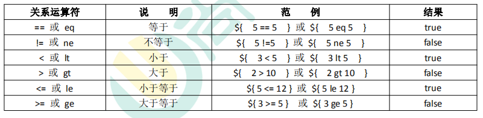
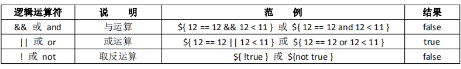
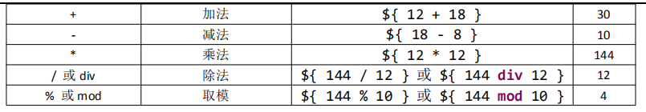
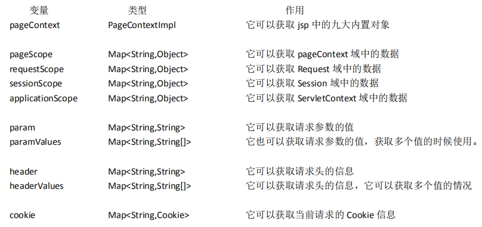
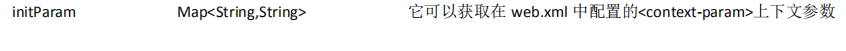

## **什么是** **EL** **表达式，**EL **表达式的作用**?

EL 表达式的全称是：Expression 

Language。是表达式语言。 

EL 表达式的什么作用：EL 表达式主要是代替 jsp 页面中的表达式脚本在 jsp 页面中进行数据的输出。 

因为 EL 表达式在输出数据的时候，要比 jsp 的表达式脚本要简洁很多。


```jsp
 <body>
  <% request.setAttribute("key","key值"); %>
  表达式脚本输出 key 的值是： <%=request.getAttribute("key1")==null?"":request.getAttribute("key1")%><br/>
  EL 表达式输出 key 的值是：${key}
  </body>
```

<%=request.getAttribute("key1")%> 如果位空  则位null

EL位null则是  空白


EL 表达式的格式是：${表达式} 

EL 表达式在输出 null 值的时候，输出的是空串。jsp 表达式脚本输出 null 值的时候，输出的是 null 字符串。


## **EL** **表达式搜索域数据的顺序**

EL 表达式主要是在 jsp 页面中输出数据。 

主要是输出**域对象**中的数据。 

当四个域中都有相同的 key 的数据的时候，**EL 表达式会按照四个域的从小到大的顺序去进行搜索**，找到就输出。


```jsp
  <% //往四个域中都保存了相同的 key 的数据。
    request.setAttribute("key", "request");
    session.setAttribute("key", "session");
    application.setAttribute("key", "application");
    pageContext.setAttribute("key", "pageContext"); %>
  ${ key }
```


pageContext


## **EL** **表达式输出** **Bean** 的普通属性，数组属性。List **集** **合属性，**map **集合属性**


```java
package com.mrchengs.bean;

import java.util.List;
import java.util.Map;

public class Person {

    private String name;
    private String[] phones;
    private List<String> cities;
    private Map<String,Object> map;

    public Person() {
    }

    public String getName() {
        return name;
    }

    public void setName(String name) {
        this.name = name;
    }

    public String[] getPhones() {
        return phones;
    }

    public void setPhones(String[] phones) {
        this.phones = phones;
    }

    public List<String> getCities() {
        return cities;
    }

    public void setCities(List<String> cities) {
        this.cities = cities;
    }

    public Map<String, Object> getMap() {
        return map;
    }

    public void setMap(Map<String, Object> map) {
        this.map = map;
    }

    public String getAge() {
        return "24";
    }
}

```


```jsp
 <%
    Person person = new Person();
    person.setName("mrchengs好帅！");
    person.setPhones(new String[]{"18610541354","18688886666","18699998888"});
    List<String> cities = new ArrayList<String>();
    cities.add("北京"); cities.add("上海");
    cities.add("深圳");
    person.setCities(cities);
    Map<String,Object>map = new HashMap<>();
    map.put("key1","value1");
    map.put("key2","value2");
    map.put("key3","value3");
    person.setMap(map);
    pageContext.setAttribute("p", person); %>

  输出 Person：${ p }<br/>
  输出 Person 的 name 属性：${p.name} <br>
  输出 Person 的 pnones 数组属性值：${p.phones[2]} <br>
  输出 Person 的 cities 集合中的元素值：${p.cities} <br>
  输出 Person 的 List 集合中个别元素值：${p.cities[2]} <br>
  输出 Person 的 Map 集合: ${p.map} <br>
  输出 Person 的 Map 集合中某个 key 的值: ${p.map.key3} <br>
  输出 Person 的 age 属性：${p.age} <br>
```

输出 Person：com.mrchengs.bean.Person@7352c65e
输出 Person 的 name 属性：mrchengs好帅！
输出 Person 的 pnones 数组属性值：18699998888
输出 Person 的 cities 集合中的元素值：[北京, 上海, 深圳]
输出 Person 的 List 集合中个别元素值：深圳
输出 Person 的 Map 集合: {key1=value1, key2=value2, key3=value3}
输出 Person 的 Map 集合中某个 key 的值: value3
输出 Person 的 age 属性：24


## **EL** **表达式——运算**


### **关系运算**




### **逻辑运算** 




### **算数运算** 




### **empty** **运算**

empty 运算可以判断一个数据是否为空，如果为空，则输出 true,不为空输出 false。 

以下几种情况为空： 

1、值为 null 值的时候，为空 

2、值为空串的时候，为空 

3、值是 Object 类型数组，长度为零的时候 

4、list 集合，元素个数为零 

5、map 集合，元素个数为零

```jsp
 <% // 1、值为 null 值的时候，为空
    request.setAttribute("emptyNull", null);
    // 2、值为空串的时候，为空
    request.setAttribute("emptyStr", "");
    // 3、值是 Object 类型数组，长度为零的时候
    request.setAttribute("emptyArr", new Object[]{});
    // 4、list 集合，元素个数为零
    List<String> list = new ArrayList<>();
    // list.add("abc");
    request.setAttribute("emptyList", list);
    // 5、map 集合，元素个数为零
    Map<String,Object> map = new HashMap<String, Object>();
    map.put("key1", "value1");
    request.setAttribute("emptyMap", map); %>
  ${ empty emptyNull } <br/>
  ${ empty emptyStr } <br/>
  ${ empty emptyArr } <br/>
  ${ empty emptyList } <br/>
  ${ empty emptyMap } <br/>
```

true
true
true
true
false

### **三元运算**

表达式 1？表达式 2：表达式 3 

如果表达式 1 的值为真，返回表达式 2 的值，如果表达式 1 的值为假，返回表达式 3 的值。


```jsp
 <%
	Map<String,Object> map = new HashMap<String, Object>();
    //map.put("key1", "value1");
    request.setAttribute("emptyMap", map); 
      %>

  ${emptyMap.size() == 0 ? "空map":"非空map" } <br/>
```

空map


### **“**.”点运算 和 **[]** **中括号运算符**

```jsp
<%
    Map<String,Object> map = new HashMap<String, Object>();
    map.put("a.a.a", "aaaValue");
    map.put("b+b+b", "bbbValue");
    map.put("c-c-c", "cccValue");
    request.setAttribute("map", map);
  %>
  ${ map['a.a.a'] } <br>
  ${ map["b+b+b"] } <br>
  ${ map['c-c-c'] } <br>
```

aaaValue
bbbValue
cccValue


##  **EL** **表达式的** **11** **个隐含对象**

EL 个达式中 11 个隐含对象，是 EL 表达式中自己定义的，可以直接使用。






### **EL** **获取四个特定域中的属性**

pageScope ====== pageContext 域 

requestScope ====== Request 域 

sessionScope ====== Session 域 

applicationScope ====== ServletContext 域 


```
<%
    pageContext.setAttribute("key1", "pageContext1");
    pageContext.setAttribute("key2", "pageContext2");
    request.setAttribute("key2", "request");
    session.setAttribute("key2", "session");
    application.setAttribute("key2", "application");
%>
${ applicationScope.key2 } <br>
${ pageScope.key2} <br>
${ requestScope.get("key2")}<br>
${ sessionScope.get("key2")}<br>
```

application
pageContext2
request
session


### **pageContext** **对象的使用** 

\1. 协议： 

\2. 服务器 ip： 

**3.** 服务器端口： 

\4. **获取工程路径：** 

\5. 获取请求方法： 

\6. 获取客户端 ip 地址： 

\7. 获取会话的 id 编号


*request.getScheme()* *它可以获取请求的协议* 

*request.getServerName()* *获取请求的服务器* *ip* *或域名* 

*request.getServerPort()* *获取请求的服务器端口号* 

*getContextPath()* *获取当前工程路径* 

*request.getMethod()* *获取请求的方式（**GET* *或* *POST**）* 

*request.getRemoteHost()* *获取客户端的* *ip* *地址* 

*session.getId()* *获取会话的唯一标识*


```jsp
<% pageContext.setAttribute("req", request); %>
<%=request.getScheme() %> <br>

1.协议： ${ req.scheme }<br>
2.服务器 ip：${ pageContext.request.serverName }<br>
3.服务器端口：${ pageContext.request.serverPort }<br>
4.获取工程路径：${ pageContext.request.contextPath }<br>
5.获取请求方法：${ pageContext.request.method }<br>
6.获取客户端 ip 地址：${ pageContext.request.remoteHost }<br>
7.获取会话的 id 编号：${ pageContext.session.id }<br>

<%= request.getContextPath() %><br>
<%= pageContext.getServletConfig().getServletContext() %>
```

http
1.协议： http
2.服务器 ip：localhost
3.服务器端口：8080
4.获取工程路径：/web_war_exploded
5.获取请求方法：GET
6.获取客户端 ip 地址：0:0:0:0:0:0:0:1
7.获取会话的 id 编号：8AA1C84A192435D9FD6BE4ECA3B601D0
/web_war_exploded
org.apache.catalina.core.ApplicationContextFacade@5ead37f6


### **EL** **表达式其他隐含对象的使用** 

param   Map<String,String>    它可以获取请求参数的值 

paramValues   Map<String,String[]>   它也可以获取请求参数的值，获取多个值的时候使用。


```jso
输出请求参数 username 的值：${ param.username } <br>
输出请求参数 password 的值：${ param.password } <br>
输出请求参数 username 的值：${ paramValues.username[0] } <br>
输出请求参数 hobby 的值：${ paramValues.hobby[0] } <br>
输出请求参数 hobby 的值：${ paramValues.hobby[1] } <br>
```

http://localhost:8080/web_war_exploded/index.jsp?username=wzg168&password=666666&hobby=java&hobby=cpp

输出请求参数 username 的值：wzg168
输出请求参数 password 的值：666666
输出请求参数 username 的值：wzg168
输出请求参数 hobby 的值：java
输出请求参数 hobby 的值：cpp


header   Map<String,String>   它可以获取请求头的信息 

headerValues   Map<String,String[]>   它可以获取请求头的信息，它可以获取多个值的情况

```jsp

输出请求头【User-Agent】的值：${ header['User-Agent'] } <br>
输出请求头【Connection】的值：${ header.Connection } <br> 
输出请求头【User-Agent】的值：${ headerValues['User-Agent'][0] } <br>
```

输出请求头【User-Agent】的值：Mozilla/5.0 (Windows NT 10.0; Win64; x64) AppleWebKit/537.36 (KHTML, like Gecko) Chrome/80.0.3987.149 Safari/537.36
输出请求头【Connection】的值：keep-alive
输出请求头【User-Agent】的值：Mozilla/5.0 (Windows NT 10.0; Win64; x64) AppleWebKit/537.36 (KHTML, like Gecko) Chrome/80.0.3987.149 Safari/537.36


cookie    Map<String,Cookie>    它可以获取当前请求的 Cookie 信息 


```jsp
获取 Cookie 的名称：${ cookie.JSESSIONID.name } <br>
获取 Cookie 的值：${ cookie.JSESSIONID.value } <br>
```

获取 Cookie 的名称：JSESSIONID
获取 Cookie 的值：5868B7A98BD2F1D65F59C0E687798DF0


initParam   Map<String,String>   它可以获取在 web.xml 中配置的<context-param>上下文参数

web.xml 中的配置：

```xml
  <context-param>
        <param-name>username</param-name>
        <param-value>mrchengs</param-value>
    </context-param>
    <context-param>
        <param-name>password</param-name>
        <param-value>1234</param-value>
    </context-param>
```


```jsp
输出&lt;Context-param&gt;username 的值：${ initParam.username } <br> 
```


输出<Context-param>username 的值：mrchengs

