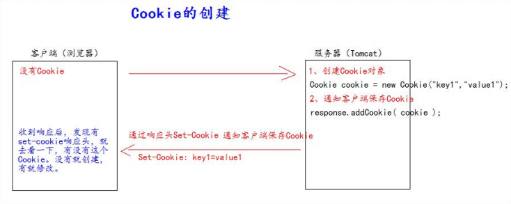
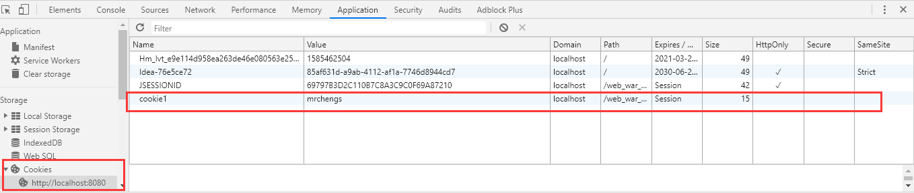
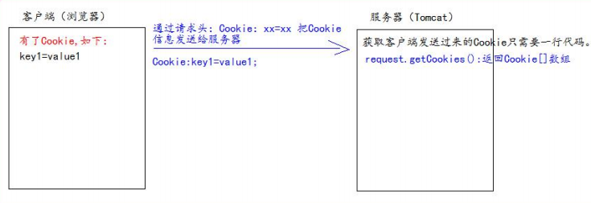

## 什么是 **Cookie**

1、Cookie 翻译过来是饼干的意思。 

2、Cookie 是服务器通知客户端保存键值对的一种技术。 

3、客户端有了 Cookie 后，每次请求都发送给服务器。 

4、每个 Cookie 的大小不能超过 4kb


## **如何创建** **Cookie**




封装反射类进行servle的响应

```java
package com.mrchengs.servlet;

import javax.servlet.ServletException;
import javax.servlet.http.HttpServlet;
import javax.servlet.http.HttpServletRequest;
import javax.servlet.http.HttpServletResponse;
import java.io.IOException;
import java.lang.reflect.Method;

public abstract class BaseServlet extends HttpServlet {

    @Override
    protected void doGet(HttpServletRequest req, HttpServletResponse resp) throws ServletException, IOException {
        doPost(req, resp);
    }

    @Override
    protected void doPost(HttpServletRequest req, HttpServletResponse resp) throws ServletException, IOException {
        // 解决post请求中文乱码问题
        // 一定要在获取请求参数之前调用才有效
        req.setCharacterEncoding("UTF-8");
        // 解决响应中文乱码问题
        resp.setContentType("text/html; charset=UTF-8");

        String action = req.getParameter("action");
        try {
            // 获取action业务鉴别字符串，获取相应的业务 方法反射对象
            Method method = this.getClass().getDeclaredMethod(action, HttpServletRequest.class, HttpServletResponse.class);
//            System.out.println(method);
            // 调用目标业务 方法
            method.invoke(this, req, resp);
        } catch (Exception e) {
            e.printStackTrace();
        }
    }

}
```


CookieServlet

```java
package com.mrchengs.servlet;

import com.sun.deploy.net.HttpResponse;

import javax.servlet.http.Cookie;
import javax.servlet.http.HttpServlet;
import javax.servlet.http.HttpServletRequest;
import javax.servlet.http.HttpServletResponse;
import java.io.IOException;

public class CookieServlet extends BaseServlet {


    protected void createCookie(HttpServletRequest request, HttpServletResponse response) throws IOException {
        //创建Cookie
        Cookie cookie = new Cookie("cookie1","mrchengs");
        //通知客户端保存cookie
        response.addCookie(cookie);
        //回传信息
        response.getWriter().write("Cookie创建成功");

    }
}
```


```html
<li><a href="cookieServlet?action=createCookie" target="target">Cookie的创建</a></li>
```





## **服务器如何获取** **Cookie**

服务器获取客户端的 Cookie 只需要一行代码：req.getCookies():Cookie[] 




```java
package com.mrchengs.servlet;

import com.sun.deploy.net.HttpResponse;

import javax.servlet.http.Cookie;
import javax.servlet.http.HttpServlet;
import javax.servlet.http.HttpServletRequest;
import javax.servlet.http.HttpServletResponse;
import java.io.IOException;

public class CookieServlet extends BaseServlet {


    protected void createCookie(HttpServletRequest request, HttpServletResponse response) throws IOException {
        //创建Cookie
        Cookie cookie = new Cookie("cookie1","mrchengs");
        //通知客户端保存cookie
        response.addCookie(cookie);
        //回传信息
        response.getWriter().write("Cookie创建成功");

    }


    protected void getCookies(HttpServletRequest request, HttpServletResponse response) throws IOException {
        //获取Cookie
       Cookie[] cookies = request.getCookies();
        for (Cookie cookie : cookies) {
            response.getWriter().write("cookName:"+ cookie.getName() +",cookVal:" + cookie.getValue() + "<br>");
        }

    }
}
```

```
<li><a href="cookieServlet?action=getCookies" target="target">Cookie的获取</a></li>
```

cookName:JSESSIONID,cookVal:69797B3D2C110B7C8A3C9C0F69A87210
cookName:cookie1,cookVal:mrchengs
cookName:Hm_lvt_e9e114d958ea263de46e080563e254c4,cookVal:1585462504
cookName:Idea-76e5ce72,cookVal:85af631d-a9ab-4112-af1a-7746d8944cd7


## **Cookie** **值的修改** 

方案一： 

1、先创建一个要修改的同名（指的就是 key）的 Cookie 对象 

2、在构造器，同时赋于新的 Cookie 值。 

3、调用 response.addCookie( Cookie )


```java
// 方案一： 
// 1、先创建一个要修改的同名的 Cookie 对象 
// 2、在构造器，同时赋于新的 Cookie 值。
Cookie cookie = new Cookie("key1","newValue1"); 
// 3、调用 response.addCookie( Cookie ); 通知 客户端 保存修改 
resp.addCookie(cookie);
```


方案二： 

1、先查找到需要修改的 Cookie 对象 

2、调用 setValue()方法赋于新的 Cookie 值。 

3、调用 response.addCookie()通知客户端保存修改


查询Cookie的工具类

```java
package com.mrchengs.util;

import javax.servlet.http.Cookie;

/**
 * @author ccrr
 */
public class CookieUtils {
    /*** 查找指定名称的 Cookie 对象 * @param name * @param cookies * @return */
    public static Cookie findCookie(String name , Cookie[] cookies){
        if (name == null || cookies == null || cookies.length == 0) {
            return null;
        }
        for (Cookie cookie : cookies) {
            if (name.equals(cookie.getName())) {
                return cookie;
            }
        }
        return null;
    }
}

```


```java
        //获取Cookie
       Cookie[] cookies = request.getCookies();

        Cookie cookie = CookieUtils.findCookie("cookie1", request.getCookies());

        if (cookie != null){
            //调用 setValue()方法赋于新的 Cookie 值。
            cookie.setValue("newValue2");
            // 调用 response.addCookie()通知客户端保存修改
            response.addCookie(cookie);
        }

```


## **Cookie** **生命控制**

Cookie 的生命控制指的是如何管理 Cookie 什么时候被销毁（删除） 


setMaxAge() 

​			正数，表示在指定的秒数后过期 

​			负数，表示浏览器一关，Cookie 就会被删除（默认值是-1） 

​			零，表示马上删除 Cookie 


设置存活定期的cookie

```java
Cookie cookie = new Cookie("c1", "v1"); 
cookie.setMaxAge(60 * 60); 
// 设置 Cookie 一小时之后被删除。无效 
resp.addCookie(cookie); 
resp.getWriter().write("已经创建了一个存活一小时的 Cookie");
```


*删除一个* *Cookie*

```java
// 先找到你要删除的 Cookie 对象 
Cookie cookie = CookieUtils.findCookie("key4", req.getCookies()); 
if (cookie != null) { 
    // 调用 setMaxAge(0); 
    cookie.setMaxAge(0); 
    // 表示马上删除，都不需要等待浏览器关闭 
    // 调用 response.addCookie(cookie); 
    resp.addCookie(cookie); 
    resp.getWriter().write("key4 的 Cookie 已经被删除");
}
```


*默认的会话级别的* *Cookie*

```java
Cookie cookie = new Cookie("defalutLife","defaultLife"); 
cookie.setMaxAge(-1);
//设置存活时间 
resp.addCookie(cookie);
```


## **有效路径** **Path** **的设置** 

Cookie 的 path 属性可以有效的过滤哪些 Cookie 可以发送给服务器。哪些不发。 

path 属性是通过请求的地址来进行有效的过滤。 


CookieA       path=/工程路径 

CookieB       path=/工程路径/abc


请求地址如下： 

​		http://ip:port/工程路径/a.html 

​		CookieA 发送 

​		CookieB 不发送 


​		http://ip:port/工程路径/abc/a.html 

​		CookieA 发送 

​		CookieB 发送 

```java
Cookie cookie = new Cookie("path1", "path1"); 
// getContextPath() ===>>>> 得到工程路径 
cookie.setPath( req.getContextPath() + "/abc" ); 
// ===>>>> /工程路径/abc 
resp.addCookie(cookie); 
resp.getWriter().write("创建了一个带有 Path 路径的 Cookie");
```


