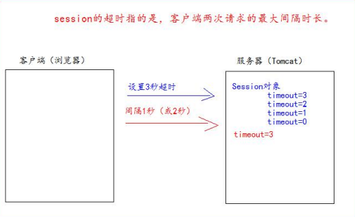

## **什么是** **Session** **会话**

1、Session 就一个接口（HttpSession）。 

2、Session 就是会话。它是用来维护一个客户端和服务器之间关联的一种技术。 

3、每个客户端都有自己的一个 Session 会话。 

4、Session 会话中，我们经常用来保存用户登录之后的信息


## **如何创建** **Session** **和获取**(id **号**,是否为新)


如何创建和获取 Session。它们的 API 是一样的。 

request.getSession() 

第一次调用是：创建 Session 会话 

之后调用都是：获取前面创建好的 Session 会话对象。 

isNew(); 判断到底是不是刚创建出来的（新的） 

​		true 表示刚创建 

​		false 表示获取之前创建 

每个会话都有一个身份证号。也就是 ID 值。而且这个 ID 是唯一的。 

getId() 得到 Session 的会话 id 值。 


```java
protected void createSession(HttpServletRequest req, HttpServletResponse resp) throws ServletException, IOException {
        //创建session对象
        HttpSession session = req.getSession();

        boolean aNew = session.isNew();

        System.out.println(session.getId());
        System.out.println(aNew);

    }
```


```
		<base href="http://localhost:8080/web_war_exploded/">
	
	<li><a href="session?action=createSession" target="target">Session的创建和获取（id号、是否为新创建）</a></li>
```


A123DC8C86EFE9552F21B8C100F63BDD
true


## **Session** **域数据的存取**

```java
 /***
     *  往 Session 中保存数据
     ** @param req
     * @param resp
     ** @throws ServletException
     ** @throws IOException
     **/
    protected void setAttribute(HttpServletRequest req, HttpServletResponse resp) throws ServletException, IOException {
        req.getSession().setAttribute("key1", "value1");

        resp.getWriter().write("已经往 Session 中保存了数据"); }
        /**
         * * 获取 Session 域中的数据
         * * @param req
         * * @param resp
         * * @throws ServletException
         * * @throws IOException */
        protected void getAttribute(HttpServletRequest req, HttpServletResponse resp) throws ServletException, IOException {
            Object attribute = req.getSession().getAttribute("key1");
            resp.getWriter().write("从 Session 中获取出 key1 的数据是：" + attribute);
        }
```

从 Session 中获取出 key1 的数据是：value1


## **Session** **生命周期控制** 

public void setMaxInactiveInterval(int interval) 

设置 Session 的超时时间（以秒为单位），超过指定的时长，Session 就会被销毁。

​				值为正数的时候，设定 Session 的超时时长。 

​				负数表示永不超时（极少使用） 


public int getMaxInactiveInterval()获取 Session 的超时时间 

public void invalidate() 让当前 Session 会话马上超时无效。


Session 默认的超时时间长为 30 分钟。 

因为在 Tomcat 服务器的配置文件 web.xml中默认有以下的配置，它就表示配置了当前 Tomcat 服务器下所有的 Session 

超时配置默认时长为：30 分钟。 

```
<session-config> 
	<session-timeout>30</session-timeout> 
</session-config>	
```




