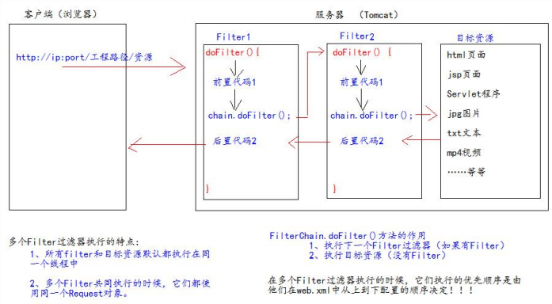

## **什么是过滤器**

1、Filter 过滤器它是 JavaWeb 的三大组件之一。三大组件分别是：Servlet 程序、Listener 监听器、Filter 过滤器 

2、Filter 过滤器它是 JavaEE 的规范。也就是接口 

3、Filter 过滤器它的作用是：**拦截请求**，过滤响应。 

拦截请求常见的应用场景有： 

​		1、权限检查 

​		2、日记操作 

​		3、事务管理 

​		……等等


## **初体验**

要求：在你的 web 工程下，有一个 admin 目录。这个 admin 目录下的所有资源（html 页面、jpg 图片、jsp 文件、等等）都必 

须是用户登录之后才允许访问。 

思考：根据之前我们学过内容。我们知道，用户登录之后都会把用户登录的信息保存到 Session 域中。所以要检查用户是否 

登录，可以判断 Session 中否包含有用户登录的信息即可！！！


```jsp
<% 
Object user = session.getAttribute("user"); 
// 如果等于 null，说明还没有登录 
if (user == null) { 
    request.getRequestDispatcher("/login.jsp").forward(request,response); 
    return; 
} 
%>
```


```java
package com.mrchengs.servlet;

import javax.servlet.*;
import javax.servlet.http.HttpServletRequest;
import javax.servlet.http.HttpSession;
import java.io.IOException;


public class AdminFilter implements Filter {
    @Override
    public void init(FilterConfig filterConfig) throws ServletException {

    }

    /**
     ** doFilter 方法，专门用于拦截请求。可以做权限检查
     **/
    @Override
    public void doFilter(ServletRequest request, ServletResponse response, FilterChain chain) throws IOException, ServletException {
        HttpServletRequest httpServletRequest = (HttpServletRequest) request;

        HttpSession session = httpServletRequest.getSession();
        Object user = session.getAttribute("user");
        // 如果等于 null，说明还没有登录
        if (user == null) {
            request.getRequestDispatcher("/ok.jsp").forward(request,response);
            return;
        } else {
            // 让程序继续往下访问用户的目标资源
            chain.doFilter(request,response);
        }
    }


    @Override
    public void destroy() {

    }
}

```


```xml
    <servlet>
        <servlet-name>Servlet4</servlet-name>
        <servlet-class>com.mrchengs.servlet.RequestAPIServlet</servlet-class>
    </servlet>
    <servlet-mapping>
        <servlet-name>Servlet4</servlet-name>
        <url-pattern>/requestservlet</url-pattern>
    </servlet-mapping>

    <!--filter 标签用于配置一个 Filter 过滤器-->
    <filter> <!--给 filter 起一个别名-->
        <filter-name>AdminFilter</filter-name>
        <!--配置 filter 的全类名-->
        <filter-class>com.mrchengs.servlet.AdminFilter</filter-class>
    </filter>
    <!--filter-mapping 配置 Filter 过滤器的拦截路径-->
    <filter-mapping>
        <!--filter-name 表示当前的拦截路径给哪个 filter 使用-->
        <filter-name>AdminFilter</filter-name>
        <!--
        url-pattern 配置拦截路径 / 表示请求地址为：http://ip:port/工程路径/
        -->
        <url-pattern>/requestservlet/*</url-pattern>
    </filter-mapping>
```

ok!


## **生命周期**

Filter 的生命周期包含几个方法 

1、构造器方法 

2、init 初始化方法 

​	第 1，2 步，在 web 工程启动的时候执行（Filter 已经创建） 

3、doFilter 过滤方法 

​	第 3 步，每次拦截到请求，就会执行 

4、destroy 销毁 

​	第 4 步，停止 web 工程的时候，就会执行（停止 web 工程，也会销毁 Filter 过滤器）


## **FilterConfig** **类** 	

它是 Filter 过滤器的配置文件类。 

Tomcat 每次创建 Filter 的时候，也会同时创建一个 FilterConfig 类，这里包含了 Filter 配置文件的配置信息。 

FilterConfig 类的作用是获取 filter 过滤器的配置内容 

1、获取 Filter 的名称 filter-name 的内容 

2、获取在 Filter 中配置的 init-param 初始化参数 

3、获取 ServletContext 对象 


```java
public void init(FilterConfig filterConfig) throws ServletException { System.out.println("2.Filter 的 init(FilterConfig filterConfig)初始化"); 
                                                                     
// 1、获取 Filter 的名称 filter-name 的内容 
System.out.println("filter-name 的值是：" + filterConfig.getFilterName()); 
// 2、获取在 web.xml 中配置的 init-param 初始化参数 
System.out.println("初始化参数 username 的值是："+filterConfig.getInitParameter("username"));
                                                                     
                                                                     System.out.println("初始化参数 url 的值是：" + filterConfig.getInitParameter("url")); 
// 3、获取 ServletContext 对象                                                    System.out.println(filterConfig.getServletContext()); 
}
```


```xml
<!--filter 标签用于配置一个 Filter 过滤器--> 
<filter> 
    <!--给 filter 起一个别名--> 
    <filter-name>AdminFilter</filter-name> 
    <!--配置 filter 的全类名-->
	<filter-class>com.atguigu.filter.AdminFilter</filter-class> 
    
    <init-param> 
        <param-name>username</param-name> 
        <param-value>root</param-value> 
    </init-param> 
    <init-param> 
        <param-name>url</param-name> 
        <param-value>jdbc:mysql://localhost3306/test</param-value> 
    </init-param> 
</filter>
```


## 拦截器链

Filter   过滤器 

Chain    链，链条 

FilterChain 就是过滤器链（多个过滤器如何一起工作）





## **拦截路径** 

- 精确匹配

  <url-pattern>/target.jsp</url-pattern> 

  以上配置的路径，表示请求地址必须为：http://ip:port/工程路径/target.jsp 

- 目录匹配

  <url-pattern>/admin/\*</url-pattern> 

  以上配置的路径，表示请求地址必须为：http://ip:port/工程路径/admin/* 

- 后缀名匹配

  <url-pattern**>*.html</**url-pattern> 

  以上配置的路径，表示请求地址必须以.html 结尾才会拦截到 

- <**url-pattern**>*.do</**url-pattern**> 

  以上配置的路径，表示请求地址必须以.do 结尾才会拦截到 

- <**url-pattern**>*.action</**url-pattern**> 

  以上配置的路径，表示请求地址必须以.action 结尾才会拦截到 

  

Filter 过滤器它只关心请求的地址是否匹配，不关心请求的资源是否存在！！！