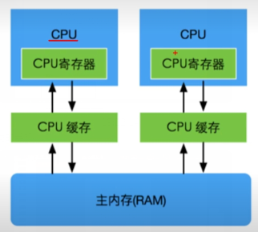
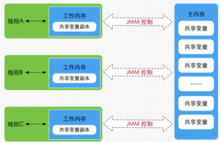
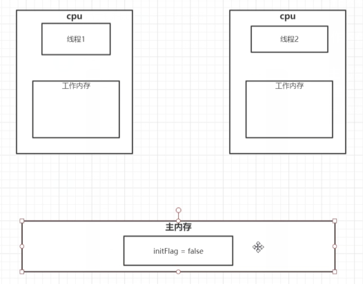
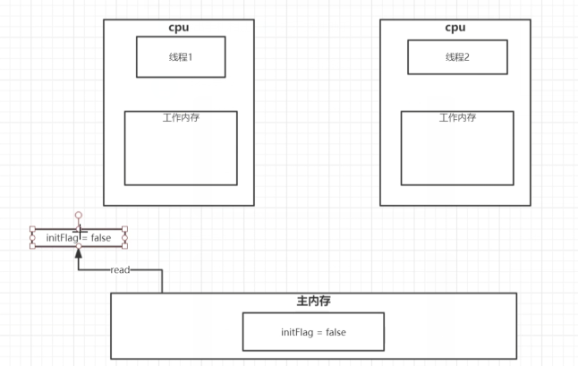
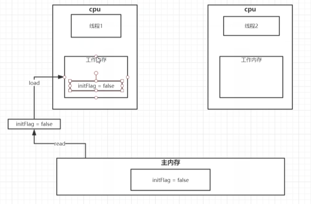
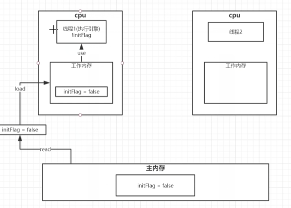
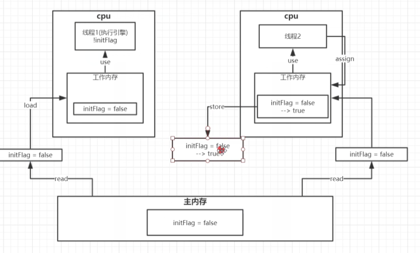
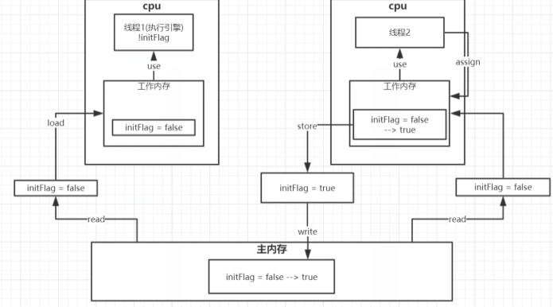

### 1、cpu多核并发缓存结构剖析

有缓存之后可以更快的提高运算速度

### 2、java线程内核模型底层实现原理

java线程内存模型跟cpu缓存类型模型类似

是基于cpu缓存模型建立

java线程内存模型是标准化的，屏蔽掉底层不同计算机的区别

#### JMM内存模型

搞一个副本可以提高速度

可能存在多个线程读取一个值（共享变量）

其中一个线程修改的数据

但是其他的线程依旧使用的是旧值

此时可以使用volatile关键字进行实现是其值为最新的值

#### **原子操作**

lock最先到数据之后对数据进行加锁，加上标记

整个操作完成之后会进行unlock解锁

其他的线程需要等待

**线程1**

初始化

read读取

load载入

use使用

**线程2**

此时read操作与线程1同时进行

store操作

write写入

此时线程1的值还是false

此时使用volatile关键字进行变量的修饰线程1的值就会进行修改为最新的值

#### **JMM缓存不一致问题**

总线加锁（性能低）

cpu从主存读取数据到告诉缓存，会在总线对这个数据加锁

这样其他的cpu无法去读取这个数据

知道这个cpu使用完数据释放锁之后其他cpu才能进行读取数据

MESI缓存一致性协议

多个cpu从主存读取同一个数据到各自的高速缓存

当其中某个cpu修改了缓存里面的数据

该数据会马上同步到主存

其他cpu通过**总线嗅探机制**可以感知数据的变化

从而将自己缓存中的数据失效

volatile基于该机制进行实现的

某一线程修改数据之后

其他线程会嗅探总线

监听到数据变动

立马将自身的数据失效

在重新进行read等

### 3、volatile缓存可见性实现原理

底层实现主要通过汇编lock指令

他会锁定这块内存区域的缓存（缓存行锁定）并且写回到主存

IA-32架构软件开发者手册对lock的解释：

1）、会将当前处理器缓存行的数据**立即**写回到系统主存

2）、这个写回到内存操作会引起其他cpu缓存里改内存地址的数据无效

