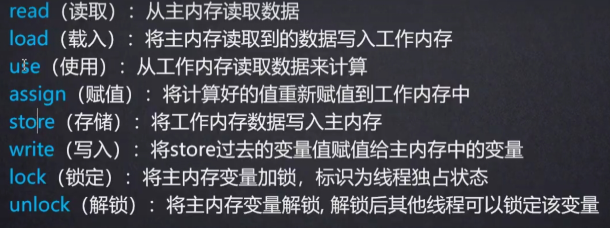
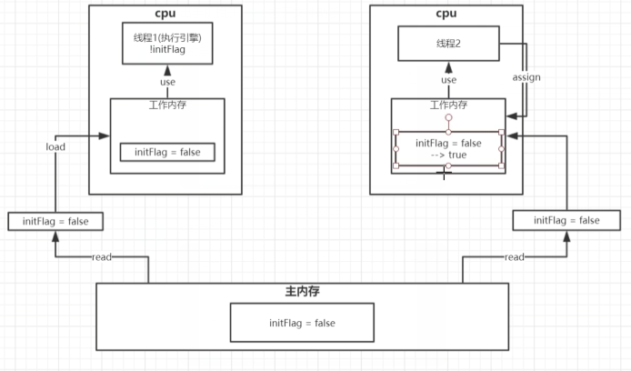

### 1、cpu多核并发缓存结构剖析

有缓存之后可以更快的提高运算速度


### 2、java线程内核模型底层实现原理

java线程内存模型跟cpu缓存类型模型类似

是基于cpu缓存模型建立

java线程内存模型是标准化的，屏蔽掉底层不同计算机的区别


#### JMM内存模型

搞一个副本可以提高速度


可能存在多个线程读取一个值（共享变量）

其中一个线程修改的数据

但是其他的线程依旧使用的是旧值

此时可以使用volatile关键字进行实现是其值为最新的值


#### **原子操作**



lock最先到数据之后对数据进行加锁，加上标记

整个操作完成之后会进行unlock解锁

其他的线程需要等待


**线程1**

初始化


read读取


load载入


use使用


**线程2**

此时read操作与线程1同时进行



store操作


write写入


此时线程1的值还是false

此时使用volatile关键字进行变量的修饰线程1的值就会进行修改为最新的值


#### **JMM缓存不一致问题**

总线加锁（性能低）

cpu从主存读取数据到告诉缓存，会在总线对这个数据加锁

这样其他的cpu无法去读取这个数据

知道这个cpu使用完数据释放锁之后其他cpu才能进行读取数据


MESI缓存一致性协议

多个cpu从主存读取同一个数据到各自的高速缓存

当其中某个cpu修改了缓存里面的数据

该数据会马上同步到主存

其他cpu通过**总线嗅探机制**可以感知数据的变化

从而将自己缓存中的数据失效


volatile基于该机制进行实现的


某一线程修改数据之后

其他线程会嗅探总线

监听到数据变动

立马将自身的数据失效

在重新进行read等


### 3、volatile缓存可见性实现原理

底层实现主要通过汇编lock指令

他会锁定这块内存区域的缓存（缓存行锁定）并且写回到主存

IA-32架构软件开发者手册对lock的解释：

1）、会将当前处理器缓存行的数据**立即**写回到系统主存

2）、这个写回到内存操作会引起其他cpu缓存里改内存地址的数据无效


参考：

https://www.cnblogs.com/xrq730/p/7048693.html

代码：

```
public class volatiletest {
    private static  volatile  boolean flag= false;
    public static void main(String[] args) throws InterruptedException {
        new Thread(new Runnable() {
            @Override
            public void run() {
              //  System.out.println("waiting data...");
                while (!flag){
                }
               // System.out.println("===========================success");
            }
        }).start();
        Thread.sleep(2000);
        new Thread(new Runnable() {
            @Override
            public void run() {
                prepareData();
            }
        }).start();
    }
    public  static  void  prepareData(){
        flag = true;
    }
}
```

vm参数：

```
-server
-Xcomp
-XX:+UnlockDiagnosticVMOptions
-XX:+PrintAssembly
-XX:CompileCommand=compileonly,*volatiletest.prepareData
```

会进行打印：

```

[Constants]
  # {method} {0x00000000171c2c18} 'prepareData' '()V' in 'jvm/volatiletest'
  #           [sp+0x40]  (sp of caller)
  0x00000000029aeba0: mov     dword ptr [rsp+0ffffffffffffa000h],eax
  0x00000000029aeba7: push    rbp
  0x00000000029aeba8: sub     rsp,30h
  0x00000000029aebac: mov     rsi,171c3a38h     ;   {metadata(method data for {method} {0x00000000171c2c18} 'prepareData' '()V' in 'jvm/volatiletest')}
  0x00000000029aebb6: mov     edi,dword ptr [rsi+0dch]
  0x00000000029aebbc: add     edi,8h
  0x00000000029aebbf: mov     dword ptr [rsi+0dch],edi
  0x00000000029aebc5: mov     rsi,171c2c10h     ;   {metadata({method} {0x00000000171c2c18} 'prepareData' '()V' in 'jvm/volatiletest')}
  0x00000000029aebcf: and     edi,0h
  0x00000000029aebd2: cmp     edi,0h
  0x00000000029aebd5: je      29aebffh          ;*iconst_1
                                                ; - jvm.volatiletest::prepareData@0 (line 31)

  0x00000000029aebdb: mov     rsi,0d5f96450h    ;   {oop(a 'java/lang/Class' = 'jvm/volatiletest')}
  0x00000000029aebe5: mov     edi,1h
  0x00000000029aebea: mov     byte ptr [rsi+68h],dil
  0x00000000029aebee: lock add dword ptr [rsp],0h  ;*putstatic flag
                                                ; - jvm.volatiletest::prepareData@1 (line 31)

  0x00000000029aebf3: add     rsp,30h
  0x00000000029aebf7: pop     rbp
  0x00000000029aebf8: test    dword ptr [230100h],eax  ;   {poll_return}
  0x00000000029aebfe: ret
  0x00000000029aebff: mov     qword ptr [rsp+8h],rsi
  0x00000000029aec04: mov     qword ptr [rsp],0ffffffffffffffffh
  0x00000000029aec0c: call    29a2f20h          ; OopMap{off=113}
                                                ;*synchronization entry
                                                ; - jvm.volatiletest::prepareData@-1 (line 31)
                                                ;   {runtime_call}
  0x00000000029aec11: jmp     29aebdbh
  0x00000000029aec13: nop
  0x00000000029aec14: nop
  0x00000000029aec15: mov     rax,qword ptr [r15+2a8h]
  0x00000000029aec1c: mov     r10,0h
  0x00000000029aec26: mov     qword ptr [r15+2a8h],r10
  0x00000000029aec2d: mov     r10,0h
  0x00000000029aec37: mov     qword ptr [r15+2b0h],r10
  0x00000000029aec3e: add     rsp,30h
  0x00000000029aec42: pop     rbp
  0x00000000029aec43: jmp     2911fe0h          ;   {runtime_call}
  0x00000000029aec48: hlt
  0x00000000029aec49: hlt
  0x00000000029aec4a: hlt
  0x00000000029aec4b: hlt
  0x00000000029aec4c: hlt
  0x00000000029aec4d: hlt
  0x00000000029aec4e: hlt
  0x00000000029aec4f: hlt
  0x00000000029aec50: hlt
  0x00000000029aec51: hlt
  0x00000000029aec52: hlt
  0x00000000029aec53: hlt
  0x00000000029aec54: hlt
  0x00000000029aec55: hlt
  0x00000000029aec56: hlt
  0x00000000029aec57: hlt
  0x00000000029aec58: hlt
  0x00000000029aec59: hlt
  0x00000000029aec5a: hlt
  0x00000000029aec5b: hlt
  0x00000000029aec5c: hlt
  0x00000000029aec5d: hlt
  0x00000000029aec5e: hlt
  0x00000000029aec5f: hlt
[Exception Handler]
[Stub Code]
  0x00000000029aec60: call    29a04a0h          ;   {no_reloc}
  0x00000000029aec65: mov     qword ptr [rsp+0ffffffffffffffd8h],rsp
  0x00000000029aec6a: sub     rsp,80h
  0x00000000029aec71: mov     qword ptr [rsp+78h],rax
  0x00000000029aec76: mov     qword ptr [rsp+70h],rcx
  0x00000000029aec7b: mov     qword ptr [rsp+68h],rdx
  0x00000000029aec80: mov     qword ptr [rsp+60h],rbx
  0x00000000029aec85: mov     qword ptr [rsp+50h],rbp
  0x00000000029aec8a: mov     qword ptr [rsp+48h],rsi
  0x00000000029aec8f: mov     qword ptr [rsp+40h],rdi
  0x00000000029aec94: mov     qword ptr [rsp+38h],r8
  0x00000000029aec99: mov     qword ptr [rsp+30h],r9
  0x00000000029aec9e: mov     qword ptr [rsp+28h],r10
  0x00000000029aeca3: mov     qword ptr [rsp+20h],r11
  0x00000000029aeca8: mov     qword ptr [rsp+18h],r12
  0x00000000029aecad: mov     qword ptr [rsp+10h],r13
  0x00000000029aecb2: mov     qword ptr [rsp+8h],r14
  0x00000000029aecb7: mov     qword ptr [rsp],r15
  0x00000000029aecbb: mov     rcx,6fc27830h     ;   {external_word}
  0x00000000029aecc5: mov     rdx,29aec65h      ;   {internal_word}
  0x00000000029aeccf: mov     r8,rsp
  0x00000000029aecd2: and     rsp,0fffffffffffffff0h
  0x00000000029aecd6: call    6f8e30e0h         ;   {runtime_call}
  0x00000000029aecdb: hlt
[Deopt Handler Code]
  0x00000000029aecdc: mov     r10,29aecdch      ;   {section_word}
  0x00000000029aece6: push    r10
  0x00000000029aece8: jmp     28e7600h          ;   {runtime_call}
  0x00000000029aeced: hlt
  0x00000000029aecee: hlt
  0x00000000029aecef: hlt
Decoding compiled method 0x00000000029aed90:
Code:
Argument 0 is unknown.RIP: 0x29aeee0 Code size: 0x00000110
[Entry Point]
[Verified Entry Point]
[Constants]
  # {method} {0x00000000171c2c18} 'prepareData' '()V' in 'jvm/volatiletest'
  #           [sp+0x40]  (sp of caller)
  0x00000000029aeee0: mov     dword ptr [rsp+0ffffffffffffa000h],eax
  0x00000000029aeee7: push    rbp
  0x00000000029aeee8: sub     rsp,30h           ;*iconst_1
                                                ; - jvm.volatiletest::prepareData@0 (line 31)

  0x00000000029aeeec: mov     rsi,0d5f96450h    ;   {oop(a 'java/lang/Class' = 'jvm/volatiletest')}
  0x00000000029aeef6: mov     edi,1h
  0x00000000029aeefb: mov     byte ptr [rsi+68h],dil
  0x00000000029aeeff: lock add dword ptr [rsp],0h  ;*putstatic flag
                                                ; - jvm.volatiletest::prepareData@1 (line 31)

  0x00000000029aef04: add     rsp,30h
  0x00000000029aef08: pop     rbp
  0x00000000029aef09: test    dword ptr [230100h],eax  ;   {poll_return}
  0x00000000029aef0f: ret
  0x00000000029aef10: nop
  0x00000000029aef11: nop
  0x00000000029aef12: mov     rax,qword ptr [r15+2a8h]
  0x00000000029aef19: mov     r10,0h
  0x00000000029aef23: mov     qword ptr [r15+2a8h],r10
  0x00000000029aef2a: mov     r10,0h
  0x00000000029aef34: mov     qword ptr [r15+2b0h],r10
  0x00000000029aef3b: add     rsp,30h
  0x00000000029aef3f: pop     rbp
  0x00000000029aef40: jmp     2911fe0h          ;   {runtime_call}
  0x00000000029aef45: hlt
  0x00000000029aef46: hlt
  0x00000000029aef47: hlt
  0x00000000029aef48: hlt
  0x00000000029aef49: hlt
  0x00000000029aef4a: hlt
  0x00000000029aef4b: hlt
  0x00000000029aef4c: hlt
  0x00000000029aef4d: hlt
  0x00000000029aef4e: hlt
  0x00000000029aef4f: hlt
  0x00000000029aef50: hlt
  0x00000000029aef51: hlt
  0x00000000029aef52: hlt
  0x00000000029aef53: hlt
  0x00000000029aef54: hlt
  0x00000000029aef55: hlt
  0x00000000029aef56: hlt
  0x00000000029aef57: hlt
  0x00000000029aef58: hlt
  0x00000000029aef59: hlt
  0x00000000029aef5a: hlt
  0x00000000029aef5b: hlt
  0x00000000029aef5c: hlt
  0x00000000029aef5d: hlt
  0x00000000029aef5e: hlt
  0x00000000029aef5f: hlt
[Exception Handler]
[Stub Code]
  0x00000000029aef60: call    29a04a0h          ;   {no_reloc}
  0x00000000029aef65: mov     qword ptr [rsp+0ffffffffffffffd8h],rsp
  0x00000000029aef6a: sub     rsp,80h
  0x00000000029aef71: mov     qword ptr [rsp+78h],rax
  0x00000000029aef76: mov     qword ptr [rsp+70h],rcx
  0x00000000029aef7b: mov     qword ptr [rsp+68h],rdx
  0x00000000029aef80: mov     qword ptr [rsp+60h],rbx
  0x00000000029aef85: mov     qword ptr [rsp+50h],rbp
  0x00000000029aef8a: mov     qword ptr [rsp+48h],rsi
  0x00000000029aef8f: mov     qword ptr [rsp+40h],rdi
  0x00000000029aef94: mov     qword ptr [rsp+38h],r8
  0x00000000029aef99: mov     qword ptr [rsp+30h],r9
  0x00000000029aef9e: mov     qword ptr [rsp+28h],r10
  0x00000000029aefa3: mov     qword ptr [rsp+20h],r11
  0x00000000029aefa8: mov     qword ptr [rsp+18h],r12
  0x00000000029aefad: mov     qword ptr [rsp+10h],r13
  0x00000000029aefb2: mov     qword ptr [rsp+8h],r14
  0x00000000029aefb7: mov     qword ptr [rsp],r15
  0x00000000029aefbb: mov     rcx,6fc27830h     ;   {external_word}
  0x00000000029aefc5: mov     rdx,29aef65h      ;   {internal_word}
  0x00000000029aefcf: mov     r8,rsp
  0x00000000029aefd2: and     rsp,0fffffffffffffff0h
  0x00000000029aefd6: call    6f8e30e0h         ;   {runtime_call}
  0x00000000029aefdb: hlt
[Deopt Handler Code]
  0x00000000029aefdc: mov     r10,29aefdch      ;   {section_word}
  0x00000000029aefe6: push    r10
  0x00000000029aefe8: jmp     28e7600h          ;   {runtime_call}
  0x00000000029aefed: hlt
  0x00000000029aefee: hlt
  0x00000000029aefef: hlt

```


对cpu高速缓存中的值进行赋值：add dword ptr [rsp],0h 

assign操作： lock add dword ptr [rsp],0h

有lock的汇编指令会立马执行store、write操作进行写到cpu

然后经过总线会通知其他线程


lock锁加载store之前，对内存的缓存行进行加锁

期间其他线程不能进行获取数据


```
  0x00000000029aebee: lock add dword ptr [rsp],0h  ;*putstatic flag
                                                ; - jvm.volatiletest::prepareData@1 (line 31)
```

对应

```
    public  static  void  prepareData(){
 ---->       flag = true;
    }
```


### 4、synchronized

https://blog.csdn.net/wangyadong317/article/details/84065828


