### JDK的体系结构


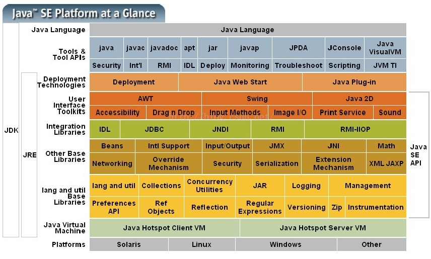

JVM：Java Virtual Machine（Java虚拟机），负责执行符合规范的Class文件

JRE：Java Runtime Environment（java运行环境），包含JVM和类库

  JDK：Java  Development Kit（java开发工具包），包含JRE和开发工具包，例如javac、javah


### **JVM所处的位置**


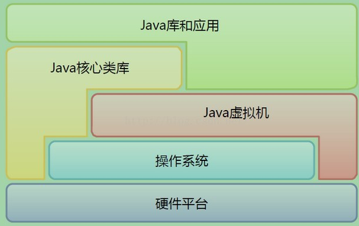


java虚拟机：

Sun HotSpot Vm、BEA JRockit（两家已经合并）

IBM J9 VM

Azul Vm

Apache Harmony

Google Dalvik Vm

Microsof JVM


程序的运行图

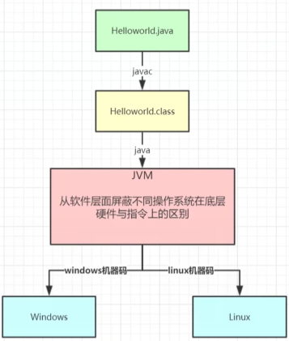


底层执行的是二进制码（1010101010101）

不同的操作系统的底层是不一样的

不同的操作系统的不同的jvm进行实现底层的编译机器码


作用：

**从软件层面屏蔽不同操作系统在底层硬件与指令上的区别**


### jvm的组成


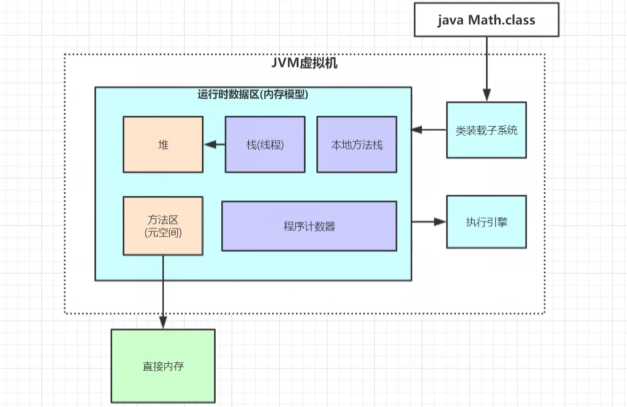

执行一个程序需要三部分：

1、类装载子系统

2、运行时数据区

3、执行引擎


### 代码

```
public class Math {
    public static final  Integer CONSTANT =  600;
    public int compute(){
        int a = 1;
        int b = 2;
        int c = (a+b)*10;
        return  c;
    }

    public static void main(String[] args) {
        Math math = new Math();
        math.compute();
    }
}
```

### 栈(线程栈)

局部变量的内存区域

存放线程执行所需要的局部变量存储的内存空间

是每一个线程独享

#### 1、相关概念

**1、栈**

是一个数据结构栈（**FILO**)

如先执行main()方法然后在执行compute()方法

此时方法就会压栈

compute()方法执行完就会出栈，对应的局部变量会销毁

最后在执行main()方法

main()方法执行之后就会出栈并且销毁对应的栈区


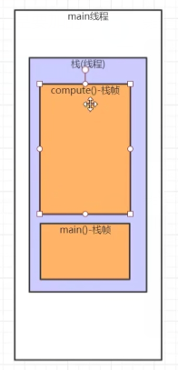


**2、栈中的内容**

栈中还会存在：

**局部变量表**：存放局部变量

**操作数栈**：见字节码部分

**动态链接**：

​				存储程序运行中，方法对应的指令码，动态生成的地址

​				可以类型指针指向该指令地址

**方法出口**：在进到computer()方法时就会将程序计数器值放到该方法里面

​					 然后进行执行之后的代码

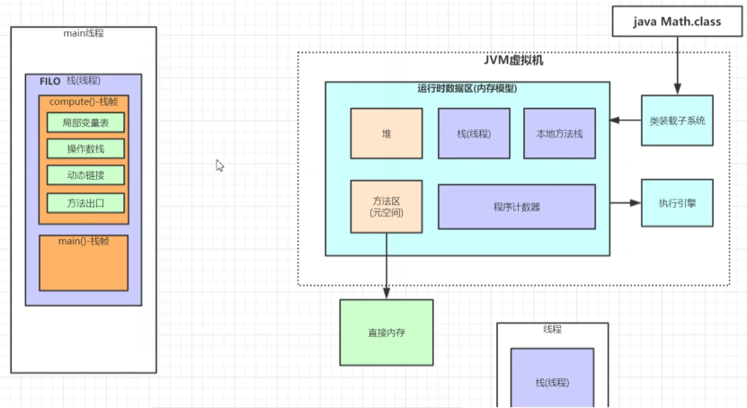


运行程序之前的栈

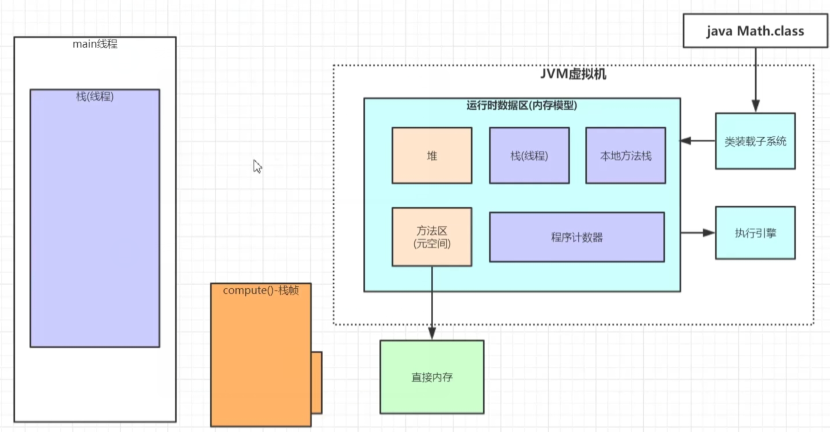


**3、字节码**

程序执行会编译成字节码文件

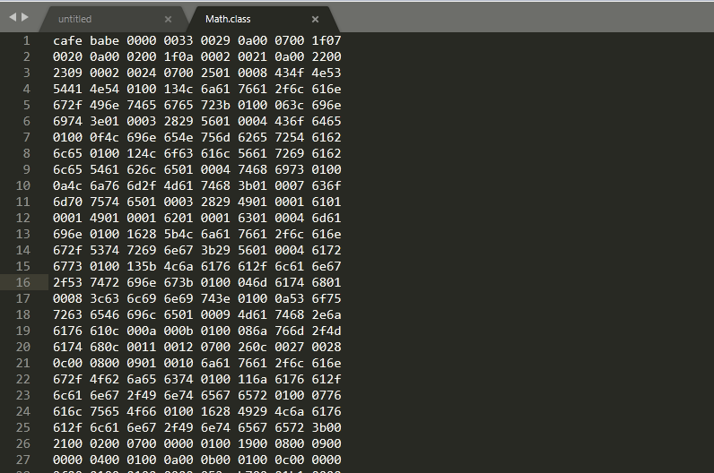


使用javap  命令进行反编译生成一种更易查看的文件

然后查询相应的文档（官方有相应的指令解释）

```
D:\test\lom\target\classes\jvm>javap -c Math.class
Compiled from "Math.java"
public class jvm.Math {
  public static final java.lang.Integer CONSTANT;

  public jvm.Math();
    Code:
       0: aload_0
       1: invokespecial #1                  // Method java/lang/Object."<init>":()V
       4: return

  public int compute();
    Code:
    将int型(1)推送至栈（操作数栈）
       0: iconst_1
    将栈顶int型数值存入本地变量
       1: istore_1
    将int型(2)推送至栈（操作数栈）
       2: iconst_2
    将栈顶int型数值存入第三个本地变量
       3: istore_2
    从局部变量1中装载int类型的值（放到操作数栈）
       4: iload_1
    从局部变量2中装载int类型的值（放到操作数栈）
       5: iload_2
    将栈顶两int型数值相加并将结果压入栈顶
       6: iadd
    将一个8位带符号数压入栈
       7: bipush        10
    执行int类型的乘法（此时会产生新的数据代替之前的数据）
       9: imul
    将栈顶int型数值存入第三个本地变量
      10: istore_3
    将栈顶两int型数值相加并将结果压入栈顶
      11: iload_3
    将int类型返回到主函数
      12: ireturn

  public static void main(java.lang.String[]);
    Code:
       0: new           #2                  // class jvm/Math
       3: dup
       4: invokespecial #3                  // Method "<init>":()V
       7: astore_1
       8: aload_1
       9: invokevirtual #4                  // Method compute:()I
      12: pop
      13: return

  static {};
    Code:
       0: sipush        600
       3: invokestatic  #5                  // Method java/lang/Integer.valueOf:(I)Ljava/lang/Integer;
       6: putstatic     #6                  // Field CONSTANT:Ljava/lang/Integer;
       9: return
}
```


提取图解：

public int compute();
Code:
将int型(1)推送至栈（操作数栈）
0: iconst_1
将栈顶int型数值存入本地变量
 1: istore_1
将int型(2)推送至栈（操作数栈）
2: iconst_2
将栈顶int型数值存入第三个本地变量
 3: istore_2
从局部变量1中装载int类型的值（放到操作数栈）
 4: iload_1
从局部变量2中装载int类型的值（放到操作数栈）
5: iload_2
将栈顶两int型数值相加并将结果压入栈顶
6: iadd
将一个8位带符号数压入栈
7: bipush        10

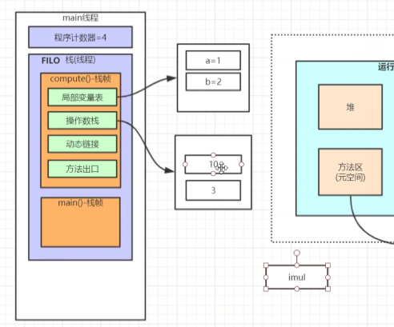

执行int类型的乘法（此时会产生新的数据代替之前的数据）
 9: imul

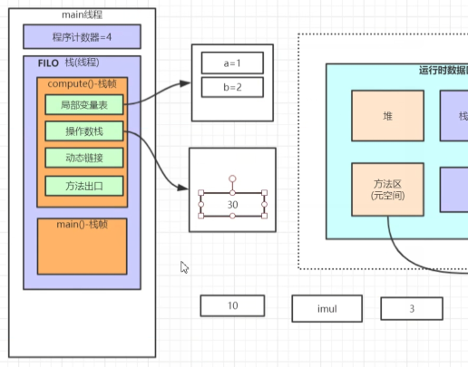

 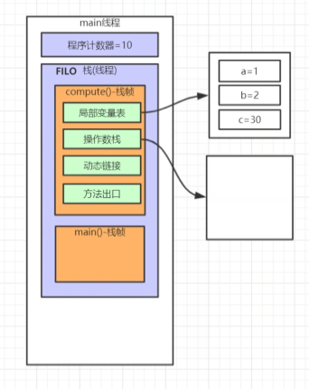

将栈顶int型数值存入第三个本地变量
10: istore_3
将栈顶两int型数值相加并将结果压入栈顶
11: iload_3
 将int类型返回到主函数
12: ireturn


4、main()方法也有对应的操作数栈

new 出来的对象存放在堆里面

会有对象的地址指针指向堆内存地址

栈中有些对象的指针指向堆中的对象


一个类new多个对象，会在堆中生成多个对象

此时共同指向方法去中的方法

对象new之后会有很复杂的结构（对象头......)

类型指针会指向类元信息（对象的类）

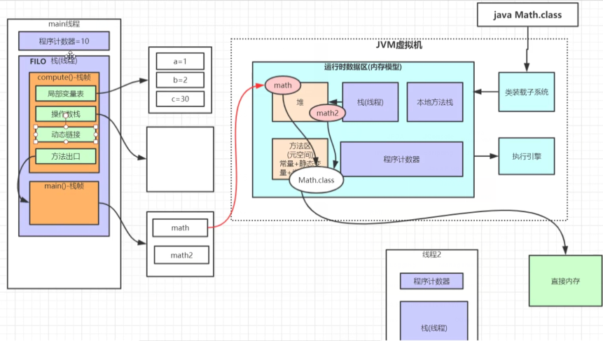


####  **2、栈帧：**

此时执行到main()方法

man方法调用computer()方法

computer()方法在运行时也会需要一些局部变量等

此时的虚拟机会在该方法的栈中独立分配一个栈帧区域用来存储方法所需要的变量


### 程序计数器

存放线程要执行的下一个或者正在执行的指令的指令码

存放对应的行号指针，代码正在执行的位置

每执行一行就会对程序计数器的值进行更新

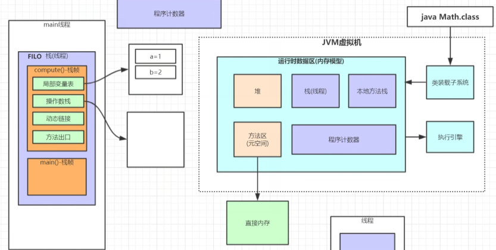


### 方法区

方法区（元空间）、常量、静态变量、类元信息

用的内存是直接的物理内存而不是jvm的内存


在启动过程中内存猛增

在启动之后相对稳定

启动时可能会不断的进行full  gc

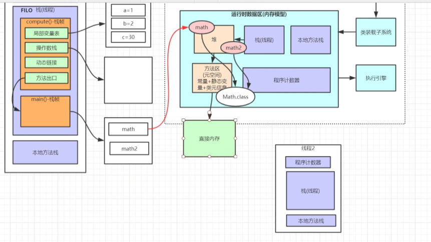

#### 堆、栈、方法区、程序计数器之间的关系


### 本地方法栈

有native方法，执行会调用底层c语言库调用相应的实现


#### 本地方法栈

每个线程独享的区域（局变等）

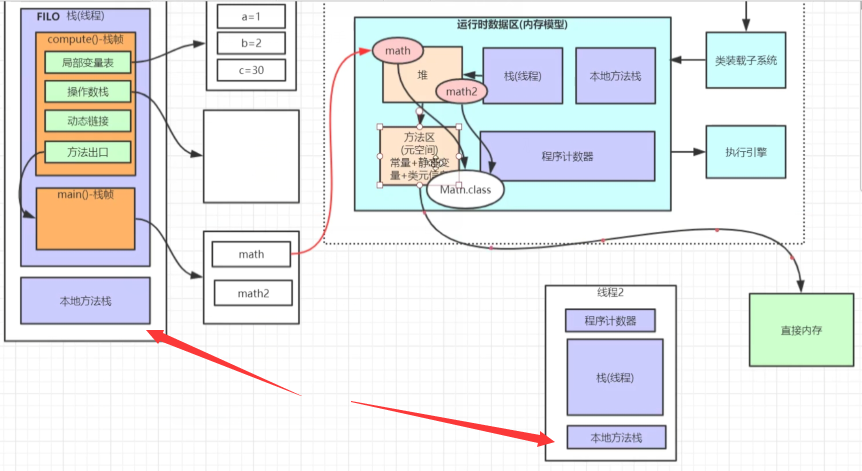


### 堆

new出来的对象有个头指针指向方法去的字节码


老年代：占空间的2/3

年轻代：占空间1/3

Eden:占8/10

from:占1/10

to：占1/10


new出来的对象放在Eden区

长期的new操作会将Eden空间占满

此时会 minor gc 对Eden无效对象进行清理

还有引用的对象会一道survivor区 的 from（分代年龄加1，在对象头中的属性）

survivor区占满触发minor gc对无效的数据进行回收

还有一些有用的对象就会移到survivor区的to区

最终经过gc会移动到老年代


老年代：静态变量，常量池.......


**使用jvisual进行查询进程相关的各个区之间的关系**

**进行装visual gc插件进行查看**


老年代满了就会触发 full gc

但是老年代对象都是有用的

此时就会报溢出


**无用对象**（gc root根）

此时栈帧中的数据指向jvm的堆的指针消失

但是对象依然存在jvm堆里面

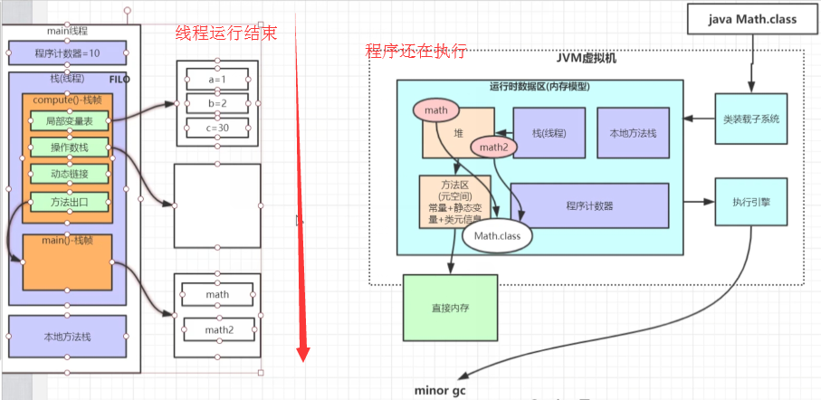


### 调优思路

执行gc会进行停机在复机

1、减少复机的次数

2、减少复机的时间


观察调优日志

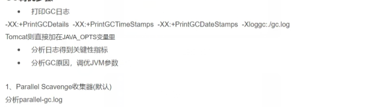


new出来的对象都是放在堆里面的


