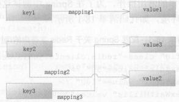
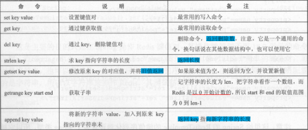
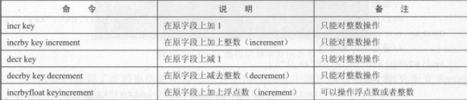
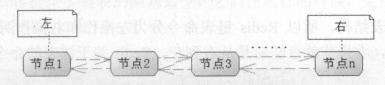
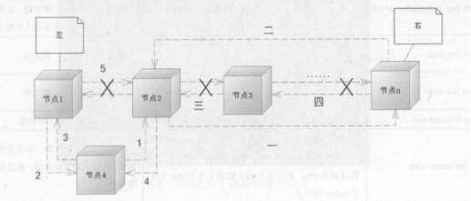
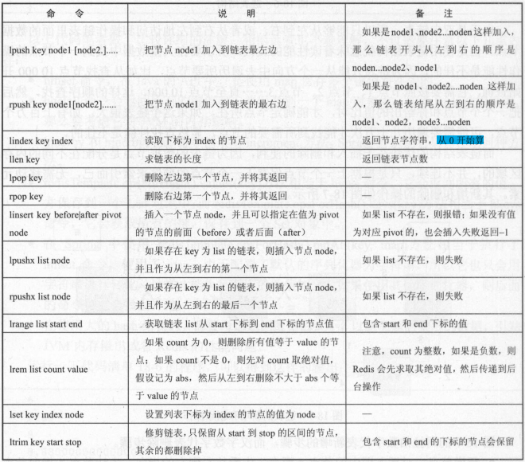

# **数据类型**

1.string（字符串）

2.hash（哈希，类似java里的Map）

3.list（列表）

4.set（集合）

5.zset(sorted set：有序集合)

6.基数


**String**（字符串）

string是redis最基本的类型，你可以理解成与Memcached一模一样的类型，一个key对应一个value。

string类型是**二进制安全的**。意思是redis的string可以包含任何数据。比如jpg图片或者序列化的对象 。

string类型是Redis**最基本的数据类型**，一个redis中字符串value最多可以是512M


**Hash**（哈希）

Redis hash 是一个键值对集合。

Redis hash是一个string类型的**field**和**value**的映射表，hash特别适合用于存储对象。

类似Java里面的Map<String,Object>


**List**（列表）

Redis 列表是简单的字符串列表，按照插入顺序排序。你可以添加一个元素导列表的头部（左边）或者尾部（右边）

**它的底层实际是个链表**


**Set**（集合）

Redis的Set是string类型的**无序**集合。它是通过**HashTable实现实现的**


**zset**(sorted set：有序集合)

Redis zset 和 set 一样也是string类型元素的集合,且不允许重复的成员。

不同的是每个元素都会关联一个**double**类型的**分数**。

redis正是通过分数来为集合中的成员进行从小到大的排序。zset的成员是唯一的,但分数(score)却可以重复。


**命令地址：http://redisdoc.com/**


# **Redis 键(key)**

\1. keys *

```
127.0.0.1:6379> keys *
1) "key"
2) "myset:__rand_int__"
3) "counter:__rand_int__"
4) "key:__rand_int__"
```

\2. exists key的名字，判断某个key是否存在

```
127.0.0.1:6379> EXISTS key
(integer) 1
```

\3. move key db   --->当前库就没有了，被移除了


\4. expire key 秒钟：为给定的key设置过期时间

```
127.0.0.1:6379> EXPIRE key 20
(integer) 1

127.0.0.1:6379> keys *
1) "key"
2) "myset:__rand_int__"
3) "counter:__rand_int__"
4) "key:__rand_int__"


127.0.0.1:6379> keys *
1) "myset:__rand_int__"
2) "counter:__rand_int__"
3) "key:__rand_int__"
```

\5. ttl key 查看还有多少秒过期，-1表示永不过期，-2表示已过期,即已被删除

```
127.0.0.1:6379> EXPIRE key 20
(integer) 1
127.0.0.1:6379> ttl key
(integer) 17
127.0.0.1:6379> ttl key
(integer) -2
```

\6. type key 查看你的key是什么类型

```
127.0.0.1:6379> type key
string
```


# **String类型：**

字符串是Redis的最基本额数据结构，以一个键和一个值存储在Redis内部

类似java的Map结构，通过键去找值



### 基本命令



### 支持简单运算的命令




### 命令测试：


#### 设置/追加

```
127.0.0.1:6379> set key1 value1
OK
```

```
127.0.0.1:6379> APPEND key1 2345
(integer) 10

127.0.0.1:6379> get key1
"value12345"
```


#### 自增/自减

```
127.0.0.1:6379> set key2 3
OK

127.0.0.1:6379> INCR key2
(integer) 4
```

```
127.0.0.1:6379> DECR key2
(integer) 3
```

```
127.0.0.1:6379> INCRBY key2 10
(integer) 13127.0.0.1:6379> INCRBY key2 10
(integer) 13
```

```
127.0.0.1:6379> DECRBY key2 3
(integer) 10
```


#### getrange/setrange

getrange:获取指定区间范围内的值，类似between......and的关系从零到负一表示				全部，默认从0开始

​                0 -1：代表全部

setrange设置指定区间范围内的值，格式是**setrange key值 具体值**

​       	     **即修改原来字符串额值从某个位置开始** 

```
127.0.0.1:6379> get key1
"value12345"
```

```
127.0.0.1:6379> getrange key1 0 -1
"value12345"
```

```
127.0.0.1:6379> SETRANGE key1 0 ab
(integer) 10

127.0.0.1:6379> get key1
"ablue12345"
```


#### setex(set with expire)键秒值/setnx(set if not exist)

setex:设置带过期时间的key，动态设置。

​            setex 键 秒值 真实值

setnx:只有在 key 不存在时设置 key 的值。

```
127.0.0.1:6379> get key1
"ablue12345"

127.0.0.1:6379> SETNX key1 val
(integer) 0

127.0.0.1:6379> get key1
"ablue12345"
```

```
127.0.0.1:6379> SETNX key11 val
(integer) 1

127.0.0.1:6379> get key11
"val"
```


#### **mset/mget/msetnx**

mset:同时设置**一个或多个** key-value 对。

mget:获取所有(**一个或多个**)给定 key 的值。

msetnx:同时设置一个或多个 key-value 对，**当且仅当所有给定 key 都不存在**。

​						否则不生效


```
127.0.0.1:6379> MSET k1 v1 k2 v2 k3 v3
OK
```

```
127.0.0.1:6379> MGET k1 k2 k3 
1) "v1"
2) "v2"
3) "v3"
```

```
127.0.0.1:6379> MSETNX k4 v4 k5 v5
(integer) 1

127.0.0.1:6379> MGET k4 k5
1) "v4"
2) "v5"
```


# **链表List**

链表结构是 Redis 中一个常用的结构，它可以存储多个字符串，而且它是有序的

Redis 链表是双向的



使用链表结构就意味着读性能的丧失

链表只能从 单个方向中去遍历所要节点


优势：在于插入和删除的便利


链表的数据节点是分配在不同的内存域的，并不连续



由此可见，链表结构的使用是需要注意场景的，对于那些经常需要对数据进行插入和

删除的列表数据使用它是十分方便的，因为它可以在不移动其他节点的情况下完成插入和

删除。而对于需要经常查找的，使用它性能并不佳，它只能从左到右或者从右到左的查找

和比对。


### 基本命令




#### 插入

 lpush/rpush/lrange

lpush: 从链表的左边插入

rpush: 从链表的右边插入

lrange ：查看链表的节点值

 **lrange  list  start    end          end=-1代表全部**


```
127.0.0.1:6379> LPUSH list1 1 2 3 4 5
(integer) 5
```

```
127.0.0.1:6379> LRANGE list1 0 -1
1) "5"
2) "4"
3) "3"
4) "2"
5) "1"
```

```
127.0.0.1:6379> RPUSH list2 1 2 3 4 5
(integer) 5
```

```
127.0.0.1:6379> LRANGE list2 0 -1
1) "1"
2) "2"
3) "3"
4) "4"
5) "5"
```


#### 删除

lpop/rpop

lpop:删除左边的第一个节点，并且将其返回

rpop：删除右边第一个节点，并且将其返回


```
127.0.0.1:6379> LRANGE list2 0 -1
1) "1"
2) "2"
3) "3"
4) "4"
5) "5"
```

左：

```
127.0.0.1:6379> LPOP list2 
"1"
127.0.0.1:6379> LRANGE list2 0 -1
1) "2"
2) "3"
3) "4"
4) "5"
```

右：

```
127.0.0.1:6379> RPOP list2
"5"
127.0.0.1:6379> LRANGE list2 0 -1
1) "2"
2) "3"
3) "4"
```


#### lindex

lindex，按照索引下标获得元素(从上到下)

lindex：  lindex key index，索引从零开始

通过索引获取列表中的元素 

```
127.0.0.1:6379> LRANGE list2 0 -1
1) "2"
2) "3"
3) "4"

127.0.0.1:6379> LINDEX list2 0
"2"

127.0.0.1:6379> LINDEX list2 5
(nil)
```


#### llen

求链表的长度，返回长度

```
127.0.0.1:6379> llen list2
(integer) 3

127.0.0.1:6379> LRANGE list2 0 -1
1) "2"
2) "3"
3) "4"
```


####  lrem key 

 lrem    key    删N个    value

 \* 从left往right删除2个值等于v1的元素，返回的值为实际删除的数量

 \*  LREM list3 0 值，表示删除全部给定的值。零个就是全部值

​     lrem list 个数  节点值


准备测试数据：

```

127.0.0.1:6379> LPUSH list 1 2 2 2 3 3 3 4 4 4 5 5 5
(integer) 13

127.0.0.1:6379> LRANGE list 0 -1
 1) "5"
 2) "5"
 3) "5"
 4) "4"
 5) "4"
 6) "4"
 7) "3"
 8) "3"
 9) "3"
10) "2"
11) "2"
12) "2"
13) "1"
```

删除

```
127.0.0.1:6379> LREM list 2 4
(integer) 2

127.0.0.1:6379> LRANGE list 0 -1
 1) "5"
 2) "5"
 3) "5"
 4) "4"
 5) "3"
 6) "3"
 7) "3"
 8) "2"
 9) "2"
10) "2"
11) "1"
```


#### 截取在赋值

ltrim key 开始index 结束index，截取指定范围的值后再赋值给key

ltrim：截取指定索引区间的元素，格式是ltrim list的key 起始索引 结束索引

​       【start end】 开区间    会把截取的内容保存在原来的list中，默认截取位置从0  开始

即：保存执行索引区间的数据

```
127.0.0.1:6379> LRANGE list1 0 -1
1) "5"
2) "4"
3) "3"
4) "2"
5) "1"

127.0.0.1:6379> LTRIM list1 0 3
OK

127.0.0.1:6379> LRANGE list1 0 -1
1) "5"
2) "4"
3) "3"
4) "2"
```


#### rpoplpush 

rpoplpush 源列表 目的列表

移除列表的最后一个元素，并将该元素添加到另一个列表并返回

**移除源列表的最后一个元素并且将其左插到目的列表中**


```
127.0.0.1:6379> LRANGE list1 0 -1 
1) "5"
2) "4"
3) "3"
4) "2"

127.0.0.1:6379> LRANGE list2 0 -1 
1) "2"
2) "3"
3) "4"


127.0.0.1:6379> RPOPLPUSH list1 list2
"2"


127.0.0.1:6379> LRANGE list1 0 -1 
1) "5"
2) "4"
3) "3"

127.0.0.1:6379> LRANGE list2 0 -1 
1) "2"
2) "2"
3) "3"
4) "4"
```


#### lset 

 lset key index value

给index出的索引修改值

```
127.0.0.1:6379> LRANGE list2 0 -1 
1) "2"
2) "2"
3) "3"
4) "4"


127.0.0.1:6379> LSET list2 0 1
OK


127.0.0.1:6379> LRANGE list2 0 -1 
1) "1"
2) "2"
3) "3"
4) "4"
```


#### linsert 

linsert key  before/after 值1 值2

在值1 前面/后面  插入值2


```
127.0.0.1:6379> LRANGE list2 0 -1 
1) "1"
2) "2"
3) "3"
4) "4"


127.0.0.1:6379> LINSERT list2 after 3 list
(integer) 5


127.0.0.1:6379> LRANGE list2 0 -1 
1) "1"
2) "2"
3) "3"
4) "list"
5) "4"
```

它是一个字符串链表，left、right都可以插入添加；

如果键不存在，创建新的链表；

如果键已存在，新增内容；

如果值全移除，对应的键也就消失了。

链表的操作无论是头和尾效率都极高，但假如是对中间元素进行操作，效率就很惨淡了。


**链表的命令都是进程不安全的，**

**Red is 提供了链表的阻塞命令，它 在运行的时候 会给链表加锁，以保**

**证操作链表的命令安全性**


