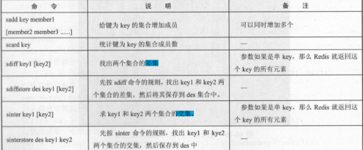
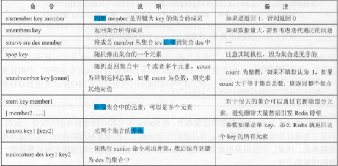
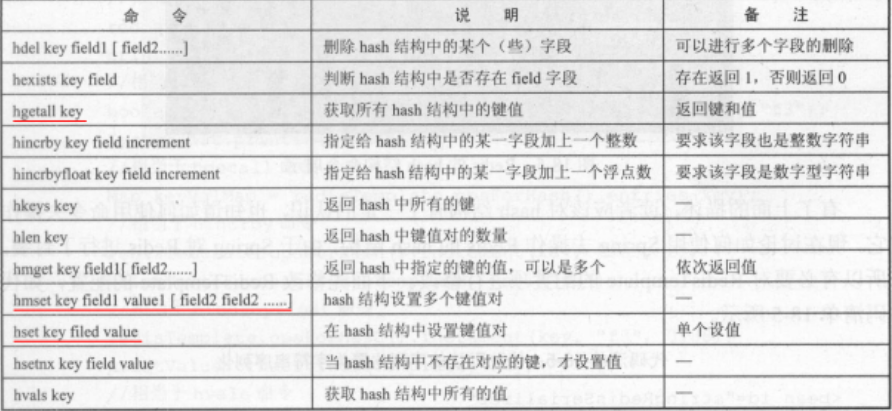
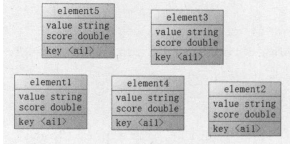
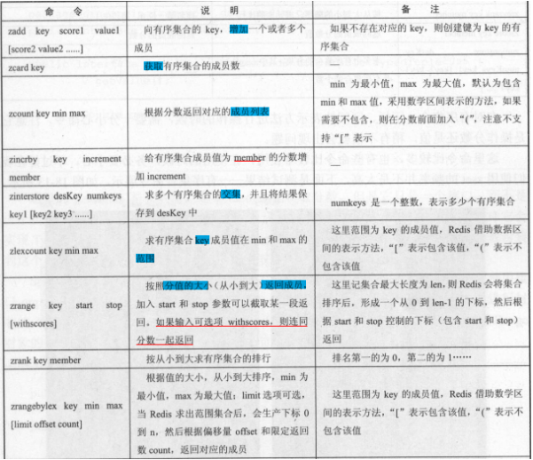
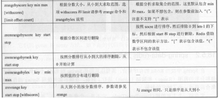
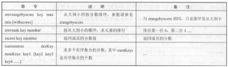

# **集合Set** 

Redis 的集合不是 个线性结构，而是一个**哈希表结构**，它的内部会根据 **hash 分子**来

存储和查找数据，理论上 个集合可以存储 232 （大约 42 亿）个元素，因为采用哈希表结

构，所以**对于 Redis 集合的插入、删除和查找的复杂度都是 0(1 ）**，只是我们需要注意：


1.对于集合而言，它的每 个元素都是不能重复的，当插入相同记录的时候都会失败

2.集合是无序的。

3.集合的每 1个元素都是 String 数据结构类型。


Redis 的集合可以对于不同的集合进行操作，比如求出两个或者以上集合的交集、 差集和并集等


### 基本命令






#### **sadd/smembers/sismember**

sadd key number [member2 .....]  给键为key的集合增加成员，可增加多个

smembers key  返回集合所有成员

sismember  key member  判断member是否是key集合的成员

```
127.0.0.1:6379> SADD set 1 2 3 
(integer) 3
```

```
127.0.0.1:6379> SMEMBERS set
1) "1"
2) "2"
3) "3"
```

```
127.0.0.1:6379> SISMEMBER set 4
(integer) 0
127.0.0.1:6379> SISMEMBER set 3
(integer) 1
```


#### scard

 scard，获取集合里面的元素个数

​    获取集合里面的元素个数

scard keyName

```
127.0.0.1:6379> SCARD set
(integer) 3
```


#### srem 

srem key value 删除集合中元素

srem key member [ member2 .... ]

移除集合中 元素，可以是多个元素

```
127.0.0.1:6379> SREM set 1
(integer) 1

127.0.0.1:6379> SMEMBERS set
1) "2"
2) "3"
```


#### srandmember 

 srandmember key 某个整数(随机出几个数)

 \*   从set集合里面随机取出2个

 \*   如果超过最大数量就全部取出，

 \*   如果写的值是负数，比如-3 ，表示需要取出3个，但是可能会有重复值。

**srandmember key [count]**

count为随机出数的个数，默认为1，为负数则取绝对值

```
127.0.0.1:6379> SMEMBERS set
1) "1"
2) "2"
3) "3"
4) "4"
5) "5"
6) "6"
7) "7"
```

```
127.0.0.1:6379> SRANDMEMBER set 3
1) "1"
2) "5"
3) "3"
127.0.0.1:6379> SRANDMEMBER set 3
1) "7"
2) "6"
3) "3"
```

```
127.0.0.1:6379> SRANDMEMBER set 
"1"
127.0.0.1:6379> SRANDMEMBER set 
"4"
```


#### spop 

spop key 随机出栈

随机弹 集合的一个元素

注意其随机性 因为集合是无序的

```
127.0.0.1:6379> SMEMBERS set
1) "1"
2) "2"
3) "3"
4) "4"
5) "5"
6) "6"
7) "7"
```

```
127.0.0.1:6379> SPOP set
"4"

127.0.0.1:6379> SMEMBERS set
1) "1"
2) "2"
3) "3"
4) "5"
5) "6"
6) "7"
```


#### smove 

smove key1 key2 在key1里某个值      作用是将key1里的某个值赋给key2

**smove src des member**

将成员 member 从集合 src 迁移到集合 des

原来集合的值可以说已经没有了，直接去了另一个集合，另一个集合可以存在，不存在则创建

```
127.0.0.1:6379> SMEMBERS set1
1) "7"
127.0.0.1:6379> SMEMBERS set
1) "1"
2) "2"
3) "3"
4) "5"
5) "6"


127.0.0.1:6379> SMOVE set set1 6
(integer) 1


127.0.0.1:6379> SMEMBERS set
1) "1"
2) "2"
3) "3"
4) "5"
127.0.0.1:6379> SMEMBERS set1
1) "6"
2) "7"
127.0.0.1:6379>
```


#### 集合操作

差集：sdiff

交集：sinter

并集：sunion


sdiff key I [key2]   找出两个综合的差集                

​			参数如果是单 key ，那么 Red is 就返回这key 的所有元素

sinter key I [key2]  key key2 两个集合的交集。    

​			参数如果是单 key ，那么 Red is 就返回这key 的所有元素

sunion key l [key2]     求两 集合 并集                  

​			 参数如果是单 key ，那么 Red is 就返回这key 的所有元素


数据准备

```
127.0.0.1:6379> SADD set4 1 2 3 4 5 
(integer) 5
127.0.0.1:6379> SADD set5 3 4 5 q w e 
(integer) 6
```

差集

```
127.0.0.1:6379> SDIFF set4 set5
1) "1"
2) "2"
```

交集

```
127.0.0.1:6379> SINTER set4 set5
1) "3"
2) "4"
3) "5"
```

并集

```
127.0.0.1:6379> SUNION set4 set5
1) "1"
2) "5"
3) "e"
4) "2"
5) "w"
6) "4"
7) "q"
8) "3"
```


# **Hash哈希**


Redis 中哈希结构就如同 Java map 一样 个对象里面有许多键值对，它是特别

合存储对象的 ，如果内存足够大，那么 Redis hash 结构可以存储 232_ 键值对 40

多亿）。 般而言 不会使用到那么大的一个键值对，所以我们认为 Redis 可以存储很多的

键值对。在 Redis 中， hash 是一个 String 类型的 field value 映射表，因此我们存储的

数据实际在 Redis内存中的一个字符串


hash 的键值对在内存中是一种无序的状态


### 基本命令



**KV模式不变，但V是一个键值对**


#### hset /hget

hset key file value:设置键值对  **单个**

hget ：获取属性值  **单个**

```
127.0.0.1:6379> HSET user id 1001
(integer) 1
127.0.0.1:6379> hget user id
"1001"
```


#### hmset 

hmset key field1 value1 [filed2 value2...]  设置键值对， **多个**

hmget：获取多个hash指定键的值   **多个**

```
127.0.0.1:6379> HMSET user name wangwang age 12
OK

127.0.0.1:6379> hget user id
"1001"

127.0.0.1:6379> hget user name
"wangwang"

127.0.0.1:6379> hget user age
"12"
```

#### hgetall

```
127.0.0.1:6379> HGETALL user
1) "id"
2) "1001"
3) "name"
4) "wangwang"
5) "age"
6) "12"
```

#### hdel

hdel：删除hash中的某些字段

```
127.0.0.1:6379> HGETALL user
1) "id"
2) "1001"
3) "name"
4) "wangwang"
5) "age"
6) "12"


127.0.0.1:6379> HDEL user age
(integer) 1


127.0.0.1:6379> HGETALL user
1) "id"
2) "1001"
3) "name"
4) "wangwang"
```


#### hlen

 hlen返回key中的数量

```
127.0.0.1:6379> HGETALL user
1) "id"
2) "1001"
3) "name"
4) "wangwang"

127.0.0.1:6379> HLEN user
(integer) 2
```


#### hexists 

 hexists key 在key里面的某个值的key

```
127.0.0.1:6379> HGETALL user
1) "id"
2) "1001"
3) "name"
4) "wangwang"

127.0.0.1:6379> HEXISTS user id
(integer) 1

127.0.0.1:6379> HEXISTS user age
(integer) 0
```


#### hkeys/hvals

hkeys：获取所有的键

hvals：获取所有的值

```
127.0.0.1:6379> HKEYS user
1) "id"
2) "name"

127.0.0.1:6379> HVALS user
1) "1001"
2) "wangwang"
```


#### hincrby/hincrbyfloat

```
127.0.0.1:6379> HGETALL user
1) "id"
2) "1001"
3) "name"
4) "wangwang"


127.0.0.1:6379> HINCRBY user id 10
(integer) 1011


127.0.0.1:6379> HGETALL user
1) "id"
2) "1011"
3) "name"
4) "wangwang"
```


#### hsetnx

hsetnx：不存在赋值，存在了无效。

hsetnx key field value

```
127.0.0.1:6379> HGETALL user
1) "id"
2) "1011"
3) "name"
4) "wangwang"

127.0.0.1:6379> HSETNX user age 12
(integer) 1

127.0.0.1:6379> HGETALL user
1) "id"
2) "1011"
3) "name"
4) "wangwang"
5) "age"
6) "12"


127.0.0.1:6379> HSETNX user age 43
(integer) 0

127.0.0.1:6379> HGETALL user
1) "id"
2) "1011"
3) "name"
4) "wangwang"
5) "age"
6) "12"
```


# **有序集合**

只是说它是有序的

和无序集合的主要区别在于每 个元素除了值之外，它还会多一个**分数**

分数是一个浮点数，在 Java 中是使用双精度表示的


Redis 就可以支持对分数从小到大或者从大到小的排序。这里和无序集合一样，对于

每一个元素都是唯一的 ，但是对于不同元素而 ，它的**分数可以一样**。




有序集合是依赖 key 标示它是属于哪个集合，依赖分数进行排序，所以值和分数是必须的


### 基本命令








#### zadd

zadd key   **score value（value1）** 【score2 value2 ...] 

增加一个或多个成员，key不存在则创建有序集合

```
127.0.0.1:6379> ZADD zset 10 v1 20 v2 5 v3
(integer) 1
```

#### ZRANGE

zrange key start stop [withscores]

按照分数大小（从小到大返回数据成员）

加入start和stop擦书可以截取某一段进行返回

如果可选项withscores，还可以同分数一起返回

```
127.0.0.1:6379> ZRANGE zset 0 -1 withscores
1) "v3"
2) "5"
3) "v1"
4) "10"
5) "v2"
6) "20"
```

```
127.0.0.1:6379> ZRANGE zset 0 -1 
1) "v3"
2) "v1"
3) "v2"
```


#### zrangebyscore 

zrangebyscore  key 开始score 结束score [withscores]  [limit offset count]

根据分数大小，从小到大求取数据范围

limit offset count 从结果的第几个开始包含几个

```
127.0.0.1:6379> ZRANGEBYSCORE zset 10 20 withscores
1) "v1"
2) "10"
3) "v2"
4) "20"
```

```
127.0.0.1:6379> ZRANGEBYSCORE zset 5 20 limit 2 2
1) "v2"
```

#### zrem 

zrem key 某score下对应的value值，作用是删除元素


#### zcard

zcard：统计个数

```
127.0.0.1:6379> ZCARD zset
(integer) 3
```


#### zcount 

zcount key score： zcount key min max        根据**分数**返回对应的成员列表

```
127.0.0.1:6379> ZCOUNT zset 10 20
(integer) 2
```


#### zrank 

```
127.0.0.1:6379> ZRANk zset v1
(integer) 1
```


#### zrevrank 

zrevrank key values值，作用是逆序获得下标值

```
127.0.0.1:6379> ZREVRANk zset v1
(integer) 1
```


#### zrevrange  

 zrevrange  从大到小的按分数排序

zrevrange key start end


#### zrevrangebyscore  

zrevrangebyscore  key 结束score 开始score

从大到小的按分数排序

zrevrangebyscore key max min [withscores


