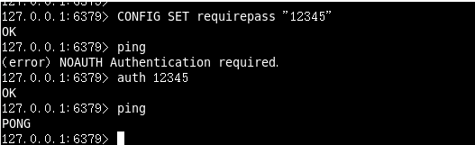
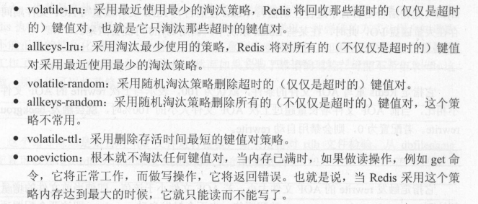

# **redis.conf文件**

在Linux进行文件的查看！


## units单位

```
  8 # Note on units: when memory size is needed, it is possible to specify
   9 # it in the usual form of 1k 5GB 4M and so forth:
  10 #
  11 # 1k => 1000 bytes
  12 # 1kb => 1024 bytes
  13 # 1m => 1000000 bytes
  14 # 1mb => 1024*1024 bytes
  15 # 1g => 1000000000 bytes
  16 # 1gb => 1024*1024*1024 bytes
  17 #
  18 # units are case insensitive so 1GB 1Gb 1gB are all the same.
```

**units are case insensitive so 1GB 1Gb 1gB are all the same.**

 1  配置大小单位,开头定义了一些基本的度量单位，只支持bytes，不支持bit

 2  对大小写不敏感


## **includes**

```
  20 ################################## INCLUDES ##############################
  22 # Include one or more other config files here.  This is useful if you
  23 # have a standard template that goes to all Redis servers but also need
  24 # to customize a few per-server settings.  Include files can include
  25 # other files, so use this wisely.
  26 #
  27 # Notice option "include" won't be rewritten by command "CONFIG REWRITE"
  28 # from admin or Redis Sentinel. Since Redis always uses the last processed
  29 # line as value of a configuration directive, you'd better put includes
  30 # at the beginning of this file to avoid overwriting config change at runti     me.
  31 #
  32 # If instead you are interested in using includes to override configuration
  33 # options, it is better to use include as the last line.
  34 #
  35 # include /path/to/local.conf
```

Include one or more other config files here.  This is useful if you

have a standard template that goes to all Redis servers but also need

**include /path/to/local.conf**

和Struts2配置文件类似，可以通过includes包含，redis.conf可以作为总闸，包含其他


## **GENERAL**

```
141 # If a pid file is specified, Redis writes it where specified at startup
142 # and removes it at exit.
143 #
144 # When the server runs non daemonized, no pid file is created if none is
145 # specified in the configuration. When the server is daemonized, the pid fi     le
146 # is used even if not specified, defaulting to "/var/run/redis.pid".
147 #
148 # Creating a pid file is best effort: if Redis is not able to create it
149 # nothing bad happens, the server will start and run normally.
150 pidfile /var/run/redis_6379.pid
```

​		**pidfile /var/run/redis_6379.pid**


```
126 # By default Redis does not run as a daemon. Use 'yes' if you need it.
127 # Note that Redis will write a pid file in /var/run/redis.pid when daemoniz     ed.
128 daemonize yes
```

​		  **daemonize yes**


```
  82 # Accept connections on the specified port, default is 6379 (IANA #815344).
  83 # If port 0 is specified Redis will not listen on a TCP socket.
  84 port 6379
```

​			**port 6379**


```
# TCP listen() backlog.
#
# In high requests-per-second environments you need an high backlog in order
# to avoid slow clients connections issues. Note that the Linux kernel
# will silently truncate it to the value of /proc/sys/net/core/somaxconn so
# make sure to raise both the value of somaxconn and tcp_max_syn_backlog
# in order to get the desired effect.
tcp-backlog 511

tcp-backlog
设置tcp的backlog，backlog其实是一个连接队列，backlog队列总和=未完成三次握手队列 + 已经完成三次握手队列。
在高并发环境下你需要一个高backlog值来避免慢客户端连接问题。注意Linux内核会将这个值减小到
/proc/sys/net/core/somaxconn的值，所以需要确认增大somaxconn和tcp_max_syn_backlog两个值
来达到想要的效果
```


```
# Close the connection after a client is idle for N seconds (0 to disable)
timeout 0
```

​			**timeout 0**


```
# IF YOU ARE SURE YOU WANT YOUR INSTANCE TO LISTEN TO ALL THE INTERFACES
# JUST COMMENT THE FOLLOWING LINE.
# ~~~~~~~~~~~~~~~~~~~~~~~~~~~~~~~~~~~~~~~~~~~~~~~~~~~~~~~~~~~~~~~~~~~~~~~~
bind 127.0.0.1
```

​		**bind 127.0.0.1**


```
# On Linux, the specified value (in seconds) is the period used to send ACKs.
# Note that to close the connection the double of the time is needed.
# On other kernels the period depends on the kernel configuration.
#
# A reasonable value for this option is 300 seconds, which is the new
# Redis default starting with Redis 3.2.1.
tcp-keepalive 300
单位为秒，如果设置为0，则不会进行Keepalive检测，建议设置成60
```

​		**tcp-keepalive 300**
​		单位为秒，如果设置为0，则不会进行Keepalive检测，建议设置成60


```
# Specify the server verbosity level.
# This can be one of:
# debug (a lot of information, useful for development/testing)
# verbose (many rarely useful info, but not a mess like the debug level)
# notice (moderately verbose, what you want in production probably)
# warning (only very important / critical messages are logged)
loglevel notice
日志级别
```


```
# Specify the log file name. Also the empty string can be used to force
# Redis to log on the standard output. Note that if you use standard
# output for logging but daemonize, logs will be sent to /dev/null
logfile ""
日志的名字
```


```
# Set the number of databases. The default database is DB 0, you can select
# a different one on a per-connection basis using SELECT <dbid> where
# dbid is a number between 0 and 'databases'-1
databases 16
系统默认的库16个
默认使用0库
```


```
# To enable logging to the system logger, just set 'syslog-enabled' to yes,
# and optionally update the other syslog parameters to suit your needs.
# syslog-enabled no   是否把日志输出到syslog中

系统日志默认时关着
# Specify the syslog identity.
# syslog-ident redis  指定syslog里的日志标志

设备以redis开头
# Specify the syslog facility. Must be USER or between LOCAL0-LOCAL7.
# syslog-facility local0
指定syslog设备，值可以是USER或LOCAL0-LOCAL7
默认使用local0
```


## **SECURITY安全**

访问密码的查看、设置和取消

```
127.0.0.1:6379> ping
PONG

127.0.0.1:6379> CONFIG GET requirepass
1) "requirepass"
2) ""
```

设置密码：

config set requirepass " "


改为空的时候默认没有密码！

```
467 ################################## SECURITY ###################################
468
469 # Require clients to issue AUTH <PASSWORD> before processing any other
470 # commands.  This might be useful in environments in which you do not trust
471 # others with access to the host running redis-server.
```

Require clients to issue AUTH <PASSWORD> before processing any other


要求必须auth + password 在任何命令之前



**Redis一般做的是缓存，不是安全，而且系统会认为Linux是在安全的环境下....**


## **LIMITS限制**


maxclients

```
设置redis同时可以与多少个客户端进行连接。默认情况下为10000个客户端。当你
无法设置进程文件句柄限制时，redis会设置为当前的文件句柄限制值减去32，因为redis会为自
身内部处理逻辑留一些句柄出来。如果达到了此限制，redis则会拒绝新的连接请求，并且向这
些连接请求方发出“max number of clients reached”以作回应。

509 # Once the limit is reached Redis will close all the new connections sending
510 # an error 'max number of clients reached'.
511 #
512 # maxclients 10000
默认情况下为10000个客户端
```


maxmemory

```
设置redis可以使用的内存量。一旦到达内存使用上限，redis将会试图移除内部数据，移除规则可以通过maxmemory-policy来指定。
如果redis无法根据移除规则来移除内存中的数据，或者设置了“不允许移除”，
那么redis则会针对那些需要申请内存的指令返回错误信息，比如SET、LPUSH等。
但是对于无内存申请的指令，仍然会正常响应，比如GET等。如果你的redis是主redis（说明你的redis有从redis），
那么在设置内存使用上限时，需要在系统中留出一些内存空间给同步队列缓存，只有在你设置的是“不移除”的情况下，才不用考虑这个因素


533 # In short... if you have slaves attached it is suggested that you set a lower
534 # limit for maxmemory so that there is some free RAM on the system for slave
535 # output buffers (but this is not needed if the policy is 'noeviction').
537 # maxmemory <bytes>
```


maxmemory-policy:

最大缓存清楚策略

```
（1）volatile-lru：使用LRU算法移除key，只对设置了过期时间的键
（2）allkeys-lru：使用LRU算法移除key
（3）volatile-random：在过期集合中移除随机的key，只对设置了过期时间的键
（4）allkeys-random：移除随机的key
（5）volatile-ttl：移除那些TTL值最小的key，即那些最近要过期的key
（6）noeviction：不进行移除。针对写操作，只是返回错误信息
LRU 算法或者 TTL 算法都是不是很精确算法，而是 个近似算法。


539 # MAXMEMORY POLICY: how Redis will select what to remove when maxmemory
540 # is reached. You can select among five behaviors:
541 #
542 # volatile-lru -> remove the key with an expire set using an LRU algorithm
543 # allkeys-lru -> remove any key according to the LRU algorithm
544 # volatile-random -> remove a random key with an expire set
545 # allkeys-random -> remove a random key, any key
546 # volatile-ttl -> remove the key with the nearest expire time (minor TTL)
547 # noeviction -> don't expire at all, just return an error on write operations
```




maxmemory-samples

```
设置样本数量，LRU算法和最小TTL算法都并非是精确的算法，而是估算值，所以你可以设置样本的大小，
redis默认会检查这么多个key并选择其中LRU的那个


562 # LRU and minimal TTL algorithms are not precise algorithms but approximated
563 # algorithms (in order to save memory), so you can tune it for speed or
564 # accuracy. For default Redis will check five keys and pick the one that was
565 # used less recently, you can change the sample size using the following
566 # configuration directive.
568 # The default of 5 produces good enough results. 10 Approximates very closely
569 # true LRU but costs a bit more CPU. 3 is very fast but not very accurate.
571 # maxmemory-samples 5
```


