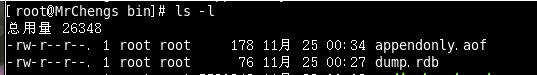
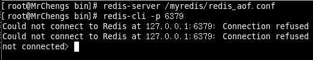
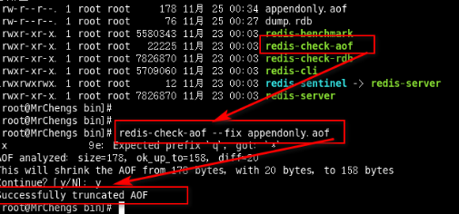

#  **redis.conf文件**


## SNAPSHOTTING快照

### Save

**a. save 秒钟 写操作次数**

```
RDB是整个内存的压缩过的Snapshot，RDB的数据结构，可以配置复合的快照触发条件，
默认
是1分钟内改了1万次，
或5分钟内改了10次，
或15分钟内改了1次。

182 # Save the DB on disk:
184 #   save <seconds> <changes>
186 #   Will save the DB if both the given number of seconds and the given
187 #   number of write operations against the DB occurred.
189 #   In the example below the behaviour will be to save:
190 #   after 900 sec (15 min) if at least 1 key changed
191 #   after 300 sec (5 min) if at least 10 keys changed
192 #   after 60 sec if at least 10000 keys changed
```

**b.如果想禁用RDB持久化的策略，只要不设置任何save指令，或者给save传入一个空字符串参数也可以**

```
194 #   Note: you can disable saving completely by commenting out all "save" lines.
195 #
196 #   It is also possible to remove all the previously configured save
197 #   points by adding a save directive with a single empty string argument
198 #   like in the following example:
199 #
200 #   save ""
202 save 900 1
203 save 300 10
204 save 60 10000
```

```
set key value1

save
此时立马执行，形成最新的dump文件
```

### stop-writes-on-bgsave-error

如果配置成no，表示你不在乎数据不一致或者有其他的手段发现和控制

```
# However if you have setup your proper monitoring of the Redis server
# and persistence, you may want to disable this feature so that Redis will
# continue to work as usual even if there are problems with disk,
# permissions, and so forth.
stop-writes-on-bgsave-error yes
```

yes：出错了就立即停止


### rdbcompression

rdbcompression：对于存储到磁盘中的快照，可以设置是否进行压缩存储。如果是的话，redis会采用LZF算法进行压缩。

如果你不想消耗CPU来进行压缩的话，可以设置为关闭此功能

```
# Compress string objects using LZF when dump .rdb databases?
# For default that's set to 'yes' as it's almost always a win.
# If you want to save some CPU in the saving child set it to 'no' but
# the dataset will likely be bigger if you have compressible values or keys.

rdbcompression yes
```


### dbfilename

默认生成的rdb文件名

```
# The filename where to dump the DB
dbfilename dump.rdb
```


### dir

```
# Note that you must specify a directory here, not a file name.
dir ./
```


### 实战测试

修改配置文件

```
#   save ""

save 900 1
save 120 10
save 60 10000
```


```
[root@zehrde3v3xqy7gpv9e4z myredis]# cd /usr/local/bin/
[root@zehrde3v3xqy7gpv9e4z bin]# ll
total 32736
-rwxr-xr-x 1 root root 4366648 Oct 19 17:27 redis-benchmark
-rwxr-xr-x 1 root root 8111856 Oct 19 17:27 redis-check-aof
-rwxr-xr-x 1 root root 8111856 Oct 19 17:27 redis-check-rdb
-rwxr-xr-x 1 root root 4806880 Oct 19 17:27 redis-cli
lrwxrwxrwx 1 root root      12 Oct 19 17:27 redis-sentinel -> redis-server
-rwxr-xr-x 1 root root 8111856 Oct 19 17:27 redis-server
```


2分钟之内操作10次

```
127.0.0.1:6379> set a 1
OK
127.0.0.1:6379> set b 2
OK
127.0.0.1:6379> set c 3
OK
127.0.0.1:6379> set d 4
OK
127.0.0.1:6379> set q 5
OK
127.0.0.1:6379> set w 6
OK
127.0.0.1:6379> set e 7
OK
127.0.0.1:6379> set r 8
OK
127.0.0.1:6379>  set t 9
OK
127.0.0.1:6379> set y 10
OK
```

之后会生成一个dump.rdb文件，具体生成文件的默认名修改：dbfilename

```
dr-xr-xr-x.  5 root root  4096 Oct  8 19:18 boot
drwxr-xr-x  19 root root  2960 Oct  8 19:17 dev
-rw-r--r--   1 root root   608 Oct 22 15:24 dump.rdb
drwxr-xr-x. 84 root root  4096 Oct  8 19:17 etc
drwxr-xr-x.  3 root root  4096 Apr 11  2018 home
```

 进行复制（备份）

```
[root@zehrde3v3xqy7gpv9e4z /]# cp dump.rdb  dump.rdb.bak
```


模拟事故：

此时直接删除所有的数据

```
127.0.0.1:6379> FLUSHDB 
OK
127.0.0.1:6379> shutdown
not connected> exit
```


此时再次重新登陆则是会显示为空，即是存在dump.rdb文件

```
127.0.0.1:6379> keys *
(empty list or set)
```


在管不redis时，迅速s斩断，保存文件dump.rdb

注意rdb文件的时间

斩断之前的rdb文件时间

```
lrwxrwxrwx   1 root root     7 Jul 19 09:44 bin -> usr/bin
dr-xr-xr-x.  5 root root  4096 Oct  8 19:18 boot
drwxr-xr-x  19 root root  2960 Oct  8 19:17 dev
-rw-r--r--   1 root root    92 Oct 22 15:31 dump.rdb
```

进行斩断操作

```
127.0.0.1:6379> shutdown
not connected> exit
```


此时删除之前的dump.rdb文件，并且把之前的dump_cp.rdb备份文件复制一份命名为dump.rdb

```
cp dump.rdb.bak  dump.rdb
```

此时又可以进行之前的keys的值获取

```
127.0.0.1:6379> keys *
 1) "key11"
 2) "counter:__rand_int__"
 3) "set1"
 4) "set"
 5) "list2"
 6) "user"
 7) "a"
 8) "key1"
 9) "k5"
10) "set4"
11) "set2"
12) "list"
13) "set5"
14) "set3"
15) "zset"
16) "key:__rand_int__"
17) "key"
18) "k3"
19) "myset:__rand_int__"
20) "k1"
21) "list1"
22) "k4"
23) "k2"
24) "key2"
```


##  **APPEND ONLY MODE追加**

### appendonly

默认开关状态，可以同时和RDB一起开着

```
# AOF and RDB persistence can be enabled at the same time without problems.
# If the AOF is enabled on startup Redis will load the AOF, that is the file
# with the better durability guarantees.
#
# Please check http://redis.io/topics/persistence for more information.

appendonly no
默认是关着的
```


### appendfilename

默认的文件名

```
# The name of the append only file (default: "appendonly.aof")
appendfilename "appendonly.aof"
```


###  appendfsync

```
# no: don't fsync, just let the OS flush the data when it wants. Faster.
# always: fsync after every write to the append only log. Slow, Safest.
# everysec: fsync only one time every second. Compromise.

```

**always**：

​	同步持久话每次发生数据变更立即记录到磁盘，性能比较差但是数据完整性好
**everysec**：

​	出场默认的推荐的，异步操作，每秒记录，如果一秒内宕机，有数据丢失


```
# More details please check the following article:
# http://antirez.com/post/redis-persistence-demystified.html
# If unsure, use "everysec".
# appendfsync always
appendfsync everysec
```


### no-appendfsync-on-rewrite

重写时是否可以运用Appendfsync，

用默认no即可，保证数据安全性。

```
# If you have latency problems turn this to "yes". Otherwise leave it as
# "no" that is the safest pick from the point of view of durability.

no-appendfsync-on-rewrite no
```


auto-aof-rewrite-min-size：设置重写的基准值

auto-aof-rewrite-percentage：设置重写的基准值

```
# This base size is compared to the current size. If the current size is
# bigger than the specified percentage, the rewrite is triggered. Also
# you need to specify a minimal size for the AOF file to be rewritten, this
# is useful to avoid rewriting the AOF file even if the percentage increase
# is reached but it is still pretty small.
# Specify a percentage of zero in order to disable the automatic AOF
# rewrite feature.

auto-aof-rewrite-percentage 100
auto-aof-rewrite-min-size 64mb
```


### 实战测试

首先开启aof测试

```
# Please check http://redis.io/topics/persistence for more information.
appendonly yes
```


此时就会生成aof文件

```
-rw-r--r--   1 root root     0 Oct 22 16:45 appendonly.aof
```


 创造性的意外事件

```
127.0.0.1:6379> set a 1
OK
127.0.0.1:6379> set b 2
OK
127.0.0.1:6379> set c 3
OK
127.0.0.1:6379> set d 4
OK
127.0.0.1:6379> FLUSHDB
OK
127.0.0.1:6379> SHUTDOWN 
not connected> exit
```


查看appendonly.aof

发现已经记下了我们写的命令

记录了我们执行的每一条命令

```
[admin@iz2zehrde3v3xqy7gpv9e4z /]$ cat appendonly.aof 
*2
$6
SELECT
$1
0
*3
$3
set
$1
a
$1
1
*3
$3
set
$1
*2
$6
SELECT
$1
0
*3
$3
set
$1
a
$1
1
*3
$3
set
$1
b
$1
2
*3
$3

~
~
~

*2
$6
SELECT
$1
0
*3
$3
set
$1
a
$1
1
*3
$3
set
$1
b
$1
2
*3
$3
set
$1
c
$1
3
*3
$3
set
$1
d
$1
4
*1
$7
FLUSHDB
```


重新启动

里面的内容为空

```
127.0.0.1:6379> keys *
(empty list or set)
```


删除appendonly.aof的最后一句


此时重新启动

获取到我们之前的内容

```
127.0.0.1:6379> keys *
1) "b"
2) "a"
3) "d"
4) "c"
```


## redis-check-aof

假设出现下面的情况：

appendonly.aof文件出错：可能是网络，断电.......


此时RDB和AOF文件都在




 此时启动Redis




 **在dump.rdb文件完整的情况下，appendonly.aof文件出错**

**说明后者的优先级大于前者**


那么此时的处理方式是：

```
redis-check-aof --fix appendonly.aof
```





再次重新启动：即可得到相应的数据


