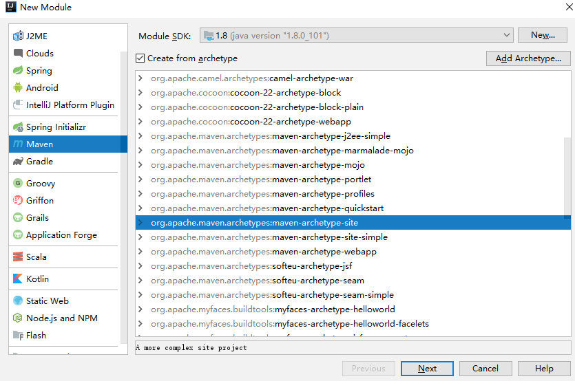

## 创建父工程




## pom文件代码：

```xml
<?xml version="1.0" encoding="UTF-8"?>

<project xmlns="http://maven.apache.org/POM/4.0.0" xmlns:xsi="http://www.w3.org/2001/XMLSchema-instance"
  xsi:schemaLocation="http://maven.apache.org/POM/4.0.0 http://maven.apache.org/xsd/maven-4.0.0.xsd">
  <modelVersion>4.0.0</modelVersion>

  <groupId>com.me.springcloud</groupId>
  <artifactId>springcloud2020</artifactId>
  <version>1.0-SNAPSHOT</version>
  <packaging>pom</packaging>

  <!-- 统一管理jar包版本-->
  <properties>
    <project.build.sourceEncoding>UTF-8</project.build.sourceEncoding>
    <maven.compiler.source>1.8</maven.compiler.source>
    <maven.compiler.target>1.8</maven.compiler.target>
    <junit.version>4.12</junit.version>
    <log4j.version>1.2.17</log4j.version>
    <lombok.version>1.16.18</lombok.version>
    <mysql.version>5.1.47</mysql.version>
    <druid.version>1.1.16</druid.version>
    <mybatis.spring.boot.version>1.3.0</mybatis.spring.boot.version>
  </properties>

  <!--子模块继承之后：提供作用：锁定版本+ 子module不用写groupid和version -->
  <dependencyManagement>
    <dependencies>
      <!--spring boot 2.2.2 -->
      <dependency>
        <groupId>org.springframework.boot</groupId>
        <artifactId>spring-boot-dependencies</artifactId>
        <version>2.2.2.RELEASE</version>
        <type>pom</type>
        <scope>import</scope>
      </dependency>


      <!--spring cloud Hoxtom.SR!-->
      <dependency>
        <groupId>org.springframework.cloud</groupId>
        <artifactId>spring-cloud-dependencies</artifactId>
        <version>Hoxton.SR1</version>
        <type>pom</type>
        <scope>import</scope>
      </dependency>

        <!--ali -->
        <dependency>
            <groupId>com.alibaba.cloud</groupId>
            <artifactId>spring-cloud-alibaba-dependencies</artifactId>
            <version>2.1.0.RELEASE</version>
            <type>pom</type>
            <scope>import</scope>
        </dependency>

        <dependency>
            <groupId>mysql</groupId>
            <artifactId>mysql-connector-java</artifactId>
            <version>${mysql.version}</version>
        </dependency>

        <dependency>
            <groupId>com.alibaba</groupId>
            <artifactId>druid-spring-boot-stater</artifactId>
            <version>${druid.version}</version>
        </dependency>

        <dependency>
            <groupId>org.mybatis.spring.boot</groupId>
            <artifactId>mybatis-spring-boot-stater</artifactId>
            <version>${mybatis.spring.boot.version}</version>
        </dependency>

        <dependency>
            <groupId>org.projectlombok</groupId>
            <artifactId>lombok</artifactId>
            <version>${lombok.version}</version>
        </dependency>

        <dependency>
            <groupId>log4j</groupId>
            <artifactId>log4j</artifactId>
            <version>${log4j.version}</version>
        </dependency>

        <dependency>
            <groupId>junit</groupId>
            <artifactId>junit</artifactId>
            <version>${junit.version}</version>
        </dependency>

    </dependencies>
  </dependencyManagement>


    <build>
        <plugins>
            <plugin>
                <groupId>org.springframework.boot</groupId>
                <artifactId>spring-boot-maven-plugin</artifactId>
                <configuration>
                    <fork>true</fork>
                    <addResources>true</addResources>
                </configuration>
            </plugin>
        </plugins>
    </build>

</project>

```


## 区别：

**dependencies**：


**dependencyManagement**：提供一个管理版本号的方式

通常会在一个组织或者项目的最顶层的父POM中看到该元素

能够让所有在子项目中引用一个依赖而不用显式的列出版本号

maven回沿着父子层次向上走，知道找到一个拥有dependencyManagement元素的项目，然后就会使用该元素中的版本号


只是声明依赖，并不引入，子项目需要显示的声明和需要引用的依赖

需要其他的版本号：直接加version即可


