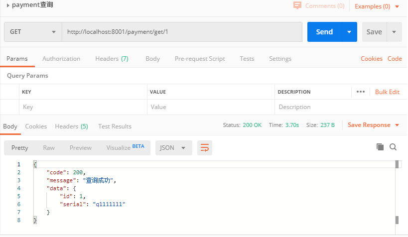

### 搭建maven工程

新建maven工程


工程目录


### 各种配置类的使用

#### 启动类PaymentMain8001

```java
package com.atguigu.springcloud;

import org.springframework.boot.SpringApplication;
import org.springframework.boot.autoconfigure.SpringBootApplication;

@SpringBootApplication
public class PaymentMain8001 {
    public static void main(String[] args) {
        SpringApplication.run(PaymentMain8001.class, args);
    }
}
```


#### pom文件

```xml
<?xml version="1.0" encoding="UTF-8"?>
<project xmlns="http://maven.apache.org/POM/4.0.0"
         xmlns:xsi="http://www.w3.org/2001/XMLSchema-instance"
         xsi:schemaLocation="http://maven.apache.org/POM/4.0.0 http://maven.apache.org/xsd/maven-4.0.0.xsd">
    <parent>
        <artifactId>springcloud2020</artifactId>
        <groupId>com.me.springcloud</groupId>
        <version>1.0-SNAPSHOT</version>
    </parent>
    <modelVersion>4.0.0</modelVersion>

    <artifactId>cloud-provider-payment8001</artifactId>

    <dependencies>
        <dependency>
            <groupId>org.springframework.boot</groupId>
            <artifactId>spring-boot-starter-web</artifactId>
            <version>2.2.2.RELEASE</version>
        </dependency>

        <!--监控-->
<!--        <dependency>-->
<!--            <groupId>org.springframework.boot</groupId>-->
<!--            <artifactId>spring-boot-starter-actuator</artifactId>-->
<!--        </dependency>-->
        <dependency>
            <groupId>org.mybatis.spring.boot</groupId>
            <artifactId>mybatis-spring-boot-starter</artifactId>
            <version>2.1.1</version>
        </dependency>
<!--        <dependency>-->
<!--            <groupId>com.alibaba</groupId>-->
<!--            <artifactId>druid-spring-boot-stater</artifactId>-->
<!--        </dependency>-->
        <dependency>
            <groupId>com.alibaba</groupId>
            <artifactId>druid</artifactId>
            <version>1.1.10</version>
        </dependency>
        <!--mysql-connector-java-->
        <dependency>
            <groupId>mysql</groupId>
            <artifactId>mysql-connector-java</artifactId>
            <version>5.1.47</version>
        </dependency>
        <!--jdbc-->
        <dependency>
            <groupId>org.springframework.boot</groupId>
            <artifactId>spring-boot-starter-jdbc</artifactId>
        </dependency>
        <!--热部署-->
<!--        <dependency>-->
<!--            <groupId>org.springframework.boot</groupId>-->
<!--            <artifactId>spring-boot-devtools</artifactId>-->
<!--            <scope>runtime</scope>-->
<!--            <optional>true</optional>-->
<!--        </dependency>-->
        <dependency>
            <groupId>org.projectlombok</groupId>
            <artifactId>lombok</artifactId>
            <optional>true</optional>
        </dependency>
        <dependency>
            <groupId>org.springframework.boot</groupId>
            <artifactId>spring-boot-starter-test</artifactId>
            <scope>test</scope>
        </dependency>
    </dependencies>
</project>
```


#### applicatiom.yml配置文件

```yml
server:
  port: 8001
spring:
  application:
    name: cloud-payment-service
  datasource:
    # 当前数据源操作类型
    type: com.alibaba.druid.pool.DruidDataSource
    # mysql驱动类
    driver-class-name: com.mysql.jdbc.Driver
    url: jdbc:mysql://localhost:3307/db2019?useUnicode=true&characterEncoding=UTF-8&useSSL=false&serverTimezone=GMT%2B8
    username: root
    password: 123456

mybatis:
  mapper-locations: classpath*:mapper/*.xml
  type-aliases-package: com.atguigu.springcloud.entities
```


#### entities类

Payment.class

```java
package com.atguigu.springcloud.entities;

import lombok.AllArgsConstructor;
import lombok.Data;
import lombok.NoArgsConstructor;

@Data
@AllArgsConstructor
@NoArgsConstructor
public class Payment {
    private Long id;
    private String serial;
}

```


CommonResult.class

```java
package com.atguigu.springcloud.entities;

import lombok.AllArgsConstructor;
import lombok.Data;
import lombok.NoArgsConstructor;

/**
 * @author ccrr
 * 通用的json实体串
 * CommonResult<T>:泛型是什么实体就返回什么实体，并且带有返回的状态码和返回信息
 */
@Data
@AllArgsConstructor
@NoArgsConstructor
public class CommonResult<T> {

    private Integer code;
    private String message;
    private  T data;

    public CommonResult(Integer code,String message){
        this(code,message,null);
    }
}

```


#### dao层

PaymentDao.class

```java
package com.atguigu.springcloud.dao;

import com.atguigu.springcloud.entities.Payment;
import org.apache.ibatis.annotations.Mapper;
import org.apache.ibatis.annotations.Param;
import org.springframework.stereotype.Component;
/**
 * @author ccrr
 *
 */
@Mapper
@Component
public interface PaymentDao {

    /**
     * 写操作
     * @param payment
     * @return
     */
    public int create(Payment payment);

    /**
     * 读操作
     * @param id
     * @return
     */
    public Payment getPaymentById(@Param("id")Long id);
}
```


dao层对应的xml配置文件

```xml
<?xml version="1.0" encoding="UTF-8" ?>
<!DOCTYPE mapper
        PUBLIC "-//mybatis.org//DTD Mapper 3.0//EN"
        "http://mybatis.org/dtd/mybatis-3-mapper.dtd">
<mapper namespace="com.atguigu.springcloud.dao.PaymentDao">

    <insert id="create" parameterType="Payment" useGeneratedKeys="true" keyProperty="id">
        insert  into payment(serial) value (#{serial})
    </insert>

    <resultMap id="BaseResultMap" type="com.atguigu.springcloud.entities.Payment">
        <id column="id" property="id" jdbcType="BIGINT"/>
        <id column="serial" property="serial" jdbcType="VARCHAR"/>
    </resultMap>

    <select id="getPaymentById" parameterType="com.atguigu.springcloud.entities.Payment" resultMap="BaseResultMap" >
        select  * from payment where id = #{id}
    </select>
</mapper>
```


#### service层

PaymentService.class

```java
package com.atguigu.springcloud.service;

import com.atguigu.springcloud.entities.Payment;

/**
 * @author ccrr
 */

public interface PaymentService {

    /**
     * 写操作
     * @param payment
     * @return:int
     */
    public int create(Payment payment);

    /**
     * 读操作
     * @param id
     * @return
     */
    public Payment getPaymentById(Long id);
}

```


PaymentServiceImpl.class

```java
package com.atguigu.springcloud.service.impl;

import com.atguigu.springcloud.dao.PaymentDao;
import com.atguigu.springcloud.entities.Payment;
import com.atguigu.springcloud.service.PaymentService;
import org.springframework.beans.factory.annotation.Autowired;
import org.springframework.stereotype.Service;

import javax.annotation.Resource;
/**
 * @author ccrr
 */
@Service
public class PaymentServiceImpl implements PaymentService {
    @Autowired
    PaymentDao paymentDao;

    @Override
    public int create(Payment payment) {
        return paymentDao.create(payment);
    }

    @Override
    public Payment getPaymentById(Long id) {
        return paymentDao.getPaymentById(id);
    }
}
```


#### controller层

PaymentController.class

```java
package com.atguigu.springcloud.controller;

import com.atguigu.springcloud.entities.CommonResult;
import com.atguigu.springcloud.entities.Payment;
import com.atguigu.springcloud.service.PaymentService;
import lombok.extern.slf4j.Slf4j;
import org.springframework.beans.factory.annotation.Autowired;
import org.springframework.web.bind.annotation.GetMapping;
import org.springframework.web.bind.annotation.PathVariable;
import org.springframework.web.bind.annotation.PostMapping;
import org.springframework.web.bind.annotation.RestController;

import javax.annotation.Resource;

/**
 * @author ccrr
 */
@RestController
@Slf4j
public class PaymentController {

    @Autowired
    PaymentService paymentService;


    @PostMapping(value = "/payment/create")
    public CommonResult create(Payment payment){
        int result = paymentService.create(payment);
        log.info("****插入结果:****" + result);

        if (result > 0){
            return new CommonResult(200,"插入数据成功",result);
        }else {
            return new CommonResult(444,"插入数据失败",null);
        }
    }

    @GetMapping(value = "/payment/get/{id}")
    public CommonResult getPaymentById(@PathVariable("id") Long id ){
        Payment payment = paymentService.getPaymentById(id);
        log.info("****插入结果:****" + payment);

        if (payment !=null){
            return new CommonResult(200,"查询成功",payment);
        }else {
            return new CommonResult(444,"查询失败",null);
        }
    }
}
```





