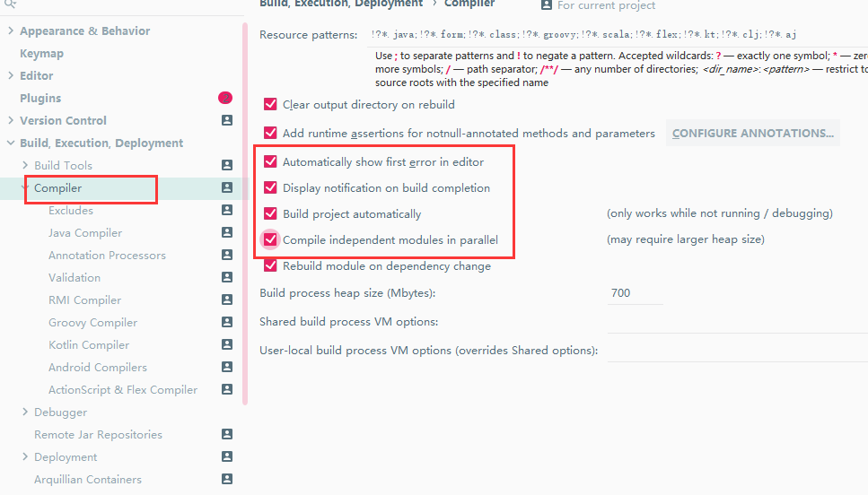

添加maven

```
 <!--热部署-->
        <dependency>
            <groupId>org.springframework.boot</groupId>
            <artifactId>spring-boot-devtools</artifactId>
            <scope>runtime</scope>
            <optional>true</optional>
        </dependency>
```


父pom

```
 <!--热启动插件-->
    <build>
        <plugins>
            <plugin>
                <groupId>org.springframework.boot</groupId>
                <artifactId>spring-boot-maven-plugin</artifactId>
                <configuration>
                    <fork>true</fork>
                    <addResources>true</addResources>
                </configuration>
            </plugin>
        </plugins>
    </build>
```


热部署配置




按键配置

ctrl + alt +  shift+/:

Registry按钮：

complier.automake.allow.when.app.running ✔

actionSystem.assertFocusAccessFromEdt ✔


