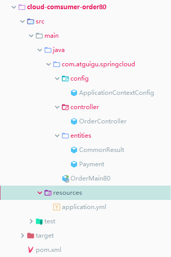

### RestTemplate

提供了多种便捷访问远程Http服务的方法

是一种简单便捷的访问restful服务模板类，是spring提供的用于访问Rest服务的客户端模板工具集


文件api地址：https://docs.spring.io/spring/docs/5.2.4.RELEASE/javadoc-api/


### order模块

#### 文件布局




#### pom文件

```xml
<?xml version="1.0" encoding="UTF-8"?>
<project xmlns="http://maven.apache.org/POM/4.0.0"
         xmlns:xsi="http://www.w3.org/2001/XMLSchema-instance"
         xsi:schemaLocation="http://maven.apache.org/POM/4.0.0 http://maven.apache.org/xsd/maven-4.0.0.xsd">
    <parent>
        <artifactId>springcloud2020</artifactId>
        <groupId>com.me.springcloud</groupId>
        <version>1.0-SNAPSHOT</version>
    </parent>
    <modelVersion>4.0.0</modelVersion>

    <artifactId>cloud-comsumer-order80</artifactId>
    <dependencies>

<!--        <dependency>-->
<!--            <groupId>org.springframework.cloud</groupId>-->
<!--            <artifactId>spring-cloud-starter-zipkin</artifactId>-->
<!--        </dependency>-->
        <dependency>
            <groupId>org.springframework.boot</groupId>
            <artifactId>spring-boot-starter-web</artifactId>
        </dependency>
        <dependency>
            <groupId>org.springframework.boot</groupId>
            <artifactId>spring-boot-starter-actuator</artifactId>
        </dependency>
        <dependency>
            <groupId>org.springframework.boot</groupId>
            <artifactId>spring-boot-devtools</artifactId>
            <scope>runtime</scope>
            <optional>true</optional>
        </dependency>
        <dependency>
            <groupId>org.springframework.boot</groupId>
            <artifactId>spring-boot-starter-test</artifactId>
            <scope>test</scope>
        </dependency>
        <dependency>
            <groupId>org.projectlombok</groupId>
            <artifactId>lombok</artifactId>
            <optional>true</optional>
        </dependency>
        <!--   引入eureka客户端     -->
<!--        <dependency>-->
<!--            <groupId>org.springframework.cloud</groupId>-->
<!--            <artifactId>spring-cloud-starter-netflix-eureka-client</artifactId>-->
<!--        </dependency>-->

    </dependencies>

</project>
```


#### 启动类配置

```java
package com.atguigu.springcloud;

import org.springframework.boot.SpringApplication;
import org.springframework.boot.autoconfigure.SpringBootApplication;

/**
 * @author ccrr
 */
@SpringBootApplication
public class OrderMain80 {
    public static void main(String[] args) {
        SpringApplication.run(OrderMain80.class, args);
    }

}

```


#### controller

```java
package com.atguigu.springcloud.controller;

import com.atguigu.springcloud.entities.CommonResult;
import com.atguigu.springcloud.entities.Payment;
import org.springframework.beans.factory.annotation.Autowired;
import org.springframework.web.bind.annotation.GetMapping;
import org.springframework.web.bind.annotation.PathVariable;
import org.springframework.web.bind.annotation.RestController;
import org.springframework.web.client.RestTemplate;

/**
 * @author ccrr
 */
@RestController
public class OrderController {

    @Autowired
    private RestTemplate restTemplate;

    private static  final  String  PAYMRNT_URL = "http://localhost:8001";

    @GetMapping("/consumer/payment/create")
    public CommonResult<Payment> create(Payment payment){
        CommonResult commonResult = null;
        try {
            commonResult = restTemplate.postForObject(PAYMRNT_URL + "/payment/create", payment, CommonResult.class);
        }catch (Exception e){
        }
        return commonResult;
    }

    @GetMapping("/consumer/payment/get/{id}")
    public CommonResult<Payment> getPayment(@PathVariable("id")Long id){
        return restTemplate.getForObject(PAYMRNT_URL + "/payment/get/" + id,CommonResult.class);
    }

}

```


#### 配置类

```java
package com.atguigu.springcloud.config;

import org.springframework.context.annotation.Bean;
import org.springframework.context.annotation.Configuration;
import org.springframework.web.client.RestTemplate;

/**
 * @author ccrr
 */
@Configuration
public class ApplicationContextConfig {
    /**
     * 添加RestTemplate类的容器配置
     * @return
     */
    @Bean
    public RestTemplate restTemplate(){
        return  new RestTemplate();
    }

}

```


#### 实体类

实体类同paymen的模块


#### 测试

测试通过


### 工程重构

系统中有重复部分、结构

提取相似部分


新建commons工程并且把公用的entities提取出来

并且在payment和consumer中进行引入公用的jar


