## Eureka服务的注册和发现

#### 什么是服务治理

封装Netflix公司开发的Eureka模块实现服务治理

在传统的rpc远程调用框架中，管理每个服务与服务之间的依赖关系比较复杂，此时需要服务治理

管理服务与服务之间的依赖关系，可以实现服务的调用、负载均衡、容错等，实现服务的发现和注册


#### 什么是服务注册与发现

Eureka采用cs的设计架构，Eureka Server作为服务注册功能的服务器，他是服务注册中心

系统中的其他微服务，使用Eureka的客户端连接上Eureka Server并维持心跳连接

这样系统的维护人员就可以通过Eureka Server来监控整个微服务是否正常运行


在服务注册与发现中，有一个叫注册中心。当服务器启动的时候，会把当前自己服务器的信息（服务地址通信地址等信息注册到注册中心上），另一方（消费者）以该别名的方式去注册中心获取到实际的服务器地址，然后本地实现rpc调用rpc远程调用框架的核心设计思想：在于注册中心，因为使用注册中心管理每个服务于服务之间的依赖关系。

任何rpc远程框架中，都会友谊和注册中心存放服务器地址相关信息


#### 两个主键

Eureka Server/Eureka Client

**Eureka Server**：

各个微服务节点通过配置启动后，会在Eureka Server中进行注册，这样Eureka Server中的服务注册中心表中会存储所有可用服务节点的信息，服务节点的信息可以在界面看到


**Eureka Client**：

是一个java客户端，用于简化Eureka Server的交互，客户端同时也具备一个内置、使用轮询（round-robin）负载算法的负载均衡器。在应用启动之后，将会向Eureka Server发送心跳（默认30s）。如果Eureka Server在多个心跳周期内没有接收到某个节点心跳，Eureka Server将会从注册中心表把这个服务节点移除（默认90s）


## 单机构建


#### 工程目录

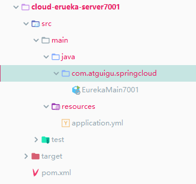

#### pom

```xml
 <dependencies>
        <dependency>
            <groupId>org.springframework.cloud</groupId>
            <artifactId>spring-cloud-starter-netflix-eureka-server</artifactId>
        </dependency>

        <!--    引入自定义的api通用包，可以使用Payment支付Entity    -->
        <dependency>
            <groupId>com.me.springcloud</groupId>
            <artifactId>cloud-api-commons</artifactId>
            <version>1.0-SNAPSHOT</version>
            <scope>compile</scope>
        </dependency>

        <!-- boot web actuator -->
        <dependency>
            <groupId>org.springframework.boot</groupId>
            <artifactId>spring-boot-starter-web</artifactId>
        </dependency>
        <dependency>
            <groupId>org.springframework.boot</groupId>
            <artifactId>spring-boot-starter-actuator</artifactId>
        </dependency>
        <!--  一般通用配置  -->
        <dependency>
            <groupId>org.springframework.boot</groupId>
            <artifactId>spring-boot-devtools</artifactId>
            <scope>runtime</scope>
        </dependency>
        <!--  热部署      -->
        <dependency>
            <groupId>org.springframework.boot</groupId>
            <artifactId>spring-boot-devtools</artifactId>
            <scope>runtime</scope>
            <optional>true</optional>
        </dependency>
        <!--   单元测试     -->
        <dependency>
            <groupId>org.springframework.boot</groupId>
            <artifactId>spring-boot-starter-test</artifactId>
            <scope>test</scope>
        </dependency>

    </dependencies>
```


#### 配置文件

```yml
server:
  port: 7001

eureka:
  instance:
    hostname: localhost # 服务端的名称
  client:
    # 自己是否注册自己
    register-with-eureka: false
    # false表示自己端就是注册中心，职责就是维护服务实例，并不需要去检索服务
    fetch-registry: false
    service-url:
      defaultZone: http://localhost:7001/eureka/
```


#### 启动类

```java
package com.atguigu.springcloud;

import org.springframework.boot.SpringApplication;
import org.springframework.boot.autoconfigure.SpringBootApplication;
import org.springframework.cloud.netflix.eureka.server.EnableEurekaServer;

/** @EnableEurekaServer:开启服务注册中心
 * @author ccrr
 */
@SpringBootApplication
@EnableEurekaServer
public class EurekaMain7001 {
    public static void main(String[] args) {
        SpringApplication.run(EurekaMain7001.class, args);
    }
}

```


#### 启动访问：

http://localhost:7001/

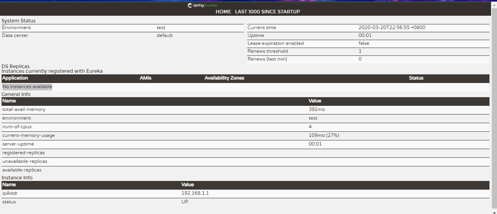


## Payment使用Eureka

#### pom文件

```xml
 <?xml version="1.0" encoding="UTF-8"?>
<project xmlns="http://maven.apache.org/POM/4.0.0"
         xmlns:xsi="http://www.w3.org/2001/XMLSchema-instance"
         xsi:schemaLocation="http://maven.apache.org/POM/4.0.0 http://maven.apache.org/xsd/maven-4.0.0.xsd">
    <parent>
        <artifactId>springcloud2020</artifactId>
        <groupId>com.me.springcloud</groupId>
        <version>1.0-SNAPSHOT</version>
    </parent>
    <modelVersion>4.0.0</modelVersion>

    <artifactId>cloud-provider-payment8001</artifactId>
    <dependencies>
        <dependency>
            <groupId>org.springframework.cloud</groupId>
            <artifactId>spring-cloud-dependencies</artifactId>
            <version>Hoxton.SR1</version>
            <type>pom</type>
            <scope>import</scope>
        </dependency>
        <dependency>
            <artifactId>springcloud2020</artifactId>
            <groupId>com.me.springcloud</groupId>
            <version>1.0-SNAPSHOT</version>
        </dependency>
        <dependency>
            <groupId>org.springframework.boot</groupId>
            <artifactId>spring-boot-starter-web</artifactId>
            <version>2.2.2.RELEASE</version>
        </dependency>
        <dependency>
            <groupId>org.mybatis.spring.boot</groupId>
            <artifactId>mybatis-spring-boot-starter</artifactId>
            <version>2.1.1</version>
        </dependency>
        <dependency>
            <groupId>org.springframework.cloud</groupId>
            <artifactId>spring-cloud-starter-netflix-eureka-client</artifactId>
        </dependency>

        <dependency>
            <groupId>com.alibaba</groupId>
            <artifactId>druid</artifactId>
            <version>1.1.10</version>
        </dependency>
        <!--mysql-connector-java-->
        <dependency>
            <groupId>mysql</groupId>
            <artifactId>mysql-connector-java</artifactId>
            <version>5.1.47</version>
        </dependency>
        <!--jdbc-->
        <dependency>
            <groupId>org.springframework.boot</groupId>
            <artifactId>spring-boot-starter-jdbc</artifactId>
        </dependency>
        <!--热部署-->
        <dependency>
            <groupId>org.springframework.boot</groupId>
            <artifactId>spring-boot-devtools</artifactId>
            <scope>runtime</scope>
            <optional>true</optional>
        </dependency>
        <dependency>
            <groupId>org.projectlombok</groupId>
            <artifactId>lombok</artifactId>
            <optional>true</optional>
        </dependency>
        <dependency>
            <groupId>org.springframework.boot</groupId>
            <artifactId>spring-boot-starter-test</artifactId>
            <scope>test</scope>
        </dependency>
        <dependency>
            <groupId>com.me.springcloud</groupId>
            <artifactId>cloud-api-commons</artifactId>
            <version>1.0-SNAPSHOT</version>
            <scope>compile</scope>
        </dependency>
        <dependency>
            <groupId>org.springframework.cloud</groupId>
            <artifactId>spring-cloud-commons</artifactId>
            <version>2.2.1.RELEASE</version>
            <scope>compile</scope>
        </dependency>
    </dependencies>
</project>
```


#### 配置文件

```yml
server:
  port: 8001
spring:
  application:
    name: cloud-payment-service
  datasource:
    # 当前数据源操作类型
    type: com.alibaba.druid.pool.DruidDataSource
    # mysql驱动类
    driver-class-name: com.mysql.jdbc.Driver
    url: jdbc:mysql://localhost:3307/db2019?useUnicode=true&characterEncoding=UTF-8&useSSL=false&serverTimezone=GMT%2B8
    username: root
    password: 123456
  cloud:
    inetutils:
      timeout-seconds: 10

mybatis:
  mapper-locations: classpath*:mapper/*.xml
  type-aliases-package: com.atguigu.springcloud.entities

# eureka的配置
#eureka:
#  client:
#    register-with-eureka: true   #是否将自己注册到注册中心,集群必须设置为true配合ribbon
#    service-url:
#      defaultZone: http://127.0.0.1:7001/eureka
#    fetch-registry: true

eureka:
  client:
    service-url:
      defaultZone: http://localhost:7001/eureka/
    register-with-eureka: true
    fetch-registry: true
```


#### 启动类添加注解

```java
package com.atguigu.springcloud;

import org.springframework.boot.SpringApplication;
import org.springframework.boot.autoconfigure.SpringBootApplication;
import org.springframework.cloud.client.discovery.EnableDiscoveryClient;
import org.springframework.cloud.netflix.eureka.EnableEurekaClient;


/**
 * @author ccrr
 */
@EnableEurekaClient
//@EnableDiscoveryClient
@SpringBootApplication
public class PaymentMain8001 {

    public static void main(String[] args) {
        SpringApplication.run(PaymentMain8001.class, args);
    }
}

```


## 启动服务

分别启动cloud-eureka-server7001项目

启动cloud-provier-payment8001项目

在llocalhost:7001地址上观察即可


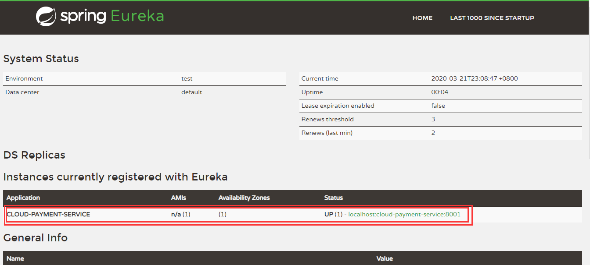

Application的名字就是：cloud-provier-payment8001配置文件的

```yml
spring:
  application:
    name: cloud-payment-service
```


## order80使用eureka

#### pom文件

添加依赖

```xml
      <dependency>
            <groupId>org.springframework.cloud</groupId>
            <artifactId>spring-cloud-starter-netflix-eureka-client</artifactId>
        </dependency>
```


#### 配置文件

```yml
server:
  port: 80
eureka:
  client:
    service-url:
      defaultZone: http://localhost:7001/eureka/
    register-with-eureka: true # 是否注册进eureka
    fetch-registry: true # 是否从eureka中抓取信息，默认true，集群必须设置true才能配合ribbon使用负载均衡
spring:
  application:
    name: cloud-order-service
```


#### 启动类

```java
package com.atguigu.springcloud;

import org.springframework.boot.SpringApplication;
import org.springframework.boot.autoconfigure.SpringBootApplication;
import org.springframework.cloud.netflix.eureka.EnableEurekaClient;

/**
 * @author ccrr
 */

@EnableEurekaClient
@SpringBootApplication
public class OrderMain80 {
    public static void main(String[] args) {
        SpringApplication.run(OrderMain80.class, args);
    }

}

```


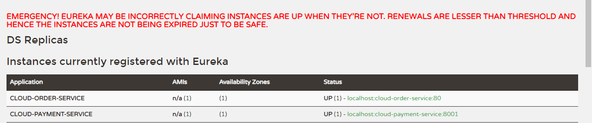


## Eureka集群

#### 集群原理

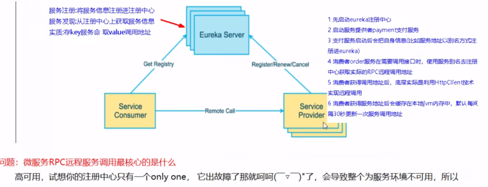


## 集群环境的搭建

搭建cloud-eureka-server7002的工程如同cloud-eureka-server7001的配置过程


#### 修改host映射

```
#eureka配置映射
127.0.0.1 eureka7001.com
127.0.0.1 eureka7002.com
```


#### 修改配置文件

cloud-eureka-server7001

```yml
server:
  port: 7001

eureka:
  instance:
    hostname: eureka7001.com
  client:
    register-with-eureka: false #是否在注册中心自己注册自己
    fetch-registry: false # false表示自己端就是注册中心，职责就是维护服务实例
    service-url:
      defaultZone: http://eureka7002.com:7002/eureka/
```

cloud-eureka-server7002

```yml
server:
  port: 7002

eureka:
  instance:
    hostname: eureka7002.com
  client:
    register-with-eureka: false #是否在注册中心自己注册自己
    fetch-registry: false # false表示自己端就是注册中心，职责就是维护服务实例
    service-url:
      defaultZone: http://eureka7001.com:7001/eureka/
```

实现两个端口的eureka相互注册


启动项目之后：

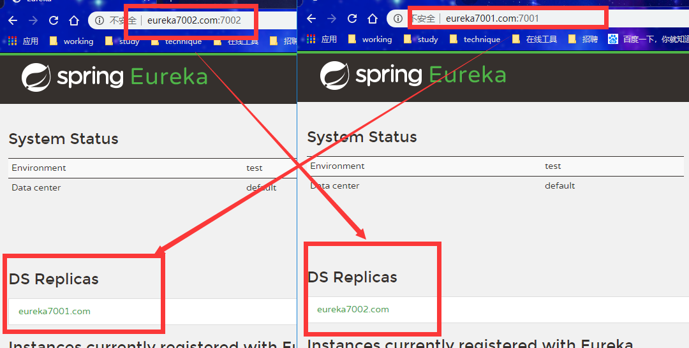


## payment8001注册进集群

## Order80注册集群

只需要修改两个配置文件的yml文件

```yml
eureka:
  client:
    service-url:
      defaultZone: http://eureka7001.com:7001/eureka/,http://eureka7002.com:7002/eureka/
    register-with-eureka: true # 是否注册进eureka
    fetch-registry: true # 是否从eureka中抓取信息，默认true，集群必须设置true才能配合ribbon使用负载均衡
```

 defaultZone: http://eureka7001.com:7001/eureka/,http://eureka7002.com:7002/eureka/，多个集群使用都好分割即可


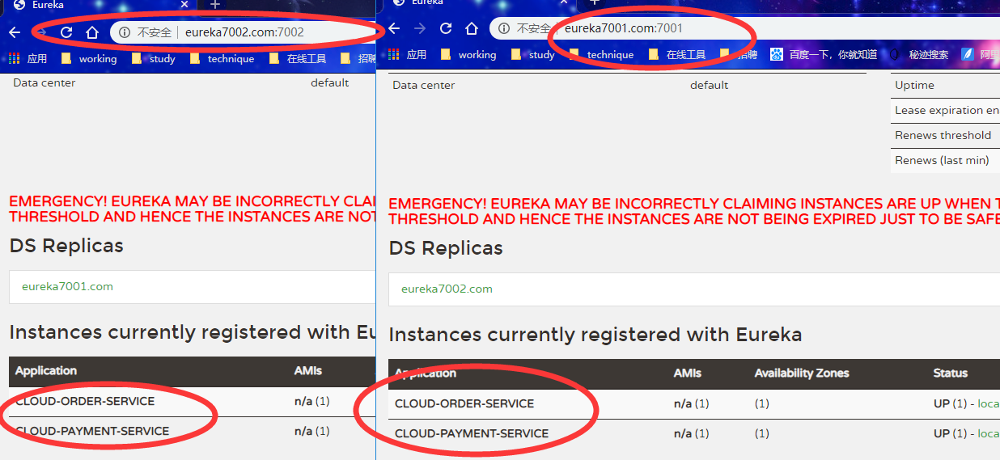


## 负载均衡

#### 新建工程

新建项目cloud-provider-payment8002，配置于cloud-provider-payment8001一致

yml配置文件

```yml
server:
  port: 8002
spring:
  application:
    name: cloud-payment-service
  datasource:
    # 当前数据源操作类型
    type: com.alibaba.druid.pool.DruidDataSource
    # mysql驱动类
    driver-class-name: com.mysql.jdbc.Driver
    url: jdbc:mysql://localhost:3307/db2019?useUnicode=true&characterEncoding=UTF-8&useSSL=false&serverTimezone=GMT%2B8
    username: root
    password: 123456
  cloud:
    inetutils:
      timeout-seconds: 10

mybatis:
  mapper-locations: classpath*:mapper/*.xml
  type-aliases-package: com.atguigu.springcloud.entities

eureka:
  client:
    service-url:
      defaultZone: http://eureka7001.com:7001/eureka/,http://eureka7002.com:7002/eureka/
    register-with-eureka: true
    fetch-registry: true
```


cloud-provider-payment8001的查询接口：

```java
package com.atguigu.springcloud.controller;

import com.atguigu.springcloud.entities.CommonResult;
import com.atguigu.springcloud.entities.Payment;
import com.atguigu.springcloud.service.PaymentService;
import lombok.extern.slf4j.Slf4j;
import org.springframework.beans.factory.annotation.Autowired;
import org.springframework.beans.factory.annotation.Value;
import org.springframework.web.bind.annotation.*;

import javax.annotation.Resource;
/**
 * @author ccrr
 */
@RestController
@Slf4j
public class PaymentController {
    @Autowired
    PaymentService paymentService;
    @Value("${server.port}")
    private String port;
    @PostMapping(value = "/payment/create")
    public CommonResult create(@RequestBody Payment payment){
        int result = paymentService.create(payment);
        log.info("****插入结果:****" + result);
        if (result > 0){
            return new CommonResult(200,"插入数据成功",result);
        }else {
            return new CommonResult(444,"插入数据失败",null);
        }
    }
    @GetMapping(value = "/payment/get/{id}")
    public CommonResult getPaymentById(@PathVariable("id") Long id ){
        Payment payment = paymentService.getPaymentById(id);
        log.info("****插入结果:****" + payment);
        log.info("****端口:****" + port);

        if (payment !=null){
            return new CommonResult(200,"查询成功"+port,payment);
        }else {
            return new CommonResult(444,"查询失败",null);
        }
    }
}
```


cloud-provider-payment8002的查询接口：

```java
package com.atguigu.springcloud.controller;
import com.atguigu.springcloud.entities.CommonResult;
import com.atguigu.springcloud.entities.Payment;
import com.atguigu.springcloud.service.PaymentService;
import lombok.extern.slf4j.Slf4j;
import org.springframework.beans.factory.annotation.Autowired;
import org.springframework.beans.factory.annotation.Value;
import org.springframework.web.bind.annotation.*;
@RestController
@Slf4j
public class PaymentController {
    @Autowired
    PaymentService paymentService;
    @Value("${server.port}")
    private String port;
    @PostMapping(value = "/payment/create")
    public CommonResult create(@RequestBody Payment payment){
        int result = paymentService.create(payment);
        log.info("****插入结果:****" + result);
        if (result > 0){
            return new CommonResult(200,"插入数据成功",result);
        }else {
            return new CommonResult(444,"插入数据失败",null);
        }
    }
    @GetMapping(value = "/payment/get/{id}")
    public CommonResult getPaymentById(@PathVariable("id") Long id ){
        Payment payment = paymentService.getPaymentById(id);
        log.info("****查询结果:****" + payment);
        log.info("****端口:****" + port);

        if (payment !=null){
            return new CommonResult(200,"查询成功"+port,payment);
        }else {
            return new CommonResult(444,"查询失败",null);
        }
    }
}
```


#### 启动服务

启动两台eureka的服务端

启动cloud-provider-payment8002、cloud-provider-payment8001

启动cloud-consumer-order80

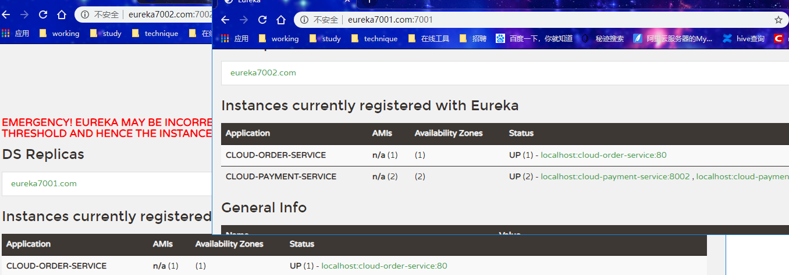


#### 查询服务

根据端口号的不同，返回值所带的端口号不一致

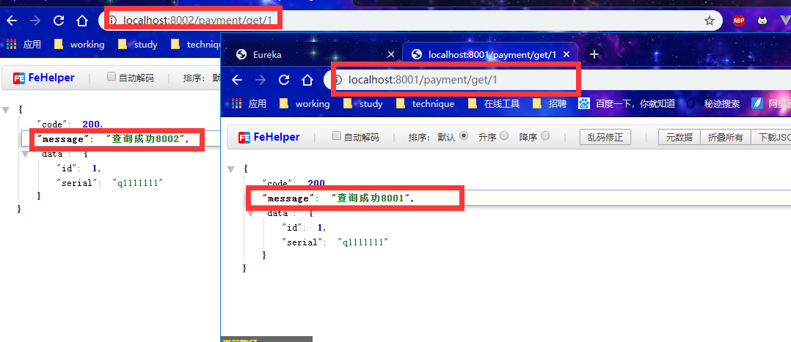


#### 修改order80代码

##### 修改配置文件

@LoadBalanced:由于微服务的名字**CLOUD-PAYMENT-SERVICE**有两个，看上图

此注解必须使用，做调用接口的轮询

```
package com.atguigu.springcloud.config;
import org.springframework.cloud.client.loadbalancer.LoadBalanced;
import org.springframework.context.annotation.Bean;
import org.springframework.context.annotation.Configuration;
import org.springframework.web.client.RestTemplate;

@Configuration
public class ApplicationContextConfig {
    @Bean
    @LoadBalanced
    public RestTemplate restTemplate(){
        return  new RestTemplate();
    }

}

```


##### 修改controller

```java
package com.atguigu.springcloud.controller;

import com.atguigu.springcloud.entities.CommonResult;
import com.atguigu.springcloud.entities.Payment;
import org.springframework.beans.factory.annotation.Autowired;
import org.springframework.web.bind.annotation.GetMapping;
import org.springframework.web.bind.annotation.PathVariable;
import org.springframework.web.bind.annotation.RestController;
import org.springframework.web.client.RestTemplate;

@RestController
public class OrderController {

    @Autowired
    private RestTemplate restTemplate;

    //微服务实现负载均衡
    private static  final  String  PAYMRNT_URL = "http://CLOUD-PAYMENT-SERVICE";

    @GetMapping("/consumer/payment/create")
    public CommonResult<Payment> create(Payment payment){
        CommonResult commonResult = null;
        try {
            commonResult = restTemplate.postForObject(PAYMRNT_URL + "/payment/create", payment, CommonResult.class);
        }catch (Exception e){
        }
        return commonResult;
    }

    @GetMapping("/consumer/payment/get/{id}")
    public CommonResult<Payment> getPayment(@PathVariable("id")Long id){
        return restTemplate.getForObject(PAYMRNT_URL + "/payment/get/" + id,CommonResult.class);
    }
}
```


##### 查询结果

此时会每次访问都会进行轮询

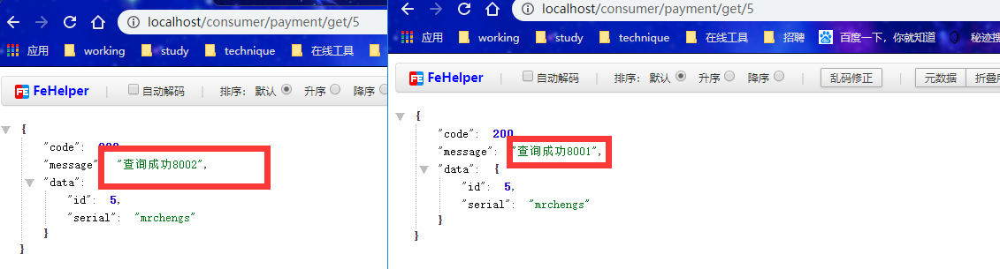


## 信息完善

cloud-provider-payment8001

cloud-provider-payment8002


#### pom

```xml
       <!--监控-->
                <dependency>
                    <groupId>org.springframework.boot</groupId>
                    <artifactId>spring-boot-starter-actuator</artifactId>
                </dependency>
```


#### 配置文件

```yml
eureka:
  client:
    service-url:
      defaultZone: http://eureka7001.com:7001/eureka/,http://eureka7002.com:7002/eureka/
    register-with-eureka: true
    fetch-registry: true
  instance:
    instance-id: payment8002
```


#### 结果

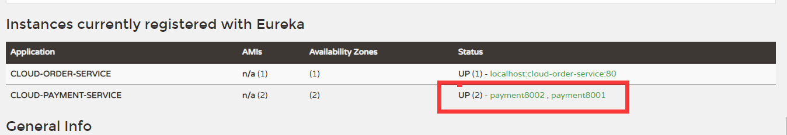


点击链接

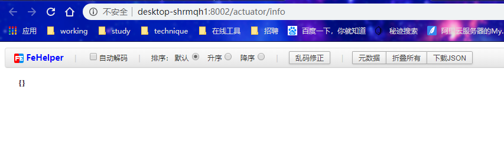

健康检查

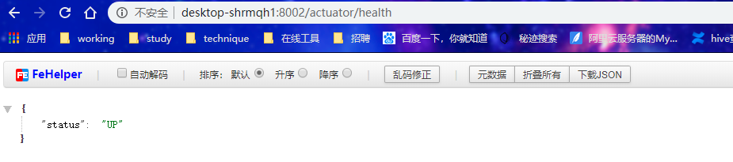


#### 显示ip

修改配置文件

​    prefer-ip-address: true

```yml
eureka:
  client:
    service-url:
      defaultZone: http://eureka7001.com:7001/eureka/,http://eureka7002.com:7002/eureka/
    register-with-eureka: true
    fetch-registry: true
  instance:
    instance-id: payment8002
    prefer-ip-address: true
```

结果

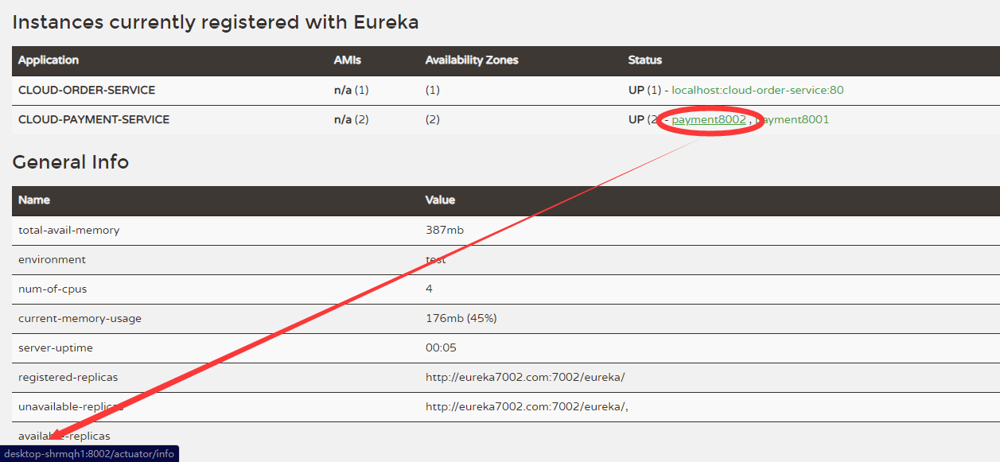


## 服务发现Discovery

对于注册eureka里面的微服务，可以通过服务发现来获得该服务的信息

修改：cloud-provider-payment8001项目

修改controller

 private DiscoveryClient discoveryClient;

```java
package com.atguigu.springcloud.controller;

import com.atguigu.springcloud.entities.CommonResult;
import com.atguigu.springcloud.entities.Payment;
import com.atguigu.springcloud.service.PaymentService;
import lombok.extern.slf4j.Slf4j;
import org.springframework.beans.factory.annotation.Autowired;
import org.springframework.beans.factory.annotation.Value;
import org.springframework.cloud.client.ServiceInstance;
import org.springframework.cloud.client.discovery.DiscoveryClient;
import org.springframework.web.bind.annotation.*;

import javax.annotation.Resource;
import java.util.List;

/**
 * @author ccrr
 */
@RestController
@Slf4j
public class PaymentController {

    @Autowired
    PaymentService paymentService;

    @Value("${server.port}")
    private String port;

    /**
     * 服务发现 获取服务信息
     */
    @Resource
    private DiscoveryClient discoveryClient;

    @GetMapping("/payment.discovery")
    public Object discovery(){
        List<String> services = discoveryClient.getServices();
        log.info("*******");
        log.info("*******");
        for (String service : services) {
            log.info(service);
        }
        log.info("*******");
        log.info("*******");
        List<ServiceInstance> instances = discoveryClient.getInstances("CLOUD-PAYMENT-SERVICE");
        for (ServiceInstance instance : instances) {
            log.info(instance.getServiceId());
            log.info(instance.getHost());
            log.info(instance.getInstanceId());
            log.info(instance.getScheme());
            log.info(String.valueOf(instance.getUri()));
            log.info(String.valueOf(instance.isSecure()));
            log.info("**********");
        }
        return this.discoveryClient;
    }
    @PostMapping(value = "/payment/create")
    public CommonResult create(@RequestBody Payment payment){
        int result = paymentService.create(payment);
        log.info("****插入结果:****" + result);
        if (result > 0){
            return new CommonResult(200,"插入数据成功",result);
        }else {
            return new CommonResult(444,"插入数据失败",null);
        }
    }
    @GetMapping(value = "/payment/get/{id}")
    public CommonResult getPaymentById(@PathVariable("id") Long id ){
        Payment payment = paymentService.getPaymentById(id);
        log.info("****插入结果:****" + payment);
        log.info("****端口:****" + port);

        if (payment !=null){
            return new CommonResult(200,"查询成功"+port,payment);
        }else {
            return new CommonResult(444,"查询失败",null);
        }
    }
}
```


启动类添加注解

@EnableDiscoveryClient

```java
package com.atguigu.springcloud;

import org.springframework.boot.SpringApplication;
import org.springframework.boot.autoconfigure.SpringBootApplication;
import org.springframework.cloud.client.discovery.EnableDiscoveryClient;
import org.springframework.cloud.netflix.eureka.EnableEurekaClient;
@EnableDiscoveryClient
@EnableEurekaClient
@SpringBootApplication
public class PaymentMain8001 {

    public static void main(String[] args) {
        SpringApplication.run(PaymentMain8001.class, args);
    }
}

```


调接口的地址：

http://localhost:8001/payment.discovery

返回结果

```
{
    "services": [
        "cloud-payment-service",
        "cloud-order-service"
    ],
    "order": 0
}
```


控制台结果

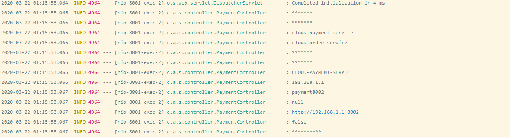


## Eureka自我保护

#### 概述

保护模式主要用于一组客户端和Eureka Server之间网络分区场景下的保护

一旦进入保护模式，Eureka Server将会尝试保护其服务注册列表中的信息，不再删除注册表中的数据，即不会注销任何微服务


在Eureka的首页显示一窜红字就是进入了自我保护模式


#### 原因

某时刻某一个微服务不可用了，Eureka不会立即清理，一九会对该微服务的信息进行保存

属于CAP里面的AP

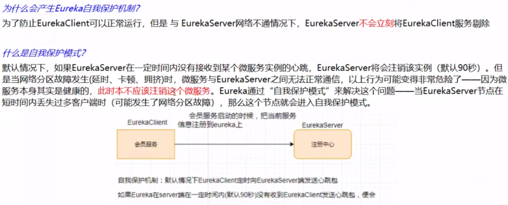

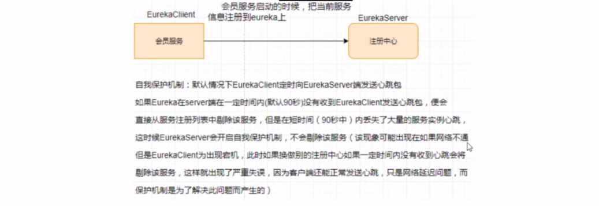


#### 怎么禁止自我保护

服务端

```yml
eureka:
	sever:
		enable-self-preservation = false # 默认为true	
        enviction-interval-timer-in-ms: 2000 # 心跳
```


客户端

```yml
eureka：
 instance：
  lease-renewal-interval-in-seconds： 1 #eureka向服务端发送心跳时间间隔，单位秒（默认30s）
  lease-expiration-duration-in-seconds：2 #eureka服务端最后收到心跳等待时间上线（90s），超时就剔除
```


