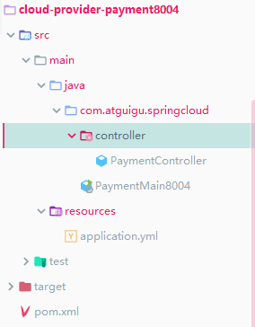
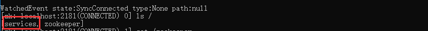
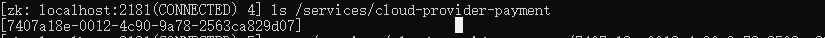
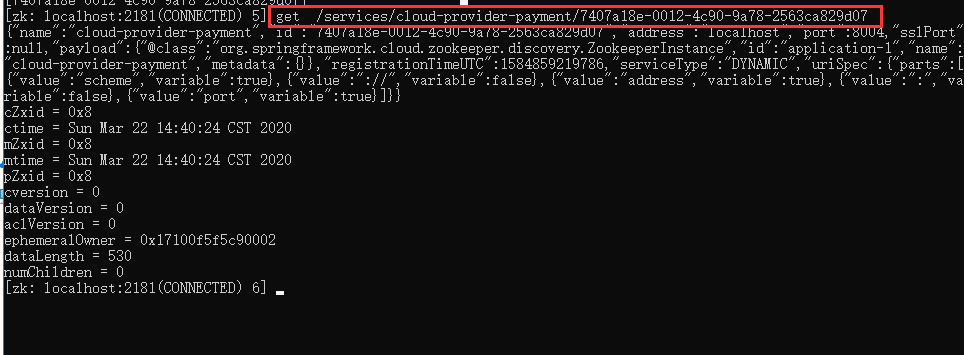
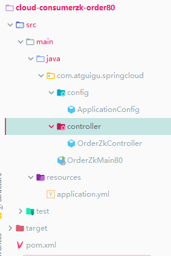

## Zookeeper

是一个分布式协调工具，可以实现注册中心功能

关闭linux服务器的防火墙地址启动zk服务器

取代eureka成为注册中心


## 支付服务注册zk


#### 工程目录




#### pom文件

```xml
 <dependencies>
        <dependency>
            <groupId>com.me.springcloud</groupId>
            <artifactId>cloud-api-commons</artifactId>
            <version>1.0-SNAPSHOT</version>
            <scope>compile</scope>
        </dependency>
        <dependency>
            <groupId>org.springframework.boot</groupId>
            <artifactId>spring-boot-starter-web</artifactId>
        </dependency>
        <!--SpringBoot整合Zookeeper客户端-->
        <dependency>
            <groupId>org.springframework.cloud</groupId>
            <artifactId>spring-cloud-starter-zookeeper-discovery</artifactId>
            <exclusions>
                <!--先排除自带的zookeeper3.5.3-->
                <exclusion>
                    <groupId>org.apache.zookeeper</groupId>
                    <artifactId>zookeeper</artifactId>
                </exclusion>
            </exclusions>
        </dependency>
        <!--添加zookeeper3.4.9版本-->
        <dependency>
            <groupId>org.apache.zookeeper</groupId>
            <artifactId>zookeeper</artifactId>
            <version>3.4.14</version>
        </dependency>
        <dependency>
            <groupId>org.springframework.boot</groupId>
            <artifactId>spring-boot-starter-actuator</artifactId>
        </dependency>
        <dependency>
            <groupId>org.springframework.boot</groupId>
            <artifactId>spring-boot-devtools</artifactId>
            <scope>runtime</scope>
            <optional>true</optional>
        </dependency>
        <dependency>
            <groupId>org.projectlombok</groupId>
            <artifactId>lombok</artifactId>
            <optional>true</optional>
        </dependency>
        <dependency>
            <groupId>org.springframework.boot</groupId>
            <artifactId>spring-boot-starter-test</artifactId>
            <scope>test</scope>
        </dependency>
    </dependencies>

```


#### 配置文件

```yml
server:
  port: 8004

spring:
  application:
    # 服务别名---注册zookeeper到注册中心的名称
    name: cloud-provider-payment
  cloud:
    zookeeper:
      # 默认localhost:2181
      connect-string: localhost:2181
```


#### 主启动类

```java
@SpringBootApplication
@EnableDiscoveryClient //用于向consul和zk作为注册中心时注册服务
public class PaymentMain8004 {

    public static void main(String[] args) {
        SpringApplication.run(PaymentMain8004.class,args);
    }
}

```


#### controller

```java
package com.atguigu.springcloud.controller;


import org.springframework.beans.factory.annotation.Value;
import org.springframework.web.bind.annotation.RequestMapping;
import org.springframework.web.bind.annotation.RestController;

import java.util.UUID;

/**
 * @author ccrr
 */
@RestController
public class PaymentController {

    @Value("${server.port}")
    private String serverPort;

    @RequestMapping("/payment/zk")
    public String paymentByzk(){
        return "springcloud with zk :" + serverPort + " "+ UUID.randomUUID().toString();
    }
}
```


#### 启动zk

#### 启动服务


访问http://localhost:8004/payment/zk

```
springcloud with zk :8004 c18b09fb-4682-4806-a05e-d0af238121bf
```


#### 观察zk

生成services数据文件




zk查询services：该值是application.name值


查询数据节点的值




查询注册节点的值



```json
{
"name": "cloud-provider-payment",
"id": "7407a18e-0012-4c90-9a78-2563ca829d07",
"address": "localhost",
"port": 8004,
"sslPort": null,
"payload": {
"@class": "org.springframework.cloud.zookeeper.discovery.ZookeeperInstance",
"id": "application-1",
"name": "cloud-provider-payment",
"metadata": {}
},
"registrationTimeUTC": 1584859219786,
"serviceType": "DYNAMIC",
"uriSpec": {
"parts": [
{
"value": "scheme",
"variable": true
},
{
"value": "://",
"variable": false
},
{
"value": "address",
"variable": true
},
{
"value": ":",
"variable": false
},
{
"value": "port",
"variable": true
}
]
}
}
```


## 持久/临时节点

在zk上注册使用临时节点

在单位时间内执行心跳检测，如果没有响应就会删除该节点


## 订单服务注册zk

#### 工程目录




#### pom

```xml
<dependencies>
        <dependency>
            <groupId>com.me.springcloud</groupId>
            <artifactId>cloud-api-commons</artifactId>
            <version>1.0-SNAPSHOT</version>
            <scope>compile</scope>
        </dependency>
        <dependency>
            <groupId>org.springframework.boot</groupId>
            <artifactId>spring-boot-starter-web</artifactId>
        </dependency>
        <!--SpringBoot整合Zookeeper客户端-->
        <dependency>
            <groupId>org.springframework.cloud</groupId>
            <artifactId>spring-cloud-starter-zookeeper-discovery</artifactId>
            <exclusions>
                <!--先排除自带的zookeeper3.5.3-->
                <exclusion>
                    <groupId>org.apache.zookeeper</groupId>
                    <artifactId>zookeeper</artifactId>
                </exclusion>
            </exclusions>
        </dependency>
        <!--添加zookeeper3.4.9版本-->
        <dependency>
            <groupId>org.apache.zookeeper</groupId>
            <artifactId>zookeeper</artifactId>
            <version>3.4.14</version>
        </dependency>
        <dependency>
            <groupId>org.springframework.boot</groupId>
            <artifactId>spring-boot-starter-actuator</artifactId>
        </dependency>
        <dependency>
            <groupId>org.springframework.boot</groupId>
            <artifactId>spring-boot-devtools</artifactId>
            <scope>runtime</scope>
            <optional>true</optional>
        </dependency>
        <dependency>
            <groupId>org.projectlombok</groupId>
            <artifactId>lombok</artifactId>
            <optional>true</optional>
        </dependency>
        <dependency>
            <groupId>org.springframework.boot</groupId>
            <artifactId>spring-boot-starter-test</artifactId>
            <scope>test</scope>
        </dependency>
    </dependencies>
```


#### 配置文件

```yml
server:
  port: 80

spring:
  application:
    name: cloud-consumer-order
  cloud:
    zookeeper:
      connect-string: localhost:2181
```


#### 启动类

```java
@SpringBootApplication
@EnableDiscoveryClient
public class OrderZkMain80 {
    public static void main(String[] args) {
        SpringApplication.run(OrderZkMain80.class,args);
    }

}
```


#### 配置类

```java
@Configuration
public class ApplicationConfig {

    @Bean
    @LoadBalanced
    public RestTemplate restTemplate(){
        return new RestTemplate();
    }


}
```


#### controller

```java
@RestController
public class OrderZkController {

    public static final  String URL_ZK = "http://cloud-provider-payment";

    @Resource
    private RestTemplate restTemplate;

    @GetMapping("/consumer/payment/zk")
    public String OrderInfo(){
        String result = restTemplate.getForObject(URL_ZK + "/payment/zk",String.class);
        return result;
    }

}
```

#### 测试

访问地址

http://localhost/consumer/payment/zk

结果：springcloud with zk :8004 c40b99f5-4c2f-47ca-bcba-dd77d4412d95