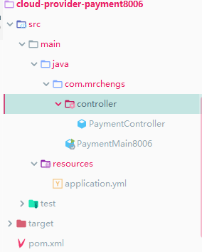
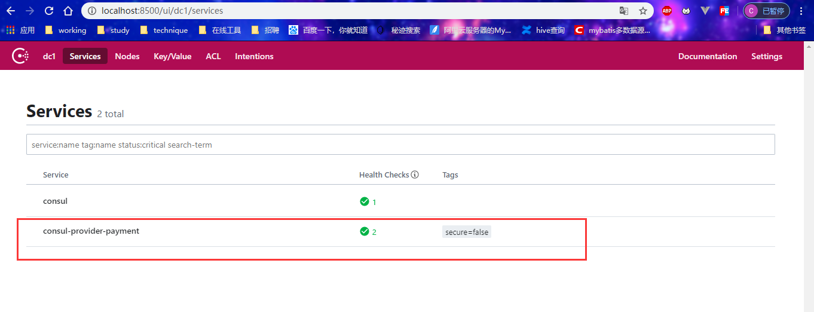
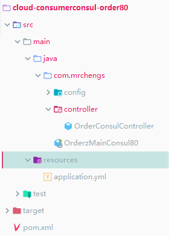

## 简介

官网：https://www.consul.io/

Consul is a service networking tool that allows you to discover services and secure network traffic.


提供了微服务系统中的服务治理、配置中心、控制总线等功能

这些功能中的每一个都可以根据需要进行单独使用，也可以使用构建全方位的服务网络，是微服务的一种服务网络解决方案


优点：

基于raft协议，比较简洁

同时支持HTTP和DNS协议

支持数据中心的WAN集群

提供图形化界面

跨平台


## 使用

查看版本

```cmd
XXX>consul --version
Consul v1.7.1
Protocol 2 spoken by default, understands 2 to 3 (agent will automatically use protocol >2 when speaking to compatible agents)
```


开发模式启动

```
XXX>consul agent -dev
```


访问web界面：http://localhost:8500/ui/dc1/services


## 服务提供者入住

#### 工程目录




#### pom

```xml
<dependencies>
        <!--SpringCloud consul-server-->
        <dependency>
            <groupId>org.springframework.cloud</groupId>
            <artifactId>spring-cloud-starter-consul-discovery</artifactId>
        </dependency>
<!--        <dependency>-->
<!--            <groupId>cl</groupId>-->
<!--            <artifactId></artifactId>-->
<!--        </dependency>-->
        <dependency>
            <groupId>org.springframework.boot</groupId>
            <artifactId>spring-boot-starter-web</artifactId>
        </dependency>
        <dependency>
            <groupId>org.springframework.boot</groupId>
            <artifactId>spring-boot-starter-actuator</artifactId>
        </dependency>
        <dependency>
            <groupId>org.springframework.boot</groupId>
            <artifactId>spring-boot-devtools</artifactId>
            <scope>runtime</scope>
            <optional>true</optional>
        </dependency>
        <dependency>
            <groupId>org.projectlombok</groupId>
            <artifactId>lombok</artifactId>
            <optional>true</optional>
        </dependency>
        <dependency>
            <groupId>org.springframework.boot</groupId>
            <artifactId>spring-boot-starter-test</artifactId>
            <scope>test</scope>
        </dependency>
    </dependencies>
```


#### 启动类

```java
@SpringBootApplication
public class PaymentMain8006 {

    public static void main(String[] args) {
        SpringApplication.run(PaymentMain8006.class,args);
    }

}
```


#### controller

```java
@RestController
public class PaymentController {

    @Value("${server.port}")
    private String serverPort;
    
    @RequestMapping("/payment/consul")
    public String paymentByzk(){
        return "springcloud with zk :" + serverPort + " "+ UUID.randomUUID().toString();
    }

}
```


#### 配置文件

```yml
server:
  port: 8006
spring:
  application:
    name: consul-provider-payment
  cloud:
    consul:
      host: localhost
      discovery:
        management-port: 8500
        service-name: ${spring.application.name}
```


#### 启动项目




#### 查询功能

http://localhost:8006/payment/consul

结果：springcloud with zk :8006 533c6e8f-5ec7-444e-857a-b1f38a146c81


## 服务消费者入住

#### 目录




#### pom

```xml
 <dependencies>
        <dependency>
            <groupId>org.springframework.cloud</groupId>
            <artifactId>spring-cloud-starter-consul-discovery</artifactId>
        </dependency>
        <dependency>
            <groupId>org.springframework.boot</groupId>
            <artifactId>spring-boot-starter-web</artifactId>
        </dependency>
        <dependency>
            <groupId>org.springframework.boot</groupId>
            <artifactId>spring-boot-starter-actuator</artifactId>
        </dependency>
        <dependency>
            <groupId>org.projectlombok</groupId>
            <artifactId>lombok</artifactId>
            <optional>true</optional>
        </dependency>
        <dependency>
            <groupId>org.springframework.boot</groupId>
            <artifactId>spring-boot-starter-test</artifactId>
            <scope>test</scope>
        </dependency>
    </dependencies>

```


#### 配置文件

```yml
server:
  port: 80

spring:
  application:
    name: cloud-consumer-order
  cloud:
    consul:
      host: localhost
      port: 8500
      discovery:
        service-name: ${spring.application.name}
```


#### 启动类

```java
@SpringBootApplication
public class OrderzMainConsul80 {

    public static void main(String[] args) {
        SpringApplication.run(OrderzMainConsul80.class,args);
    }

}
```


#### controller

```java
@RestController
public class OrderConsulController {

    public static final  String URL_ZK = "http://consul-provider-payment";

    @Resource
    private RestTemplate restTemplate;

    @GetMapping("/consumer/payment/consul")
    public String OrderInfo(){
        String result = restTemplate.getForObject(URL_ZK + "/payment/consul",String.class);
        return result;
    }
}
```


#### 配置类

```
@Configuration
public class ApplicationConfig {

    @Bean
    @LoadBalanced
    public RestTemplate restTemplate(){
        return new RestTemplate();
    }


}
```


#### 测试

http://localhost/consumer/payment/consul

springcloud with zk :8006 8394c48c-fc7b-4668-bc7c-a04658d47df2

