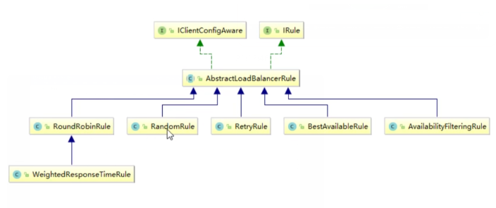
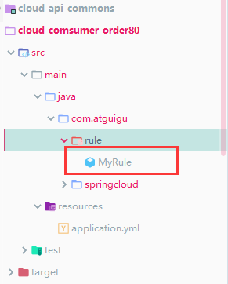
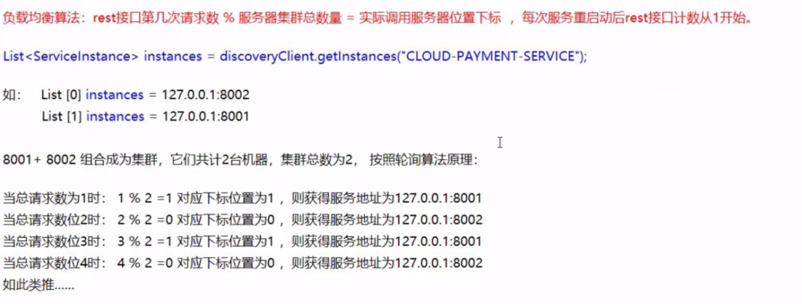

## 使用到的项目

cloud-eureka-server7001

cloud-eureka-server7002

cloud-comsumer-order80

cloud-provider-payment8002

cloud-provider-payment8001


## Ribbon

是基于Nefllix Ribbon实现的一套客户端负载工具

Ribbon是Netflix发布的开源项目，主要工具是提供客户端的软件负载均衡算法和服务调用

Ribbon客户端自建提供一系列完善的配置如连接超时、重试等/

在配置文件列出Load Balancer后面所有的机器，Ribbon会自动帮程序基于某种规整连接机器（简单轮询，随机连接等）


负载均衡：

将用户的请求分配到多个服务上，大导高可用

常见的负载均衡：Nginx、LVS、硬件....


Ribbon vs Nginx

Nginx是服务端的负载均衡，客户端请求都会交给nginx，Nginx在实现转发请求，即负载都是由服务端实现

Ribbon实现本地负载均衡，在调用微服务接口时，会在注册中心获取信息服务列表换成存到jvm本地，从而在本地实现rpc远程调用技术


**Ribbon=负载均衡算法+RestTemplete**


```xml

        <dependency>
            <groupId>org.springframework.cloud</groupId>
            <artifactId>spring-cloud-starter-netflix-eureka-client</artifactId>
        </dependency>
```

该包包含

```xml
    <dependency>
      <groupId>org.springframework.cloud</groupId>
      <artifactId>spring-cloud-starter-netflix-ribbon</artifactId>
      <version>2.2.1.RELEASE</version>
      <scope>compile</scope>
    </dependency>
```


启动一下项目

cloud-eureka-server7001

cloud-eureka-server7002

cloud-comsumer-order80

cloud-provider-payment8002

cloud-provider-payment8001


测试地址：http://localhost/consumer/payment/get/1

```
{
"code": 200,
"message": "查询成功8002",
"data": {
"id": 1,
"serial": "q1111111"
}
}
```

```
{
"code": 200,
"message": "查询成功8001",
"data": {
"id": 1,
"serial": "q1111111"
}
}
```


## 相关讲解

#### RestTemplate

- restTemplate.getForObject():返回对象为响应体中数据转化的对象，可以理解为json
- restTemplate.getForEntity():返回对象为ResponseEntity对象，包含响应体中的一些重要信息，如响应头、响应体、相应状态码等信息

```java
    @GetMapping("/consumer/payment/get/{id}")
    public CommonResult<Payment> getPayment(@PathVariable("id")Long id){
        return restTemplate.getForObject(PAYMRNT_URL + "/payment/get/" + id,CommonResult.class);
    }

    @GetMapping("/consumer/payment/getforentity/{id}")
    public CommonResult<Payment> getPayment1(@PathVariable("id")Long id){
        ResponseEntity<CommonResult> entity = restTemplate.getForEntity(PAYMRNT_URL + "/payment/get/" + id,CommonResult.class);
        if (entity.getStatusCode().is2xxSuccessful()){
            return entity.getBody();
        }else {
            return new CommonResult(444,"操作失败",null);
        }
    }
```


## 默认自带负载规则


自带接口实现

IRule.class

```java
public interface IRule{
    /*
     * choose one alive server from lb.allServers or
     * lb.upServers according to key
     * 
     * @return choosen Server object. NULL is returned if none
     *  server is available 
     */

    public Server choose(Object key);
    
    public void setLoadBalancer(ILoadBalancer lb);
    
    public ILoadBalancer getLoadBalancer();    
}
```




接口有一个抽象的实现类AbstractLoadBalancerRule

- com.netflix.loadbalancer.RoundRobinRule 
  - 轮询
- com.netflix.loadbalancer.RandomRule 
  - 随机

- com.netflix.loadbalancer.RetryRule  
  - 先按照轮询策略获取服务，如果获取失败则在规定时间会进行重试，获取可用的服务
- com.netflix.loadbalancer.WeightedResponseTimeRule  
  - 对RoundRobinRule 的扩展、相应速度越快的实例选择权重越大、越容易被选择
- BestAvailableRule
  - 会先过滤由于多次访问故障而处于断路器 跳闸的状态的服务，然后选择一个并发量小的
- AvailabilityFilteringRule
  - 先过滤故障实例，在选择并发较小的
- ZoneAvoidanceRule
  - 默认规则，复合判断server所在区域的性能和server的可用性选择服务


## 替换负载规则

**所实现的自动一规则不能放在@ComponentScan所扫面的包以及子包下面**





确保MyRule类不能被扫描到


#### MyRule.class

```java
package com.atguigu.rule;

import com.netflix.loadbalancer.IRule;
import com.netflix.loadbalancer.RandomRule;
import org.springframework.context.annotation.Bean;
import org.springframework.context.annotation.Configuration;

@Configuration
public class MyRule {

    @Bean
    public IRule mySelfRule(){
        return new RandomRule();
    }
}
```

#### 启动类配置

@RibbonClient(name="CLOUD-PAYMENT-SERVICE",configuration = MyRule.class)

```java
package com.atguigu.springcloud;

import com.atguigu.rule.MyRule;
import org.springframework.boot.SpringApplication;
import org.springframework.boot.autoconfigure.SpringBootApplication;
import org.springframework.cloud.netflix.eureka.EnableEurekaClient;
import org.springframework.cloud.netflix.ribbon.RibbonClient;
import org.springframework.cloud.netflix.ribbon.RibbonClients;

@RibbonClient(name="CLOUD-PAYMENT-SERVICE",configuration = MyRule.class)
@EnableEurekaClient
@SpringBootApplication
public class OrderMain80 {
    public static void main(String[] args) {
        SpringApplication.run(OrderMain80.class, args);
    }
}
```


## 默认负载轮询算法原理

#### 原理




## 源码

```java
/*
 *
 * Copyright 2013 Netflix, Inc.
 *
 * Licensed under the Apache License, Version 2.0 (the "License");
 * you may not use this file except in compliance with the License.
 * You may obtain a copy of the License at
 *
 * http://www.apache.org/licenses/LICENSE-2.0
 *
 * Unless required by applicable law or agreed to in writing, software
 * distributed under the License is distributed on an "AS IS" BASIS,
 * WITHOUT WARRANTIES OR CONDITIONS OF ANY KIND, either express or implied.
 * See the License for the specific language governing permissions and
 * limitations under the License.
 *
 */
package com.netflix.loadbalancer;

import com.netflix.client.config.IClientConfig;
import org.slf4j.Logger;
import org.slf4j.LoggerFactory;

import java.util.List;
import java.util.concurrent.atomic.AtomicInteger;

public class RoundRobinRule extends AbstractLoadBalancerRule {

    private AtomicInteger nextServerCyclicCounter;
    private static final boolean AVAILABLE_ONLY_SERVERS = true;
    private static final boolean ALL_SERVERS = false;

    private static Logger log = LoggerFactory.getLogger(RoundRobinRule.class);

    
    //空参构造实现原子类的实例化
    public RoundRobinRule() {
        nextServerCyclicCounter = new AtomicInteger(0);
    }

    public RoundRobinRule(ILoadBalancer lb) {
        this();
        setLoadBalancer(lb);
    }

    //调用实现接口的方法
    public Server choose(ILoadBalancer lb, Object key) {
        //如果为null则返回为空
        if (lb == null) {
            log.warn("no load balancer");
            return null;
        }

        Server server = null;
        int count = 0;
        while (server == null && count++ < 10) {
            
            //Only the servers that are up and reachable.
            List<Server> reachableServers = lb.getReachableServers();
            
            //All known servers, both reachable and unreachable.
            List<Server> allServers = lb.getAllServers();
            int upCount = reachableServers.size();
            int serverCount = allServers.size();

            if ((upCount == 0) || (serverCount == 0)) {
                log.warn("No up servers available from load balancer: " + lb);
                return null;
            }

            int nextServerIndex = incrementAndGetModulo(serverCount);
            server = allServers.get(nextServerIndex);

            if (server == null) {
                /* Transient. */
                Thread.yield();
                continue;
            }

            if (server.isAlive() && (server.isReadyToServe())) {
                return (server);
            }

            // Next.
            server = null;
        }

        if (count >= 10) {
            log.warn("No available alive servers after 10 tries from load balancer: "
                    + lb);
        }
        return server;
    }

    /**
     * Inspired by the implementation of {@link AtomicInteger#incrementAndGet()}.
     *
     * @param modulo The modulo to bound the value of the counter.
     * @return The next value.
     */
    private int incrementAndGetModulo(int modulo) {
        for (;;) {
            int current = nextServerCyclicCounter.get();
            int next = (current + 1) % modulo;
            if (nextServerCyclicCounter.compareAndSet(current, next))
                return next;
        }
    }

    @Override
    public Server choose(Object key) {
        return choose(getLoadBalancer(), key);
    }

    @Override
    public void initWithNiwsConfig(IClientConfig clientConfig) {
    }
}

```


