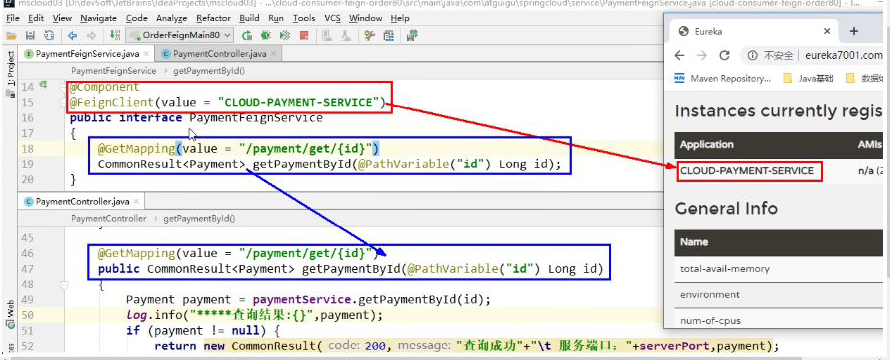

## OpenFeign

https://spring.io/projects/spring-cloud-openfeign

是一个声明式WebService客户端，使用Feign能让编写的Web Service客户端更加简单

使用方式是定义一个服务接口然后在上面加注解

Feign也支持拔插式的编码器和解码器


在服务消费者方面实现

自带负载均衡


## 使用

接口+注解：微服务调用接口+@FeignClient

#### 目录


#### pom文件

```xml
 <dependencies>
        <!--openfeign-->
        <dependency>
            <groupId>org.springframework.cloud</groupId>
            <artifactId>spring-cloud-starter-openfeign</artifactId>
        </dependency>
        <!--eureka client-->
        <dependency>
            <groupId>org.springframework.cloud</groupId>
            <artifactId>spring-cloud-starter-netflix-eureka-client</artifactId>
        </dependency>

        <dependency>
            <groupId>com.me.springcloud</groupId>
            <artifactId>cloud-api-commons</artifactId>
            <version>1.0-SNAPSHOT</version>
            <scope>compile</scope>
        </dependency>

        <dependency>
            <groupId>org.springframework.boot</groupId>
            <artifactId>spring-boot-starter-web</artifactId>
        </dependency>
        <!--监控-->
        <dependency>
            <groupId>org.springframework.boot</groupId>
            <artifactId>spring-boot-starter-actuator</artifactId>
        </dependency>
        <!--热部署-->
        <dependency>
            <groupId>org.springframework.boot</groupId>
            <artifactId>spring-boot-devtools</artifactId>
            <scope>runtime</scope>
            <optional>true</optional>
        </dependency>
        <dependency>
            <groupId>org.projectlombok</groupId>
            <artifactId>lombok</artifactId>
            <optional>true</optional>
        </dependency>
        <dependency>
            <groupId>org.springframework.boot</groupId>
            <artifactId>spring-boot-starter-test</artifactId>
            <scope>test</scope>
        </dependency>
        <dependency>
            <groupId>com.me.springcloud</groupId>
            <artifactId>cloud-api-commons</artifactId>
            <version>1.0-SNAPSHOT</version>
            <scope>compile</scope>
        </dependency>
    </dependencies>
```


#### 配置文件

```yml
server:
  port: 80
eureka:
  client:
    register-with-eureka: false
    fetch-registry: true
    service-url:
      defaultZone: http://eureka7001.com:7001/eureka,http://eureka7002.com:7002/eureka
```


#### 启动类

@EnableFeignClients

```java
package com.mrchengs.springcloud;

import org.springframework.boot.SpringApplication;
import org.springframework.boot.autoconfigure.SpringBootApplication;
import org.springframework.cloud.openfeign.EnableFeignClients;

/**
 * @author ccrr
 */
@EnableFeignClients//开启Feign
@SpringBootApplication
public class OrderFeignMain80 {

    public static void main(String[] args) {
        SpringApplication.run(OrderFeignMain80.class,args);
    }
}

```


#### 接口实现

```java
package com.mrchengs.springcloud.service;

import com.atguigu.springcloud.entities.CommonResult;
import org.springframework.cloud.openfeign.FeignClient;
import org.springframework.stereotype.Component;
import org.springframework.web.bind.annotation.GetMapping;
import org.springframework.web.bind.annotation.PathVariable;

/**
 * @author ccrr
 */
@Component
@FeignClient(value = "CLOUD-PAYMENT-SERVICE") //eureka中的
public interface PaymentService {

    //该方法来自8001端口的controller 
    @GetMapping(value = "/payment/get/{id}")
    public CommonResult getPaymentById(@PathVariable("id") Long id );
}
```

8001端口的controller

```java
 @GetMapping(value = "/payment/get/{id}")
    public CommonResult getPaymentById(@PathVariable("id") Long id ){
        Payment payment = paymentService.getPaymentById(id);
        log.info("****插入结果:****" + payment);
        log.info("****端口:****" + port);

        if (payment !=null){
            return new CommonResult(200,"查询成功"+port,payment);
        }else {
            return new CommonResult(444,"查询失败",null);
        }
    }
```


#### controller

```java
package com.mrchengs.springcloud.controller;

import com.atguigu.springcloud.entities.CommonResult;
import com.atguigu.springcloud.entities.Payment;
import com.mrchengs.springcloud.service.PaymentService;
import org.springframework.web.bind.annotation.GetMapping;
import org.springframework.web.bind.annotation.PathVariable;
import org.springframework.web.bind.annotation.RestController;

import javax.annotation.Resource;

/**
 * @author ccrr
 */

@RestController
public class FeignController {

    @Resource
    private PaymentService paymentService;

    @GetMapping(value = "/payment/get/{id}")
    public CommonResult<Payment> getPaymentById(@PathVariable("id") Long id){
        return paymentService.getPaymentById(id);
    }
}
```

#### 测试

http://localhost/payment/get/1

```json
{
"code": 200,
"message": "查询成功8002",
"data": {
"id": 1,
"serial": "q1111111"
}
}

{
"code": 200,
"message": "查询成功8001",
"data": {
"id": 1,
"serial": "q1111111"
}
}
```




## 超时控制

OpenFeign默认等待一秒钟，超时就会报错


payment8001的controller中实现新接口

```java
@GetMapping(value = "/payment/timeout")
    public String timeout(){
        try {
            Thread.sleep(3);
        } catch (InterruptedException e) {
            e.printStackTrace();
        }
        return port;
    }

```


#### service接口

```java
package com.mrchengs.springcloud.service;

import com.atguigu.springcloud.entities.CommonResult;
import org.springframework.cloud.openfeign.FeignClient;
import org.springframework.stereotype.Component;
import org.springframework.web.bind.annotation.GetMapping;
import org.springframework.web.bind.annotation.PathVariable;

/**
 * @author ccrr
 */
@Component
@FeignClient(value = "CLOUD-PAYMENT-SERVICE")
public interface PaymentService {

    @GetMapping(value = "/payment/get/{id}")
    public CommonResult getPaymentById(@PathVariable("id") Long id );

    @GetMapping(value = "/payment/timeout")
    public String timeout();

}

```


#### controller

```java
package com.mrchengs.springcloud.controller;

import com.atguigu.springcloud.entities.CommonResult;
import com.atguigu.springcloud.entities.Payment;
import com.mrchengs.springcloud.service.PaymentService;
import org.springframework.web.bind.annotation.GetMapping;
import org.springframework.web.bind.annotation.PathVariable;
import org.springframework.web.bind.annotation.RestController;

import javax.annotation.Resource;

/**
 * @author ccrr
 */

@RestController
public class FeignController {

    @Resource
    private PaymentService paymentService;

    @GetMapping(value = "/payment/get/{id}")
    public CommonResult<Payment> getPaymentById(@PathVariable("id") Long id){
        return paymentService.getPaymentById(id);
    }

    @GetMapping("/consumer/timeout")
    public  String timeout(){
        return paymentService.timeout();
    }
}
```


#### 超时处理

默认的Feign客户端只等待一秒钟，但是有些服务可能需要超过1s时间

导致Feign不想等待，直接返回报错信息


避免这种情况可以在Feign客户端实现超时控制


注意：OpenFeign的maven包自带Ribbon包

```yml
server:
  port: 80
eureka:
  client:
    register-with-eureka: false
    fetch-registry: true
    service-url:
      defaultZone: http://eureka7001.com:7001/eureka,http://eureka7002.com:7002/eureka

ribbon:
  # 指的是建立连接所用的时间,适用于网络状态正常的情况下,两端连接所用的时间
  ReadTimeout: 5000
  # 指的是建立连接后从服务器读取到可用资源所用的时间
  ConnectTimeout: 5000
```


## 日志打印

Feign提供了日志打印功能，可以通过调整日志级别，从而了解Feign中HTTp请求细节

**就是Feign接口的调用情况进行监控和输出**


#### 日志级别


#### 新建配置类

```java
package com.mrchengs.springcloud.config;

import feign.Logger;
import org.springframework.context.annotation.Bean;
import org.springframework.context.annotation.Configuration;

@Configuration
public class FeignCOnfig {

    @Bean
    Logger.Level feignLoggerLevel(){
        return  Logger.Level.FULL;
    }

}

```


#### 配置文件配置

```yml
server:
  port: 80
eureka:
  client:
    register-with-eureka: false
    fetch-registry: true
    service-url:
      defaultZone: http://eureka7001.com:7001/eureka,http://eureka7002.com:7002/eureka

ribbon:
  # 指的是建立连接所用的时间,适用于网络状态正常的情况下,两端连接所用的时间
  ReadTimeout: 5000
  # 指的是建立连接后从服务器读取到可用资源所用的时间
  ConnectTimeout: 5000

# feign日志开启
logging:
  level:
    # feign日志以什么级别监控哪个接口
    com.mrchengs.springcloud.service.PaymentService: debug
```


测试访问接口之后 查看控制台

```verilog
2020-03-23 21:16:35.884 DEBUG 1364 --- [p-nio-80-exec-1] c.m.springcloud.service.PaymentService   : [PaymentService#timeout] ---> GET http://CLOUD-PAYMENT-SERVICE/payment/timeout HTTP/1.1
2020-03-23 21:16:35.885 DEBUG 1364 --- [p-nio-80-exec-1] c.m.springcloud.service.PaymentService   : [PaymentService#timeout] ---> END HTTP (0-byte body)
2020-03-23 21:16:36.064  INFO 1364 --- [p-nio-80-exec-1] c.netflix.config.ChainedDynamicProperty  : Flipping property: CLOUD-PAYMENT-SERVICE.ribbon.ActiveConnectionsLimit to use NEXT property: niws.loadbalancer.availabilityFilteringRule.activeConnectionsLimit = 2147483647
2020-03-23 21:16:36.094  INFO 1364 --- [p-nio-80-exec-1] c.n.u.concurrent.ShutdownEnabledTimer    : Shutdown hook installed for: NFLoadBalancer-PingTimer-CLOUD-PAYMENT-SERVICE
2020-03-23 21:16:36.094  INFO 1364 --- [p-nio-80-exec-1] c.netflix.loadbalancer.BaseLoadBalancer  : Client: CLOUD-PAYMENT-SERVICE instantiated a LoadBalancer: DynamicServerListLoadBalancer:{NFLoadBalancer:name=CLOUD-PAYMENT-SERVICE,current list of Servers=[],Load balancer stats=Zone stats: {},Server stats: []}ServerList:null
2020-03-23 21:16:36.101  INFO 1364 --- [p-nio-80-exec-1] c.n.l.DynamicServerListLoadBalancer      : Using serverListUpdater PollingServerListUpdater
2020-03-23 21:16:36.123  INFO 1364 --- [p-nio-80-exec-1] c.netflix.config.ChainedDynamicProperty  : Flipping property: CLOUD-PAYMENT-SERVICE.ribbon.ActiveConnectionsLimit to use NEXT property: niws.loadbalancer.availabilityFilteringRule.activeConnectionsLimit = 2147483647
2020-03-23 21:16:36.125  INFO 1364 --- [p-nio-80-exec-1] c.n.l.DynamicServerListLoadBalancer      : DynamicServerListLoadBalancer for client CLOUD-PAYMENT-SERVICE initialized: DynamicServerListLoadBalancer:{NFLoadBalancer:name=CLOUD-PAYMENT-SERVICE,current list of Servers=[192.168.1.1:8001, 192.168.1.1:8002],Load balancer stats=Zone stats: {defaultzone=[Zone:defaultzone;	Instance count:2;	Active connections count: 0;	Circuit breaker tripped count: 0;	Active connections per server: 0.0;]
},Server stats: [[Server:192.168.1.1:8001;	Zone:defaultZone;	Total Requests:0;	Successive connection failure:0;	Total blackout seconds:0;	Last connection made:Thu Jan 01 08:00:00 CST 1970;	First connection made: Thu Jan 01 08:00:00 CST 1970;	Active Connections:0;	total failure count in last (1000) msecs:0;	average resp time:0.0;	90 percentile resp time:0.0;	95 percentile resp time:0.0;	min resp time:0.0;	max resp time:0.0;	stddev resp time:0.0]
, [Server:192.168.1.1:8002;	Zone:defaultZone;	Total Requests:0;	Successive connection failure:0;	Total blackout seconds:0;	Last connection made:Thu Jan 01 08:00:00 CST 1970;	First connection made: Thu Jan 01 08:00:00 CST 1970;	Active Connections:0;	total failure count in last (1000) msecs:0;	average resp time:0.0;	90 percentile resp time:0.0;	95 percentile resp time:0.0;	min resp time:0.0;	max resp time:0.0;	stddev resp time:0.0]
]}ServerList:org.springframework.cloud.netflix.ribbon.eureka.DomainExtractingServerList@5af413f1
2020-03-23 21:16:36.204 DEBUG 1364 --- [p-nio-80-exec-1] c.m.springcloud.service.PaymentService   : [PaymentService#timeout] <--- HTTP/1.1 200 (319ms)
2020-03-23 21:16:36.204 DEBUG 1364 --- [p-nio-80-exec-1] c.m.springcloud.service.PaymentService   : [PaymentService#timeout] connection: keep-alive
2020-03-23 21:16:36.204 DEBUG 1364 --- [p-nio-80-exec-1] c.m.springcloud.service.PaymentService   : [PaymentService#timeout] content-length: 4
2020-03-23 21:16:36.205 DEBUG 1364 --- [p-nio-80-exec-1] c.m.springcloud.service.PaymentService   : [PaymentService#timeout] content-type: text/plain;charset=UTF-8
2020-03-23 21:16:36.205 DEBUG 1364 --- [p-nio-80-exec-1] c.m.springcloud.service.PaymentService   : [PaymentService#timeout] date: Mon, 23 Mar 2020 13:16:36 GMT
2020-03-23 21:16:36.205 DEBUG 1364 --- [p-nio-80-exec-1] c.m.springcloud.service.PaymentService   : [PaymentService#timeout] keep-alive: timeout=60
2020-03-23 21:16:36.205 DEBUG 1364 --- [p-nio-80-exec-1] c.m.springcloud.service.PaymentService   : [PaymentService#timeout] 
2020-03-23 21:16:36.206 DEBUG 1364 --- [p-nio-80-exec-1] c.m.springcloud.service.PaymentService   : [PaymentService#timeout] 8001
2020-03-23 21:16:36.207 DEBUG 1364 --- [p-nio-80-exec-1] c.m.springcloud.service.PaymentService   : [PaymentService#timeout] <--- END HTTP (4-byte body)
2020-03-23 21:16:37.106  INFO 1364 --- [erListUpdater-0] c.netflix.config.ChainedDynamicProperty  : Flipping property: CLOUD-PAYMENT-SERVICE.ribbon.ActiveConnectionsLimit to use NEXT property: niws.loadbalancer.availabilityFilteringRule.activeConnectionsLimit = 2147483647

```


 


