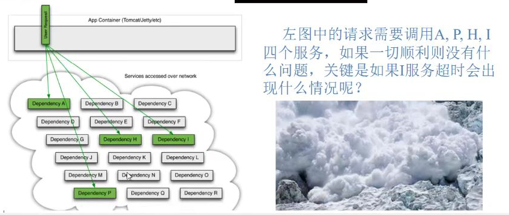

## 分布式面临的问题

复杂的分布式体系结构中的应用程序有数十个依赖关系，每个依赖在某些时候不可避免的失败




服务雪崩
多个微服务之间调用的时候，假设微服务A调用微服务B和微服务C,微服务B和微服务C又调用其它的微服务，这就是所谓的"扇出”。
如果扇出的链路上某个微服务的调用响应时间过长或者不可用,对微服务A的调用就会占用越来越多的系统资源，进而引|起系统崩溃,所
谓的“雪崩效应”.
对于高流量的应用来说，单一的后端依赖可能会导致所有服务 器上的所有资源都在几秒钟内饱和。比失败更糟糕的是,这些应用程序还
可能导致服务之间的延迟增加，备份队列，线程和其他系统资源紧张，导致整个系统发生更多的级联故障。这些都表示需要对故障和延
迟进行隔离和管理，以便单个依赖关系的失败，不能取消整个应用程序或系统。
所以，
通常当你发现一个模块 下的某个实例失败后，这时候这个模块依然还会接收流量，然后这个有问题的模块还调用了其他的模块，这样就
会发生级联故障，或者叫雪崩。


## Hystrix

Hystrix是一个用于 处理分布式系统的**延迟**和**容错**的开源库,在分布式系统里，许多依赖不可避免的会调用失败，比如超时、异常等,
Hystrix能够保证在一个依赖出问题的情况下， 不会导致整体服务失败，避免级联故障，以提高分布式系统的性。
”断路器”本身是一种开关装置， 当某个服务单元发生故障之后，通过断路器的故障监控(类似熔断保险丝)，向调用方返回一个符合预期的、可处理的备选响应(FallBack) ，而不是长时间的等待或者抛出调用方无法处理的异常，这样就保证了服务调用方的线程不会被长时间、不必要地占用，从而避免了故障在分布式系统中的蔓延，乃至雪崩。


## 能干吗

服务降级

服务熔断

接近实时监控


## 概念

#### 服务降级

向调用方返回一个符合预期的、可处理的备选响应(FallBack) ，服务器忙,不让客户等待返回提示信息


发生降级：

程序异常、超时、服务熔断服务降级，线程池/信号量打满


#### 服务熔断

类似保险丝达到最大服务访问后，直接拒绝访问，然后调用降级方法并且返回有好的提示


#### 服务限流

秒杀高并发的炒作，严禁一窝蜂过来拥挤，一秒钟N个通过


## 支付服务构建


#### pom

```xml
 <dependencies>
        <!--hystrix-->
        <dependency>
            <groupId>org.springframework.cloud</groupId>
            <artifactId>spring-cloud-starter-netflix-hystrix</artifactId>
        </dependency>
        <!--eureka client-->
        <dependency>
            <groupId>org.springframework.cloud</groupId>
            <artifactId>spring-cloud-starter-netflix-eureka-client</artifactId>
        </dependency>

        <dependency>
            <groupId>org.springframework.boot</groupId>
            <artifactId>spring-boot-starter-web</artifactId>
        </dependency>
        <!--监控-->
        <dependency>
            <groupId>org.springframework.boot</groupId>
            <artifactId>spring-boot-starter-actuator</artifactId>
        </dependency>
        <!--热部署-->
        <dependency>
            <groupId>org.springframework.boot</groupId>
            <artifactId>spring-boot-devtools</artifactId>
            <scope>runtime</scope>
            <optional>true</optional>
        </dependency>
        <dependency>
            <groupId>org.projectlombok</groupId>
            <artifactId>lombok</artifactId>
            <optional>true</optional>
        </dependency>
        <dependency>
            <groupId>org.springframework.boot</groupId>
            <artifactId>spring-boot-starter-test</artifactId>
            <scope>test</scope>
        </dependency>
    </dependencies>
```


#### 启动类

```java
package com.mrcheng.springcloud;

import org.springframework.boot.SpringApplication;
import org.springframework.boot.autoconfigure.SpringBootApplication;

/**
 * @author ccrr
 */
@SpringBootApplication
public class PaymentHystrixMain8001 {

    public static void main(String[] args) {
        SpringApplication.run(PaymentHystrixMain8001.class,args);
    }
}

```


#### 配置文件

```yml
server:
  port: 8001
spring:
  application:
    name: cloud-provider-hystrix-payment

eureka:
  client:
    register-with-eureka: true
    fetch-registry: true
    service-url:
      defaultZone: http://eureka7001.com:7001/eureka
```


#### service

```java
package com.mrcheng.springcloud.service;

import org.springframework.stereotype.Service;

/**
 * @author ccrr
 */
@Service
public class PaymentService {
    //正常访问
    public String paymentInfo(InternalError id){
        return "线程池：" + Thread.currentThread().getName()+"paymentinfo:" + id;
    }

    //不能正常访问
    public String paymentError(InternalError id){
        int time = 5000;

        try {
            Thread.sleep(time);
        } catch (InterruptedException e) {
            e.printStackTrace();
        }
        return "线程池：" + Thread.currentThread().getName()+"paymentError:" + id;
    }

}

```


#### controller

```java
package com.mrcheng.springcloud.controller;

import com.mrcheng.springcloud.service.PaymentService;
import lombok.extern.slf4j.Slf4j;
import org.springframework.beans.factory.annotation.Value;
import org.springframework.stereotype.Controller;
import org.springframework.web.bind.annotation.GetMapping;
import org.springframework.web.bind.annotation.RestController;

import javax.annotation.Resource;

/**
 * @author ccrr
 */
@RestController
@Slf4j
public class PaymentController {
    @Resource
    private PaymentService paymentService;

    @Value("${server.port}")
    private String serverPort;

    @GetMapping("/payment/hystrix/ok/{id}")
    public String paymentInfo(InternalError id){

        String result = paymentService.paymentInfo(id);
        log.info("res:" + result);
        return result;
    }

    //不能正常访问
    @GetMapping("/payment/hystrix/error/{id}")
    public String paymentError(InternalError id){
        String result = paymentService.paymentError(id);
        log.info("res:" + result);
        return result;
    }

}

```

/payment/hystrix/error/{id}:会有5秒缓冲时间

/payment/hystrix/ok/{id}:会立即相应


## 高并发测试

使用Apache JMeter进行测试

此时/payment/hystrix/ok/{id}:也会有延迟


tomcat的默认线程池被打满了，没有多余的线程分配


## Order

#### 目录


#### pom

```java
<dependencies>
        <!--hystrix-->
        <dependency>
            <groupId>org.springframework.cloud</groupId>
            <artifactId>spring-cloud-starter-netflix-hystrix</artifactId>
        </dependency>
        <!--openfeign-->
        <dependency>
            <groupId>org.springframework.cloud</groupId>
            <artifactId>spring-cloud-starter-openfeign</artifactId>
        </dependency>
        <!--eureka client-->
        <dependency>
            <groupId>org.springframework.cloud</groupId>
            <artifactId>spring-cloud-starter-netflix-eureka-client</artifactId>
        </dependency>
   
        <dependency>
            <groupId>org.springframework.boot</groupId>
            <artifactId>spring-boot-starter-web</artifactId>
        </dependency>
        <!--监控-->
        <dependency>
            <groupId>org.springframework.boot</groupId>
            <artifactId>spring-boot-starter-actuator</artifactId>
        </dependency>
        <!--热部署-->
        <dependency>
            <groupId>org.springframework.boot</groupId>
            <artifactId>spring-boot-devtools</artifactId>
            <scope>runtime</scope>
            <optional>true</optional>
        </dependency>
        <dependency>
            <groupId>org.projectlombok</groupId>
            <artifactId>lombok</artifactId>
            <optional>true</optional>
        </dependency>
        <dependency>
            <groupId>org.springframework.boot</groupId>
            <artifactId>spring-boot-starter-test</artifactId>
            <scope>test</scope>
        </dependency>
    </dependencies>
```


#### 启动类

```java
package com.mrchengs.springcloud;

import org.springframework.boot.SpringApplication;
import org.springframework.boot.autoconfigure.SpringBootApplication;
import org.springframework.cloud.openfeign.EnableFeignClients;

/**
 * @author ccrr
 */
@EnableFeignClients
@SpringBootApplication
public class OrderHystrixMain80 {
    public static void main(String[] args) {
        SpringApplication.run(OrderHystrixMain80.class,args);
    }
}

```


#### 配置文件

```yml
server:
  port: 80
eureka:
  client:
    register-with-eureka: false
    fetch-registry: true
    service-url:
      defaultZone: http://eureka7001.com:7001/eureka
#feign:
#  hystrix:
#    # 在feign中开启Hystrix
#    enabled: true
```


#### feign的service

```java
package com.mrchengs.springcloud.service;

import org.springframework.cloud.openfeign.FeignClient;
import org.springframework.stereotype.Component;
import org.springframework.web.bind.annotation.GetMapping;
import org.springframework.web.bind.annotation.PathVariable;

/**
 * @author ccrr
 */
@Component
@FeignClient(value = "CLOUD-PROVIDER-HYSTRIX-PAYMENT")
public interface PaymentHystrixService {

    @GetMapping("/payment/hystrix/ok/{id}")
    public String paymentInfo(@PathVariable("id") Integer id);

    //不能正常访问
    @GetMapping("/payment/hystrix/error/{id}")
    public String paymentError(@PathVariable("id") Integer id);

}

```


#### controller

```java
package com.mrchengs.springcloud.controller;

import com.mrchengs.springcloud.service.PaymentHystrixService;
import org.springframework.web.bind.annotation.GetMapping;
import org.springframework.web.bind.annotation.PathVariable;
import org.springframework.web.bind.annotation.RestController;

import javax.annotation.Resource;

/**
 * @author ccrr
 */
@RestController
public class OrderHystrixController {
    @Resource
    private PaymentHystrixService paymentHystrixService;


    @GetMapping("/order/hystrix/ok/{id}")
    public String paymentInfo(@PathVariable("id") Integer id){
        return paymentHystrixService.paymentInfo(id);
    }

    //不能正常访问
    @GetMapping("/order/hystrix/error/{id}")
    public String paymentError(@PathVariable("id") Integer id){
        return paymentHystrixService.paymentError(id);
    }


}

```


使用并发测试http://localhost:8001/payment/hystrix/error/1接口

在Order中调用：http://localhost/order/hystrix/ok/1会出现卡顿


## 解决方法

超时导致服务器变慢（转圈）：超时不再等待

出错（宕机或程序运行出错）：出错 有兜底

解决：

- 对方服务8001超时，调用80不能一直卡死等待，必须要有服务降级
- 对方服务8001宕机，调用者80不能一直卡死等待，必须要有服务降级
- 对方服务8001Ok，调用者80自己出故障有自由要求


## 服务降级

#### 提供者

**cloud-provider-hystrix-payment8001**

设置自身超时时间的峰值，峰值内可以正常运行

超时过了需要有兜底的方法处理，作为降级fallback


#### feign的service

HystrixCommand注解需要实现fallback的方法

```java
package com.mrcheng.springcloud.service;

import com.netflix.hystrix.contrib.javanica.annotation.HystrixCommand;
import com.netflix.hystrix.contrib.javanica.annotation.HystrixProperty;
import org.springframework.stereotype.Service;

/**
 * @author ccrr
 */
@Service
public class PaymentService {
    //正常访问
    public String paymentInfo(Integer id){
        return "线程池：" + Thread.currentThread().getName()+"paymentinfo:" + id;
    }

    //不能正常访问

    /**
     *  @HystrixProperty(name = "execution.isolation.timeoutInMilliseconds",value = "3000"):3s以内正常峰值
     *  3s之后超时执行：fallbackMethod的方法
     * @param id
     * @return
     */
    @HystrixCommand(fallbackMethod = "paymentErrorHandler", commandProperties = {
            @HystrixProperty(name = "execution.isolation.thread.timeoutInMilliseconds", value = "3000")
    })
    public String paymentError(Integer id){
        int time = 5000;

        try {
            Thread.sleep(time);
        } catch (InterruptedException e) {
            e.printStackTrace();
        }
        return "线程池：" + Thread.currentThread().getName()+"paymentError:" + id;
    }
    public String paymentErrorHandler(Integer id){
        return "繁忙处理中。...." + id;
    }
}
```

给与系统三秒正常时间访问，线程阻塞五秒

会进行服务降级


#### 主启动类

@EnableCircuitBreaker：开启操纵

```java
package com.mrcheng.springcloud;

import org.springframework.boot.SpringApplication;
import org.springframework.boot.autoconfigure.SpringBootApplication;
import org.springframework.cloud.client.circuitbreaker.EnableCircuitBreaker;
import org.springframework.cloud.netflix.eureka.EnableEurekaClient;

/**
 * @author ccrr
 */
@EnableEurekaClient
@EnableCircuitBreaker//Hystrix
@SpringBootApplication
public class PaymentHystrixMain8001 {

    public static void main(String[] args) {
        SpringApplication.run(PaymentHystrixMain8001.class,args);
    }
}

```


#### 调接口

http://localhost:8001/payment/hystrix/error/5

结果：繁忙处理中。....5


#### 消费者

cloud-consumer-feign-hystrix-order80


#### 配置文件

```yml
server:
  port: 80
eureka:
  client:
    register-with-eureka: false
    fetch-registry: true
    service-url:
      defaultZone: http://eureka7001.com:7001/eureka
feign:
  hystrix:
    # 在feign中开启Hystrix
    enabled: true
```


#### 启动类

```java
package com.mrchengs.springcloud;

import org.springframework.boot.SpringApplication;
import org.springframework.boot.autoconfigure.SpringBootApplication;
import org.springframework.cloud.netflix.hystrix.EnableHystrix;
import org.springframework.cloud.openfeign.EnableFeignClients;

/**
 * @author ccrr
 */
@EnableHystrix
@EnableFeignClients
@SpringBootApplication
public class OrderHystrixMain80 {
    public static void main(String[] args) {
        SpringApplication.run(OrderHystrixMain80.class,args);
    }
}

```


#### 业务实现

```java
package com.mrchengs.springcloud.controller;

import com.mrchengs.springcloud.service.PaymentHystrixService;
import com.netflix.hystrix.contrib.javanica.annotation.HystrixCommand;
import com.netflix.hystrix.contrib.javanica.annotation.HystrixProperty;
import org.springframework.web.bind.annotation.GetMapping;
import org.springframework.web.bind.annotation.PathVariable;
import org.springframework.web.bind.annotation.RestController;

import javax.annotation.Resource;

/**
 * @author ccrr
 */
@RestController
public class OrderHystrixController {
    @Resource
    private PaymentHystrixService paymentHystrixService;


    @GetMapping("/order/hystrix/ok/{id}")
    public String paymentInfo(@PathVariable("id") Integer id){
        return paymentHystrixService.paymentInfo(id);
    }

    //不能正常访问
    /**
     *  @HystrixProperty(name = "execution.isolation.timeoutInMilliseconds",value = "3000"):3s以内正常峰值
     *  3s之后超时执行：fallbackMethod的方法
     * @param id
     * @return
     */
    @HystrixCommand(fallbackMethod = "paymentErrorHandler", commandProperties = {
            @HystrixProperty(name = "execution.isolation.thread.timeoutInMilliseconds", value = "3000")
    })
    @GetMapping("/order/hystrix/error/{id}")
    public String paymentError(@PathVariable("id") Integer id){
        return paymentHystrixService.paymentError(id);
    }

    public String paymentErrorHandler(Integer id){
        return "客户端处理繁忙。...." + id;
    }

}

```


#### 结果

http://localhost/order/hystrix/error/4

客户端处理繁忙。....4


#### 问题

耦合的高

业务逻辑和fallback混合


@DefaultProperties(defaultFallback = "")

在没有@HystrixCommand(）时，使用默认的，有的话就使用独有的


#### 1111：基于hystrx

cloud-consumer-feign-hystrix-order80

```java
package com.mrchengs.springcloud.controller;

import com.mrchengs.springcloud.service.PaymentHystrixService;
import com.netflix.hystrix.contrib.javanica.annotation.DefaultProperties;
import com.netflix.hystrix.contrib.javanica.annotation.HystrixCommand;
import com.netflix.hystrix.contrib.javanica.annotation.HystrixProperty;
import org.springframework.web.bind.annotation.GetMapping;
import org.springframework.web.bind.annotation.PathVariable;
import org.springframework.web.bind.annotation.RestController;

import javax.annotation.Resource;

/**
 * @author ccrr
 */
@RestController
@DefaultProperties(defaultFallback = "paymentErrorHandlerGlobal")
public class OrderHystrixController {
    @Resource
    private PaymentHystrixService paymentHystrixService;


    @GetMapping("/order/hystrix/ok/{id}")
    public String paymentInfo(@PathVariable("id") Integer id){
        return paymentHystrixService.paymentInfo(id);
    }

    //不能正常访问
    /**
     *  @HystrixProperty(name = "execution.isolation.timeoutInMilliseconds",value = "3000"):3s以内正常峰值
     *  3s之后超时执行：fallbackMethod的方法
     * @param id
     * @return
     */
//    @HystrixCommand(fallbackMethod = "paymentErrorHandler", commandProperties = {
//            @HystrixProperty(name = "execution.isolation.thread.timeoutInMilliseconds", value = "3000")
//    })
    @HystrixCommand
    @GetMapping("/order/hystrix/error/{id}")
    public String paymentError(@PathVariable("id") Integer id){
        return paymentHystrixService.paymentError(id);
    }

    public String paymentErrorHandlerGlobal(){
        return "全局处理。...." ;
    }

    public String paymentErrorHandler(Integer id){
        return "客户端处理繁忙。...." + id;
    }

}

```

http://localhost/order/hystrix/error/4

全局处理。....


#### 2222：基于Feign

cloud-consumer-feign-hystrix-order80


Feign的service接口

在注解@FeignFallbackService中调用回调函数

```java
package com.mrchengs.springcloud.service;

import org.springframework.cloud.openfeign.FeignClient;
import org.springframework.stereotype.Component;
import org.springframework.web.bind.annotation.GetMapping;
import org.springframework.web.bind.annotation.PathVariable;

@Component
@FeignClient(value = "CLOUD-PROVIDER-HYSTRIX-PAYMENT",fallback = PaymentFallbackService.class)
public interface PaymentHystrixService {

    @GetMapping("/payment/hystrix/ok/{id}")
    public String paymentInfo(@PathVariable("id") Integer id);

    //不能正常访问
    @GetMapping("/payment/hystrix/error/{id}")
    public String paymentError(@PathVariable("id") Integer id);

}

```

新建类实现Feign的接口

```java
package com.mrchengs.springcloud.service;

import org.springframework.stereotype.Component;

@Component
public class PaymentFallbackService implements  PaymentHystrixService {
    @Override
    public String paymentInfo(Integer id) {
        return "PaymentFallbackService paymentInfo";
    }

    @Override
    public String paymentError(Integer id) {
        return "PaymentFallbackService paymentError";
    }
}

```


http://localhost/order/hystrix/error/4

PaymentFallbackService paymentError


## 服务熔断

类比保险丝达到最大服务访问后，直接拒绝访问，然后调用降级方法返回友好提示

服务降级->进而熔断->恢复调用链路


熔断机制：

是应对雪崩雪崩效应的一宗微服务链路保护机制

当扇出链路的某个微服务出错不可用或者相应时间太长

会进行服务降级，进而熔断该节点微服务的调用，快速返回错误的相应信息

当检测到该节点微服务正常相应之后，恢复调用链路


cloud-provider-hystrix-payment8001

#### service

```java
package com.mrcheng.springcloud.service;

import cn.hutool.core.util.IdUtil;
import com.netflix.hystrix.contrib.javanica.annotation.HystrixCommand;
import com.netflix.hystrix.contrib.javanica.annotation.HystrixProperty;
import org.springframework.stereotype.Service;
import org.springframework.web.bind.annotation.PathVariable;

/**
 * @author ccrr
 */
@Service
public class PaymentService {
    //正常访问
    public String paymentInfo(Integer id){
        return "线程池：" + Thread.currentThread().getName()+"paymentinfo:" + id;
    }

    //不能正常访问

    /**
     *  @HystrixProperty(name = "execution.isolation.timeoutInMilliseconds",value = "3000"):3s以内正常峰值
     *  3s之后超时执行：fallbackMethod的方法
     * @param id
     * @return
     */
    @HystrixCommand(fallbackMethod = "paymentErrorHandler", commandProperties = {
            @HystrixProperty(name = "execution.isolation.thread.timeoutInMilliseconds", value = "3000")
    })
    public String paymentError(Integer id){
        int time = 5000;

        try {
            Thread.sleep(time);
        } catch (InterruptedException e) {
            e.printStackTrace();
        }
        return "线程池：" + Thread.currentThread().getName()+"paymentError:" + id;
    }
    public String paymentErrorHandler(Integer id){
        return "繁忙处理中。...." + id;
    }

    //服务熔断
    /**
     * 在10秒窗口期中10次请求有6次是请求失败的,断路器将起作用
     * @param id
     * @return
     */
    //HystrixCommandProperties:参数来源
    @HystrixCommand(
            fallbackMethod = "paymentCircuitBreaker_fallback", commandProperties = {
            @HystrixProperty(name = "circuitBreaker.enabled", value = "true"),// 是否开启断路器
            @HystrixProperty(name = "circuitBreaker.requestVolumeThreshold", value = "10"),// 请求次数
            @HystrixProperty(name = "circuitBreaker.sleepWindowInMilliseconds", value = "10000"),// 时间窗口期/时间范文
            @HystrixProperty(name = "circuitBreaker.errorThresholdPercentage", value = "60")// 失败率达到多少后跳闸
    }
    )
    public String paymentCircuitBreaker(@PathVariable("id") Integer id) {
        if (id < 0) {
            throw new RuntimeException("*****id不能是负数");
        }
        String serialNumber = IdUtil.simpleUUID();
        return Thread.currentThread().getName() + "\t" + "调用成功,流水号:" + serialNumber;
    }

    public String paymentCircuitBreaker_fallback(@PathVariable("id") Integer id) {
        return "id 不能负数,请稍后重试,o(╥﹏╥)o id:" + id;
    }
}
```


#### conttroller

```java
package com.mrcheng.springcloud.controller;

import com.mrcheng.springcloud.service.PaymentService;
import lombok.extern.slf4j.Slf4j;
import org.springframework.beans.factory.annotation.Value;
import org.springframework.stereotype.Controller;
import org.springframework.web.bind.annotation.GetMapping;
import org.springframework.web.bind.annotation.PathVariable;
import org.springframework.web.bind.annotation.RestController;

import javax.annotation.Resource;

/**
 * @author ccrr
 */
@RestController
@Slf4j
public class PaymentController {
    @Resource
    private PaymentService paymentService;

    @Value("${server.port}")
    private String serverPort;

    @GetMapping("/payment/hystrix/ok/{id}")
    public String paymentInfo(@PathVariable("id") Integer id){

        String result = paymentService.paymentInfo(id);
        log.info("res:" + result);
        return result;
    }

    //不能正常访问
    @GetMapping("/payment/hystrix/error/{id}")
    public String paymentError(@PathVariable("id")Integer id){
        String result = paymentService.paymentError(id);
        log.info("res:" + result);
        return result;
    }

    //服务熔断
    /**
     * 服务熔断
     * http://localhost:8001/payment/circuit/32
     * @param id
     * @return
     */
    @GetMapping("/payment/circuit/{id}")
    public String paymentCircuitBreaker(@PathVariable("id") Integer id) {
        String result = paymentService.paymentCircuitBreaker(id);
        log.info("***result:" + result);
        return result;
    }
}
```


#### ceshi 

http://localhost:8001/payment/circuit/-32

id 不能负数,请稍后重试,o(╥﹏╥)o id:-32

http://localhost:8001/payment/circuit/32

hystrix-PaymentService-3 调用成功,流水号:572083e2f97d4d929c773f64d7ee2690


多执行几次

http://localhost:8001/payment/circuit/-32

结果：id 不能负数,请稍后重试,o(╥﹏╥)o id:-32

在执行http://localhost:8001/payment/circuit/32

结果：id 不能负数,请稍后重试,o(╥﹏╥)o id:32

此时便会发生服务熔断，在过一段时间就会恢复


## 工作流程

https://github.com/Netflix/Hystrix/wiki/How-it-Works#Flow


## 图形化

除了隔离依赖服务的调用以外, Hystrix还提供 了准实时的调用监控(Hystrix Dashboard)，Hystrix会持续地记录所有通过Hystrix发
起的请求的执行信息，并以统计报表和图形的形式展示给用户，包括每秒执行多少请求多少成功，多少失败等。Netflix通过
hystrix-metrics-event-stream项目实现了对以上指标的监控。Spring Cloud也提供了Hystrix Dashboard的整合，对监控内容转化成
可视化界面。


搭建新的项目

cloud-consumer-hystrix-dashboard9001


#### pom

```xml
 <dependencies>
        <!--hystrix dashboard-->
        <dependency>
            <groupId>org.springframework.cloud</groupId>
            <artifactId>spring-cloud-starter-netflix-hystrix-dashboard</artifactId>
        </dependency>
        <!--actuator监控信息完善-->
        <dependency>
            <groupId>org.springframework.boot</groupId>
            <artifactId>spring-boot-starter-actuator</artifactId>
        </dependency>
        <!--热部署-->
        <dependency>
            <groupId>org.springframework.boot</groupId>
            <artifactId>spring-boot-devtools</artifactId>
            <scope>runtime</scope>
            <optional>true</optional>
        </dependency>
        <dependency>
            <groupId>org.projectlombok</groupId>
            <artifactId>lombok</artifactId>
            <optional>true</optional>
        </dependency>
        <dependency>
            <groupId>org.springframework.boot</groupId>
            <artifactId>spring-boot-starter-test</artifactId>
            <scope>test</scope>
        </dependency>
    </dependencies>
```


#### 配置文件

```
server:
  port: 9001
```


#### 启动类

```java
package com.mrchengs.coud;

import com.netflix.hystrix.contrib.metrics.eventstream.HystrixMetricsStreamServlet;
import org.springframework.boot.SpringApplication;
import org.springframework.boot.autoconfigure.SpringBootApplication;
import org.springframework.boot.web.servlet.ServletRegistrationBean;
import org.springframework.cloud.netflix.hystrix.dashboard.EnableHystrixDashboard;
import org.springframework.context.annotation.Bean;

/**
 * @author ccrr
 * @create 2020/3/26 17:27
 **/
@SpringBootApplication
@EnableHystrixDashboard
public class HystrixDashboardMain9001 {
    public static void main(String[] args) {
        SpringApplication.run(HystrixDashboardMain9001.class);
    }

    /**
     * 此配置是为了服务监控而配置，与服务容错本身无观，springCloud 升级之后的坑
     * ServletRegistrationBean因为springboot的默认路径不是/hystrix.stream
     * 只要在自己的项目中配置上下面的servlet即可
     * @return
     */
    @Bean
    public ServletRegistrationBean getServlet(){
        HystrixMetricsStreamServlet streamServlet = new HystrixMetricsStreamServlet();
        ServletRegistrationBean<HystrixMetricsStreamServlet> registrationBean = new ServletRegistrationBean<>(streamServlet);
        registrationBean.setLoadOnStartup(1);
        registrationBean.addUrlMappings("/hystrix.stream");
        registrationBean.setName("HystrixMetricsStreamServlet");
        return registrationBean;
    }
}
```


#### 启动访问

http://localhost:8001/payment/circuit/32


#### 监控8001

配置8001的启动类

```java
package com.mrcheng.springcloud;

import com.netflix.hystrix.contrib.metrics.eventstream.HystrixMetricsStreamServlet;
import org.springframework.boot.SpringApplication;
import org.springframework.boot.autoconfigure.SpringBootApplication;
import org.springframework.boot.web.servlet.ServletRegistrationBean;
import org.springframework.cloud.client.circuitbreaker.EnableCircuitBreaker;
import org.springframework.cloud.netflix.eureka.EnableEurekaClient;
import org.springframework.context.annotation.Bean;

/**
 * @author ccrr
 */
@EnableEurekaClient
@EnableCircuitBreaker//Hystrix
@SpringBootApplication
public class PaymentHystrixMain8001 {

    public static void main(String[] args) {
        SpringApplication.run(PaymentHystrixMain8001.class,args);
    }

    /**
     * 此配置是为了服务监控而配置，与服务容错本身无观，springCloud 升级之后的坑
     * ServletRegistrationBean因为springboot的默认路径不是/hystrix.stream
     * 只要在自己的项目中配置上下面的servlet即可
     * @return
     */
    @Bean
    public ServletRegistrationBean getServlet(){
        HystrixMetricsStreamServlet streamServlet = new HystrixMetricsStreamServlet();
        ServletRegistrationBean<HystrixMetricsStreamServlet> registrationBean = new ServletRegistrationBean<>(streamServlet);
        registrationBean.setLoadOnStartup(1);
        registrationBean.addUrlMappings("/hystrix.stream");
        registrationBean.setName("HystrixMetricsStreamServlet");
        return registrationBean;
    }
}

```


在图形化界面

http://localhost:8001/hystrix.stream


