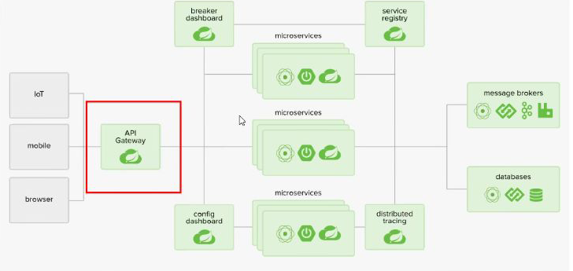
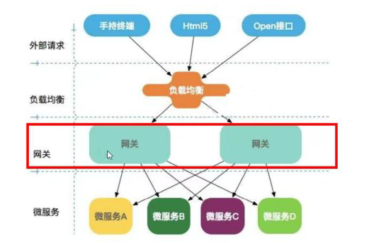
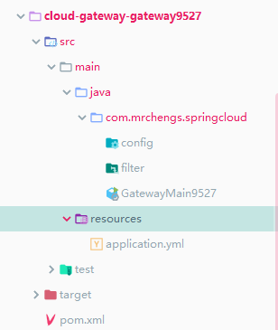

## 网关

CLoud全家桶很重要的组建就是网关

1.x版本使用Zuul网关

2.x版本使用Gateway





SpringCloud Gateway是Spring Cloud的一个全新项目， 基纡Spring 5.0+Spring Boot 2.0和Project Reactor等技术开发的网关，它旨在为
微服务架构提供一种简单有效的统一的API路由管理方式。
SpringCloud Gateway作为Spring Cloud生态系统中的网关，目标是替代Zuul,在Spring Cloud 2.0以上版本中，没有对新版本的Zuul 2.0以上
最新高性能版本进行集成，仍然还是使用的Zuul 1.x非Reactor模式的老版本。而为了提升网关的性能，SpringCloud Gateway是基于WebFlux框架
实现的，而WebFlux框架底层则使用了高性能的Reactor模式通信框架Netty。
Spring Cloud Gateway的目标提供统的路由方式且基于Filter链的方式提供了网关基本的功能，例如:安全，监控/指标，和限流。


SpringCloud Gateway使用Webflux中的reactor-netty响应式编程组建，底层使用了Netty通讯框架


## 作用

#### 网关的位置




Spring Cloud Gateway具有如下特性:
基于Spring Framework 5, Project Reactor和Spring Boot 2.0进行构建
动态路由:能够匹配任何请求属性;
**可以对路由指定Predicate (断言)和Filter (过滤器) ;**
集成Hystrix的断路器功能; .
集成Spring Cloud服务发现功能;
易于编写的Predicate (断言)和Filter (过滤器) ;
请求限流功能;
支持路径重写。


## 三大核心概念

#### 路由

路由时构建网关的基本模块，由ID、目标URI、一系列的断言和过滤器组成，如果断言为true则匹配该路由


#### 断言

参考java8的java.util..funcation.Predicate

开发人员可以匹配HTTP请求中的所有内容（请求头、参数等），如果请求u、与断言相匹配则进行路由


#### 过滤

spring框架中的GatewayFilter的实例，使用过滤器，可以在请求被路由前后对请求进行修改


## 使用

#### 目录




#### pom

```xml
 <dependencies>
        <dependency>
            <groupId>org.springframework.cloud</groupId>
            <artifactId>spring-cloud-starter-gateway</artifactId>
        </dependency>
        <!--gateway无需web和actuator-->
        <dependency>
            <groupId>org.springframework.cloud</groupId>
            <artifactId>spring-cloud-starter-netflix-eureka-client</artifactId>
        </dependency>
        <dependency>
            <groupId>org.projectlombok</groupId>
            <artifactId>lombok</artifactId>
            <optional>true</optional>
        </dependency>
        <dependency>
            <groupId>org.springframework.boot</groupId>
            <artifactId>spring-boot-starter-test</artifactId>
            <scope>test</scope>
        </dependency>
<!--        <dependency>-->
<!--            <groupId>com.atguigu.springcloud</groupId>-->
<!--            <artifactId>cloud-api-common</artifactId>-->
<!--            <version>${project.version}</version>-->
<!--        </dependency>-->
    </dependencies>
```


#### 配置文件

```yml
server:
  port: 9527

spring:
  application:
    name: cloud-gateway
  cloud:
    gateway:
      discovery:
        locator:
          enabled: true # 开启从注册中心动态创建路由的功能，利用微服务名称j进行路由
      routes:
        - id: payment_route # 路由的id,没有规定规则但要求唯一,建议配合服务名
          #匹配后提供服务的路由地址
          uri: http://localhost:8001
          predicates:
            - Path=/payment/get/** # 断言，路径相匹配的进行路由
            #- After=2017-01-20T17:42:47.789-07:00[America/Denver]
            #- Before=2017-01-20T17:42:47.789-07:00[America/Denver]
            #- Cookie=username,zzyy
            #- Header=X-Request-Id, \d+ #请求头要有X-Request-Id属性，并且值为正数
            #- Host=**.atguigu.com
            #- Method=GET
            #- Query=username, \d+ # 要有参数名username并且值还要是正整数才能路由
          # 过滤
          #filters:
          #  - AddRequestHeader=X-Request-red, blue
        - id: payment_route2
          uri: http://localhost:8001
          predicates:
            Path=/payment/timeout/** #断言,路径相匹配的进行路由

eureka:
  instance:
    hostname: cloud-gateway-service
  client:
    fetch-registry: true
    register-with-eureka: true
    service-url:
      defaultZone: http://eureka7001.com:7001/eureka/
```


#### 启动类

```java
package com.mrchengs.springcloud;

import org.springframework.boot.SpringApplication;
import org.springframework.boot.autoconfigure.SpringBootApplication;
import org.springframework.cloud.netflix.eureka.EnableEurekaClient;

/**
 * @author ccrr
 */
@SpringBootApplication
@EnableEurekaClient
public class GatewayMain9527 {
    public static void main(String[] args) {
        SpringApplication.run(GatewayMain9527.class, args);
    }
}
```


#### payment8001controller

```java

@RestController
@Slf4j
public class PaymentController {

    @Autowired
    PaymentService paymentService;

    @Value("${server.port}")
    private String port;

    /**
     * 服务发现 获取服务信息
     */
    @Resource
    private DiscoveryClient discoveryClient;

    @GetMapping("/payment/discovery")
    public Object discovery(){
        List<String> services = discoveryClient.getServices();
        log.info("*******");
        log.info("*******");
        for (String service : services) {
            log.info(service);
        }
        log.info("*******");
        log.info("*******");
        List<ServiceInstance> instances = discoveryClient.getInstances("CLOUD-PAYMENT-SERVICE");
        for (ServiceInstance instance : instances) {
            log.info(instance.getServiceId());
            log.info(instance.getHost());
            log.info(instance.getInstanceId());
            log.info(instance.getScheme());
            log.info(String.valueOf(instance.getUri()));
            log.info(String.valueOf(instance.isSecure()));
            log.info("**********");
        }
        return this.discoveryClient;
    }


    @PostMapping(value = "/payment/create")
    public CommonResult create(@RequestBody Payment payment){
        int result = paymentService.create(payment);
        log.info("****插入结果:****" + result);
        if (result > 0){
            return new CommonResult(200,"插入数据成功",result);
        }else {
            return new CommonResult(444,"插入数据失败",null);
        }
    }

    @GetMapping(value = "/payment/get/{id}")
    public CommonResult getPaymentById(@PathVariable("id") Long id ){
        Payment payment = paymentService.getPaymentById(id);
        log.info("****插入结果:****" + payment);
        log.info("****端口:****" + port);

        if (payment !=null){
            return new CommonResult(200,"查询成功"+port,payment);
        }else {
            return new CommonResult(444,"查询失败",null);
        }
    }
    @GetMapping(value = "/payment/timeout")
    public String timeout(){
//        try {
//            Thread.sleep(3);
//        } catch (InterruptedException e) {
//            e.printStackTrace();
//        }
        return port;
    }

}

```


#### 启动

启动：

payment8001

erueka7001

gateway9527


#### 测试

正常访问：http://localhost:8001/payment/get/1出结果

**{****}**"code": 200,"message": "查询成功8001","data": {"id": 1,"serial": "q1111111"}


此时类似虚拟化IP地址

此时访问：http://localhost:9527/payment/get/1

**{****}**"code": 200,"message": "查询成功8001","data": {"id": 1,"serial": "q1111111"}


http://localhost:9527/payment/timeout

8001


请求8001服务通过9527端口的gateway进行实现


## 配置路由两种方式

#### 配置在yml文件


#### 代码注入RouteLocator的Bean

实现介入：http://news.baidu.com/guonei

新建配置类

```java
package com.mrchengs.springcloud.config;


import org.springframework.cloud.gateway.route.RouteLocator;
import org.springframework.cloud.gateway.route.builder.RouteLocatorBuilder;
import org.springframework.context.annotation.Bean;
import org.springframework.context.annotation.Configuration;

/**
 * @author ccrr
 */
@Configuration
public class GateWayConfig {
    /**
     * 配置了一个id为route-name的路由规则
     * 当访问localhost:9527/guonei的时候，将会转发至https://news.baidu.com/guonei
     *
     * @param routeLocatorBuilder
     * @return
     */
    @Bean
    public RouteLocator routeLocator(RouteLocatorBuilder routeLocatorBuilder){

        //构建路由
        RouteLocatorBuilder.Builder routes = routeLocatorBuilder.routes();

        routes.route("path_route_one",r->r.path("/guonei").uri("http://news.baidu.com")).build();

        return routes.build();
    }
}

```

访问即可http://localhost:9527/guonei


## 配置动态路由

默认情况下Gateway会根据注册中心的服务列表

以注册中心上微服务名为路径创建动态路由进行转发，从而实现动态路由更能


配置文件

```yml
spring:
  application:
    name: cloud-gateway
  cloud:
    gateway:
      discovery:
        locator:
          enabled: true # 开启从注册中心动态创建路由的功能，利用微服务名称j进行路由

```

```yml
      routes:
        - id: payment_route # 路由的id,没有规定规则但要求唯一,建议配合服务名
          #匹配后提供服务的路由地址
          #uri: http://localhost:8001
          uri: lb://CLOUD-PAYMENT-SERVICE
          predicates:
            - Path=/payment/get/** # 断言，路径相匹配的进行路由
        - id: payment_route2
          #uri: http://localhost:8001
          uri: lb://CLOUD-PAYMENT-SERVICE
          predicates:
            Path=/payment/timeout/** #断言,路径相匹配的进行路由
```

访问：http://localhost:9527/payment/timeout

8001

8002


## 断言

```yml
  cloud:
    gateway:
      discovery:
        locator:
          enabled: true # 开启从注册中心动态创建路由的功能，利用微服务名称j进行路由
      routes:
        - id: payment_route # 路由的id,没有规定规则但要求唯一,建议配合服务名
          #匹配后提供服务的路由地址
          #uri: http://localhost:8001
          uri: lb://CLOUD-PAYMENT-SERVICE
          predicates:
            - Path=/payment/get/** # 断言，路径相匹配的进行路由
            #- After=2017-01-20T17:42:47.789-07:00[America/Denver] 在什么时间之后可以进行访问
            #- Before=2017-01-20T17:42:47.789-07:00[America/Denver]   在什么时间之前可以进行访问
            #- Cookie=username,zzyy   携带cookie
            #- Header=X-Request-Id, \d+ #请求头要有X-Request-Id属性，并且值为正数
            #- Host=**.atguigu.com
            #- Method=GET
            #- Query=username, \d+ # 要有参数名username并且值还要是正整数才能路由
```


## 过滤器

路由过滤器可用于修改进入HTTP请求和返回HTTP相应，路由过滤器只能指定路由器进行使用

单一的

https://cloud.spring.io/spring-cloud-static/spring-cloud-gateway/2.2.2.RELEASE/reference/html/#gateway-request-predicates-factories


全局的

https://cloud.spring.io/spring-cloud-static/spring-cloud-gateway/2.2.2.RELEASE/reference/html/#gatewayfilter-factories


自定义

```java
package com.mrchengs.springcloud.filter;

import lombok.extern.slf4j.Slf4j;
import org.springframework.cloud.gateway.filter.GatewayFilterChain;
import org.springframework.cloud.gateway.filter.GlobalFilter;
import org.springframework.core.Ordered;
import org.springframework.http.HttpStatus;
import org.springframework.stereotype.Component;
import org.springframework.web.server.ServerWebExchange;
import reactor.core.publisher.Mono;

/**
 * @author ccrr
 */
@Component
@Slf4j
public class GatewFilter implements GlobalFilter, Ordered {


    @Override
    public Mono<Void> filter(ServerWebExchange exchange, GatewayFilterChain chain) {

        log.info("****全局过滤器****");
        String uname = exchange.getRequest().getQueryParams().getFirst("uname");
        if (uname == null){
            log.info("****用户名为空****");
            exchange.getResponse().setStatusCode(HttpStatus.NOT_ACCEPTABLE);
            return  exchange.getResponse().setComplete();
        }
        return chain.filter(exchange);
    }

    @Override
    public int getOrder() {
        return 0;
    }
}

```

http://localhost:9527/payment/get/1

```
2020-03-29 15:06:30.524  INFO 16700 --- [ctor-http-nio-2] c.m.springcloud.filter.GatewFilter       : ****全局过滤器****
2020-03-29 15:06:30.524  INFO 16700 --- [ctor-http-nio-2] c.m.springcloud.filter.GatewFilter       : ****用户名为空****
```


http://localhost:9527/payment/get/1?uname=aa

```
{
"code": 200,
"message": "查询成功8001",
"data": {
"id": 1,
"serial": "q1111111"
}
}
```

```log
2020-03-29 15:07:33.827  INFO 16700 --- [ctor-http-nio-2] c.m.springcloud.filter.GatewFilter       : ****全局过滤器****
2020-03-29 15:07:33.994  INFO 16700 --- [ctor-http-nio-2] c.netflix.config.ChainedDynamicProperty  : Flipping property: CLOUD-PAYMENT-SERVICE.ribbon.ActiveConnectionsLimit to use NEXT property: niws.loadbalancer.availabilityFilteringRule.activeConnectionsLimit = 2147483647
2020-03-29 15:07:34.023  INFO 16700 --- [ctor-http-nio-2] c.n.u.concurrent.ShutdownEnabledTimer    : Shutdown hook installed for: NFLoadBalancer-PingTimer-CLOUD-PAYMENT-SERVICE
2020-03-29 15:07:34.024  INFO 16700 --- [ctor-http-nio-2] c.netflix.loadbalancer.BaseLoadBalancer  : Client: CLOUD-PAYMENT-SERVICE instantiated a LoadBalancer: DynamicServerListLoadBalancer:{NFLoadBalancer:name=CLOUD-PAYMENT-SERVICE,current list of Servers=[],Load balancer stats=Zone stats: {},Server stats: []}ServerList:null
2020-03-29 15:07:34.032  INFO 16700 --- [ctor-http-nio-2] c.n.l.DynamicServerListLoadBalancer      : Using serverListUpdater PollingServerListUpdater
2020-03-29 15:07:34.056  INFO 16700 --- [ctor-http-nio-2] c.netflix.config.ChainedDynamicProperty  : Flipping property: CLOUD-PAYMENT-SERVICE.ribbon.ActiveConnectionsLimit to use NEXT property: niws.loadbalancer.availabilityFilteringRule.activeConnectionsLimit = 2147483647
2020-03-29 15:07:34.058  INFO 16700 --- [ctor-http-nio-2] c.n.l.DynamicServerListLoadBalancer      : DynamicServerListLoadBalancer for client CLOUD-PAYMENT-SERVICE initialized: DynamicServerListLoadBalancer:{NFLoadBalancer:name=CLOUD-PAYMENT-SERVICE,current list of Servers=[192.168.199.219:8001, 192.168.199.219:8002],Load balancer stats=Zone stats: {defaultzone=[Zone:defaultzone;	Instance count:2;	Active connections count: 0;	Circuit breaker tripped count: 0;	Active connections per server: 0.0;]
},Server stats: [[Server:192.168.199.219:8001;	Zone:defaultZone;	Total Requests:0;	Successive connection failure:0;	Total blackout seconds:0;	Last connection made:Thu Jan 01 08:00:00 CST 1970;	First connection made: Thu Jan 01 08:00:00 CST 1970;	Active Connections:0;	total failure count in last (1000) msecs:0;	average resp time:0.0;	90 percentile resp time:0.0;	95 percentile resp time:0.0;	min resp time:0.0;	max resp time:0.0;	stddev resp time:0.0]
, [Server:192.168.199.219:8002;	Zone:defaultZone;	Total Requests:0;	Successive connection failure:0;	Total blackout seconds:0;	Last connection made:Thu Jan 01 08:00:00 CST 1970;	First connection made: Thu Jan 01 08:00:00 CST 1970;	Active Connections:0;	total failure count in last (1000) msecs:0;	average resp time:0.0;	90 percentile resp time:0.0;	95 percentile resp time:0.0;	min resp time:0.0;	max resp time:0.0;	stddev resp time:0.0]
]}ServerList:org.springframework.cloud.netflix.ribbon.eureka.DomainExtractingServerList@6ff7f7f3
2020-03-29 15:07:35.037  INFO 16700 --- [erListUpdater-0] c.netflix.config.ChainedDynamicProperty  : Flipping property: CLOUD-PAYMENT-SERVICE.ribbon.ActiveConnectionsLimit to use NEXT property: niws.loadbalancer.availabilityFilteringRule.activeConnectionsLimit = 2147483647

```


