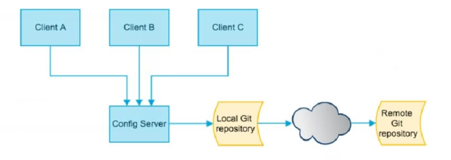

## 分布式系统面临的问题

微服务意味着要将单体应用中的业务拆分成一个个子服务， 每个服务的粒度相对较小，因此系统中会出现大量的服务。由于每个服务
都需要必要的配置信息才能运行，所以套集中式的、 动态的配置管理设施是必不可少的。
SpringCloud提供了ConfigServer来解决这个问题，我们每一个微服务自己带着一 个application.yml, 上百个配置文件的管理...

## 是什么

SpringCloud Config为微服务架构中的微服务提供集中化的外部配置支持配置服务器为**各个不同微服务应用**的所有环境提供了1个**中心化的外部配置**。

SpringCloud Config分为服务端和客户端两部分。
服务端也称为**分布式配置中心**，它是一个独立的微服务应用,用来连接配置服务器并为客户端提供获取配置信息，加密/解密信息等访问接口
客户端则是通过指定的配置中心来管理应用资源，以及与业务相关的配置内容，并在启动的时候从配置中心获取和加载配置信息配置服
务器默认采用git来存储配置信息，这样就有助于对环境配置进行版本管理,并且可以通过git客户端工具来方便的管理和访问配置内容

## 作用

- 集中管理配置文件
- 不同环境不同配置，动态化的配置更新，分环境部署如dev/test/prod/beta/release
- 运行期间动态调正配置，不需要在每个服务器服务器部署的机器上写配置文件，服务会向配置中心拉去配置信息
- 当配置文件法神改动时，服务不需要重启即可感知到配置文件大的变化并且应用新配置
- 将配置信息以REST接口的形式暴露

## Cinfig服务端

## Config客户端配置

##  COnfig客户端之动态刷新

