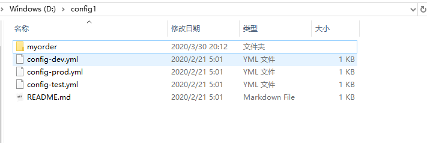
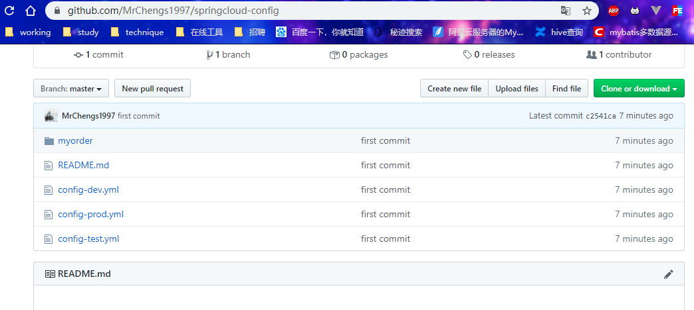

## 分布式系统面临的问题

微服务意味着要将单体应用中的业务拆分成一个个子服务， 每个服务的粒度相对较小，因此系统中会出现大量的服务。由于每个服务
都需要必要的配置信息才能运行，所以套集中式的、 动态的配置管理设施是必不可少的。
SpringCloud提供了ConfigServer来解决这个问题，我们每一个微服务自己带着一 个application.yml, 上百个配置文件的管理...


## 是什么


SpringCloud Config为微服务架构中的微服务提供集中化的外部配置支持配置服务器为**各个不同微服务应用**的所有环境提供了1个**中心化的外部配置**。


SpringCloud Config分为服务端和客户端两部分。
服务端也称为**分布式配置中心**，它是一个独立的微服务应用,用来连接配置服务器并为客户端提供获取配置信息，加密/解密信息等访问接口
客户端则是通过指定的配置中心来管理应用资源，以及与业务相关的配置内容，并在启动的时候从配置中心获取和加载配置信息配置服
务器默认采用git来存储配置信息，这样就有助于对环境配置进行版本管理,并且可以通过git客户端工具来方便的管理和访问配置内容


## 作用

- 集中管理配置文件
- 不同环境不同配置，动态化的配置更新，分环境部署如dev/test/prod/beta/release
- 运行期间动态调正配置，不需要在每个服务器服务器部署的机器上写配置文件，服务会向配置中心拉去配置信息
- 当配置文件法神改动时，服务不需要重启即可感知到配置文件大的变化并且应用新配置
- 将配置信息以REST接口的形式暴露


配置文件







## Cinfig服务端

#### pom

```xml
    <dependencies>
<!--        <dependency>-->
<!--            <groupId>org.springframework.cloud</groupId>-->
<!--            <artifactId>spring-cloud-starter-bus-amqp</artifactId>-->
<!--        </dependency>-->
        <dependency>
            <groupId>org.springframework.cloud</groupId>
            <artifactId>spring-cloud-config-server</artifactId>
        </dependency>
        <dependency>
            <groupId>org.springframework.cloud</groupId>
            <artifactId>spring-cloud-starter-netflix-eureka-client</artifactId>
        </dependency>
        <dependency>
            <groupId>org.springframework.boot</groupId>
            <artifactId>spring-boot-starter-web</artifactId>
        </dependency>
        <dependency>
            <groupId>org.springframework.boot</groupId>
            <artifactId>spring-boot-starter-actuator</artifactId>
        </dependency>
        <dependency>
            <groupId>org.projectlombok</groupId>
            <artifactId>lombok</artifactId>
            <optional>true</optional>
        </dependency>
        <dependency>
            <groupId>org.springframework.boot</groupId>
            <artifactId>spring-boot-starter-test</artifactId>
            <scope>test</scope>
        </dependency>

<!--        <dependency>-->
<!--            <groupId>com.jcraft</groupId>-->
<!--            <artifactId>jsch</artifactId>-->
<!--            <version>0.1.54</version>-->
<!--        </dependency>-->

    </dependencies>
```


#### 配置文件

```yml
server:
  port: 3344

spring:
  application:
    name: cloud-config-center #注册eureka服务器的微服务名
  cloud:
    config:
      server:
        git:
          uri: https://github.com/zzyybs/springcloud-config.git
#          username: XXXX@qq.com
#          password: XXXXX
          # 搜索目录
          search-paths:
            - springcloud-config
      # 读取分支
      label: master
#  rabbitmq:
#    host: localhost
#    port: 5672
#    username: guest
#    password: guest


eureka:
  client:
    service-url:
      defaultZone: http://eureka7001.com:7001/eureka
```


#### 启动类

```java
package com.mrchengs.springcloud;

import org.springframework.boot.SpringApplication;
import org.springframework.boot.autoconfigure.SpringBootApplication;
import org.springframework.cloud.config.server.EnableConfigServer;

@EnableConfigServer
@SpringBootApplication
public class ConfigCenterMain3344 {

    public static void main(String[] args) {
        SpringApplication.run(ConfigCenterMain3344.class,args);
    }
}

```


http://localhost:3344/master/config-dev.yml

```
config:
  info: "master branch,springcloud-config/config-dev.yml version=7" 
```

等于git上的文件内容


## 配置读取规则

```
/{application}/{profile}[/{label}]

/{application}-{profile}.yml

/{label}/{application}-{profile}.yml

/{application}-{profile}.properties

/{label}/{application}-{profile}.properties
```

label:分支


## Config客户端配置

application.yml：用户级的资源配置项

bootstrap.yml系统及级别配置文件优先级更高


#### pom

```xml
 <dependencies>
<!--        <dependency>-->
<!--            <groupId>org.springframework.cloud</groupId>-->
<!--            <artifactId>spring-cloud-starter-bus-amqp</artifactId>-->
<!--        </dependency>-->
        <dependency>
            <groupId>org.springframework.cloud</groupId>
            <artifactId>spring-cloud-starter-config</artifactId>
        </dependency>
        <dependency>
            <groupId>org.springframework.cloud</groupId>
            <artifactId>spring-cloud-starter-netflix-eureka-client</artifactId>
        </dependency>
        <dependency>
            <groupId>org.springframework.boot</groupId>
            <artifactId>spring-boot-starter-web</artifactId>
        </dependency>
        <dependency>
            <groupId>org.springframework.boot</groupId>
            <artifactId>spring-boot-starter-actuator</artifactId>
        </dependency>
        <dependency>
            <groupId>org.projectlombok</groupId>
            <artifactId>lombok</artifactId>
            <optional>true</optional>
        </dependency>
        <dependency>
            <groupId>org.springframework.boot</groupId>
            <artifactId>spring-boot-starter-test</artifactId>
            <scope>test</scope>
        </dependency>
    </dependencies>
```


#### 配置文件bootstrap.yml

```yml

server:
  port: 3355

spring:
  application:
    name: config-client
  cloud:
    config:
      label: master # 分支名称
      name: config #配置文件名称
      profile: dev # 读取的后缀，上述三个综合，为master分支上的config-dev.yml的配置文件被读取，http://localhost:3344:3344/master/config-dev.yml
      uri: http://localhost:3344/ #配置中心的地址
#  rabbitmq: #rabbitmq相关配置，15672是web管理端口，5672是mq访问端口
#    port: 5672
#    host: localhost
#    username: guest
#    password: guest


eureka:
  client:
    service-url:
      defaultZone: http://eureka7001.com:7001/eureka

#management:
#  endpoints:
#    web:
#      exposure:
#        include: "*"
server:
  port: 3355

spring:
  application:
    name: config-client
  cloud:
    config:
      label: master # 分支名称
      name: config #配置文件名称
      profile: dev # 读取的后缀，上述三个综合，为master分支上的config-dev.yml的配置文件被读取，http://localhost:3344:3344/master/config-dev.yml
      uri: http://localhost:3344/ #配置中心的地址
#  rabbitmq: #rabbitmq相关配置，15672是web管理端口，5672是mq访问端口
#    port: 5672
#    host: localhost
#    username: guest
#    password: guest


eureka:
  client:
    service-url:
      defaultZone: http://eureka7001.com:7001/eureka

#management:
#  endpoints:
#    web:
#      exposure:
#        include: "*"
```


#### 启动类

```java
package com.mechengs.springcloud;


import org.springframework.boot.SpringApplication;
import org.springframework.boot.autoconfigure.SpringBootApplication;
import org.springframework.cloud.netflix.eureka.EnableEurekaClient;
/**
 * @author ccrr
 */
@SpringBootApplication
@EnableEurekaClient
public class ConfigClientMain3355 {
    public static void main(String[] args) {
        SpringApplication.run(ConfigClientMain3355.class, args);
    }
}
```


#### controller

```java
package com.mechengs.springcloud.controller;
import org.springframework.beans.factory.annotation.Value;
import org.springframework.cloud.context.config.annotation.RefreshScope;
import org.springframework.web.bind.annotation.GetMapping;
import org.springframework.web.bind.annotation.RestController;

/**
 * @author ccrr
 */
@RestController
//@RefreshScope
public class ConfigClientController {

    @Value("${config.info}")
    private String configInfo;

    @GetMapping("/configInfo")
    public String getConfigInfo(){
        return configInfo;
    }
}
```


http://localhost:3355/configInfo

master branch,springcloud-config/config-dev.yml version=7


##  Config客户端之动态刷新

@RefreshScope注解

```java
package com.mechengs.springcloud.controller;
import org.springframework.beans.factory.annotation.Value;
import org.springframework.cloud.context.config.annotation.RefreshScope;
import org.springframework.web.bind.annotation.GetMapping;
import org.springframework.web.bind.annotation.RestController;

/**
 * @author ccrr
 */
@RestController
@RefreshScope
public class ConfigClientController {

    @Value("${config.info}")
    private String configInfo;

    @GetMapping("/configInfo")
    public String getConfigInfo(){
        return configInfo;
    }
}
```


```
       <dependency>
            <groupId>org.springframework.boot</groupId>
            <artifactId>spring-boot-starter-actuator</artifactId>
        </dependency>
```


配置文件

```yml
management:
  endpoints:
    web:
      exposure:
        include: "*"
```


此时需要发送post请求：curl -X POST "http://localhost:3355/autuator/refresh"


