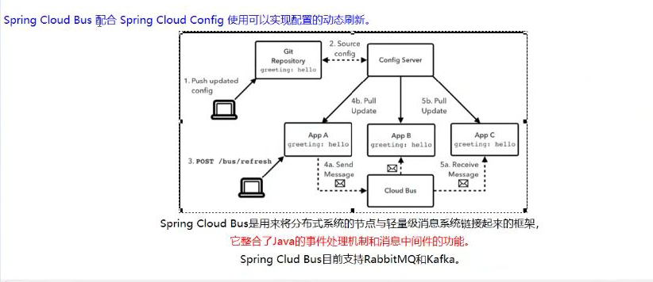
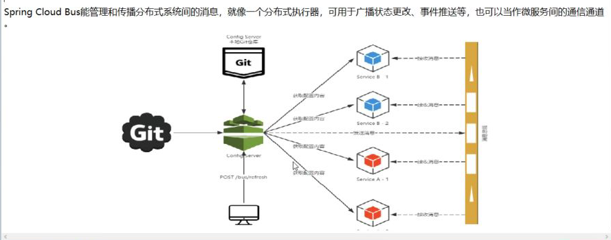
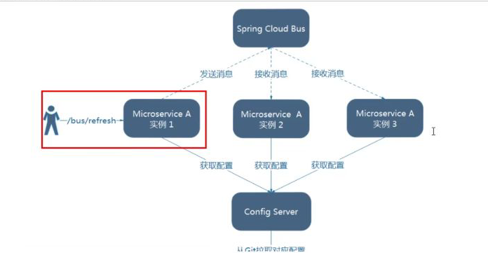
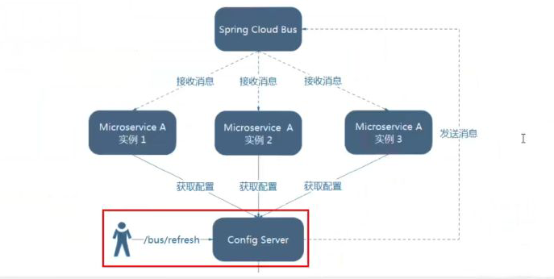

## 是什么

Bus支持两种消息代理：RabbitMQ和Kafka








**什么是总线**
在微服务架构的系统中，通常会使用竖量级的消息代理来构建一个共用的消息主题， 井让系统中所有微服务实例都连接上来。由于该主题中产生的消
息会被所有实例监听和消费，所以称它为消息总线。在总线上的各个实例，都可以方便地广播-些需要让其他连接在该主题 上的实例都知道的消息。

**基本原理**
ConfigClient实例都监听MQ中同一个topic(默认是springCloudBus)。当-个服务刷新数据的时候，它会把这个信息放入到Topic中,这样其它监听
同一Topic的服务就能得到通知，然后去更新自身的配置。


## 设计思想

1、利用消息总线触发一个客户端/bus/refresh,而刷新所有客户端的配置




2、利用消息总线触发一个服务端ConfigServer的/bus/refresh断电，而刷新客户端配置




①中打破了微服务职责单一性，因为微服务本身是业务模块，不应当担任刷新的职责

破坏了微服务各个节点的对等性

有一定局限性，如：微服务迁移，网络地址会发生变化


## Config服务端修改

```yml
server:
  port: 3344

spring:
  application:
    name: cloud-config-center
  cloud:
    config:
      server:
        git:
          uri: https://github.com/MrChengs1997/springcloud-config.git
          search-paths:
            - spring-config
      label: master
  rabbitmq:
    host: 192.168.199.116
    port: 5672
    username: guest
    password: guest

# 暴露bus刷新配置的端点
management:
  endpoints:
    web:
      exposure:
        include: "bus-refresh"
eureka:
  client:
    service-url:
      defaultZone: http://eureka7001.com:7001/eureka
```


## 客户端

修改cloud-config-client-3355配置文件

```YML

server:
  port: 3355

spring:
  application:
    name: config-client
  cloud:
    config:
      label: master # 分支名称
      name: config #配置文件名称
      profile: dev # 读取的后缀，上述三个综合，为master分支上的config-dev.yml的配置文件被读取，http://localhost:3344:3344/master/config-dev.yml
      uri: http://localhost:3344/ #配置中心的地址
  rabbitmq: #rabbitmq相关配置，15672是web管理端口，5672是mq访问端口
    port: 15672
    host: 192.168.199.116
    username: guest
    password: guest


eureka:
  client:
    service-url:
      defaultZone: http://eureka7001.com:7001/eureka

management:
  endpoints:
    web:
      exposure:
        include: "*"
```


## 新建客户端

```yml
server:
  port: 3366

spring:
  application:
    name: config-client
  cloud:
    config:
      label: master # 分支名称
      name: config #配置文件名称
      profile: dev # 读取的后缀，上述三个综合，为master分支上的config-dev.yml的配置文件被读取，http://config-3344.com:3344/master/config-dev.yml
      uri: http://localhost:3344 #配置中心的地址

eureka:
  client:
    service-url:
      defaultZone: http://eureka7001.com:7001/eureka

management:
  endpoints:
    web:
      exposure:
        include: "*"
```


在git修改之后执行命令进行刷新

curl -X POST "http://localhost:3344/actuator/bus-refresh"


