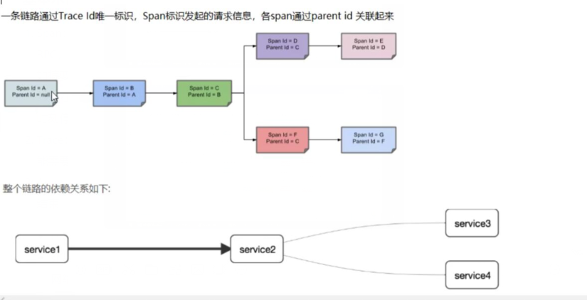
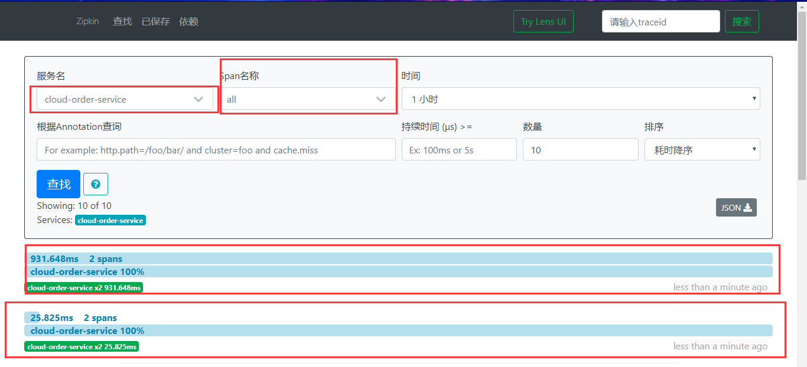

## 概述

| 在微服务框架中，一个由客户端发起的请求在后端系统中会经过多个不同的的服务节点调用来协同产生最后的请求结果,每一 个前段
请求都会形成一条复杂的分布式服务调用链路， 链路中的任何1环出现高延时或错误都会引起整个请求最后的失败。


微服务链路追踪

在分布式系统中提供了一套追踪解决方案，并且兼容支持了zipkin


```
zipkin-server-2.12.9-exec.jar
```

下载地址：https://dl.bintray.com/openzipkin/maven/io/zipkin/java/zipkin-server/


启动：

```java
D:>java -jar zipkin-server-2.12.9-exec.jar
                                    ********
                                  **        **
                                 *            *
                                **            **
                                **            **
                                 **          **
                                  **        **
                                    ********
                                      ****
                                      ****
        ****                          ****
     ******                           ****                                 ***
  ****************************************************************************
    *******                           ****                                 ***
        ****                          ****
                                       **
                                       **


             *****      **     *****     ** **       **     **   **
               **       **     **  *     ***         **     **** **
              **        **     *****     ****        **     **  ***
             ******     **     **        **  **      **     **   **

:: Powered by Spring Boot ::         (v2.1.4.RELEASE)

2020-04-02 20:54:16.660  INFO 14612 --- [           main] z.s.ZipkinServer                         : Starting ZipkinServer on DESKTOP-SHRMQH1 with PID 14612 (XXXXzipkin-server-2.12.9-exec.jar started by ccrr in D:\Tools4\zipkin)
.....
```


访问：http://localhost:9411/zipkin/


## 关键字




https://www.jianshu.com/p/f177a5e2917f


**Span**：基本工作单元，例如，在一个新建的span中发送一个RPC等同于发送一个回应请求给RPC，span通过一个64位ID唯一标识，trace以另一个64位ID表示，span还有其他数据信息，比如摘要、时间戳事件、关键值注释(tags)、span的ID、以及进度ID(通常是IP地址)
 span在不断的启动和停止，同时记录了时间信息，当你创建了一个span，你必须在未来的某个时刻停止它。

**Trace**：一系列spans组成的一个树状结构，例如，如果你正在跑一个分布式大数据工程，你可能需要创建一个trace。

**Annotation**：用来及时记录一个事件的存在，一些核心annotations用来定义一个请求的开始和结束


## 测试

cloud-provider-payment8001

```xml
        <!--包含了sleuth+zipkin-->
        <dependency>
            <groupId>org.springframework.cloud</groupId>
            <artifactId>spring-cloud-starter-zipkin</artifactId>
        </dependency>

```


```yml
spring:
  application:
    name: cloud-payment-service
  datasource:
    # 当前数据源操作类型
    type: com.alibaba.druid.pool.DruidDataSource
    # mysql驱动类
    driver-class-name: com.mysql.jdbc.Driver
    url: jdbc:mysql://localhost:3307/db2019?useUnicode=true&characterEncoding=UTF-8&useSSL=false&serverTimezone=GMT%2B8
    username: root
    password: 123456
  cloud:
    inetutils:
      timeout-seconds: 10
  zipkin:
    base-url: http://localhost:9411
  sleuth:
    sampler:
      probability: 1  #采样率值介于0-1之间，1则会全部采集
```


```java
    @GetMapping("/payment/zipkin")
    public String paymentZipkin(){
        return "zipkin";
    }
```


cloud-comsumer-order80

```
       <dependency>
            <groupId>org.springframework.cloud</groupId>
            <artifactId>spring-cloud-starter-zipkin</artifactId>
        </dependency>
```


```
spring:
  application:
    name: cloud-order-service
  zipkin:
    base-url: http://localhost:9411
  sleuth:
    sampler:
      probability: 1
```


```
    @GetMapping("/consumer/payment/zipkin")
    public String paymentZipkin(){
        return restTemplate.getForObject(PAYMRNT_URL +"/payment/zipkin",String.class);
    }

```


调用：http://localhost/consumer/payment/zipkin




