## Nacos

Naming Configuratiion Service


易于构建云原生应用的动态服务发现、配置和服务管理平台


地址：https://nacos.io/zh-cn/

git： https://github.com/alibaba/nacos

学习文档地址：https://spring-cloud-alibaba-group.github.io/github-pages/greenwich/spring-cloud-alibaba.html


## 不同注册中心

| 服务注册于发现 | CAP模型 | 控制台管理 | 社区活跃 |
| -------------- | ------- | ---------- | -------- |
| Eureka         | AP      | √          | 低       |
| Zookeeper      | CP      | ×          | 中       |
| Consul         | CP      | √          | 高       |
| Nacos          | AP      | √          | 高       |


支持AP和CP的切换

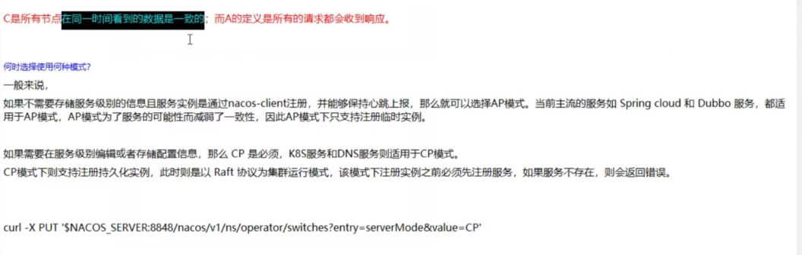


## nacos安装

地址：https://github.com/alibaba/nacos/releases/tag/1.1.4


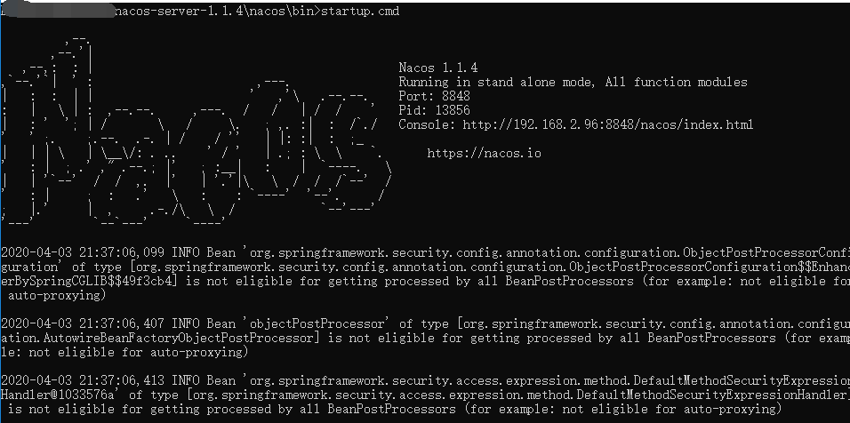

访问地址：http://localhost:8848/nacos/#/login


## 服务提供者

pom

```xml
 <dependencies>
        <dependency>
            <groupId>com.alibaba.cloud</groupId>
            <artifactId>spring-cloud-starter-alibaba-nacos-discovery</artifactId>
        </dependency>
        <dependency>
            <groupId>org.springframework.boot</groupId>
            <artifactId>spring-boot-starter-web</artifactId>
        </dependency>
        <dependency>
            <groupId>org.springframework.boot</groupId>
            <artifactId>spring-boot-starter-actuator</artifactId>
        </dependency>
        <dependency>
            <groupId>org.projectlombok</groupId>
            <artifactId>lombok</artifactId>
            <optional>true</optional>
        </dependency>
        <dependency>
            <groupId>org.springframework.boot</groupId>
            <artifactId>spring-boot-starter-test</artifactId>
            <scope>test</scope>
        </dependency>

        <dependency>
            <groupId>junit</groupId>
            <artifactId>junit</artifactId>
        </dependency>
    </dependencies>
```


配置文件

```yml
server:
  port: 9001

spring:
  application:
    name: nacos-payment-provider
  cloud:
    nacos:
      discovery:
        server-addr: localhost:8848

management:
  endpoints:
    web:
      exposure:
        include: "*"
```


启动类

```java
@EnableDiscoveryClient
@SpringBootApplication
public class PaymentMain9001 {
    public static void main(String[] args) {
      SpringApplication.run(PaymentMain9001.class,args);
    }
}
```


controller1

```java
@RestController
public class PaymentController {

    @Value("${server.port}")
    private String serverPort;

    @GetMapping("/payment/nacos/{id}")
    public String getPayment(@PathVariable("id") Integer id){
        return "nacos register, serverport=" + serverPort + "\t id:" + id;
    }
}
```


测试:

localhost:9001/payment/nacos/1

nacos register, serverport=9001 id:1

http://localhost:9002/payment/nacos/1

nacos register, serverport=9002 id:1


## 消费者

pom

```xml
  <dependencies>
        <dependency>
            <groupId>com.alibaba.cloud</groupId>
            <artifactId>spring-cloud-starter-alibaba-nacos-discovery</artifactId>
        </dependency>
        <dependency>
            <groupId>org.springframework.boot</groupId>
            <artifactId>spring-boot-starter-web</artifactId>
        </dependency>
        <dependency>
            <groupId>org.springframework.boot</groupId>
            <artifactId>spring-boot-starter-actuator</artifactId>
        </dependency>
        <dependency>
            <groupId>org.projectlombok</groupId>
            <artifactId>lombok</artifactId>
            <optional>true</optional>
        </dependency>
        <dependency>
            <groupId>org.springframework.boot</groupId>
            <artifactId>spring-boot-starter-test</artifactId>
            <scope>test</scope>
        </dependency>
    </dependencies>

```


yml

```yml
server:
  port: 83

spring:
  application:
    name: nacos-order-consumer
  cloud:
    nacos:
      discovery:
        server-addr: localhost:8848

#消费者将要去访问的微服务名称（注册成功进nacos的微服务提供者）
service-url:
  nacos-user-service: http://nacos-payment-provider
```


启动类

```java
/**
 * @author ccrr
 */
@SpringBootApplication
@EnableDiscoveryClient
public class OrderMain83 {
    public static void main(String[] args) {
        SpringApplication.run(OrderMain83.class, args);
    }
}

```


配置类

```java
@Configuration
public class ApplicationContextConfig {

    @Bean
    @LoadBalanced
    public RestTemplate getRestTemplate(){
        return new RestTemplate();
    }

}
```


controller

```java
@RestController
@Slf4j
public class OrderNacosController {

    @Resource
    private RestTemplate restTemplate;

    @Value("${service-url.nacos-user-service}")
    private String serverUrl;

    @GetMapping("/consumer/payment/nacos/{id}")
    public String paymentInfo(@PathVariable("id") Integer id){
        return restTemplate.getForObject(serverUrl + "/payment/nacos/" + id, String.class);
    }

}
```


测试：

http://localhost:83/consumer/payment/nacos/1

nacos register, serverport=9002 id:1

nacos register, serverport=9001 id:1

nacos自带负载均衡


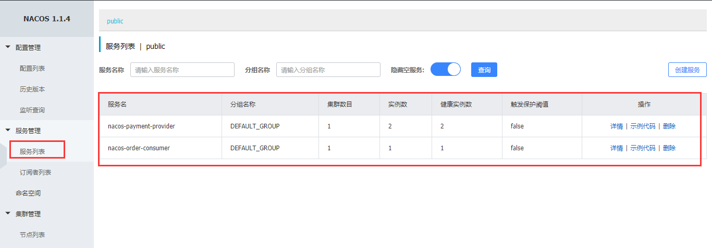


## nacos作为配置中心

#### 新建工程

cloudalibaba-config-nacos-client3377

bootstrap.yml

```yml
server:
  port: 3377
spring:
  application:
    name: nacos-config-client
  cloud:
    nacos:
      discovery:
        server-addr: localhost:8848 # 注册中心
      config:
        server-addr: localhost:8848 # 配置中心
        file-extension: yaml  # 这里指定的文件格式需要和nacos上新建的配置文件后缀相同，否则读不到
```


application.yml

```yml
spring:
  profiles:
    active: dev # 开发环境

```


启动类

```java
@SpringBootApplication
@EnableDiscoveryClient
public class NacosConfigClientMain3377 {

    public static void main(String[] args) {
        SpringApplication.run(NacosConfigClientMain3377.class,args);
    }
}ja
```


controller

```java
@RestController
@RefreshScope // 支持nacos的动态刷新
public class ConfigClientController {

    @Value(value = "${config.info}")
    private String configInfo;

    @GetMapping("/config/info")
    public String getConfigInfo(){
        return configInfo;
    }
}
```


#### 配置中心

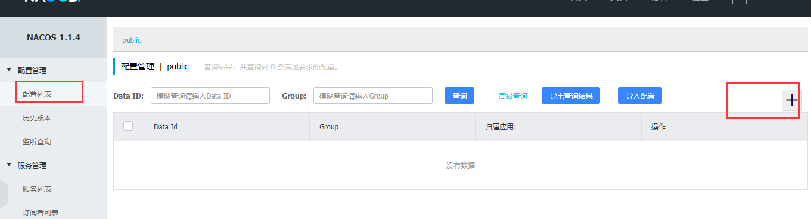


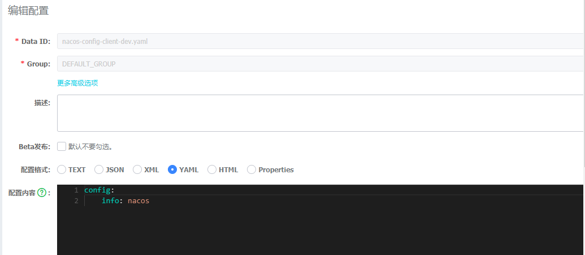


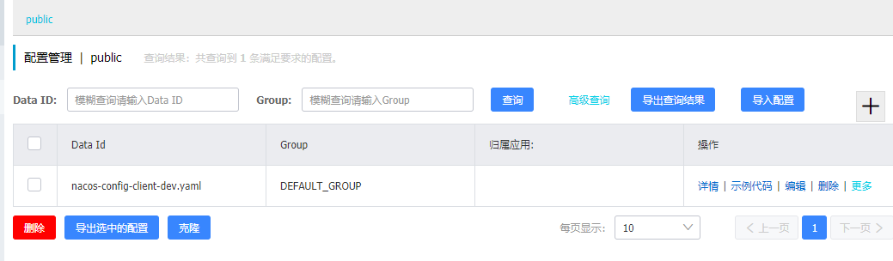


#### 测试

http://localhost:3377/config/info

nacos


## 加载配置


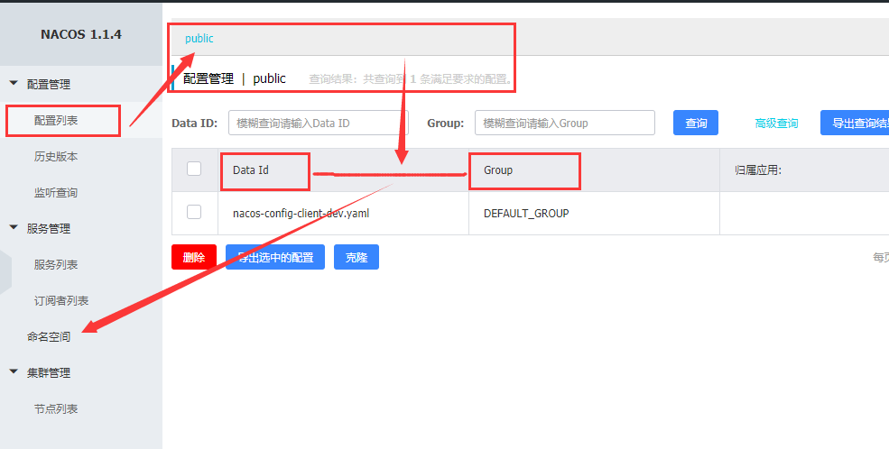


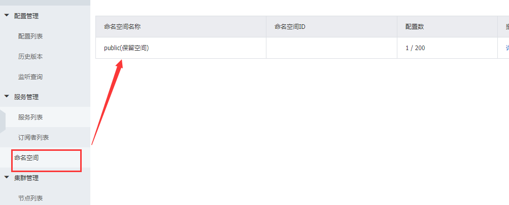


namespace + Group + Data ID

三者之间的关系


Nacos默认的命名空间是public, Namespace主要用来实现隔离。
比方说我们现在有3三个环境:开发、测试、生产环境,我们就可以创建三个Namespace, 不同的Namespace之间是隔离的。
Group默认是DEFAULT_ GROUP, Group可以把不同的微服务划分到同一个分组里面去

Service就是微服务;一个Service可以包含多个Cluster (集群)，Nacos默认Quster是DEFAULT, Cluster是对指定微服务的一个虚拟划分。

比方说为了容灾,将Service微服务分别部署在了杭州机房和州机房,
这时就可以给杭州机房的Service微服务起一个集群名称 (HZ) ，给广州机房的Service微服务起一 个集群名称(GZ) ，还可以尽量让同一个机房的微服务互相调用，以提升性能。
最后是Instance,就是微服务的实例。


#### DataId加载配置

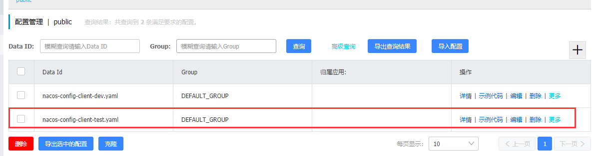


```yml
spring:
  profiles:
    #active: dev # 开发环境
    active: test # 测试环境

```

http://localhost:3377/config/info

nacos-test version = 2


#### Group加载配置


group:DEV_GROUP

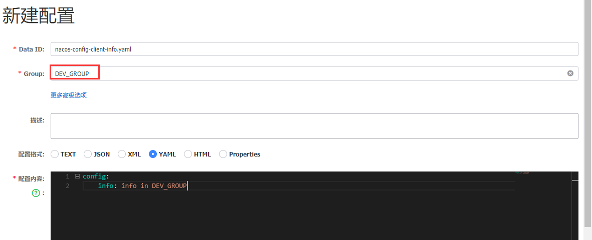


group:TEST_GROUP

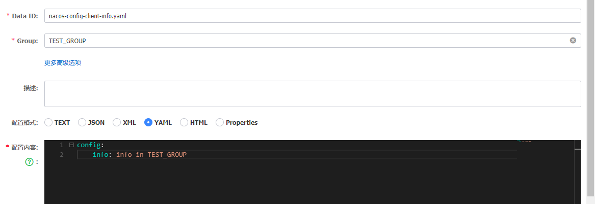


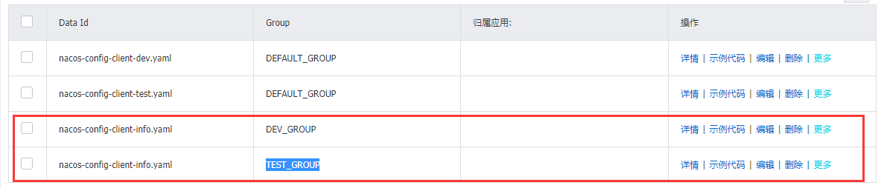


application.yml

```yml
spring:
  profiles:
    #active: dev # 开发环境
    active: info # 测试环境
```


bootstrap.yml

```yml
server:
  port: 3377
spring:
  application:
    name: nacos-config-client
  cloud:
    nacos:
      discovery:
        server-addr: localhost:8848 # 注册中心
      config:
        server-addr: localhost:8848 # 配置中心
        file-extension: yaml  # 这里指定的文件格式需要和nacos上新建的配置文件后缀相同，否则读不到
        group: TEST_GROUP
```


http://localhost:3377/config/info

info in TEST_GROUP


#### namespace加载配置

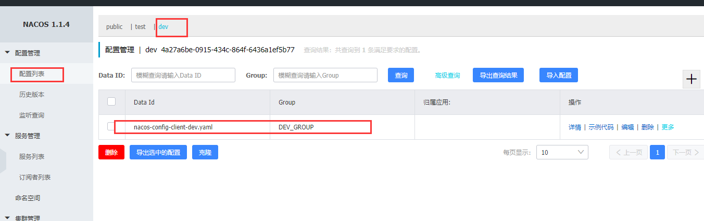


```yml
spring:
  profiles:
    active: dev # 开发环境
    #active: info # 测试环境

```


```yml
server:
  port: 3377
spring:
  application:
    name: nacos-config-client
  cloud:
    nacos:
      discovery:
        server-addr: localhost:8848 # 注册中心
      config:
        server-addr: localhost:8848 # 配置中心
        file-extension: yaml  # 这里指定的文件格式需要和nacos上新建的配置文件后缀相同，否则读不到
        group: DEV_GROUP
        namespace: 4a27a6be-0915-434c-864f-6436a1ef5b77
```

http://localhost:3377/config/info

namespace dev


## 集群和持久化

https://nacos.io/zh-cn/docs/deployment.html


#### windows

Nacos自带是嵌入式数据库derby

在配置集群时需要进行切换到mysql（目前仅支持mysql）


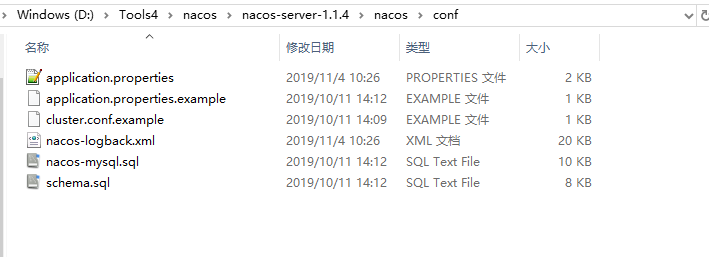

nacos-mysql.sql

```sql
/******************************************/
/*   数据库全名 = nacos_config   */
/*   表名称 = config_info   */
/******************************************/
CREATE TABLE `config_info` (
  `id` bigint(20) NOT NULL AUTO_INCREMENT COMMENT 'id',
  `data_id` varchar(255) NOT NULL COMMENT 'data_id',
  `group_id` varchar(255) DEFAULT NULL,
  `content` longtext NOT NULL COMMENT 'content',
  `md5` varchar(32) DEFAULT NULL COMMENT 'md5',
  `gmt_create` datetime NOT NULL DEFAULT '2010-05-05 00:00:00' COMMENT '创建时间',
  `gmt_modified` datetime NOT NULL DEFAULT '2010-05-05 00:00:00' COMMENT '修改时间',
  `src_user` text COMMENT 'source user',
  `src_ip` varchar(20) DEFAULT NULL COMMENT 'source ip',
  `app_name` varchar(128) DEFAULT NULL,
  `tenant_id` varchar(128) DEFAULT '' COMMENT '租户字段',
  `c_desc` varchar(256) DEFAULT NULL,
  `c_use` varchar(64) DEFAULT NULL,
  `effect` varchar(64) DEFAULT NULL,
  `type` varchar(64) DEFAULT NULL,
  `c_schema` text,
  PRIMARY KEY (`id`),
  UNIQUE KEY `uk_configinfo_datagrouptenant` (`data_id`,`group_id`,`tenant_id`)
) ENGINE=InnoDB DEFAULT CHARSET=utf8 COLLATE=utf8_bin COMMENT='config_info';

/******************************************/
/*   数据库全名 = nacos_config   */
/*   表名称 = config_info_aggr   */
/******************************************/
CREATE TABLE `config_info_aggr` (
  `id` bigint(20) NOT NULL AUTO_INCREMENT COMMENT 'id',
  `data_id` varchar(255) NOT NULL COMMENT 'data_id',
  `group_id` varchar(255) NOT NULL COMMENT 'group_id',
  `datum_id` varchar(255) NOT NULL COMMENT 'datum_id',
  `content` longtext NOT NULL COMMENT '内容',
  `gmt_modified` datetime NOT NULL COMMENT '修改时间',
  `app_name` varchar(128) DEFAULT NULL,
  `tenant_id` varchar(128) DEFAULT '' COMMENT '租户字段',
  PRIMARY KEY (`id`),
  UNIQUE KEY `uk_configinfoaggr_datagrouptenantdatum` (`data_id`,`group_id`,`tenant_id`,`datum_id`)
) ENGINE=InnoDB DEFAULT CHARSET=utf8 COLLATE=utf8_bin COMMENT='增加租户字段';


/******************************************/
/*   数据库全名 = nacos_config   */
/*   表名称 = config_info_beta   */
/******************************************/
CREATE TABLE `config_info_beta` (
  `id` bigint(20) NOT NULL AUTO_INCREMENT COMMENT 'id',
  `data_id` varchar(255) NOT NULL COMMENT 'data_id',
  `group_id` varchar(128) NOT NULL COMMENT 'group_id',
  `app_name` varchar(128) DEFAULT NULL COMMENT 'app_name',
  `content` longtext NOT NULL COMMENT 'content',
  `beta_ips` varchar(1024) DEFAULT NULL COMMENT 'betaIps',
  `md5` varchar(32) DEFAULT NULL COMMENT 'md5',
  `gmt_create` datetime NOT NULL DEFAULT '2010-05-05 00:00:00' COMMENT '创建时间',
  `gmt_modified` datetime NOT NULL DEFAULT '2010-05-05 00:00:00' COMMENT '修改时间',
  `src_user` text COMMENT 'source user',
  `src_ip` varchar(20) DEFAULT NULL COMMENT 'source ip',
  `tenant_id` varchar(128) DEFAULT '' COMMENT '租户字段',
  PRIMARY KEY (`id`),
  UNIQUE KEY `uk_configinfobeta_datagrouptenant` (`data_id`,`group_id`,`tenant_id`)
) ENGINE=InnoDB DEFAULT CHARSET=utf8 COLLATE=utf8_bin COMMENT='config_info_beta';

/******************************************/
/*   数据库全名 = nacos_config   */
/*   表名称 = config_info_tag   */
/******************************************/
CREATE TABLE `config_info_tag` (
  `id` bigint(20) NOT NULL AUTO_INCREMENT COMMENT 'id',
  `data_id` varchar(255) NOT NULL COMMENT 'data_id',
  `group_id` varchar(128) NOT NULL COMMENT 'group_id',
  `tenant_id` varchar(128) DEFAULT '' COMMENT 'tenant_id',
  `tag_id` varchar(128) NOT NULL COMMENT 'tag_id',
  `app_name` varchar(128) DEFAULT NULL COMMENT 'app_name',
  `content` longtext NOT NULL COMMENT 'content',
  `md5` varchar(32) DEFAULT NULL COMMENT 'md5',
  `gmt_create` datetime NOT NULL DEFAULT '2010-05-05 00:00:00' COMMENT '创建时间',
  `gmt_modified` datetime NOT NULL DEFAULT '2010-05-05 00:00:00' COMMENT '修改时间',
  `src_user` text COMMENT 'source user',
  `src_ip` varchar(20) DEFAULT NULL COMMENT 'source ip',
  PRIMARY KEY (`id`),
  UNIQUE KEY `uk_configinfotag_datagrouptenanttag` (`data_id`,`group_id`,`tenant_id`,`tag_id`)
) ENGINE=InnoDB DEFAULT CHARSET=utf8 COLLATE=utf8_bin COMMENT='config_info_tag';

/******************************************/
/*   数据库全名 = nacos_config   */
/*   表名称 = config_tags_relation   */
/******************************************/
CREATE TABLE `config_tags_relation` (
  `id` bigint(20) NOT NULL COMMENT 'id',
  `tag_name` varchar(128) NOT NULL COMMENT 'tag_name',
  `tag_type` varchar(64) DEFAULT NULL COMMENT 'tag_type',
  `data_id` varchar(255) NOT NULL COMMENT 'data_id',
  `group_id` varchar(128) NOT NULL COMMENT 'group_id',
  `tenant_id` varchar(128) DEFAULT '' COMMENT 'tenant_id',
  `nid` bigint(20) NOT NULL AUTO_INCREMENT,
  PRIMARY KEY (`nid`),
  UNIQUE KEY `uk_configtagrelation_configidtag` (`id`,`tag_name`,`tag_type`),
  KEY `idx_tenant_id` (`tenant_id`)
) ENGINE=InnoDB DEFAULT CHARSET=utf8 COLLATE=utf8_bin COMMENT='config_tag_relation';

/******************************************/
/*   数据库全名 = nacos_config   */
/*   表名称 = group_capacity   */
/******************************************/
CREATE TABLE `group_capacity` (
  `id` bigint(20) unsigned NOT NULL AUTO_INCREMENT COMMENT '主键ID',
  `group_id` varchar(128) NOT NULL DEFAULT '' COMMENT 'Group ID，空字符表示整个集群',
  `quota` int(10) unsigned NOT NULL DEFAULT '0' COMMENT '配额，0表示使用默认值',
  `usage` int(10) unsigned NOT NULL DEFAULT '0' COMMENT '使用量',
  `max_size` int(10) unsigned NOT NULL DEFAULT '0' COMMENT '单个配置大小上限，单位为字节，0表示使用默认值',
  `max_aggr_count` int(10) unsigned NOT NULL DEFAULT '0' COMMENT '聚合子配置最大个数，，0表示使用默认值',
  `max_aggr_size` int(10) unsigned NOT NULL DEFAULT '0' COMMENT '单个聚合数据的子配置大小上限，单位为字节，0表示使用默认值',
  `max_history_count` int(10) unsigned NOT NULL DEFAULT '0' COMMENT '最大变更历史数量',
  `gmt_create` datetime NOT NULL DEFAULT '2010-05-05 00:00:00' COMMENT '创建时间',
  `gmt_modified` datetime NOT NULL DEFAULT '2010-05-05 00:00:00' COMMENT '修改时间',
  PRIMARY KEY (`id`),
  UNIQUE KEY `uk_group_id` (`group_id`)
) ENGINE=InnoDB DEFAULT CHARSET=utf8 COLLATE=utf8_bin COMMENT='集群、各Group容量信息表';

/******************************************/
/*   数据库全名 = nacos_config   */
/*   表名称 = his_config_info   */
/******************************************/
CREATE TABLE `his_config_info` (
  `id` bigint(64) unsigned NOT NULL,
  `nid` bigint(20) unsigned NOT NULL AUTO_INCREMENT,
  `data_id` varchar(255) NOT NULL,
  `group_id` varchar(128) NOT NULL,
  `app_name` varchar(128) DEFAULT NULL COMMENT 'app_name',
  `content` longtext NOT NULL,
  `md5` varchar(32) DEFAULT NULL,
  `gmt_create` datetime NOT NULL DEFAULT '2010-05-05 00:00:00',
  `gmt_modified` datetime NOT NULL DEFAULT '2010-05-05 00:00:00',
  `src_user` text,
  `src_ip` varchar(20) DEFAULT NULL,
  `op_type` char(10) DEFAULT NULL,
  `tenant_id` varchar(128) DEFAULT '' COMMENT '租户字段',
  PRIMARY KEY (`nid`),
  KEY `idx_gmt_create` (`gmt_create`),
  KEY `idx_gmt_modified` (`gmt_modified`),
  KEY `idx_did` (`data_id`)
) ENGINE=InnoDB DEFAULT CHARSET=utf8 COLLATE=utf8_bin COMMENT='多租户改造';


/******************************************/
/*   数据库全名 = nacos_config   */
/*   表名称 = tenant_capacity   */
/******************************************/
CREATE TABLE `tenant_capacity` (
  `id` bigint(20) unsigned NOT NULL AUTO_INCREMENT COMMENT '主键ID',
  `tenant_id` varchar(128) NOT NULL DEFAULT '' COMMENT 'Tenant ID',
  `quota` int(10) unsigned NOT NULL DEFAULT '0' COMMENT '配额，0表示使用默认值',
  `usage` int(10) unsigned NOT NULL DEFAULT '0' COMMENT '使用量',
  `max_size` int(10) unsigned NOT NULL DEFAULT '0' COMMENT '单个配置大小上限，单位为字节，0表示使用默认值',
  `max_aggr_count` int(10) unsigned NOT NULL DEFAULT '0' COMMENT '聚合子配置最大个数',
  `max_aggr_size` int(10) unsigned NOT NULL DEFAULT '0' COMMENT '单个聚合数据的子配置大小上限，单位为字节，0表示使用默认值',
  `max_history_count` int(10) unsigned NOT NULL DEFAULT '0' COMMENT '最大变更历史数量',
  `gmt_create` datetime NOT NULL DEFAULT '2010-05-05 00:00:00' COMMENT '创建时间',
  `gmt_modified` datetime NOT NULL DEFAULT '2010-05-05 00:00:00' COMMENT '修改时间',
  PRIMARY KEY (`id`),
  UNIQUE KEY `uk_tenant_id` (`tenant_id`)
) ENGINE=InnoDB DEFAULT CHARSET=utf8 COLLATE=utf8_bin COMMENT='租户容量信息表';


CREATE TABLE `tenant_info` (
  `id` bigint(20) NOT NULL AUTO_INCREMENT COMMENT 'id',
  `kp` varchar(128) NOT NULL COMMENT 'kp',
  `tenant_id` varchar(128) default '' COMMENT 'tenant_id',
  `tenant_name` varchar(128) default '' COMMENT 'tenant_name',
  `tenant_desc` varchar(256) DEFAULT NULL COMMENT 'tenant_desc',
  `create_source` varchar(32) DEFAULT NULL COMMENT 'create_source',
  `gmt_create` bigint(20) NOT NULL COMMENT '创建时间',
  `gmt_modified` bigint(20) NOT NULL COMMENT '修改时间',
  PRIMARY KEY (`id`),
  UNIQUE KEY `uk_tenant_info_kptenantid` (`kp`,`tenant_id`),
  KEY `idx_tenant_id` (`tenant_id`)
) ENGINE=InnoDB DEFAULT CHARSET=utf8 COLLATE=utf8_bin COMMENT='tenant_info';

CREATE TABLE users (
	username varchar(50) NOT NULL PRIMARY KEY,
	password varchar(500) NOT NULL,
	enabled boolean NOT NULL
);

CREATE TABLE roles (
	username varchar(50) NOT NULL,
	role varchar(50) NOT NULL
);

INSERT INTO users (username, password, enabled) VALUES ('nacos', '$2a$10$EuWPZHzz32dJN7jexM34MOeYirDdFAZm2kuWj7VEOJhhZkDrxfvUu', TRUE);

INSERT INTO roles (username, role) VALUES ('nacos', 'ROLE_ADMIN');

```


在该目录下找到application.properties文件

```properties
# spring

server.contextPath=/nacos
server.servlet.contextPath=/nacos
server.port=8848

# nacos.cmdb.dumpTaskInterval=3600
# nacos.cmdb.eventTaskInterval=10
# nacos.cmdb.labelTaskInterval=300
# nacos.cmdb.loadDataAtStart=false


# metrics for prometheus
#management.endpoints.web.exposure.include=*

# metrics for elastic search
management.metrics.export.elastic.enabled=false
#management.metrics.export.elastic.host=http://localhost:9200

# metrics for influx
management.metrics.export.influx.enabled=false
#management.metrics.export.influx.db=springboot
#management.metrics.export.influx.uri=http://localhost:8086
#management.metrics.export.influx.auto-create-db=true
#management.metrics.export.influx.consistency=one
#management.metrics.export.influx.compressed=true

server.tomcat.accesslog.enabled=true
server.tomcat.accesslog.pattern=%h %l %u %t "%r" %s %b %D %{User-Agent}i
# default current work dir
server.tomcat.basedir=

## spring security config
### turn off security
#spring.security.enabled=false
#management.security=false
#security.basic.enabled=false
#nacos.security.ignore.urls=/**

nacos.security.ignore.urls=/,/**/*.css,/**/*.js,/**/*.html,/**/*.map,/**/*.svg,/**/*.png,/**/*.ico,/console-fe/public/**,/v1/auth/login,/v1/console/health/**,/v1/cs/**,/v1/ns/**,/v1/cmdb/**,/actuator/**,/v1/console/server/**

# nacos.naming.distro.taskDispatchPeriod=200
# nacos.naming.distro.batchSyncKeyCount=1000
# nacos.naming.distro.syncRetryDelay=5000
# nacos.naming.data.warmup=true
# nacos.naming.expireInstance=true

nacos.istio.mcp.server.enabled=false

```


https://nacos.io/zh-cn/docs/deployment.html

观察配置手册

- 1.安装数据库，版本要求：5.6.5+
- 2.初始化mysql数据库，数据库初始化文件：nacos-mysql.sql
- 3.修改conf/application.properties文件，增加支持mysql数据源配置（目前只支持mysql），添加mysql数据源的url、用户名和密码。

添加

```properties
spring.datasource.platform=mysql

db.num=1
db.url.0=jdbc:mysql://11.162.196.16:3306/nacos_devtest?characterEncoding=utf8&connectTimeout=1000&socketTimeout=3000&autoReconnect=true
db.user=nacos_devtest
db.password=youdontknow
```


重启就会把数据源从derby切换到mysql

新建配置


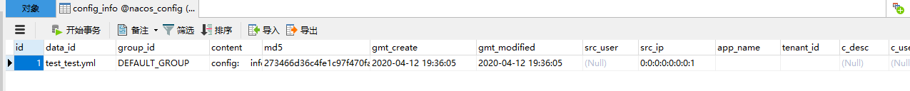


#### linux

application文件

```properties
spring.datasource.platform=mysql

db.num=1
db.url.0=jdbc:mysql://192.168.199.120:3306/nacos_config?characterEncoding=utf8&connectTimeout=1000&socketTimeout=3000&autoReconnect=true
db.user=root
db.password=1234

```

cluster.conf

```conf

192.168.199.120
192.168.199.186
192.168.199.149

```


配置mysql分别在不同机器上启动


配置nginx

```conf
upstream cluster{
	server 192.168.199.120:8848;
	server 192.168.199.186:8848;
	server 192.168.199.149:8848;
}
server {
    listen       1111;
    server_name  localhost;

    #charset koi8-r;
    #access_log  /var/log/nginx/host.access.log  main;

    location / {
       # root   /usr/share/nginx/html;
        #index  index.html index.htm;
	proxy_pass http://cluster;
    }

    #error_page  404              /404.html;

    # redirect server error pages to the static page /50x.html
    #
    error_page   500 502 503 504  /50x.html;
    location = /50x.html {
        root   /usr/share/nginx/html;
    }

    # proxy the PHP scripts to Apache listening on 127.0.0.1:80
    #
    #location ~ \.php$ {
    #    proxy_pass   http://127.0.0.1;
    #}

    # pass the PHP scripts to FastCGI server listening on 127.0.0.1:9000
    #
    #location ~ \.php$ {
    #    root           html;
    #    fastcgi_pass   127.0.0.1:9000;
    #    fastcgi_index  index.php;
    #    fastcgi_param  SCRIPT_FILENAME  /scripts$fastcgi_script_name;
    #    include        fastcgi_params;
    #}

    # deny access to .htaccess files, if Apache's document root
    # concurs with nginx's one
    #
    #location ~ /\.ht {
    #    deny  all;
    #}

```


启动ngnx

http://192.168.199.149:1111/nacos

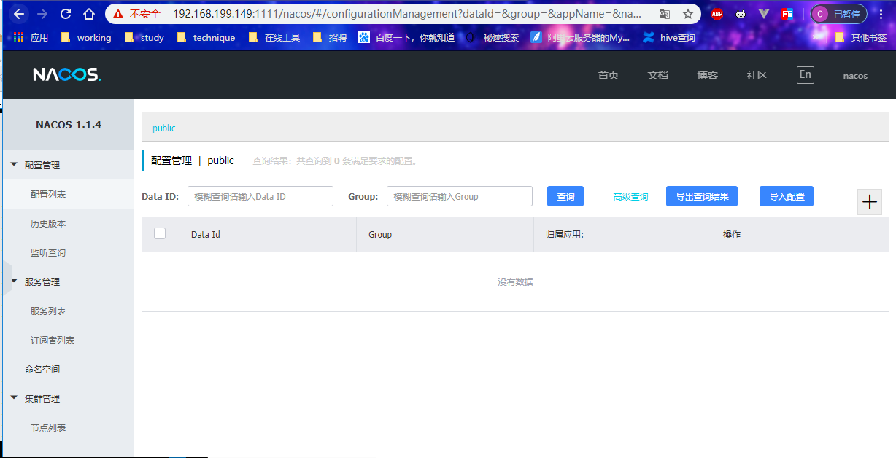


添加配置之后 

```
mysql> select * from config_info
    -> ;
+----+---------------+---------------+----------------------------+----------------------------------+---------------------+---------------------+----------+-----------------+----------+-----------+--------+-------+--------+------+----------+
| id | data_id       | group_id      | content                    | md5                              | gmt_create          | gmt_modified        | src_user | src_ip          | app_name | tenant_id | c_desc | c_use | effect | type | c_schema |
+----+---------------+---------------+----------------------------+----------------------------------+---------------------+---------------------+----------+-----------------+----------+-----------+--------+-------+--------+------+----------+
|  5 | com-test.yaml | DEFAULT_GROUP | config；
    info: werwr  | b832620465524d410ed4540226bea04b | 2020-04-15 01:54:19 | 2020-04-15 01:54:19 | NULL     | 192.168.199.149 |          |           | NULL   | NULL  | NULL   | yaml | NULL     |
+----+---------------+---------------+----------------------------+----------------------------------+---------------------+---------------------+----------+-----------------+----------+-----------+--------+-------+--------+------+----------+
1 row in set (0.00 sec)

```


代码配置文件

```yml
server:
  port: 9002

spring:
  application:
    name: nacos-payment-provider
  cloud:
    nacos:
      discovery:
        #server-addr: localhost:8848
         #换成nginx的1111端口
        server-addr: 192.168.199.149:1111

management:
  endpoints:
    web:
      exposure:
        include: "*"
```

查询注册中心

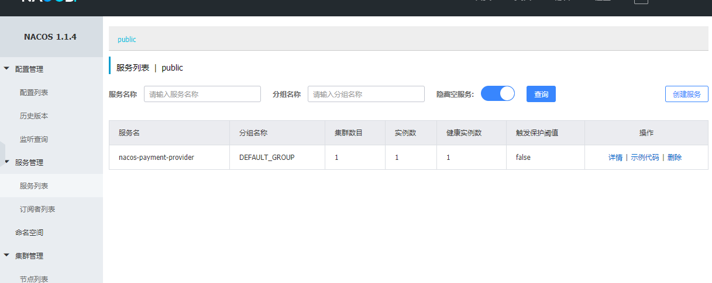