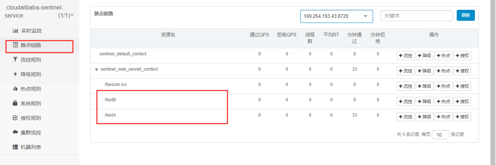

地址：[git地址及](https://github.com/alibaba/Sentinel/wiki/介绍)


下载地址：https://github.com/alibaba/Sentinel/releases


## 控制台

由两部分组成

- 后台

  核心库（java客户端）不依赖任何框架，能够运行在所有的java环境，对Dubbo/cloud等框架有很好的支持

- 前台8080

  控制台（Dashboard）基于springboot开发，打包后直接运行，不需要额外的tomcat等应用容器

  

启动命令

```
java -jar sentinel-dashboard-1.6.3.jar
```


访问管理界面

http://localhost:8080/#/login

账户密码：sentinel


## 初始化监控

### pom

```xml
 <dependencies>
        <dependency>
            <groupId>com.alibaba.cloud</groupId>
            <artifactId>spring-cloud-starter-alibaba-nacos-discovery</artifactId>
        </dependency>
        <!--     sentinel-datasource-nacos 后续持久化用   -->
        <dependency>
            <groupId>com.alibaba.csp</groupId>
            <artifactId>sentinel-datasource-nacos</artifactId>
        </dependency>
        <dependency>
            <groupId>com.alibaba.cloud</groupId>
            <artifactId>spring-cloud-starter-alibaba-sentinel</artifactId>
        </dependency>
        <dependency>
            <groupId>org.springframework.cloud</groupId>
            <artifactId>spring-cloud-starter-openfeign</artifactId>
        </dependency>
        <dependency>
            <groupId>org.springframework.boot</groupId>
            <artifactId>spring-boot-starter-web</artifactId>
        </dependency>
        <dependency>
            <groupId>org.springframework.boot</groupId>
            <artifactId>spring-boot-starter-actuator</artifactId>
        </dependency>
        <dependency>
            <groupId>org.projectlombok</groupId>
            <artifactId>lombok</artifactId>
            <optional>true</optional>
        </dependency>
        <dependency>
            <groupId>org.springframework.boot</groupId>
            <artifactId>spring-boot-starter-test</artifactId>
            <scope>test</scope>
        </dependency>
    </dependencies>
```


### yml

```yml
server:
  port: 8401
spring:
  application:
    name: cloudalibaba-sentinel-service
  cloud:
    nacos:
      discovery:
        # Nacos服务注册中心地址
        server-addr: localhost:8848
    sentinel:
      transport:
        # sentinel dashboard 地址
        dashboard: localhost:8080
        # 默认为8719，如果被占用会自动+1，直到找到为止
        port: 8719
      # 流控规则持久化到nacos
#      datasource:
#        dsl:
#          nacos:
#            server-addr: localhost:8848
#            data-id: ${spring.application.name}
#            group-id: DEFAULT_GROUP
#            data-type: json
#            rule-type: flow
management:
  endpoints:
    web:
      exposure:
        include: "*"
```


### q启动类

```java

import org.springframework.boot.SpringApplication;
import org.springframework.boot.autoconfigure.SpringBootApplication;
import org.springframework.cloud.client.discovery.EnableDiscoveryClient;

@SpringBootApplication
@EnableDiscoveryClient
public class MainApp8401 {

    public static void main(String[] args) {
        SpringApplication.run(MainApp8401.class, args);
    }
}

```


### controller

```java
import lombok.extern.slf4j.Slf4j;
import org.springframework.web.bind.annotation.GetMapping;
import org.springframework.web.bind.annotation.RestController;

@RestController
@Slf4j
public class FlowController {

    @GetMapping("/testA")
    public String testA(){
        return "testA-----";
    }

    @GetMapping("/testB")
    public String testB(){
        log.info(Thread.currentThread().getName() + "...testB ");
        return "testB   -----";
    }
}
```


sentinel是懒加载机制

需要手动进行访问之后就会出现实例

```
http://localhost:8401/testA
```


实时监控就会检测每一个访问的controller


簇点链路




## 流控规则

资源名：唯一名称，默认请求路径

针对来源：Sentinel可以针对调用者进行限流，填写微服务名，默认default（不区分来源）

阈值类型/单机阈值：

- QPS（每秒钟请求数量）：当调用该api的QPS达到阈值的时候，进行限流
- 线程数：当调用该api的线程数达到阈值的时候，进行限流

是否集群：不需要集群

流控模式：

- 直接：当api达到限流的条件直接限流
- 关联：当关联的资源达到阈值时，就限流自己
- 链路：只记录指定链路上的上的流量（指定资源从入口资源进来的流量，达到阈值，进行限流）（api级别针对来源）

流控效果：

- 快速失败：直接失败，抛异常
- warm up：根据codeFactor（冷加载因子，默认3）的值，从阈值/codeFactor，经过预热时长，才达到设置的QPS阈值
- 排队等待：匀速排队，让请求以匀速的速度通过，阈值类型必须设置QPS，否则无效


### 直接 （QPS）

添加流控方式

方式1：


方式2：


添加流控规则


查看流控规则


此时的单机阈值设置为1，一秒点一次可以通过，点多次则会触发监控

返回

```
Blocked by Sentinel (flow limiting)
```


直接调用返回的是系统设置的默认的方法

设置返回信息的数据源即用户自定义


### 直接（线程数）

线程数和QPS的区别

线程数：此时的请求已经进入请求方法，请求方法执行之后进行拦截

QPS：此时的请求并没有进入请求方法，在请求方法执行之前进行拦截


### 关联

当与A关联的资源B达到阈值之后就限流A


配置


如订单接口在执行的时候调用 支付模块

支付模块访问较大进行限流，此时订单进行回显

条件：支付模块达到阈值


此时使用线程访问/testB

在请求/testA接口

```
Blocked by Sentinel (flow limiting)
```


## 流控效果

### 直接快速失败

直接抛异常(Blocked by Sentinel (flow limiting))

源码：com.alibaba.csp.sentinel.slots.block.flow.controller.DefaultController


### 预热

公式：阈值除以coldFactor（默认为3），经过预热之后时长到达阈值

当系统长期处于低水位情况，当流量突然增加到高水位可能瞬间把系统压垮，通过‘冷启动’

让通过的流量慢慢增加，在一定时间内达到阈值上限，给冷系统一个预热时间，避免冷系统被压垮


默认coldFactor=3 即请求QPS从threshold/3开始，经过预热时长升至设定的QPS阈值


源码类：com.alibaba.csp.sentinel.slots.block.flow.controller.WarmUpController

```
 public WarmUpController(double count, int warmUpPeriodInSec) {
        construct(count, warmUpPeriodInSec, 3);
    }
```


系统初始化的阈值为10/3 = 3，即刚开始为3，5s之后阈值慢慢恢复到10


效果在访问接口的时候

会存在抛出异常的页面进行显示给用户

在经过一定的时间之后，达到阈值就能抗住对系统的压力


秒杀活动开启瞬间，会存在大量的流量涌入，有可能瞬间把系统打死，预热方式为了保护系统，可以慢慢的把流量放进来，慢慢的把阈值增长到设置的阈值


### 排队等待

匀速排队，让请求匀速通过，**阈值类型必须设置为QPS，都则无效**

设置含义：/testA每一秒一次请求，超过的话就排队等待，等到的超时时间设置20000毫秒


匀速排队会严格的控制请求通过的时间，让请求匀速通过，对应的是漏洞算法

**此时大量请求进入，会进入等待状态，在设定的阈值和时间内进行匀速通过调用**


## 降级

[https://github.com/alibaba/Sentinel/wiki/%E7%86%94%E6%96%AD%E9%99%8D%E7%BA%A7](https://github.com/alibaba/Sentinel/wiki/熔断降级)


- 平均响应时间 (`DEGRADE_GRADE_RT`)：当 1s 内持续进入 N 个请求，对应时刻的平均响应时间（秒级）均超过阈值（`count`，以 ms 为单位），那么在接下的时间窗口（`DegradeRule` 中的 `timeWindow`，以 s 为单位）之内，对这个方法的调用都会自动地熔断（抛出 `DegradeException`）。注意 Sentinel 默认统计的 RT 上限是 4900 ms，**超出此阈值的都会算作 4900 ms**，若需要变更此上限可以通过启动配置项 `-Dcsp.sentinel.statistic.max.rt=xxx` 来配置。
- 异常比例 (`DEGRADE_GRADE_EXCEPTION_RATIO`)：当资源的每秒请求量 >= N（可配置），并且每秒异常总数占通过量的比值超过阈值（`DegradeRule` 中的 `count`）之后，资源进入降级状态，即在接下的时间窗口（`DegradeRule` 中的 `timeWindow`，以 s 为单位）之内，对这个方法的调用都会自动地返回。异常比率的阈值范围是 `[0.0, 1.0]`，代表 0% - 100%。
- 异常数 (`DEGRADE_GRADE_EXCEPTION_COUNT`)：当资源近 1 分钟的异常数目超过阈值之后会进行熔断。注意由于统计时间窗口是分钟级别的，若 `timeWindow` 小于 60s，则结束熔断状态后仍可能再进入熔断状态。

​	

sentinel熔断降级会在调用链路中某个资源出现不稳定状态时（超时/异常比例升高）对这个资源进行限制

让请求快速失败，避免影响到其他资源而导致级联错误

资源进行降级之后，在借来的降级时间窗口之内，对该资源的调用都自动熔断（默认抛出DegradeException）


sentinel的断路器是没有**半开状态**


### RT


使用jemeter进行每秒进入是个请求（>5）进行调用testD接口

设置希望200ms能基本处理调用一个的任务

超过200ms没有处理完，在未来的1s时间窗口内，断路器打开微服务不可能，保险丝断电


```java
    @GetMapping("/testD")
    public String testD(){
        try {
            TimeUnit.SECONDS.sleep(1);
        } catch (InterruptedException e) {
            e.printStackTrace();
        }
        log.info("testD 测试RT");
        return "testD -----";
    }
```


调用报错

```
Blocked by Sentinel (flow limiting)
```


### 异常比例


```java
    @GetMapping("/testException")
    public String testException(){
        log.info("testException 异常比例");
        int age = 10 /0 ;
        return "testException -----";
    }
```


http://localhost:8401/testException

```
Blocked by Sentinel (flow limiting)
```

使用jemeter进行不断访问，会进行服务断电


关闭jemeter

```
Whitelabel Error Page
This application has no explicit mapping for /error, so you are seeing this as a fallback.

Sat May 02 15:38:21 CST 2020
There was an unexpected error (type=Internal Server Error, status=500).
/ by zero
```


### 异常数


http://localhost:8401/testException

访问1-5次

```
Whitelabel Error Page
This application has no explicit mapping for /error, so you are seeing this as a fallback.

Sat May 02 15:47:24 CST 2020
There was an unexpected error (type=Internal Server Error, status=500).
/ by zero
```

访问5次之后

```
Blocked by Sentinel (flow limiting)
```

会立即保护系统70s


## 热点key限流


[https://github.com/alibaba/Sentinel/wiki/%E7%83%AD%E7%82%B9%E5%8F%82%E6%95%B0%E9%99%90%E6%B5%81](https://github.com/alibaba/Sentinel/wiki/热点参数限流)


源码：com.alibaba.csp.sentinel.slots.block.BlockException


```java
  /**
     * SentinelResource:value唯一，blockHandler触发的方法
     * @param p1
     * @param p2
     * @return
     */
    @GetMapping("/testHotKey")
    @SentinelResource(value = "testHotKey", blockHandler = "dealTestHotKey")
    public String testHotKey(@RequestParam(value = "p1", required = false) String p1,
                             @RequestParam(value = "p2", required = false) String p2){
        int age = 10 /0;
        return "testHotKey -----";
    }

    public String dealTestHotKey(String p1, String p2, BlockException blockException){
        return "dealTestHotKey---------";
    }
```

http://localhost:8401/testHotKey

```
testHotKey -----
```

http://localhost:8401/testHotKey?p1=2&p2=e

```
testHotKey -----
```


资源名配置：testHotKey


效果1：

http://localhost:8401/testHotKey?p1=2

正常在一秒超过阈值 之后

```
dealTestHotKey---------
```

未超过阈值

```
testHotKey -----
```

```
@SentinelResource(value = "testHotKey", blockHandler = "dealTestHotKey")
超过阈值立马使用兜底的方法进行抛异常返回
```


效果2：

```java
 @GetMapping("/testHotKey")
   // @SentinelResource(value = "testHotKey", blockHandler = "dealTestHotKey")
    @SentinelResource(value = "testHotKey")
    public String testHotKey(@RequestParam(value = "p1", required = false) String p1,
                             @RequestParam(value = "p2", required = false) String p2){
        //int age = 10 /0;
        return "testHotKey -----";
    }
```

http://localhost:8401/testHotKey?p1=2

超过阈值之后

```
Whitelabel Error Page
This application has no explicit mapping for /error, so you are seeing this as a fallback.

Sat May 02 16:14:54 CST 2020
There was an unexpected error (type=Internal Server Error, status=500).
No message available
```


### **参数例外项**

即参数的类型在某个情况下的特殊配置

如p1 =5时的限流阈值是300

如p1 = 10的限流阈值是500


http://localhost:8401/testHotKey?p1=6

此时的阈值时100


## 系统规则

[https://github.com/alibaba/Sentinel/wiki/%E7%B3%BB%E7%BB%9F%E8%87%AA%E9%80%82%E5%BA%94%E9%99%90%E6%B5%81](https://github.com/alibaba/Sentinel/wiki/系统自适应限流)


系统保护规则是从应用级别的**入口流量进行控制**，从单台机器的 load、CPU 使用率、平均 RT、入口 QPS 和并发线程数等几个维度监控应用指标，让系统尽可能跑在最大吞吐量的同时保证系统整体的稳定性。

系统保护规则是应用整体维度的，而不是资源维度的，并且**仅对入口流量生效**。入口流量指的是进入应用的流量（`EntryType.IN`），比如 Web 服务或 Dubbo 服务端接收的请求，都属于入口流量。


- **Load 自适应**（仅对 Linux/Unix-like 机器生效）：系统的 load1 作为启发指标，进行自适应系统保护。当系统 load1 超过设定的启发值，且系统当前的并发线程数超过估算的系统容量时才会触发系统保护（BBR 阶段）。系统容量由系统的 `maxQps * minRt` 估算得出。设定参考值一般是 `CPU cores * 2.5`。
- **CPU usage**（1.5.0+ 版本）：当系统 CPU 使用率超过阈值即触发系统保护（取值范围 0.0-1.0），比较灵敏。
- **平均 RT**：当单台机器上所有入口流量的平均 RT 达到阈值即触发系统保护，单位是毫秒。
- **并发线程数**：当单台机器上所有入口流量的并发线程数达到阈值即触发系统保护。
- **入口 QPS**：当单台机器上所有入口流量的 QPS 达到阈值即触发系统保护。


## sentinelResource配置

### 资源名称限流+后续处理

**@SentinelResource(value = "byResource", blockHandler = "handleException")**


```java
  @GetMapping("/byResource")
    @SentinelResource(value = "byResource", blockHandler = "handleException")
    public CommonResult byResource(){
        return new CommonResult(200, "按资源名称限流测试OK", new Payment(2020L, "serial1001"));
    }

    public CommonResult handleException(BlockException blockException){
        return new CommonResult<>(444, blockException.getClass().getCanonicalName()+"\t服务不可用" );
    }
```

1s之内请求一次http://localhost:8401/byResource

```
{
"code": 200,
"message": "按资源名称限流测试OK",
"data": {
"id": 2020,
"serial": "serial1001"
}
}
```

如果请求多次

```
{
"code": 444,
"message": "com.alibaba.csp.sentinel.slots.block.flow.FlowException\t服务不可用",
"data": null
}
```


### 按照Url地址限流+后续处理


```java
    @GetMapping("/rateLimit/byUrl")
    @SentinelResource(value = "byUrl")
    public CommonResult byUrl(){
        return new CommonResult(200, "by url限流测试OK", new Payment(2020L, "serial1001"));
    }
```


**@GetMapping("/rateLimit/byUrl")**


http://localhost:8401//rateLimit/byUrl

阈值之内访问

```
{
"code": 200,
"message": "by url限流测试OK",
"data": {
"id": 2020,
"serial": "serial1001"
}
}
```

超过阈值

```
Blocked by Sentinel (flow limiting)
```


**会返回sentinel自带的结果**


### 上述两种方法的局限：

1、系统默认的没有提现自己业务的要求

2、依照现有的条件，自定义处理方法和业务代码耦合在一块，不直观

3、每个业务方法都有一个兜底的方法，加剧代码膨胀

4、全局统一的处理方法没有提现


### 客户自定义限流逻辑处理

controller

```java
 @GetMapping("/rateLimit/customerBlockHandler")
    @SentinelResource(value = "customerBlockHandler",
            blockHandlerClass = CustomerBlockHandler.class, blockHandler = "handlerException")
    public CommonResult customerBlockHandler(){
        return new CommonResult(200, "客户自定义 限流测试OK", new Payment(2020L, "serial1001"));
    }
```

handler

```java
public class CustomerBlockHandler {
    public static CommonResult handlerException(BlockException exception) {
        return new CommonResult(444, "客户自定义，global handlerException---1");
    }

    public static CommonResult handlerException2(BlockException exception) {
        return new CommonResult(444, "客户自定义，global handlerException---2");
  
    }

}
```

http://localhost:8401/rateLimit/customerBlockHandler

阈值之内

```
{
"code": 200,
"message": "客户自定义 限流测试OK",
"data": {
"id": 2020,
"serial": "serial1001"
}
}
```

阈值之外

```
{
"code": 444,
"message": "客户自定义，global handlerException---1",
"data": null
}
```


## 服务熔断Ribbon

### 实现两种服务提供者

不同的启动类

```java
@SpringBootApplication
@EnableDiscoveryClient
public class PaymentMain9004 {
    public static void main(String[] args) {
        SpringApplication.run(PaymentMain9004.class, args);
    }
}
```


```java
@SpringBootApplication
@EnableDiscoveryClient
public class paymentMain9003 {
    public static void main(String[] args) {
        SpringApplication.run(paymentMain9003.class, args);
    }
}
```


配置文件

```yml
server:
  port: 9004

spring:
  application:
    name: nacos-payment-provider
  cloud:
    nacos:
      discovery:
        server-addr: localhost:8848

management:
  endpoints:
    web:
      exposure:
        include: "*"
```

```yml
server:
  port: 9003

spring:
  application:
    name: nacos-payment-provider
  cloud:
    nacos:
      discovery:
        server-addr: localhost:8848

management:
  endpoints:
    web:
      exposure:
        include: "*"
```


接口

```java
@RestController
public class PaymentController {

    @Value("${server.port}")
    private String serverPort;

    public static Map<Long, Payment> hashMap = new HashMap<>();

    static {
        hashMap.put(1L, new Payment(1L, IdUtil.simpleUUID()));
        hashMap.put(2L, new Payment(2L, IdUtil.simpleUUID()));
        hashMap.put(3L, new Payment(3L, IdUtil.simpleUUID()));
    }

    @GetMapping("/paymentSQL/{id}")
    public CommonResult<Payment> paymentSQL(@PathVariable("id") Long id) {
        Payment payment = hashMap.get(id);
        return new CommonResult<>(200, "from mysql,serverPort:" + serverPort, payment);
    }
}
```


http://localhost:9003/paymentSQL/3

```
{
"code": 200,
"message": "from mysql,serverPort:9003",
"data": {
"id": 3,
"serial": "71d40b7afe6940d5a0c1bccc9634e2af"
}
}
```

http://localhost:9004/paymentSQL/2

```
{
"code": 200,
"message": "from mysql,serverPort:9004",
"data": {
"id": 2,
"serial": "161927c3855645cbb7d644f7fe277583"
}
}
```


### 服务调用者

yml

```yml
server:
  port: 84
spring:
  application:
    name: nacos-order-consumer
  cloud:
    nacos:
      discovery:
        server-addr: localhost:8848
    sentinel:
      transport:
        dashboard: localhost:8080
        port: 8719

#消费者将要去访问的微服务 名称（注册成功进nacos的微服务提供者）
service-url:
  nacos-user-service: http://nacos-payment-provider

#激活sentinel对feign的支持
feign:
  sentinel:
    enabled: true
```


启动类

```java
package com.springcloud;

import org.springframework.boot.SpringApplication;
import org.springframework.boot.autoconfigure.SpringBootApplication;
import org.springframework.cloud.client.discovery.EnableDiscoveryClient;
import org.springframework.cloud.openfeign.EnableFeignClients;

@SpringBootApplication
@EnableDiscoveryClient
@EnableFeignClients
public class OrderNacosMain84 {
    public static void main(String[] args) {
        SpringApplication.run(OrderNacosMain84.class, args);
    }
}

```

配置类

```java
@Configuration
public class config {


    @Bean
    @LoadBalanced
    public RestTemplate getRestTemplate(){
        return new RestTemplate();
    }
}

```


controller

```java
package com.springcloud.controller;


import com.alibaba.csp.sentinel.annotation.SentinelResource;
import com.atguigu.springcloud.entities.CommonResult;
import com.atguigu.springcloud.entities.Payment;
import lombok.extern.slf4j.Slf4j;
import org.springframework.web.bind.annotation.PathVariable;
import org.springframework.web.bind.annotation.RequestMapping;
import org.springframework.web.bind.annotation.RestController;
import org.springframework.web.client.RestTemplate;

import javax.annotation.Resource;

@RestController
@Slf4j
public class CircleBreakerController {

    private static final String SERVICE_URL = "http://nacos-payment-provider";

    @Resource
    private RestTemplate restTemplate;

    @RequestMapping("/consumer/fallback/{id}")
//    @SentinelResource(value = "fallback") //没有配置
//    @SentinelResource(value = "fallback",fallback = "handlerFallback") //配置了fallback的，fallback只负责业务异常
//    @SentinelResource(value = "fallback",blockHandler = "blockHandler") // 配置了blockHandler，只负责sentinel控制台配置违规
    @SentinelResource(value = "fallback",fallback = "handlerFallback", blockHandler = "blockHandler",
            exceptionsToIgnore = {IllegalArgumentException.class}) // 配置了blockHandler和fallback
    public CommonResult<Payment> fallback(@PathVariable("id") Long id){
        CommonResult<Payment> commonResult = restTemplate.getForObject(SERVICE_URL + "/paymentSQL/" + id, CommonResult.class);
        if(id == 4){
            throw new IllegalArgumentException("IllegalArgumentException,非法参数异常");
        }else if(commonResult.getData() == null){
            throw new NullPointerException("NullPointerException,该ID没有记录，空指针异常");
        }
        return commonResult;
    }

}

```


访问：

http://localhost:84//consumer/fallback/1

```
{
"code": 200,
"message": "from mysql,serverPort:9003",
"data": {
"id": 1,
"serial": "3926e05b05d447c1ba5dfac82ad51f18"
}
}
```

```
{
"code": 200,
"message": "from mysql,serverPort:9004",
"data": {
"id": 1,
"serial": "f9909f72f83a4a67923c20a4b7fefd5f"
}
}
```


### 场景一(无配置)

```java
     @RequestMapping("/consumer/fallback/{id}")
     @SentinelResource(value = "fallback") //没有配置

    public CommonResult<Payment> fallback(@PathVariable("id") Long id){
        CommonResult<Payment> commonResult = restTemplate.getForObject(SERVICE_URL + "/paymentSQL/" + id, CommonResult.class);
        if(id == 4){
            throw new IllegalArgumentException("IllegalArgumentException,非法参数异常");
        }else if(commonResult.getData() == null){
            throw new NullPointerException("NullPointerException,该ID没有记录，空指针异常");
        }
        return commonResult;
    }
```


此时在sentinel的控制台 不做任何配置

http://localhost:84//consumer/fallback/1-3：可以正常出结果

http://localhost:84//consumer/fallback/4

```
Whitelabel Error Page
This application has no explicit mapping for /error, so you are seeing this as a fallback.

Tue May 05 12:04:09 CST 2020
There was an unexpected error (type=Internal Server Error, status=500).
IllegalArgumentException,非法参数异常
```

http://localhost:84//consumer/fallback/5

```
Whitelabel Error Page
This application has no explicit mapping for /error, so you are seeing this as a fallback.

Tue May 05 12:04:27 CST 2020
There was an unexpected error (type=Internal Server Error, status=500).
NullPointerException,该ID没有记录，空指针异常
```

返回信息 不友好


### 场景二（只配置fallback）返回运行时异常


```java
  @RequestMapping("/consumer/fallback/{id}")
    @SentinelResource(value = "fallback",fallback = "handlerFallback") 

    public CommonResult<Payment> fallback(@PathVariable("id") Long id){
        CommonResult<Payment> commonResult = restTemplate.getForObject(SERVICE_URL + "/paymentSQL/" + id, CommonResult.class);
        if(id == 4){
            throw new IllegalArgumentException("IllegalArgumentException,非法参数异常");
        }else if(commonResult.getData() == null){
            throw new NullPointerException("NullPointerException,该ID没有记录，空指针异常");
        }
        return commonResult;
    }
    // 本例是fallback
    public CommonResult handlerFallback(Long id, Throwable e){
        Payment payment = new Payment(id, null);
        return new CommonResult(444, "兜底异常handler，exception内容"+e.getMessage(), payment);
    }
```

http://localhost:84//consumer/fallback/5

```
{
"code": 444,
"message": "兜底异常handler，exception内容NullPointerException,该ID没有记录，空指针异常",
"data": {
"id": 5,
"serial": null
}
}
```


http://localhost:84//consumer/fallback/4

```
{
"code": 444,
"message": "兜底异常handler，exception内容IllegalArgumentException,非法参数异常",
"data": {
"id": 4,
"serial": null
}
}
```


### 场景三（只配置blockHandler）

```java
   @RequestMapping("/consumer/fallback/{id}")
   @SentinelResource(value = "fallback",blockHandler = "blockHandler") 

    public CommonResult<Payment> fallback(@PathVariable("id") Long id){
        CommonResult<Payment> commonResult = restTemplate.getForObject(SERVICE_URL + "/paymentSQL/" + id, CommonResult.class);
        if(id == 4){
            throw new IllegalArgumentException("IllegalArgumentException,非法参数异常");
        }else if(commonResult.getData() == null){
            throw new NullPointerException("NullPointerException,该ID没有记录，空指针异常");
        }
        return commonResult;
    }


    public CommonResult blockHandler(Long id, BlockException exception){
        Payment payment = new Payment(id, null);
        return new CommonResult<>(445, "blockHandler-sentinel 限流，无此流水号：blockException" + exception.getMessage(), payment);
    }
```


配置sentinel的降级

| 资源名   | 降级模式 | 阈值 | 时间窗口(s) | 操作 |
| -------- | -------- | ---- | ----------- | ---- |
| fallback | 异常数   | 2    | 2s          | 编辑 |

请求urlhttp://localhost:84//consumer/fallback/4 	未达到阈值

```
Whitelabel Error Page
This application has no explicit mapping for /error, so you are seeing this as a fallback.

Tue May 05 12:15:26 CST 2020
There was an unexpected error (type=Internal Server Error, status=500).
IllegalArgumentException,非法参数异常
```

此时不会捕获java代码的运行时异常


请求到达阈值

```json
{
"code": 445,
"message": "blockHandler-sentinel 限流，无此流水号：blockExceptionnull",
"data": {
"id": 4,
"serial": null
}
}
```


### 场景四（场景2和3都配置）

```java
    @RequestMapping("/consumer/fallback/{id}")
    @SentinelResource(value = "fallback",fallback = "handlerFallback", blockHandler = "blockHandler") // 配置了blockHandler和fallback
    public CommonResult<Payment> fallback(@PathVariable("id") Long id){
        CommonResult<Payment> commonResult = restTemplate.getForObject(SERVICE_URL + "/paymentSQL/" + id, CommonResult.class);
        if(id == 4){
            throw new IllegalArgumentException("IllegalArgumentException,非法参数异常");
        }else if(commonResult.getData() == null){
            throw new NullPointerException("NullPointerException,该ID没有记录，空指针异常");
        }
        return commonResult;
    }
    // 本例是fallback
    public CommonResult handlerFallback(Long id, Throwable e){
        Payment payment = new Payment(id, null);
        return new CommonResult(444, "兜底异常handler，exception内容"+e.getMessage(), payment);
    }

    public CommonResult blockHandler(Long id, BlockException exception){
        Payment payment = new Payment(id, null);
        return new CommonResult<>(445, "blockHandler-sentinel 限流，无此流水号：blockException" + exception.getMessage(), payment);
    }
```


http://localhost:84//consumer/fallback/1

```json
{
"code": 200,
"message": "from mysql,serverPort:9004",
"data": {
"id": 1,
"serial": "f9909f72f83a4a67923c20a4b7fefd5f"
}
}
```


配置流控

| 资源名   | 来源应用 | 流控模式 | 阈值类型 | 阈值 | 阈值模式 | 流控效果 | 操作 |
| -------- | -------- | -------- | -------- | ---- | -------- | -------- | ---- |
| fallback | default  | 直接     | QPS      | 2    | 单机     | 快速失败 | 编辑 |

当请求达到阈值

```json
{
"code": 445,
"message": "blockHandler-sentinel 限流，无此流水号：blockExceptionnull",
"data": {
"id": 1,
"serial": null
}
}
```


http://localhost:84/consumer/fallback/5访问一次

```json
{
"code": 444,
"message": "兜底异常handler，exception内容NullPointerException,该ID没有记录，空指针异常",
"data": {
"id": 5,
"serial": null
}
}
```

到达阈值

```json
{
"code": 445,
"message": "blockHandler-sentinel 限流，无此流水号：blockExceptionnull",
"data": {
"id": 5,
"serial": null
}
}
```


**若blockHandler和fallback都进行了配置**

**则被限流而降级抛出BlockException时只会进入blockHandler处理逻辑**


### exceptionsToIgnore属性

```java
 @SentinelResource(value = "fallback",fallback = "handlerFallback", blockHandler = "blockHandler",
            exceptionsToIgnore = {IllegalArgumentException.class}) // 配置了blockHandler和fallback
```

假如报IllegalArgumentException异常就不会执行兜底的fallback方法没有降级效果


