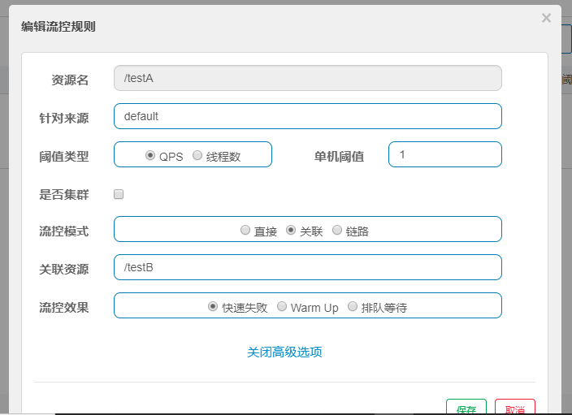

地址：[git地址及](https://github.com/alibaba/Sentinel/wiki/介绍)


下载地址：https://github.com/alibaba/Sentinel/releases


## 控制台

由两部分组成

- 后台

  核心库（java客户端）不依赖任何框架，能够运行在所有的java环境，对Dubbo/cloud等框架有很好的支持

- 前台8080

  控制台（Dashboard）基于springboot开发，打包后直接运行，不需要额外的tomcat等应用容器

  

启动命令

```
java -jar sentinel-dashboard-1.6.3.jar
```


访问管理界面

http://localhost:8080/#/login

账户密码：sentinel


## 初始化监控

### pom

```xml
 <dependencies>
        <dependency>
            <groupId>com.alibaba.cloud</groupId>
            <artifactId>spring-cloud-starter-alibaba-nacos-discovery</artifactId>
        </dependency>
        <!--     sentinel-datasource-nacos 后续持久化用   -->
        <dependency>
            <groupId>com.alibaba.csp</groupId>
            <artifactId>sentinel-datasource-nacos</artifactId>
        </dependency>
        <dependency>
            <groupId>com.alibaba.cloud</groupId>
            <artifactId>spring-cloud-starter-alibaba-sentinel</artifactId>
        </dependency>
        <dependency>
            <groupId>org.springframework.cloud</groupId>
            <artifactId>spring-cloud-starter-openfeign</artifactId>
        </dependency>
        <dependency>
            <groupId>org.springframework.boot</groupId>
            <artifactId>spring-boot-starter-web</artifactId>
        </dependency>
        <dependency>
            <groupId>org.springframework.boot</groupId>
            <artifactId>spring-boot-starter-actuator</artifactId>
        </dependency>
        <dependency>
            <groupId>org.projectlombok</groupId>
            <artifactId>lombok</artifactId>
            <optional>true</optional>
        </dependency>
        <dependency>
            <groupId>org.springframework.boot</groupId>
            <artifactId>spring-boot-starter-test</artifactId>
            <scope>test</scope>
        </dependency>
    </dependencies>
```


### yml

```yml
server:
  port: 8401
spring:
  application:
    name: cloudalibaba-sentinel-service
  cloud:
    nacos:
      discovery:
        # Nacos服务注册中心地址
        server-addr: localhost:8848
    sentinel:
      transport:
        # sentinel dashboard 地址
        dashboard: localhost:8080
        # 默认为8719，如果被占用会自动+1，直到找到为止
        port: 8719
      # 流控规则持久化到nacos
#      datasource:
#        dsl:
#          nacos:
#            server-addr: localhost:8848
#            data-id: ${spring.application.name}
#            group-id: DEFAULT_GROUP
#            data-type: json
#            rule-type: flow
management:
  endpoints:
    web:
      exposure:
        include: "*"
```


### q启动类

```java

import org.springframework.boot.SpringApplication;
import org.springframework.boot.autoconfigure.SpringBootApplication;
import org.springframework.cloud.client.discovery.EnableDiscoveryClient;

@SpringBootApplication
@EnableDiscoveryClient
public class MainApp8401 {

    public static void main(String[] args) {
        SpringApplication.run(MainApp8401.class, args);
    }
}

```


### controller

```java
import lombok.extern.slf4j.Slf4j;
import org.springframework.web.bind.annotation.GetMapping;
import org.springframework.web.bind.annotation.RestController;

@RestController
@Slf4j
public class FlowController {

    @GetMapping("/testA")
    public String testA(){
        return "testA-----";
    }

    @GetMapping("/testB")
    public String testB(){
        log.info(Thread.currentThread().getName() + "...testB ");
        return "testB   -----";
    }
}
```


sentinel是懒加载机制

需要手动进行访问之后就会出现实例

```
http://localhost:8401/testA
```


实时监控就会检测每一个访问的controller


簇点链路


## 流控规则

资源名：唯一名称，默认请求路径

针对来源：Sentinel可以针对调用者进行限流，填写微服务名，默认default（不区分来源）

阈值类型/单机阈值：

- QPS（每秒钟请求数量）：当调用该api的QPS达到阈值的时候，进行限流
- 线程数：当调用该api的线程数达到阈值的时候，进行限流

是否集群：不需要集群

流控模式：

- 直接：当api达到限流的条件直接限流
- 关联：当关联的资源达到阈值时，就限流自己
- 链路：只记录指定链路上的上的流量（指定资源从入口资源进来的流量，达到阈值，进行限流）（api级别针对来源）

流控效果：

- 快速失败：直接失败，抛异常
- warm up：根据codeFactor（冷加载因子，默认3）的值，从阈值/codeFactor，经过预热时长，才达到设置的QPS阈值
- 排队等待：匀速排队，让请求以匀速的速度通过，阈值类型必须设置QPS，否则无效


### 直接 （QPS）

添加流控方式

方式1：


方式2：


添加流控规则


查看流控规则


此时的单机阈值设置为1，一秒点一次可以通过，点多次则会触发监控

返回

```
Blocked by Sentinel (flow limiting)
```


直接调用返回的是系统设置的默认的方法

设置返回信息的数据源即用户自定义


### 直接（线程数）

线程数和QPS的区别

线程数：此时的请求已经进入请求方法，请求方法执行之后进行拦截

QPS：此时的请求并没有进入请求方法，在请求方法执行之前进行拦截


### 关联

当与A关联的资源B达到阈值之后就限流A


配置




如订单接口在执行的时候调用 支付模块

支付模块访问较大进行限流，此时订单进行回显

条件：支付模块达到阈值


此时使用线程访问/testB

在请求/testA接口

```
Blocked by Sentinel (flow limiting)
```


## 流控效果

### 直接快速失败

直接抛异常(Blocked by Sentinel (flow limiting))

源码：com.alibaba.csp.sentinel.slots.block.flow.controller.DefaultController


### 预热

公式：阈值除以coldFactor（默认为3），经过预热之后时长到达阈值

当系统长期处于低水位情况，当流量突然增加到高水位可能瞬间把系统压垮，通过‘冷启动’

让通过的流量慢慢增加，在一定时间内达到阈值上限，给冷系统一个预热时间，避免冷系统被压垮


默认coldFactor=3 即请求QPS从threshold/3开始，经过预热时长升至设定的QPS阈值


源码类：com.alibaba.csp.sentinel.slots.block.flow.controller.WarmUpController

```
 public WarmUpController(double count, int warmUpPeriodInSec) {
        construct(count, warmUpPeriodInSec, 3);
    }
```


系统初始化的阈值为10/3 = 3，即刚开始为3，5s之后阈值慢慢恢复到10


效果在访问接口的时候

会存在抛出异常的页面进行显示给用户

在经过一定的时间之后，达到阈值就能抗住对系统的压力


秒杀活动开启瞬间，会存在大量的流量涌入，有可能瞬间把系统打死，预热方式为了保护系统，可以慢慢的把流量放进来，慢慢的把阈值增长到设置的阈值


### 排队等待

匀速排队，让请求匀速通过，**阈值类型必须设置为QPS，都则无效**

设置含义：/testA每一秒一次请求，超过的话就排队等待，等到的超时时间设置20000毫秒


匀速排队会严格的控制请求通过的时间，让请求匀速通过，对应的是漏洞算法

**此时大量请求进入，会进入等待状态，在设定的阈值和时间内进行匀速通过调用**


