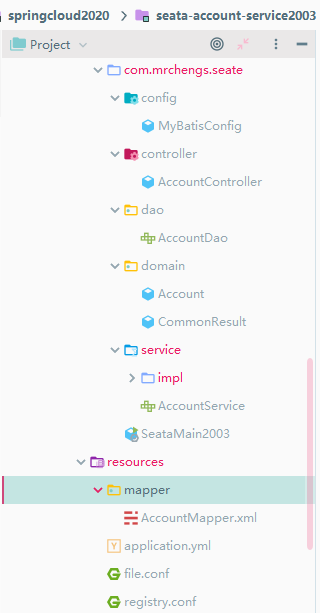

## 分布式事务问题

单机单库没这个问题

从1：1 -> 1:N -> N: N

一次业务操作需要跨多个数据源或需要跨多个系统进行远程调用，就会产生分布式事务问题


## Seata简介

是什么

Seata是一款开源的分布式事务解决方案，致力于在微服务架构下提供高性能和简单易用的分布式事务服务


官网地址

http://seata.io/zh-cn/


能干嘛

一个典型的分布式事务过程


分布式事务处理过程的-ID+三组件模型

-  Transaction ID XID

  全局唯一的事务ID

3组件概念

- Transaction Coordinator(TC) 

  事务协调器，维护全局事务的运行状态，负责协调并驱动全局事务的提交或回滚;

- Transaction  Manager(TM) 

   控制全局事务的边界，负责开启一个全局事务，并最终发起全局提交或全局回滚的决议;

- Resource Manager(RM) 

  控制分支事务，负责分支注册，状态汇报，并接收事务协调器的指令，驱动分支（本地）事务的提交和回滚；


去哪下

发布说明:https://github.com/seata/seata/releases


## 安装

file.conf备份修改

```conf
service {
  #vgroup->rgroup
  #修改模块分组
  vgroup_mapping.fsp_tx_group = "default"
  #only support single node
  default.grouplist = "127.0.0.1:8091"
```

修改事务的存储位数据库而非文件

```
## transaction log store
store {
  ## store mode:file、 db
  mode = "db"

  ## file store
  file {
    dir = "sessionStore"

    # branch session size , if exceeded first try compress lockkey, still exceeded throws exceptions
    max-branch-session-size = 16384
    # globe session size , if exceeded throws exceptions
    max-global-session-size = 512
    # file buffer size , if exceeded allocate new buffer
    file-write-buffer-cache-size = 16384
    # when recover batch read size
    session.reload.read_size = 100
    # async, sync
    flush-disk-mode = async
  }
```

配置數據庫

```
 ## database store
  db {
    ## the implement of javax.sql.DataSource, such as DruidDataSource(druid)/BasicDataSource(dbcp) etc.
    datasource = "dbcp"
    ## mysql/oracle/h2/oceanbase etc.
    db-type = "mysql"
    driver-class-name = "com.mysql.jdbc.Driver"
    url = "jdbc:mysql://127.0.0.1:3307/seata"
    user = "root"
    password = "123456"
    min-conn = 1
    max-conn = 3
    global.table = "global_table"
    branch.table = "branch_table"
    lock-table = "lock_table"
    query-limit = 100
  }
}
```


创建seate数据库

导入数据

db_store.sql	


配置registry.conf文件

```
registry {
  # file 、nacos 、eureka、redis、zk、consul、etcd3、sofa
  type = "nacos"

```

```
  nacos {
    serverAddr = "localhost:8848"
    namespace = ""
    cluster = "default"
  }
```


先启动nacos

在启动seeata：seata-server.bat


## 怎么玩

Spring 本地@Transactional

全局@GlobalTransactional	：SEATA的分布式交易解决方案


## 玩法说明

由于官方图解中最少需要三个数据库进行业务使用


创建三个服务：订单、库存、账户

用户下单，订单服务中生成一个订单，然后通过远程调用库存服务来减库存数

在通过远程账户服务来扣除账户里面余额

最终订单读物中修改订单为完成状态


跨越三个数据库，两次远程调用，很明显会有分布式事务问题

订单库

```sql
SET FOREIGN_KEY_CHECKS=0;

-- ----------------------------
-- Table structure for t_order
-- ----------------------------
DROP TABLE IF EXISTS `t_order`;
CREATE TABLE `t_order` (
  `id` bigint(11) NOT NULL AUTO_INCREMENT,
  `user_id` bigint(11) DEFAULT NULL,
  `product_id` bigint(11) DEFAULT NULL,
  `count` int(11) DEFAULT NULL,
  `money` decimal(10,0) DEFAULT NULL,
  `status` int(1) DEFAULT NULL,
  PRIMARY KEY (`id`)
) ENGINE=InnoDB DEFAULT CHARSET=utf8;

-- ----------------------------
-- Table structure for undo_log
-- ----------------------------
DROP TABLE IF EXISTS `undo_log`;
CREATE TABLE `undo_log` (
  `id` bigint(20) NOT NULL AUTO_INCREMENT,
  `branch_id` bigint(20) NOT NULL,
  `xid` varchar(100) NOT NULL,
  `context` varchar(128) NOT NULL,
  `rollback_info` longblob NOT NULL,
  `log_status` int(11) NOT NULL,
  `log_created` datetime NOT NULL,
  `log_modified` datetime NOT NULL,
  `ext` varchar(100) DEFAULT NULL,
  PRIMARY KEY (`id`),
  UNIQUE KEY `ux_undo_log` (`xid`,`branch_id`)
) ENGINE=InnoDB DEFAULT CHARSET=utf8;

```


账户库

```sql
SET FOREIGN_KEY_CHECKS=0;

-- ----------------------------
-- Table structure for t_account
-- ----------------------------
DROP TABLE IF EXISTS `t_account`;
CREATE TABLE `t_account` (
  `id` bigint(11) NOT NULL AUTO_INCREMENT,
  `user_id` bigint(11) DEFAULT NULL,
  `total` decimal(10,0) DEFAULT NULL,
  `used` decimal(10,0) DEFAULT NULL,
  `residue` decimal(10,0) DEFAULT NULL,
  PRIMARY KEY (`id`)
) ENGINE=InnoDB DEFAULT CHARSET=utf8;

-- ----------------------------
-- Table structure for undo_log
-- ----------------------------
DROP TABLE IF EXISTS `undo_log`;
CREATE TABLE `undo_log` (
  `id` bigint(20) NOT NULL AUTO_INCREMENT,
  `branch_id` bigint(20) NOT NULL,
  `xid` varchar(100) NOT NULL,
  `context` varchar(128) NOT NULL,
  `rollback_info` longblob NOT NULL,
  `log_status` int(11) NOT NULL,
  `log_created` datetime NOT NULL,
  `log_modified` datetime NOT NULL,
  `ext` varchar(100) DEFAULT NULL,
  PRIMARY KEY (`id`),
  UNIQUE KEY `ux_undo_log` (`xid`,`branch_id`)
) ENGINE=InnoDB DEFAULT CHARSET=utf8;

```


库存看

```sql
SET FOREIGN_KEY_CHECKS=0;

-- ----------------------------
-- Table structure for t_storage
-- ----------------------------
DROP TABLE IF EXISTS `t_storage`;
CREATE TABLE `t_storage` (
  `id` bigint(11) NOT NULL AUTO_INCREMENT,
  `product_id` bigint(11) DEFAULT NULL,
  `total` int(11) DEFAULT NULL,
  `used` int(11) DEFAULT NULL,
  `residue` int(11) DEFAULT NULL,
  PRIMARY KEY (`id`)
) ENGINE=InnoDB AUTO_INCREMENT=2 DEFAULT CHARSET=utf8;

-- ----------------------------
-- Table structure for undo_log
-- ----------------------------
DROP TABLE IF EXISTS `undo_log`;
CREATE TABLE `undo_log` (
  `id` bigint(20) NOT NULL AUTO_INCREMENT,
  `branch_id` bigint(20) NOT NULL,
  `xid` varchar(100) NOT NULL,
  `context` varchar(128) NOT NULL,
  `rollback_info` longblob NOT NULL,
  `log_status` int(11) NOT NULL,
  `log_created` datetime NOT NULL,
  `log_modified` datetime NOT NULL,
  `ext` varchar(100) DEFAULT NULL,
  PRIMARY KEY (`id`),
  UNIQUE KEY `ux_undo_log` (`xid`,`branch_id`)
) ENGINE=InnoDB DEFAULT CHARSET=utf8;

```


订单-库存-账户3个库下都需要建各自的回滚日志表

\seata-server-0.9.0\seata\conf目录下的db_undo_log.sql 

undo_log数据库来源

db_undo_log.sql中的数据执行


## 工程

下订单->减库存->扣余额->改（订单）状态


## seata-order-service2001


### POM

```xml
 <dependencies>
        <!-- nacos -->
        <dependency>
            <groupId>com.alibaba.cloud</groupId>
            <artifactId>spring-cloud-starter-alibaba-nacos-discovery</artifactId>
        </dependency>
        <!-- nacos -->

        <!-- seata-->
        <dependency>
            <groupId>com.alibaba.cloud</groupId>
            <artifactId>spring-cloud-starter-alibaba-seata</artifactId>
            <exclusions>
                <exclusion>
                    <groupId>io.seata</groupId>
                    <artifactId>seata-all</artifactId>
                </exclusion>
            </exclusions>
        </dependency>
        <dependency>
            <groupId>io.seata</groupId>
            <artifactId>seata-all</artifactId>
            <version>0.9.0</version>
        </dependency>

        <!-- seata-->
        <!--feign-->
        <dependency>
            <groupId>org.springframework.cloud</groupId>
            <artifactId>spring-cloud-starter-openfeign</artifactId>
        </dependency>
        <dependency>
            <groupId>org.springframework.boot</groupId>
            <artifactId>spring-boot-starter-web</artifactId>
        </dependency>
        <dependency>
            <groupId>org.mybatis.spring.boot</groupId>
            <artifactId>mybatis-spring-boot-starter</artifactId>
        </dependency>
<!--        <dependency>-->
<!--            <groupId>com.alibaba</groupId>-->
<!--            <artifactId>druid-spring-boot-starter</artifactId>-->
<!--        </dependency>-->

<!--                <dependency>-->
<!--                    <groupId>com.alibaba</groupId>-->
<!--                    <artifactId>druid-spring-boot-stater</artifactId>-->
<!--                </dependency>-->


        <dependency>
            <groupId>mysql</groupId>
            <artifactId>mysql-connector-java</artifactId>
        </dependency>
        <!--jdbc-->
        <dependency>
            <groupId>org.springframework.boot</groupId>
            <artifactId>spring-boot-starter-jdbc</artifactId>
        </dependency>
        <dependency>
            <groupId>org.springframework.boot</groupId>
            <artifactId>spring-boot-starter-actuator</artifactId>
        </dependency>
        <dependency>
            <groupId>org.projectlombok</groupId>
            <artifactId>lombok</artifactId>
            <optional>true</optional>
        </dependency>
        <dependency>
            <groupId>org.springframework.boot</groupId>
            <artifactId>spring-boot-starter-test</artifactId>
            <scope>test</scope>
        </dependency>
        <!--hutool 测试雪花算法-->
        <dependency>
            <groupId>cn.hutool</groupId>
            <artifactId>hutool-captcha</artifactId>
            <version>5.2.0</version>
        </dependency>
    </dependencies>
```


### application.yml

```yml
server:
  port: 2001

spring:
  application:
    name: seata-order-service
  cloud:
    alibaba:
      seata:
        # 自定义事务组名称需要与seata-server中的对应
        tx-service-group: fsp_tx_group
    nacos:
      discovery:
        server-addr: 127.0.0.1:8848
  datasource:
    # 当前数据源操作类型
    type: com.alibaba.druid.pool.DruidDataSource
    # mysql驱动类
    driver-class-name: com.mysql.jdbc.Driver
    url: jdbc:mysql://localhost:3307/seata_order?useUnicode=true&characterEncoding=UTF-8&useSSL=false&serverTimezone=GMT%2B8
    username: root
    password: 123456
feign:
  hystrix:
    enabled: false
logging:
  level:
    io:
      seata: info


mybatis:
  mapper-locations: classpath*:mapper/*.xml
```


### Order.java

```java
@Data
@AllArgsConstructor
@NoArgsConstructor
public class Order {
    private Long id;

    private Long userId;

    private Long productId;

    private Integer count;

    private BigDecimal money;

    /**
     * 订单状态 0:创建中,1:已完结
     */
    private Integer status;
}
```


### CommonResult.java

```java
@Data
@AllArgsConstructor
@NoArgsConstructor
public class CommonResult<T> {
    private Integer code;
    private String message;
    private T data;

    public CommonResult(Integer code, String message) {
        this(code, message, null);
    }
}
```


### OrderDao.java

```java
@Mapper
public interface OrderDao {
    /**
     * 1 新建订单
     * @param order
     * @return
     */
    int create(Order order);

    /**
     * 2 修改订单状态,从0改为1
     * @param userId
     * @param status
     * @return
     */
    int update(@Param("userId") Long userId, @Param("status") Integer status);
}

```


### mapper

OrderMapper.xml

```xml
<?xml version="1.0" encoding="UTF-8" ?>
<!DOCTYPE mapper PUBLIC "-//mybatis.org//DTD Mapper 3.0//EN"
        "http://mybatis.org/dtd/mybatis-3-mapper.dtd">
<mapper namespace="com.mrchengs.seate.order.dao.OrderDao">

    <resultMap id="BaseResultMap" type="com.mrchengs.seate.order.domain.Order">
        <id column="id" property="id" jdbcType="BIGINT"/>
        <result column="user_id" property="userId" jdbcType="BIGINT"/>
        <result column="product_id" property="productId" jdbcType="BIGINT"/>
        <result column="count" property="count" jdbcType="INTEGER"/>
        <result column="money" property="money" jdbcType="DECIMAL"/>
        <result column="status" property="status" jdbcType="INTEGER"/>
    </resultMap>

    <insert id="create" parameterType="com.mrchengs.seate.order.domain.Order" useGeneratedKeys="true"
            keyProperty="id">
        insert into t_order(user_id,product_id,count,money,status) values (#{userId},#{productId},#{count},#{money},0)
    </insert>

    <update id="update">
        update t_order set status =1 where user_id =#{userId} and status=#{status}
    </update>
</mapper>
```


### service 

AccountService.java

```java
@Component
@FeignClient(value = "seata-account-service")
public interface AccountService {

    /**
     * 减余额
     *
     * @param userId
     * @param money
     * @return
     */
    @PostMapping(value = "/account/decrease")
    CommonResult decrease(@RequestParam("userId") Long userId, @RequestParam("money") BigDecimal money);
}
```


OrderService.java

```java
public interface OrderService {
    /**
     * 创建订单
     * @param order
     */
    void create(Order order);
}

```


StorageService.java

```java
@Component
@FeignClient(value = "seata-storage-service")
public interface StorageService {

    /**
     * 减库存
     * @param productId 产品ID
     * @param count 库存数
     * @return CommonResult
     */
    @PostMapping(value = "/storage/decrease/{productId}/{count}")
    CommonResult decrease(@RequestParam("productId") Long productId, @RequestParam("count") Integer count);

}
```


### service实现类(注解地点)

OrderServiceImpl.java

```java
@Service
@Slf4j
public class OrderServiceImpl implements OrderService {

    @Resource
    private OrderDao orderDao;
    @Resource
    private AccountService accountService;
    @Resource
    private StorageService storageService;

    /**
     * 创建订单->调用库存服务扣减库存->调用账户服务扣减账户余额->修改订单状态
     * 简单说:
     * 下订单->减库存->减余额->改状态
     * GlobalTransactional seata开启分布式事务,异常时回滚,name保证唯一即可
     *
     * @param order 订单对象
     */
    @GlobalTransactional(name = "fsp_tx_group",rollbackFor = Exception.class)
    @Override
    public void create(Order order) {
        // 1 新建订单
        log.info("----->开始新建订单");
        orderDao.create(order);

        // 2 扣减库存
        log.info("----->订单微服务开始调用库存,做扣减Count");
        storageService.decrease(order.getProductId(), order.getCount());
        log.info("----->订单微服务开始调用库存,做扣减End");

        // 3 扣减账户
        /**
         * 超时处理
         * 出异常，但是上述之前的会进行数据的修改
         */
        log.info("----->订单微服务开始调用账户,做扣减Money");
        accountService.decrease(order.getUserId(), order.getMoney());
        log.info("----->订单微服务开始调用账户,做扣减End");

        // 4 修改订单状态,从0到1,1代表已完成
        log.info("----->修改订单状态开始");
        orderDao.update(order.getUserId(), 0);

        log.info("----->下订单结束了,O(∩_∩)O哈哈~");
    }
}

```


### controller

OrderController.class

```java
@RestController
public class OrderController {
    @Resource
    private OrderService orderService;
//    @Resource
//    private IdGeneratorSnowflake idGeneratorSnowflake;

    /**
     * 创建订单
     * @param order
     * @return
     */
    @GetMapping("/order/create")
    public CommonResult create(Order order) {
        orderService.create(order);
        return new CommonResult(200, "订单创建成功");
    }

    /**
     * 生成id,通过雪花算法
     *
     * @return

    @GetMapping("snowflake")
    public String getIDBySnowflake() {
        ExecutorService threadPool = Executors.newFixedThreadPool(5);
        for (int i = 0; i < 20; i++) {
            threadPool.submit(() -> {
                System.out.println(idGeneratorSnowflake.snowflakeId());
            });
        }
        threadPool.shutdown();
        return "hello snowflake";
    }
     */
}
```


### config

```java
@Configuration
public class MyBatisConfig {

    @Value("${mybatis.mapper-locations}")
    private String mapperLocations;

    /**
     * @param sqlSessionFactory SqlSessionFactory
     * @return SqlSessionTemplate
     */
    @Bean
    public SqlSessionTemplate sqlSessionTemplate(SqlSessionFactory sqlSessionFactory) {
        return new SqlSessionTemplate(sqlSessionFactory);
    }

    /**
     * 从配置文件获取属性构造datasource，注意前缀，这里用的是druid，根据自己情况配置,
     * 原生datasource前缀取"spring.datasource"
     *
     * @return
     */
    @Bean
    @ConfigurationProperties(prefix = "spring.datasource")
    public DataSource druidDataSource() {
        return new DruidDataSource();
    }

    /**
     * 构造datasource代理对象，替换原来的datasource
     *
     * @param druidDataSource
     * @return
     */
    @Primary
    @Bean("dataSource")
    public DataSourceProxy dataSourceProxy(DataSource druidDataSource) {
        return new DataSourceProxy(druidDataSource);
    }

    @Bean(name = "sqlSessionFactory")
    public SqlSessionFactory sqlSessionFactoryBean(DataSourceProxy dataSourceProxy) throws Exception {
        SqlSessionFactoryBean bean = new SqlSessionFactoryBean();
        bean.setDataSource(dataSourceProxy);
        ResourcePatternResolver resolver = new PathMatchingResourcePatternResolver();
        bean.setMapperLocations(resolver.getResources(mapperLocations));

        SqlSessionFactory factory;
        try {
            factory = bean.getObject();
        } catch (Exception e) {
            throw new RuntimeException(e);
        }
        return factory;
    }

}
```


### 启动类

```java
@EnableDiscoveryClient
@EnableFeignClients
@SpringBootApplication(exclude = DataSourceAutoConfiguration.class)
public class SeataOrderMainApp2001 {
    public static void main(String[] args) {
        SpringApplication.run(SeataOrderMainApp2001.class, args);
    }
}

```


## seata-storage-service2002


### POM

```xml
 <dependencies>
        <!-- nacos -->
        <dependency>
            <groupId>com.alibaba.cloud</groupId>
            <artifactId>spring-cloud-starter-alibaba-nacos-discovery</artifactId>
        </dependency>
        <!-- nacos -->

        <!-- seata-->
        <dependency>
            <groupId>com.alibaba.cloud</groupId>
            <artifactId>spring-cloud-starter-alibaba-seata</artifactId>
            <exclusions>
                <exclusion>
                    <groupId>io.seata</groupId>
                    <artifactId>seata-all</artifactId>
                </exclusion>
            </exclusions>
        </dependency>
        <dependency>
            <groupId>io.seata</groupId>
            <artifactId>seata-all</artifactId>
            <version>0.9.0</version>
        </dependency>
        <!-- seata-->
        <!--feign-->
        <dependency>
            <groupId>org.springframework.cloud</groupId>
            <artifactId>spring-cloud-starter-openfeign</artifactId>
        </dependency>
        <dependency>
            <groupId>org.springframework.boot</groupId>
            <artifactId>spring-boot-starter-web</artifactId>
        </dependency>
        <dependency>
            <groupId>org.mybatis.spring.boot</groupId>
            <artifactId>mybatis-spring-boot-starter</artifactId>
        </dependency>
<!--        <dependency>-->
<!--            <groupId>com.alibaba</groupId>-->
<!--            <artifactId>druid-spring-boot-starter</artifactId>-->
<!--        </dependency>-->
        <dependency>
            <groupId>mysql</groupId>
            <artifactId>mysql-connector-java</artifactId>
        </dependency>
        <!--jdbc-->
        <dependency>
            <groupId>org.springframework.boot</groupId>
            <artifactId>spring-boot-starter-jdbc</artifactId>
        </dependency>
        <dependency>
            <groupId>org.springframework.boot</groupId>
            <artifactId>spring-boot-starter-actuator</artifactId>
        </dependency>
        <dependency>
            <groupId>org.projectlombok</groupId>
            <artifactId>lombok</artifactId>
            <optional>true</optional>
        </dependency>
        <dependency>
            <groupId>org.springframework.boot</groupId>
            <artifactId>spring-boot-starter-test</artifactId>
            <scope>test</scope>
        </dependency>
    </dependencies>
```


### 配置文件

```yml
server:
  port: 2002

spring:
  application:
    name: seata-storage-service
  cloud:
    alibaba:
      seata:
        # 自定义事务组名称需要与seata-server中的对应
        tx-service-group: fsp_tx_group
    nacos:
      discovery:
        server-addr: 127.0.0.1:8848
  datasource:
    # 当前数据源操作类型
    type: com.alibaba.druid.pool.DruidDataSource
    # mysql驱动类
    driver-class-name: com.mysql.jdbc.Driver
    url: jdbc:mysql://localhost:3307/seate_storage?useUnicode=true&characterEncoding=UTF-8&useSSL=false&serverTimezone=GMT%2B8
    username: root
    password: 123456
feign:
  hystrix:
    enabled: false
logging:
  level:
    io:
      seata: info

mybatis:
  mapper-locations: classpath*:mapper/*.xml
```


### doman

CommonResult.java

```java
@Data
@AllArgsConstructor
@NoArgsConstructor
public class CommonResult<T> {
    private Integer code;
    private String message;
    private T data;

    public CommonResult(Integer code, String message) {
        this(code, message, null);
    }
}
```

Storage.java

```java
@Data
@AllArgsConstructor
@NoArgsConstructor
public class Storage {
    private Long id;

    /**
     * 产品id
     */
    private Long productId;

    /**
     * 总库存
     */
    private Integer total;

    /**
     * 已用库存
     */
    private Integer used;

    /**
     * 剩余库存
     */
    private Integer residue;

}

```


### dao

```
@Mapper
@Repository
public interface StorageDao {
    /**
     * 减库存
     * @param productId
     * @param count
     * @return
     */
    int decrease(@Param("productId") Long productId, @Param("count") Integer count);
}

```


### mapper

```xml
<?xml version="1.0" encoding="UTF-8" ?>
<!DOCTYPE mapper PUBLIC "-//mybatis.org//DTD Mapper 3.0//EN"
        "http://mybatis.org/dtd/mybatis-3-mapper.dtd">
<mapper namespace="com.mrchengs.seata.dao.StorageDao">

    <resultMap id="BaseResultMap" type="com.mrchengs.seata.doman.Storage">
        <id column="id" property="id" jdbcType="BIGINT"></id>
        <result column="product_id" property="productId" jdbcType="BIGINT"></result>
        <result column="total" property="total" jdbcType="INTEGER"></result>
        <result column="used" property="used" jdbcType="INTEGER"></result>
        <result column="residue" property="residue" jdbcType="INTEGER"></result>
    </resultMap>


    <!--减库存-->
    <update id="decrease">
        update t_storage
        set used =used + #{count},residue=residue-#{count}
        where product_id=#{productId};
    </update>
</mapper>
```


### sevice

```jva
public interface StorageService {
    /**
     * 减库存
     *
     * @param productId
     * @param count
     * @return
     */
    void decrease(Long productId, Integer count);
}

```


```java
@Service
@Slf4j
public class StorageServiceImpl implements StorageService {

    @Autowired
    private StorageDao storageDao;

    /**
     * 减库存
     *
     * @param productId
     * @param count
     * @return
     */
    @Override
    public void decrease(Long productId, Integer count) {
        log.info("*******->storage-service中扣减账户余额开始");
        storageDao.decrease(productId, count);
        log.info("*******->storage-service中扣减账户余额结束");
    }
}

```


### controller

```java
package com.mrchengs.seata.controller;

import com.mrchengs.seata.doman.CommonResult;
import com.mrchengs.seata.service.StorageService;
import org.springframework.web.bind.annotation.PostMapping;
import org.springframework.web.bind.annotation.RequestParam;
import org.springframework.web.bind.annotation.RestController;

import javax.annotation.Resource;

@RestController
public class StorageController {

    @Resource
    private StorageService storageService;

    /**
     * 减库存
     *
     * @param productId
     * @param count
     * @return
     */
    @PostMapping(value = "/storage/decrease/{productId}/{count}")
    public CommonResult decrease(@RequestParam("productId") Long productId, @RequestParam("count") Integer count) {
        storageService.decrease(productId, count);
        return new CommonResult(200, "扣减库存成功");
    }
}

```


### config

```java
package com.mrchengs.seata.config;

import com.alibaba.druid.pool.DruidDataSource;
import io.seata.rm.datasource.DataSourceProxy;
import org.apache.ibatis.session.SqlSessionFactory;
import org.mybatis.spring.SqlSessionFactoryBean;
import org.mybatis.spring.SqlSessionTemplate;
import org.springframework.beans.factory.annotation.Value;
import org.springframework.boot.context.properties.ConfigurationProperties;
import org.springframework.context.annotation.Bean;
import org.springframework.context.annotation.Configuration;
import org.springframework.context.annotation.Primary;
import org.springframework.core.io.support.PathMatchingResourcePatternResolver;
import org.springframework.core.io.support.ResourcePatternResolver;

import javax.sql.DataSource;

/**
 * seata管理数据源
 */

@Configuration
public class MyBatisConfig {

    @Value("${mybatis.mapper-locations}")
    private String mapperLocations;

    /**
     * @param sqlSessionFactory SqlSessionFactory
     * @return SqlSessionTemplate
     */
    @Bean
    public SqlSessionTemplate sqlSessionTemplate(SqlSessionFactory sqlSessionFactory) {
        return new SqlSessionTemplate(sqlSessionFactory);
    }

    /**
     * 从配置文件获取属性构造datasource，注意前缀，这里用的是druid，根据自己情况配置,
     * 原生datasource前缀取"spring.datasource"
     *
     * @return
     */
    @Bean
    @ConfigurationProperties(prefix = "spring.datasource")
    public DataSource druidDataSource() {
        return new DruidDataSource();
    }

    /**
     * 构造datasource代理对象，替换原来的datasource
     *
     * @param druidDataSource
     * @return
     */
    @Primary
    @Bean("dataSource")
    public DataSourceProxy dataSourceProxy(DataSource druidDataSource) {
        return new DataSourceProxy(druidDataSource);
    }

    @Bean(name = "sqlSessionFactory")
    public SqlSessionFactory sqlSessionFactoryBean(DataSourceProxy dataSourceProxy) throws Exception {
        SqlSessionFactoryBean bean = new SqlSessionFactoryBean();
        bean.setDataSource(dataSourceProxy);
        ResourcePatternResolver resolver = new PathMatchingResourcePatternResolver();
        bean.setMapperLocations(resolver.getResources(mapperLocations));

        SqlSessionFactory factory;
        try {
            factory = bean.getObject();
        } catch (Exception e) {
            throw new RuntimeException(e);
        }
        return factory;
    }
}
```


### 启动类

```java
package com.mrchengs.seata;

import org.springframework.boot.SpringApplication;
import org.springframework.boot.autoconfigure.SpringBootApplication;
import org.springframework.boot.autoconfigure.jdbc.DataSourceAutoConfiguration;
import org.springframework.cloud.client.discovery.EnableDiscoveryClient;
import org.springframework.cloud.openfeign.EnableFeignClients;

/**
 **/
@EnableDiscoveryClient
@EnableFeignClients
@SpringBootApplication(exclude = DataSourceAutoConfiguration.class)
public class SeataMainApp2002 {
    public static void main(String[] args) {
        SpringApplication.run(SeataMainApp2002.class, args);
    }
}
```


## seata-account-service2003




### POM

```xml
   <dependencies>
        <!-- nacos -->
        <dependency>
            <groupId>com.alibaba.cloud</groupId>
            <artifactId>spring-cloud-starter-alibaba-nacos-discovery</artifactId>
        </dependency>
        <!-- nacos -->

        <!-- seata-->
        <dependency>
            <groupId>com.alibaba.cloud</groupId>
            <artifactId>spring-cloud-starter-alibaba-seata</artifactId>
            <exclusions>
                <exclusion>
                    <groupId>io.seata</groupId>
                    <artifactId>seata-all</artifactId>
                </exclusion>
            </exclusions>
        </dependency>
        <dependency>
            <groupId>io.seata</groupId>
            <artifactId>seata-all</artifactId>
            <version>0.9.0</version>
        </dependency>
        <!-- seata-->
        <!--feign-->
        <dependency>
            <groupId>org.springframework.cloud</groupId>
            <artifactId>spring-cloud-starter-openfeign</artifactId>
        </dependency>
        <dependency>
            <groupId>org.springframework.boot</groupId>
            <artifactId>spring-boot-starter-web</artifactId>
        </dependency>
        <dependency>
            <groupId>org.mybatis.spring.boot</groupId>
            <artifactId>mybatis-spring-boot-starter</artifactId>
        </dependency>
<!--        <dependency>-->
<!--            <groupId>com.alibaba</groupId>-->
<!--            <artifactId>druid-spring-boot-starter</artifactId>-->
<!--        </dependency>-->
        <dependency>
            <groupId>mysql</groupId>
            <artifactId>mysql-connector-java</artifactId>
        </dependency>
        <!--jdbc-->
        <dependency>
            <groupId>org.springframework.boot</groupId>
            <artifactId>spring-boot-starter-jdbc</artifactId>
        </dependency>
        <dependency>
            <groupId>org.springframework.boot</groupId>
            <artifactId>spring-boot-starter-actuator</artifactId>
        </dependency>
        <dependency>
            <groupId>org.projectlombok</groupId>
            <artifactId>lombok</artifactId>
            <optional>true</optional>
        </dependency>
        <dependency>
            <groupId>org.springframework.boot</groupId>
            <artifactId>spring-boot-starter-test</artifactId>
            <scope>test</scope>
        </dependency>
    </dependencies>
```


### 配置文件

```yml
server:
  port: 2003

spring:
  application:
    name: seata-account-service
  cloud:
    alibaba:
      seata:
        # 自定义事务组名称需要与seata-server中的对应
        tx-service-group: fsp_tx_group
    nacos:
      discovery:
        server-addr: 127.0.0.1:8848
  datasource:
    # 当前数据源操作类型
    type: com.alibaba.druid.pool.DruidDataSource
    # mysql驱动类
    driver-class-name: com.mysql.jdbc.Driver
    url: jdbc:mysql://localhost:3307/seate_account?useUnicode=true&characterEncoding=UTF-8&useSSL=false&serverTimezone=GMT%2B8
    username: root
    password: 123456
feign:
  hystrix:
    enabled: false
logging:
  level:
    io:
      seata: info

mybatis:
  mapper-locations: classpath*:mapper/*.xml
```


### domain

```java
@Data
@AllArgsConstructor
@NoArgsConstructor
public class CommonResult<T> {
    private Integer code;
    private String message;
    private T data;

    public CommonResult(Integer code, String message) {
        this(code, message, null);
    }
}
```


```java
package com.mrchengs.seate.domain;

import lombok.AllArgsConstructor;
import lombok.Data;
import lombok.NoArgsConstructor;

/**
 * 账户实体类
 **/
@Data
@AllArgsConstructor
@NoArgsConstructor
public class Account {
    private Long id;

    /**
     * 用户id
     */
    private Long userId;

    /**
     * 总额度
     */
    private Integer total;

    /**
     * 已用额度
     */
    private Integer used;

    /**
     * 剩余额度
     */
    private Integer residue;
}
```


### dao

```java
package com.mrchengs.seate.dao;


import org.apache.ibatis.annotations.Mapper;
import org.apache.ibatis.annotations.Param;

import java.math.BigDecimal;

/**
 **/
@Mapper
public interface AccountDao {
    /**
     * 扣减账户余额
     *
     * @param userId
     * @param money
     * @return
     */
    int decrease(@Param("userId") Long userId, @Param("money") BigDecimal money);
}
```

### mapper

```xml
<?xml version="1.0" encoding="UTF-8" ?>
<!DOCTYPE mapper PUBLIC "-//mybatis.org//DTD Mapper 3.0//EN"
        "http://mybatis.org/dtd/mybatis-3-mapper.dtd">
<mapper namespace="com.mrchengs.seate.dao.AccountDao">
    <update id="decrease">
        update t_account set residue = residue- #{money},used = used + #{money}
        where user_id =#{userId};
    </update>
</mapper>
```


### service

```java
package com.mrchengs.seate.service;

import java.math.BigDecimal;

/**
 * 库存服务
 *
 **/
public interface AccountService {
    /**
     * 减库存
     *
     * @param userId 用户id
     * @param money  金额
     * @return
     */
    void decrease(Long userId, BigDecimal money);
}
```


```java
package com.mrchengs.seate.service.impl;


import com.mrchengs.seate.dao.AccountDao;
import com.mrchengs.seate.service.AccountService;
import lombok.extern.slf4j.Slf4j;
import org.springframework.stereotype.Service;

import javax.annotation.Resource;
import java.math.BigDecimal;
import java.util.concurrent.TimeUnit;

/**
 * 账户业务实现类
 *
 * @author zzyy
 * @date 2020/3/8 15:56
 **/
@Service
@Slf4j
public class AccountServiceImpl implements AccountService {
    @Resource
    private AccountDao accountDao;

    @Override
    public void decrease(Long userId, BigDecimal money) {
        log.info("*******->account-service中扣减账户余额开始");
        // 模拟超时异常,全局事务回滚
        try {
            // 暂停20秒钟
            TimeUnit.SECONDS.sleep(20);
        } catch (InterruptedException e) {
            e.printStackTrace();
        }
        accountDao.decrease(userId, money);
        log.info("*******->account-service中扣减账户余额结束");
    }
}
```


### controller

```java
package com.mrchengs.seate.controller;

import com.mrchengs.seate.domain.CommonResult;
import com.mrchengs.seate.service.AccountService;
import org.springframework.web.bind.annotation.PostMapping;
import org.springframework.web.bind.annotation.RequestParam;
import org.springframework.web.bind.annotation.RestController;

import javax.annotation.Resource;
import java.math.BigDecimal;

/**
 * @author ccrr
 */
@RestController
public class AccountController {
    @Resource
    private AccountService accountService;

    @PostMapping(value = "/account/decrease")
    public CommonResult decrease(@RequestParam("userId") Long userId, @RequestParam("money") BigDecimal money) {
        accountService.decrease(userId, money);
        return new CommonResult(200, "扣减账户余额成功");
    }
}
```


### config

```java
package com.mrchengs.seate.config;


import com.alibaba.druid.pool.DruidDataSource;
import io.seata.rm.datasource.DataSourceProxy;
import org.apache.ibatis.session.SqlSessionFactory;
import org.mybatis.spring.SqlSessionFactoryBean;
import org.mybatis.spring.SqlSessionTemplate;
import org.springframework.beans.factory.annotation.Value;
import org.springframework.boot.context.properties.ConfigurationProperties;
import org.springframework.context.annotation.Bean;
import org.springframework.context.annotation.Configuration;
import org.springframework.context.annotation.Primary;
import org.springframework.core.io.support.PathMatchingResourcePatternResolver;
import org.springframework.core.io.support.ResourcePatternResolver;

import javax.sql.DataSource;

/**
 * seata管理数据源
 *
 * @author zzyy
 * @version 1.0
 * @create 2020/3/8 15:35
 */

@Configuration
public class MyBatisConfig {

    @Value("${mybatis.mapper-locations}")
    private String mapperLocations;

    /**
     * @param sqlSessionFactory SqlSessionFactory
     * @return SqlSessionTemplate
     */
    @Bean
    public SqlSessionTemplate sqlSessionTemplate(SqlSessionFactory sqlSessionFactory) {
        return new SqlSessionTemplate(sqlSessionFactory);
    }

    /**
     * 从配置文件获取属性构造datasource，注意前缀，这里用的是druid，根据自己情况配置,
     * 原生datasource前缀取"spring.datasource"
     *
     * @return
     */
    @Bean
    @ConfigurationProperties(prefix = "spring.datasource")
    public DataSource druidDataSource() {
        return new DruidDataSource();
    }

    /**
     * 构造datasource代理对象，替换原来的datasource
     *
     * @param druidDataSource
     * @return
     */
    @Primary
    @Bean("dataSource")
    public DataSourceProxy dataSourceProxy(DataSource druidDataSource) {
        return new DataSourceProxy(druidDataSource);
    }

    @Bean(name = "sqlSessionFactory")
    public SqlSessionFactory sqlSessionFactoryBean(DataSourceProxy dataSourceProxy) throws Exception {
        SqlSessionFactoryBean bean = new SqlSessionFactoryBean();
        bean.setDataSource(dataSourceProxy);
        ResourcePatternResolver resolver = new PathMatchingResourcePatternResolver();
        bean.setMapperLocations(resolver.getResources(mapperLocations));

        SqlSessionFactory factory;
        try {
            factory = bean.getObject();
        } catch (Exception e) {
            throw new RuntimeException(e);
        }
        return factory;
    }
}
```


### 启动

```java
package com.mrchengs.seate;

import org.springframework.boot.SpringApplication;
import org.springframework.boot.autoconfigure.SpringBootApplication;
import org.springframework.boot.autoconfigure.jdbc.DataSourceAutoConfiguration;
import org.springframework.cloud.client.discovery.EnableDiscoveryClient;
import org.springframework.cloud.openfeign.EnableFeignClients;

/**
 * 取消数据源的自动配置
 *
 **/
@EnableDiscoveryClient
@EnableFeignClients
@SpringBootApplication(exclude = DataSourceAutoConfiguration.class)
public class SeataMain2003 {
    public static void main(String[] args) {
        SpringApplication.run(SeataMain2003.class, args);
    }
}

```


http://localhost:2001/order/create?userId=1&productId=1&count=10&money=100 	

# Whitelabel Error Page

This application has no explicit mapping for /error, so you are seeing this as a fallback.

Fri Jun 26 00:59:41 CST 2020

There was an unexpected error (type=Internal Server Error, status=500).

Read timed out executing POST http://seata-account-service/account/decrease?userId=1&money=100


此时会进行报错，但是已经更改的数据库数据会进行回退


