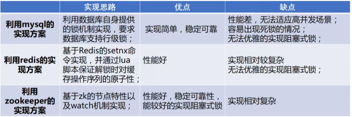

## 简介

在jvm中有相应的锁机制进行解决多个线程之间对共享资源的操作

在分布式环境中相应的juc包下的并不不能解决对共享资源的操作

需要一种分布式协调机制来进行对这些线程的调度

这个机制就是**分布式锁**

## 为什么需要锁？

- 多任务环境中需要

- 任务都需要对统一共享资源进行写操作

- 对资源的访问是互斥的

任务通过竞争获取锁才能对该资源进行操作（**①竞争锁**）

当有一个任务对资源进行更新时（**②占有锁**）

其他任务都不能对这个资源进行操作（**③任务阻塞**）

知道该任务完成更新（**④释放锁**）

**JVM锁解决不了分布式环境任务对共享资源的竞争**

## 分布式锁具有的条件

- 分布式系统下，一个方法同一时间只能被一个机器的一个线程执行
- 高可用的获取锁与释放锁
- 具有失效机制， 防止发生死锁，避免其他线程的无线等待
- 具有非阻塞锁特性，没有获取锁直接返回获取锁失败

## 分布式锁的解决方案

