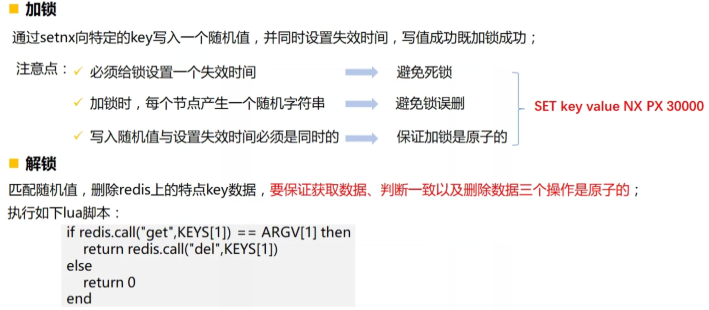

## 基于Redis实现分布式锁


Redis是一个开源，内存存储的数据结构服务器

可以作为服务器，高速缓存和消息队列代理

采用单进程的模型，并发能力强

是当前互联网主流的分布式缓存工具


## 基础知识

1、缓存有效期

redis中的数据，不一定都是持久化的，给key设置生存时间，当key过期时，自动删除数据

2、setnx命令

setnx key value 将key值设置为value，当且仅当key不存在

若给定的key已经存在，则给定的setnx不会做任何的操作

setnx == set if not exists的简写

3、lua脚本

轻量级小巧的脚本语言，用于支持redis操作序列的原子性


## 代码

```
    @Test
    public  void testRedis(){
        //1、获取redis的链接
        Jedis jedis = new Jedis("127.0.0.1", 6379);

        //2、想redis发送setnx命令写相应的数据
        //NX表示使用“nx”模式
        //PX表示失效的时间（毫秒）
        String test = jedis.set("test","test","NX","PX",15000);

        System.out.println(test);
        jedis.close();
    }
```

只有当前数据key不存在时才可以进行插入数据

```
127.0.0.1:6379> get test
"test"
127.0.0.1:6379> get test
(nil)
```


## redis枷锁的方式





```
  @Test
    public  void mySqlLock() throws InterruptedException {
        TicketRunable t = new TicketRunable();

        Thread thread1 = new Thread(t,"a");
        Thread thread2 = new Thread(t,"b");
        Thread thread3 = new Thread(t,"c");
        Thread thread4 = new Thread(t,"d");

        thread1.start();
        thread2.start();
        thread3.start();
        thread4.start();

        thread1.join();
        Thread.sleep(50000);

    }


    class TicketRunable implements  Runnable{

        @Override
        public void run() {
            while (serialNumber >0) {

                if (serialNumber > 0){

                    try {
                        Thread.currentThread();
                        Thread.sleep(100);
                    } catch (InterruptedException e) {
                        e.printStackTrace();
                    }
                    System.out.println(Thread.currentThread().getName()+"卖。。。"+serialNumber--);
                }
            }

        }
    }
```


多线程以及分布式环境下该代码会友问题


此时使用redis作为分布式锁

Redis锁代码

```
 package com.service;

import org.springframework.beans.factory.annotation.Autowired;
import org.springframework.data.redis.connection.jedis.JedisConnectionFactory;
import org.springframework.stereotype.Service;
import redis.clients.jedis.Jedis;


import java.util.Arrays;
import java.util.UUID;
import java.util.concurrent.TimeUnit;
import java.util.concurrent.locks.Condition;
import java.util.concurrent.locks.Lock;

@Service
public class RedisLock implements Lock {

    private static  final String key = "KEY";
    //线程内部共享的变量
    private ThreadLocal<String> local = new ThreadLocal<>();

    @Autowired
    JedisConnectionFactory jedisConnectionFactory;

    //阻塞枷锁
    @Override
    public void lock() {
        //尝试枷锁
        if (tryLock()){
            return;
        }
        //枷锁失败，休眠一段时间
        try {
            Thread.sleep(50);
        } catch (InterruptedException e) {
            e.printStackTrace();
        }
        //递归调用
        lock();
    }

    @Override
    public void lockInterruptibly() throws InterruptedException {

    }

    //非阻塞式枷锁
    //使用setnx命令返回ok加锁成功，并产生随机值
    //redisTemplate不支持setnx命令
    @Override
    public boolean tryLock() {
        //随机值
        String uuid = UUID.randomUUID().toString();
        //获取rendis的连接
        Jedis jedis = (Jedis) jedisConnectionFactory.getConnection().getNativeConnection();
        //传入setnx命令请求写值，并且设置时间
        String result = jedis.set(key, uuid, "NX", "PX", 1000);

        jedis.close();

        //返回ok以为加锁成功
        if (("OK".equals(result))){
            local.set(uuid);
            return true;
        }
        //加送失败返回false
        return false;
    }

    @Override
    public boolean tryLock(long time, TimeUnit unit) throws InterruptedException {
        return false;
    }

    @Override
    public void unlock() {
       // String script= FileUtils.readFile("unlock.lua");
        String script= "if redis.call('get', KEYS[1]) == ARGV[1] then return redis.call('del', KEYS[1]) else return 0 end";
        //连接
        Jedis jedis = (Jedis) jedisConnectionFactory.getConnection().getNativeConnection();
        //执行lua脚本
        jedis.eval(script, Arrays.asList(key),Arrays.asList(local.get()));

        jedis.close();
//        Jedis jedis = (Jedis) jedisConnectionFactory.getConnection().getNativeConnection();
//        String val = jedis.get(key);
//        if (val == null){
//            return;
//        }else {
//            jedis.del(key);
//        }
//        jedis.close();

    }

    @Override
    public Condition newCondition() {
        return null;
    }
}

```


测试

```
    @Autowired
    RedisLock redisLock;

    @Test
    public  void mySqlLock() throws InterruptedException {
        TicketRunable t = new TicketRunable();

        Thread thread1 = new Thread(t,"a");
        Thread thread2 = new Thread(t,"b");
        Thread thread3 = new Thread(t,"c");
        Thread thread4 = new Thread(t,"d");

        thread1.start();
        thread2.start();
        thread3.start();
        thread4.start();

        thread1.join();
        Thread.sleep(50000);

    }

    @Autowired
    MySqlLockService mySqlLockService;

    class TicketRunable implements  Runnable{

        @Override
        public void run() {
            while (serialNumber >0) {

                redisLock.lock();

                if (serialNumber > 0){

                    try {
                        Thread.currentThread();
                        Thread.sleep(100);
                    } catch (InterruptedException e) {
                        e.printStackTrace();
                    }
                    System.out.println(Thread.currentThread().getName()+"卖。。。"+serialNumber--);
                }

                redisLock.unlock();

            }

        }
    }
```

此时代码执行正确


redis作为分布式锁可有有效的处理相对高点的并发环境


