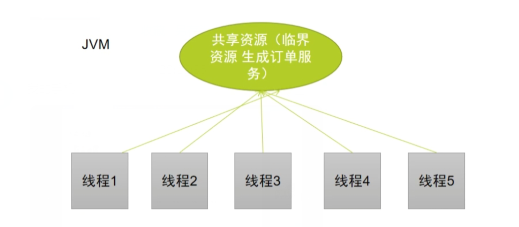
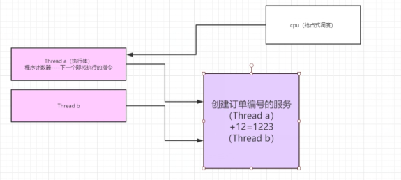
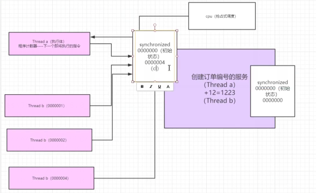
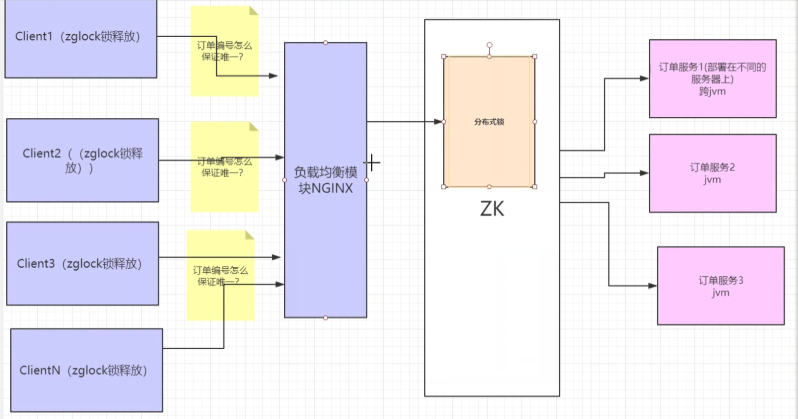

### 场景描述

在线程高并发场景下

生产有一定业务含义的惟一的订单编号

如：2019-01-01-12-32-12 年月日时分秒




小案例

生成订单的类

```
public class OrderFactory {

    private static  int i = 0;

    //synchronized
    public String createOrder(){
        SimpleDateFormat simpleDateFormat = new SimpleDateFormat("YYYY-MM-dd HH:mm:ss");
        return simpleDateFormat.format(new Date()) +( i++);
    }
}
```

线程类

```
public class OrderService implements Runnable {

    //100客户端
    private static  int count = 100;

    private static Logger logger = LoggerFactory.getLogger(OrderService.class);

    private OrderFactory  orderFactory = new OrderFactory();

    private static CountDownLatch countDownLatch = new CountDownLatch(count);

    private static  Object object = new Object();

    @Override
    public void run() {

        try {
            countDownLatch.await();
        } catch (InterruptedException e) {
            e.printStackTrace();
        }
        createOrder();
    }

    public  void createOrder(){
        String oder = orderFactory.createOrder();
        System.out.println(Thread.currentThread().getName() + "---" + oder);
        //logger.info(Thread.currentThread().getName() + "-" + oder);
    }

    public static void main(String[] args) {
        for (int i = 0;i<count;i++){
            new Thread(new OrderService()).start();
            countDownLatch.countDown();
        }
    }
}

```

此时会有数据订单重复问题

```
Thread-94---2019-10-28 20:33:120
Thread-16---2019-10-28 20:33:120
```

线程是抢占式的获取cpu资源




对订单类进行加锁

synchronized:用于费静态、静态方法、代码块上

### 锁的当前实例（this）

```
public class OrderFactory {

    private static  int i = 0;

    //synchronized
    public synchronized String createOrder(){
        SimpleDateFormat simpleDateFormat = new SimpleDateFormat("YYYY-MM-dd HH:mm:ss");
        return simpleDateFormat.format(new Date()) +( i++);
    }
}
```

此时不可以订单重复的问题！

此时每次都是不同的对象new OrderService()

```
    public static void main(String[] args) {
        for (int i = 0;i<count;i++){
            new Thread(new OrderService()).start();
            countDownLatch.countDown();
        }
    }
```

### 锁静态方法

锁的是对象Class

jvm通过双亲委派模型Class  独占一份（锁是一份对象）

```
public class OrderFactory {

    private static  int i = 0;

    //synchronized
    public synchronized static String createOrder(){
        SimpleDateFormat simpleDateFormat = new SimpleDateFormat("YYYY-MM-dd HH:mm:ss");
        return simpleDateFormat.format(new Date()) +( i++);
    }
}
```





### 锁代码块

```
public class OrderFactory {

    private static  int i = 0;

    //synchronized
    public   String createOrder(){
    synchronized(this){
        SimpleDateFormat simpleDateFormat = new SimpleDateFormat("YYYY-MM-dd HH:mm:ss");
        return simpleDateFormat.format(new Date()) +( i++);
    }
   }
}
```

此时可以解决问题！

### 分布式环境下

由于不同的服务在不同的服务器上

此时使用synchronized无法解决以上遇到的问题


此时需要使用到zk进行作为分布式锁的控制（mysql&redis）



只有获取分布式锁才能创建订单服务

每个客户端都会将自己的监听器注册到zk的注册中心中

发生删除事件，所有的客户端会再次进行抢占zk的锁


### 独占锁

公平竞争zk资源

每次都会所有客户端进行抢占


Lock接口

```
//面向接口编程抽取分布式锁的接口

//Lock:分布式锁对象接口zk里面的分布式锁

public interface Lock {
  //获取锁行为

  public  void lock();

  //释放锁
  public  void  unlock();
}
```

抽象类实现Lock接口

```
//构建抽象类实现Lock
public abstract class zkAbstractLock implements Lock {
    //日志输出对象
    private static Logger logger = LoggerFactory.getLogger(zkAbstractLock.class);

    private static String host ="127.0.0.1";
    private  static String port ="2181";

    //锁的名称
    protected static String path = "/mrchengs";

    //操作zk的管道
    protected static ZkClient zkClient = new ZkClient(host+":" + port);

    //抽取中间状态的描述
    protected abstract  boolean tryLock();
    protected abstract  void waitLock();

    //高并发状态下，会有很多线程进行上锁
    //成功：调用服务方法
    //失败：一个等待的状态
    @Override
    public void lock() {
        if (tryLock()){
            logger.info(Thread.currentThread().getName()+"获取锁成功！");
        }else {
            //等待
            waitLock();
        }
    }

    @Override
    public void unlock() {
        //有效性的检查
        if (zkClient.exists(path)){
            zkClient.delete(path);
        }
    }
}
```

自定义实现类

```
public class ZkLockImpl extends zkAbstractLock {

    private static Logger logger = LoggerFactory.getLogger(ZkLockImpl.class);

    //怎么知道有线程进来 信号量
    private static CountDownLatch countDownLatch = null;

    //尝试在zk服务商创建一个临时接点
    //其他线程提前创建会创建异常（ZKNodeException）返回false
    @Override
    protected boolean tryLock() {
        try {
            //创建临时节点
            zkClient.createEphemeral(path);
        }catch (Exception e){
            //有一场则获取失败
            return false;
        }
        return true;
    }

    //当前锁的节点被占用
    //对当前的分布式锁节点注册监听器
    //发生某个时间此时产生级联效应
    @Override
    protected void waitLock() {
        //客户监听器
        IZkDataListener listener = new IZkDataListener() {
            //节点数据发生变化事件
            @Override
            public void handleDataChange(String dataPath, Object data) throws Exception {

            }
            //节点发生删除事件
            @Override
            public void handleDataDeleted(String dataPath) throws Exception {

                if (countDownLatch != null){
                    //发出去
                    countDownLatch.countDown();;
                    //抢夺资源
                    lock();
                }
            }
        };

        //刚创建出来的监听器注册到path节点上
        zkClient.subscribeDataChanges(path,listener);

        //当前节点是否存在
        if (zkClient.exists(path)){
            //把当前对象阻塞
            //什么时候被发令枪打出
            countDownLatch = new CountDownLatch(1);
        }

        zkClient.unsubscribeDataChanges(path,listener);

    }
}
```


创建订单id的实现类

```
public class OrderFactory {

    private static  int i = 0;


    public   String createOrder(){
        SimpleDateFormat simpleDateFormat = new SimpleDateFormat("YYYY-MM-dd HH:mm:ss");
        return simpleDateFormat.format(new Date()) + "-"+( i++);
    }


}
```

多线程进行测试

```
public class OrderService implements Runnable {

    //100客户端
    private static  int count = 100;

    private static Logger logger = LoggerFactory.getLogger(OrderService.class);

    private OrderFactory  orderFactory = new OrderFactory();

    private static CountDownLatch countDownLatch = new CountDownLatch(count);

  private static  Lock lock = new ZkLockImpl();

    @Override
    public void run() {

        try {
            countDownLatch.await();
        } catch (InterruptedException e) {
            e.printStackTrace();
        }
        createOrder();
    }

    public  void createOrder(){
        lock.lock();
        String oder = orderFactory.createOrder();
        System.out.println(Thread.currentThread().getName() + "---" + oder);
        lock.unlock();
    }

    public static void main(String[] args) {
        for (int i = 0;i<count;i++){
            new Thread(new OrderService()).start();
            countDownLatch.countDown();
        }
    }
}
```

此时的运行时一次进行打印


### 共享锁

不是公平竞争的机制

此时是一种分配机制

会进行对注册的zk进行分配带序号的节点