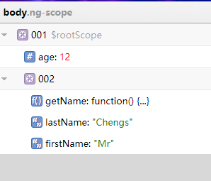

# **作用域**

- 是一个js实例对象
- 这个对象的属性/方法， 在页面中可以直接引用
- ng-app指令： 内部创建一个根作用域（$rootScope）, 是所有其它作用域的父对象
- $scope的2个重要方法
  - $apply(): 强制脏数据检查

- 当scope中的数据发生了改变, angular会将数据同步显示到页面, 这一操作称为"脏数据检查"
   angular在它的方法执行完后, 都会进行脏数据检查,
        * 在原生JS函数中改变作用域数据, angular是不会进行脏数据检查的
              * 使用$scope的$apply函数可以解决此问题

```

  	$scope.$apply(function(){
      //在这里更新scope数据, angular会同步更新其页面数据
    });

  * $apply()的本质是调用$digest()去进行脏数据检查更新页面的
  * $digest()虽然也能实现页面更新, 但建议使用$apply()
```

- $watch(): 监视scope中某个属性的变化 
  - angular是双向数据绑定的, Scope中的属性数据发生了改变, 会自动更新页面中对应的数据
  - 但有时, 我们想监视数据的变化情况, 来实现特定的功能
  - Angular提供了$watch()来实现
    - var unWatch = $scope.$watch('propertyName', function(newValue, oldValue){}, deepWatch)
    - 参数一: 指定监视属性的属性名
    - 参数二: 发现数据发生改变时的回调函数
    - 参数三: 是否深度监视, 默认是false, 代表只是监视属性本身, 而不监视其内部数据
    - 返回值: 用于取消监视的函数, 调用unWatch()取消监视


# 控制器

- 也是一个对象，是我们View与Model之间的桥梁
- 当我们使用了ng-controller指令， 内部就会创建控制器对象
- 但我们同时得提供控制器的构造函数（必须定义一个$scope的形参）
- 每定义一个ng-controller指令， 内部就会创建一个新的作用域对象（$scope）, 并输入构造函数中


- 作用域对象     :

  一个js实例对象, ng-app指令默认会创建一个根作用域对象(**$rootScope**)

  它的属性和方法与页面中的指令或表达式是关联的

- 控制器:

  用来控制AngularJS应用数据的 实例对象

  ng-controller : 指定控制器构造函数, Angular会自动new此函数创建控制器对象

  **同时Angular还有创建一个新的域对象$scope, 它是$rootScope的子对象**

  在控制器函数中声明$scope形参, Angular会自动将$scope传入


**作用域&控制器实例：**

```
<!DOCTYPE html>
<html>
<head lang="en">
  <meta charset="UTF-8">
  <title></title>
</head>
<body ng-app="" ng-init="age=12">
<div ng-controller="MyController">
  <input type="text" placeholder="姓" ng-model="firstName">
  <input type="text" placeholder="名" ng-model="lastName">

  <p>输入的姓名为: {{firstName+'-'+lastName}}</p>
  <p>输入的姓名2为: {{getName()}}</p>
</div>

<div>
  {{firstName}} <!--不能显示-->
</div>

<script type="text/javascript" src="../../js/angular-1.2.29/angular.js"></script>
<script type="text/javascript">
  function MyController ($scope) {//必须是$scope
    // alert(this instanceof MyController);//说明是new调用构造函数的实例
    $scope.firstName = 'Mr';
    $scope.lastName = 'Chengs';

    //给域对象指定方法
    $scope.getName = function() {
      return $scope.firstName + "  " + $scope.lastName;
    };

    console.log($scope.age);
  }
</script>
</body>
</html>
```





# **模块**

- 也是一个对象
- 创建模块对象： angular.module('模块名', [依赖的模块])
- 通过模块添加控制器：
  - module.controller('MyController', funnction($scope){//操作$scope的语句})
- angular的整体设计也是多模块的
  - 核心模块： angular.js
  - 扩展模块： angular-router.js, angular-message.js, angular-animate.js

- module对象的方法
  - controller() : 定义控制器
  - factory() : 定义服务对象
  - service() : 定义服务对象
  - filter() : 定义过滤器
  - directive() : 定义指令
  - config() : 指定做一些配置的回调函数


# 服务

- 是什么？ 具有特定功能的对象（object对象、函数，数组，基本类型）

- 内置服务

  - 都以$开头
  - 引入内置服务： 声明式依赖注入（定义形参）, 你不使用它就存在了
  - 常用的几个：
    - $rootScope
    - $scope
    - $timeout 
    - $interval
    - 脏数据检查: 
      - 当angular定义的函数执行完后, 会对scope内的属性进行检查, 如果发现有改变更新界面
      - 在非angular定义的回调函数执行完后, 不会进行脏数据检查 --->即使更新了scope页面不会同步更新
  - 页面如何能自动更新的？
    - 在内置的一些函数执行完后， angular会进行脏数据检查的操作
    - controller, $timeout()中的回调函数,  $interval()中的回调函数
    - 如果我们在setTimeout()的回调函数中更新scope，是不会进行脏数据检查的，页面不可能更新 

- 自定义服务

  - 使用module对象来定义服务

  - 定义的方法：

    - factory() : 可以定义任意类型的服务
    - service() ： 只能定义object类型对象

  - factory()

    ```
    factory('服务名', function(){
     return 服务对象;  //可以是任意类型
     })
    ```

  - 如何引入： 声明式依赖注入


# angular对象

- module() : 创建模型对象
- bootstrap() : 编码启动angular, 代替ng-app
- element() : 将dom对象/html标签包装为jQuery对象
- forEach() : 遍历数组和元素集合伪数组
- toJson()和fromJson() : js对象与Json字符串相互转换
- isArray(),isObject(),isFunction() : 类型判断
- lowercase()和uppercase() : 大小写转换