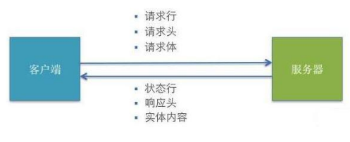

### 1.1MDN文档

https://developer.mozilla.org/zh-CN/docs/Web/HTTP/Overview

### 1.2**HTTP** **请求交互的基本过程**

1. 前后应用从浏览器端向服务器发送 HTTP 请求(请求报文) 

2. 后台服务器接收到请求后, 调度服务器应用处理请求, 向浏览器端返回 HTTP 

响应(响应报文) 

3. 浏览器端接收到响应, 解析显示响应体/调用监视回调

### 1.3 **HTTP** **请求报文**

1.请求行:

​	method url 

​	GET /product_detail?id=2 

​	POST /login 

2.多个请求头

Host: www.baidu.com 

Cookie: BAIDUID=AD3B0FA706E; BIDUPSID=AD3B0FA706; 

Content-Type(内容类型): application/x\-www\-form\-urlencoded 

​												或者 application/json

3.请求体
	username=tom&pwd=123 
	{"username": "tom", "pwd": 123}

### **1.4. HTTP** **响应报文**

1. 响应状态行: status statusText 
2. 多个响应头
		    Content-Type(类型): text/html;charset=utf-8 
		Set-Cookie: BD_CK_SAM=1;path=/ 
3. 响应体 
		html 文本/json 文本/js/css/图片...

### **1.5.** **post** **请求体参数格式**

1.Content-Type: application/x-www-form-urlencoded;charset=utf-8 
		用于键值对参数，参数的键值用=连接, 参数之间用&连接 
		例如: name=%E5%B0%8F%E6%98%8E&age=12 

2.Content-Type: application/json;charset=utf-8 
		用于 json 字符串参数 
		例如: {"name": "%E5%B0%8F%E6%98%8E", "age": 12} 

3.Content-Type: multipart/form-data
		用于文件上传请求

### **1.6.** **常见的响应状态码**

200 		OK 		请求成功。一般用于 GET 与 POST 请求 
201 		Created 		已创建。成功请求并创建了新的资源 
401 		Unauthorized 		未授权/请求要求用户的身份认证 
404 		Not Found		 服务器无法根据客户端的请求找到资源 
500		 Internal Server Error 		服务器内部错误，无法完成请求

### **1.7.** **不同类型的请求及其作用**

GET: 从服务器端读取数据 
POST: 向服务器端添加新数据 
PUT: 更新服务器端已经数据 
DELETE: 删除服务器端数据

### **1.8. API** **的分类**

REST API: restful 
(1) 发送请求进行 C

RUD 哪个操作由请求方式来决定 
(2) 同一个请求路径可以进行多个操作 
(3) 请求方式会用到 GET/POST/PUT/DELETE

非 REST API: restless 
(1) 请求方式不决定请求的 CRUD 操作 
(2) 一个请求路径只对应一个操作 
(3) 一般只有 GET/POST

