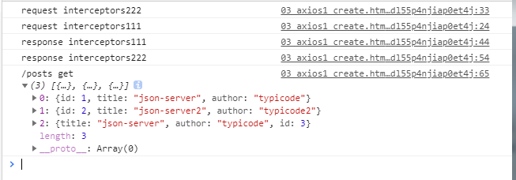

## 1 **是什么**

\1. 前端最流行的 ajax 请求库 

\2. react/vue 官方都推荐使用 axios 发 ajax 请求 

\3. 文档: https://github.com/axios/axios 


## **2. axios** **特点**

\1. 基本 promise 的异步 ajax 请求库 

\2. 浏览器端/node 端都可以使用 

\3. 支持请求／响应拦截器 

\4. 支持请求取消 

\5. 请求/响应数据转换 

\6. 批量发送多个请求


## **3. axios** **常用语法** 

axios(config): 通用/最本质的发任意类型请求的方式 

axios(url[, config]): 可以只指定 url 发 get 请求 

axios.request(config): 等同于 axios(config) 

axios.get(url[, config]): 发 get 请求 

axios.delete(url[, config]): 发 delete 请求 

axios.post(url[, data, config]): 发 post 请求 

axios.put(url[, data, config]): 发 put 请求


axios.defaults.xxx: 请求的默认全局配置 

axios.interceptors.request.use(): 添加请求拦截器 

axios.interceptors.response.use(): 添加响应拦截器 


axios.create([config]): 创建一个新的 axios(它没有下面的功能) 


axios.Cancel(): 用于创建取消请求的错误对象 

axios.CancelToken(): 用于创建取消请求的 token 对象 

axios.isCancel(): 是否是一个取消请求的错误 

axios.all(promises): 用于批量执行多个异步请求

axios.spread(): 用来指定接收所有成功数据的回调函数的方法 


```
<div>
  <button onclick="testGet()">GET请求</button>
  <button onclick="testPost()">POST请求</button>
  <button onclick="testPut()">PUT请求</button>
  <button onclick="testDelete()">DELETE请求</button>
</div>
```

```
<script src="https://unpkg.com/axios/dist/axios.min.js"></script>
<script>
  //指定默认配置
  axios.defaults.baseURL='http://localhost:3000'

  function testGet() {
    axios({
      url:'/posts',
      id:'1'
    }).then(response => {
      console.log('/posts get', response.data)
      alert(response.data.toString())
     })
  }

  function testPost() {
      axios({
        url:'/posts',
        method:'POST',
        data:{"title": "json-server1111", "author": "typicode1111"}
      }).then(response => {
             console.log('/posts post', response.data)
      })
  }

  function testPut() {
        axios({
          url:'/posts/4',//修改id等于4的值
          method:'PUT',
          data:{"id": "json-server222", "author": "typicode222"}
        }).then(response => {
              console.log('/posts put', response.data)
        })
  }

  function testDelete() {
          axios({
            url:'/posts/4',//删除id等于4的值
            method:'DELETE'

          }).then(response => {
              console.log('/posts delete', response.data)
            })
  }

</script>
```


## **4.** **难点语法的理解和使用** 

**axios.create(config)** 

\1. 根据指定配置创建一个新的 axios, 也就就每个新 axios 都有自己的配置 

\2. 新 axios 只是没有取消请求和批量发请求的方法, 其它所有语法都是一致的 

\3. 为什么要设计这个语法? 

​			(1) 需求: 项目中有部分接口需要的配置与另一部分接口需要的配置不太一 					样, 如何处理 

​		(2) 解决: 创建 2 个新 axios, 每个都有自己特有的配置, **分别应用到不同要** 

​				**求的接口请求中** 

```
<script src="https://unpkg.com/axios/dist/axios.min.js"></script>
<script>

  //指定默认配置
  //axios.defaults.baseURL='http://localhost:3000'

  const  instance = axios.create({
    //指定默认配置
    baseURL:'http://localhost:3000'
  })

  //instance发请求
  instance({
    url:'/http://localhost:4000'//请求4000端口
  })
  instance.get('/posts')//请求的是4000端口


</script>
```


**拦截器函数/ajax** **请求/请求的回调函数的调用顺序**

\1. 说明: 调用 axios()并不是立即发送 ajax 请求, 而是需要经历一个较长的流程 

\2. 流程: 请求拦截器2 => 请求拦截器 1 => 发ajax请求 => 响应拦截器1 => 响 

应拦截器 2 => 请求的回调 

\3. 注意: 此流程是通过 promise 串连起来的, 请求拦截器传递的是 config, 响应 

拦截器传递的是 response


```
  //添加请求拦截器
  axios.interceptors.request.use(function (config) {
    // Do something before request is sent
    console.log('request interceptors111')
    return config;
  },function (error) {
    // Do something with request error
    return Promise.reject(error);
  })

  axios.interceptors.request.use(function (config) {
    // Do something before request is sent
    console.log('request interceptors222')
    return config;
  },function (error) {
    // Do something with request error
    return Promise.reject(error);
  })

  //添加相应拦截器
  axios.interceptors.response.use(function (response) {
    // Any status code that lie within the range of 2xx cause this function to trigger
    // Do something with response data
    console.log('response interceptors111')
    return response;
  }, function (error) {
    // Any status codes that falls outside the range of 2xx cause this function to trigger
    // Do something with response error
    return Promise.reject(error);
  });
  axios.interceptors.response.use(function (response) {
    // Any status code that lie within the range of 2xx cause this function to trigger
    // Do something with response data
    console.log('response interceptors222')
    return response;
  }, function (error) {
    // Any status codes that falls outside the range of 2xx cause this function to trigger
    // Do something with response error
    return Promise.reject(error);
  });


  axios.get('http://localhost:3000/posts')
          .then(response => {
            console.log('/posts get', response.data)
          }).catch(error=>{
            console.log("error:" + error.message)
        })

```




\1. 基本流程 

配置 cancelToken 对象 

缓存用于取消请求的 cancel 函数 

在后面特定时机调用 cancel 函数取消请求 

在错误回调中判断如果 error 是 cancel, 做相应处理 

\2. 实现功能 

点击按钮, 取消某个正在请求中的请求 

在请求一个接口前, 取消前面一个未完成的请求 

```
  <button onclick="getProducts1()">获取商品列表1</button><br>
  <button onclick="getProducts2()">获取商品列表2</button><br>
  <button onclick="cancelReq()">取消请求</button><br>
```

```
  const CancelToken = axios.CancelToken;
  let cancel;//用于保存取消请求的函数
```

```
  function getProducts1() {
            axios.get('http://localhost:4000/products1',{
                cancelToken: new CancelToken(function executor(c) { //c用于取消当前请求的函数
                // An executor function receives a cancel function as a parameter
                  //用于保存取消函数，用于之后的可能取消当前请求
                cancel = c;
              })
            })
            .then(response => {
              console.log('请求成功1', response.data)
              //请求成功之后cancel没有使用的意义
              cancel =null;
            }).catch(error=>{
             console.log("error1:" + error.message)
            //请求失败之后cancel没有使用的意义
            cancel =null;
        })
  }
```

```
  function cancelReq() {
    //如果没有点击相关的请求函数会有问题进行判断
    if (typeof  cancel == 'function'){
      cancel('强制取消请求')//执行取消请求的函数
      //catch(error=>{}进行执行相应的代码
    }else {
      alert('无可取消的请求')
    }
  }
```


点击1之后又进行点击按钮2

此时需要进行取消之前的请求事件

```
function getProducts1() {

           // 准备发请求前 取消未完成的请求
            if (typeof  cancel == 'function'){
              cancel('强制取消请求')//执行取消请求的函数
            }

            axios.get('http://localhost:4000/products1',{
                cancelToken: new CancelToken(function executor(c) { //c用于取消当前请求的函数
                // An executor function receives a cancel function as a parameter
                  //用于保存取消函数，用于之后的可能取消当前请求
                cancel = c;
              })
            })
            .then(response => {
              console.log('请求成功1', response.data)
              //请求成功之后cancel没有使用的意义
              cancel =null;
            }).catch(error=>{
                if (axios.isCancel(error)){
                  console.log('请求取消错误')
                }else {
                  console.log("error1:" + error.message)
                  //请求失败之后cancel没有使用的意义
                  cancel =null;
                }
        })
  }
```

 if (axios.isCancel(error)){
                  console.log('请求取消错误')
                }else {
                  console.log("error1:" + error.message)
                  //请求失败之后cancel没有使用的意义
                  cancel =null;
}


可以相关重用的代码进行提取出来

使用连接器链进行在请求前和响应之间进行相应的处理

```
  const CancelToken = axios.CancelToken;
  let cancel;//用于保存取消请求的函数
```

```
//添加请求拦截器
  axios.interceptors.request.use(function (config) {
    // 准备发请求前 取消未完成的请求
    if (typeof  cancel == 'function'){
      cancel('强制取消请求')//执行取消请求的函数
    }

    //添加CancelToken配置
    config.cancelToken = new CancelToken(function executor(c) { //c用于取消当前请求的函数
      // An executor function receives a cancel function as a parameter
      //用于保存取消函数，用于之后的可能取消当前请求
      cancel = c;
    })

    return config;
  },function (error) {
    // Do something with request error
    return Promise.reject(error);
  })
```

```
  //添加相应拦截器
  axios.interceptors.response.use(function (response) {
    return response;
  }, function (error) {

    if (axios.isCancel(error)){//取消请求错误
      console.log('请求取消错误')
      //中断响应链
      return new Promise(()=>{})
    }else {
      console.log("error:" + error.message)
      //请求失败之后cancel没有使用的意义
      cancel =null;

      //将错误乡下传递
      return Promise.reject(error);
    }

    return Promise.reject(error);
  });
```

```
  function getProducts1() {
            axios.get('http://localhost:4000/products1')
            .then(response => {
              console.log('请求成功1', response.data)
              //请求成功之后cancel没有使用的意义
              cancel =null;//可以提上去在response相应中
            }).catch(error=>{
              console.log('请求取消错误')
        })
  }

  function getProducts2() {
    axios.get('http://localhost:4000/products2')
            .then(response => {
              console.log('请求成功2', response.data)
              //请求成功之后cancel没有使用的意义
              cancel =null;
            }).catch(error=>{
           console.log('请求取消错误')
      })
  }

```

拦截器链的思想可以进行较好的整合在前后进行相应的执行

是逻辑代码仅仅只执行代码的逻辑


