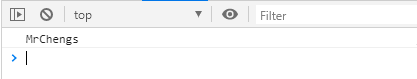

## 理解:

  * 除了正常运行模式(**混杂模式**)，ES5添加了第二种运行模式："严格模式"（strict mode）。
  * 顾名思义，这种模式使得Javascript在更严格的语法条件下运行


## 目的/作用

* 消除Javascript语法的一些不合理、不严谨之处，减少一些怪异行为
* 消除代码运行的一些不安全之处，为代码的安全运行保驾护航
* 为未来新版本的Javascript做好铺垫


## 使用

  * 在全局或函数的第一条语句定义为: 'use strict';
  * 如果浏览器不支持, 只解析为一条简单的语句, 没有任何副作用


## 语法和行为改变

- 必须用var声明变量
- 禁止自定义的函数中的this指向window
- 创建eval作用域
- 对象不能有重名的属性
- 函数不能有重名的形参


1、必须用var声明变量

默认不适用var定义的数据是window对象

```
<script type="text/javascript">
  //'use strict';
  username = 'MrChengs';
  console.log(username)
</script>
```




使用use strict

使用之后语法就会报错

```
<script type="text/javascript">
  'use strict';
  username = 'MrChengs';
  console.log(username)
</script>
```


加上var就不会报错

```
<script type="text/javascript">
  'use strict';
  var username = 'MrChengs';
  console.log(username)
</script>
```


2、禁止自定义的函数中的this指向window

不报错

```
<script type="text/javascript">
  'use strict';
  var username = 'MrChengs';
  console.log(username)

  function person(name,age) {
    this.name = name;
    this.age = age;
  }

  new person('MrCHeng',12);

</script>
```

报错

```
<script type="text/javascript">
  'use strict';
  var username = 'MrChengs';
  console.log(username)

  function person(name,age) {
    this.name = name;
    this.age = age;
  }

   person('MrCHeng',12);

</script>
```


3、创建eval作用域

eval函数会解析传入的字符串进行执行

会打印**MrChengs**

```
  var str   = 'MrChengs';
  eval('alert(str)');
```


会打印两边**MR**

```
<script type="text/javascript">
  //'use strict';
  var str   = 'MrChengs';
  eval(' var str   = "MR";alert(str)');
  alert(str)
</script>
```

注意：不使用严格模式，eval没有自己的作用域，里面的变量相当于全局的


使用全局模式

```
<script type="text/javascript">
  'use strict';

  var str   = 'MrChengs';
  eval(' var str   = "MR";alert(str)');
  alert(str)
</script>
```

会打印MR、MrChengs


4、函数不能有重名的形参

```
  'use strict';
var o = {
    names:'w',
    names:'a'
  }
```


