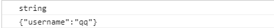
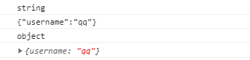

## JSON.stringify(obj/arr)
js对象(数组)转换为json对象(数组)


```
<script type="text/javascript">
  var obj ={
    username:'qq'
  }
  obj = JSON.stringify(obj);
  console.log(typeof  obj);
  console.log(obj);
</script>
```




## JSON.parse(json)
json对象(数组)转换为js对象(数组)


```
<script type="text/javascript">
  var obj ={
    username:'qq'
  }
  obj = JSON.stringify(obj);
  console.log(typeof  obj);
  console.log(obj);

  obj=JSON.parse(obj);
  console.log(typeof  obj);
  console.log(obj);

</script>
```




