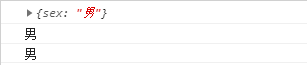
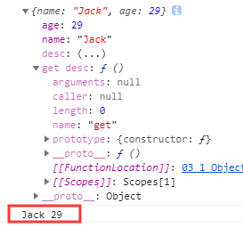

ES5给Object扩展了好一些静态方法, 常用的2个:


## Object.create

**Object.create(prototype, [descriptors])**

  * 作用: 以指定对象为原型创建新的对象
  * 为新的对象指定新的属性, 并对属性进行描述,**均是对扩展属性结果来说**
    **value** : 指定值
    **writable** : 标识当前属性值是否是可修改的, 默认为false
    **configurable**: 标识当前属性是否可以被删除 默认为false
    **enumerable**： 标识当前属性是否能用for in 枚举 默认为false


- **create**

```
  var obj = {name : 'Jack', age : 29}
  var obj1 = {};

  obj1 = Object.create(obj);
  console.log(obj1)
  console.log(obj1.name)
  console.log(obj1.age)
```


- **value** : 指定值

扩展属性

并且修改数值

此时设置修改属性的值失败

因为还需要writable 属性值进行修改，默认为false，对扩展属性修改无效

```
  var obj = {name : 'Jack', age : 29}
  var obj1 = {};

  //添加扩展属性
  obj1 = Object.create(obj,{
    sex:{//添加的新属性
      value:'男'//添加的属性值
    }
  });
  console.log(obj1)
  console.log(obj1.name)
  console.log(obj1.age)
  console.log(obj1.sex)
```


- **writable** : 标识当前属性值是否是可修改的, 默认为false

```
<script type="text/javascript">
  var obj = {name : 'Jack', age : 29}
  var obj1 = {};

  //添加扩展属性
  obj1 = Object.create(obj,{
    sex:{//添加的新属性
      value:'男',//添加的属性值
      writable:true
    }
  });
  console.log(obj1)

  console.log(obj1.sex)
  //修改扩展属性的值
  obj1.sex='女';
  console.log(obj1.sex)
</script>
```


- **delete** 进行删除

使用delete进行删除扩展的属性

此时是删除失败的

configurable: 标识当前属性是否可以被删除 默认为false

```
<script type="text/javascript">

  var obj = {name : 'Jack', age : 29}
  var obj1 = {};

  //添加扩展属性
  obj1 = Object.create(obj,{
    sex:{//添加的新属性
      value:'男',//添加的属性值
      writable:true
    }
  });
  console.log(obj1)

  console.log(obj1.sex)
  //s删除扩展属性
  delete obj1.sex;

  console.log(obj1.sex)

</script>
```




- **configurable**: 标识当前属性是否可以被删除 默认为false

```
<script type="text/javascript">
  var obj = {name : 'Jack', age : 29}
  var obj1 = {};

  //添加扩展属性
  obj1 = Object.create(obj,{
    sex:{//添加的新属性
      value:'男',//添加的属性值
      writable:true,// 标识当前属性值是否是可修改的
      configurable:true//标识当前属性是否可以被删除
    }
  });
  console.log(obj1)

  console.log(obj1.sex)
  //s删除扩展属性
  delete obj1.sex;

  console.log(obj1.sex)

</script>
```


- **enumerable**： 标识当前属性是否能用for in 枚举

```
<script type="text/javascript">
  var obj = {name : 'Jack', age : 29}
  var obj1 = {};
  //添加扩展属性
  obj1 = Object.create(obj,{
    sex:{//添加的新属性
      value:'男',//添加的属性值
      writable:true,// 标识当前属性值是否是可修改的
      configurable:true//标识当前属性是否可以被删除
    }
  });

  console.log(obj1.sex)
  //s删除扩展属性
  //delete obj1.sex;
  for (var i in obj1){
    console.log(i + "循环")
  }
</script>
```


默认当前属扩展属性是不可以进行遍历的

需要使用enumerable属性为true才能进行遍历扩展的属性


```
<script type="text/javascript">
  var obj = {name : 'Jack', age : 29}
  var obj1 = {};
  //添加扩展属性
  obj1 = Object.create(obj,{
    sex:{//添加的新属性
      value:'男',//添加的属性值
      writable:true,// 标识当前属性值是否是可修改的
      configurable:true,//标识当前属性是否可以被删除
      enumerable:true
    }
  });

  console.log(obj1.sex)
  //s删除扩展属性
  //delete obj1.sex;
  for (var i in obj1){
    console.log(i + "循环")
  }
</script>
```


## Object.defineProperties

**Object.defineProperties(object, descriptors)**

  * 作用: 为指定对象定义扩展多个属性
  * get ：用来获取当前属性值得回调函数
  * set ：修改当前属性值得触发的回调函数，并且实参即为修改后的值
  * 存取器属性：setter,getter一个用来存值，一个用来取值


- **get:用来获取当前属性值得回调函数**

```
  var obj = {name : 'Jack', age : 29}

  //Object.defineProperties(object, descriptors)
  Object.defineProperties(obj,{
    desc:{
      get : function () {
        return this.name + ' ' + this.age;
      }
    }
  })

  console.log(obj);
  console.log(obj.desc);
```




**注意**：

获取扩展属性值的时候自动调用

自动调用后会将变化的值作为实参

每获取一次就会触发调用get函数一次


- **set ：修改当前属性值得触发的回调函数，并且实参即为修改后的值**

```
  var obj = {name : 'Jack', age : 29}

  //Object.defineProperties(object, descriptors)
  Object.defineProperties(obj,{
    desc:{
      get : function () {//获取扩展属性值
        return this.name + ' ' + this.age;
      },
      set : function (data) {
        //监听扩展属性，当扩展属性属性发生变化时自动调用
        //会将变化的值作为实参注入到set函数
        console.log("set函数触发："+ data);
      }
    }
  })

  obj.desc = "描述信息";

  console.log(obj.desc);

```

此时可以监听到数据的变化但是不会对数据进行改变

set监听函数也进行触发


修改数据成功

```
  var obj = {name : 'Jack', age : 29}

  //Object.defineProperties(object, descriptors)
  Object.defineProperties(obj,{
    desc:{
      get : function () {//获取扩展属性值
        return this.name + ' ' + this.age;
      },
      set : function (data) {
        //监听扩展属性，当扩展属性属性发生变化时自动调用
        //会将变化的值作为实参注入到set函数
        console.log("set函数触发："+ data);
        //此时可以监听到数据的变化
        //可以根据监听到的数据进行对数据的修改
        var descs = data.split(' ');
        this.name = descs[0];
        this.age = descs[1];
      }
    }
  })

  obj.desc = "Tom 12";

  console.log(obj.desc);
```


## 对象本身的两个方法

对象本身的两个方法
* **get propertyName(){}** 用来得到当前属性值的回调函数
* **set propertyName(){}** 用来监视当前属性值变化的回调函数


```
    var obj = {
        name : 'Jack',
        age : 29,
        get desc(){
            return this.name + ' ' + this.age;
        }
    };
    console.log(obj)
```


```
    var obj = {
        name : 'Jack',
        age : 29,
        get desc(){
            return this.name + ' ' + this.age;
        },
        set desc(data){
            console.log("set函数触发："+ data);
            //此时可以监听到数据的变化
            //可以根据监听到的数据进行对数据的修改
            var descs = data.split(' ');
            this.name = descs[0];
            this.age = descs[1];
        }
    };

    obj.desc = "Tom 12";

    console.log(obj)
```


