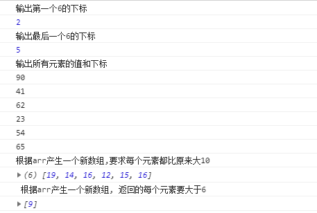

- Array.prototype.indexOf(value) : 

  得到值在数组中的第一个下标


- Array.prototype.lastIndexOf(value) : 

  得到值在数组中的最后一个下标


- Array.prototype.forEach(function(item, index){}) : 

  遍历数组


- Array.prototype.map(function(item, index){}) : 

  遍历数组返回一个新的数组，返回加工之后的值


- Array.prototype.filter(function(item, index){}) : 

  遍历过滤出一个新的子数组， 返回条件为true的值


```
  var arr = [9, 4, 6, 2, 5, 6];
  console.log("输出第一个6的下标")
  console.log( arr.indexOf(6))

  console.log("输出最后一个6的下标")
  console.log( arr.lastIndexOf(6))

  console.log("输出所有元素的值和下标")
  arr.forEach(function (item,index) {
    console.log(item + "" + index)
  })

  console.log("根据arr产生一个新数组,要求每个元素都比原来大10")
  var arr1 = arr.map(function (item,index){
    return item + 10;
  })
  console.log(arr1)

  console.log(' 根据arr产生一个新数组, 返回的每个元素要大于6')
  var arr3 = [9, 4, 6, 2, 5, 6];
  var arr2 = arr3.filter(function(item, index){
    return item >6;
  })
  console.log(arr2)
```





