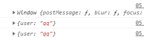
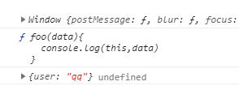

1. Function.prototype.bind(obj) :
  * 作用: 将函数内的this绑定为obj, 并将函数返回


2.  区别bind()与call()和apply()?
  * 都能指定函数中的this
  * call()/apply()是立即调用函数
  * bind()是将函数返回


- call和apply在不传参数的情况下使用时一样的

```
<script type="text/javascript">

  var obj = {user:'qq'}

  function foo(){
    console.log(this)
  }

  foo();
  //强制将this绑定为对象
  foo.call(obj);
  foo.apply(obj)

</script>
```




- call和apply传参

区别：传入参数的形式

call：直接从第二个参数开始，一次传入

apply：第二个参数必须是数组，传入的参数放在数组里面

```
  var obj = {user:'qq'}

  function foo(data){
    console.log(this,data)
  }

  foo();
  //强制将this绑定为对象
  foo.call(obj,11);
  foo.apply(obj,[33])
```


- bind:

绑定完this不会立即调用当前的函数

会将函数返回

```
  var obj = {user:'qq'}

  function foo(data){
    console.log(this,data)
  }

  foo();

  var binds = foo.bind(obj)
  console.log(binds)
  binds()

```




- bind传参问题

  传参数与call类型一致

```
  var obj = {user:'qq'}

  function foo(data){
    console.log(this,data)
  }

  //
  foo.bind(obj,123)()
```


如果希望函数中的this绑定的不是window对象

同时在调用时触发

此时使用bind返回回调函数


