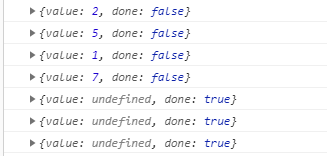

**概念**： iterator是一种接口机制，为各种不同的数据结构提供统一的访问机制


**作用**：
  1、为各种数据结构，提供一个统一的、简便的访问接口；
  2、使得数据结构的成员能够按某种次序排列
  3、ES6创造了一种新的遍历命令for...of循环，Iterator接口主要供for...of消费。


**工作原理**：

  - 创建一个指针对象，指向数据结构的起始位置。
  - 第一次调用next方法，指针自动指向数据结构的第一个成员
  - 接下来不断调用next方法，指针会一直往后移动，直到指向最后一个成员
  - 每调用next方法返回的是一个包含value和done的对象，{value: 当前成员的值,done: 布尔值}
    * value表示当前成员的值，done对应的布尔值表示当前的数据的结构是否遍历结束。
    * 当遍历结束的时候返回的value值是undefined，done值为false
原生具备iterator接口的数据(可用for of遍历)
    1、Array
    2、arguments
    3、set容器
    4、map容器
    5、String


模拟接口的实现

```
    function iterator(arr) {
      //闭包
      //记录指针的位置
      let nextIndex = 0;
      //遍历器对象
      return {
        next : function () {
            return nextIndex < arr.length ? {value :arr[nextIndex++],done:false} :
                    {value: undefined,done: true}
        }
      }
    }


    let arr =[2,5,1,7]
    let iteratorArr = iterator(arr);
    console.log(iteratorArr.next() )
    console.log(iteratorArr.next())
    console.log(iteratorArr.next())
    console.log(iteratorArr.next())
    console.log(iteratorArr.next())
    console.log(iteratorArr.next())
    console.log(iteratorArr.next())
```




原生具备iterator接口的数据(可用for of遍历)

将iterator接口部署到指定的数据类型上可以使用for ...of进行实现

```
1、Array2、arguments3、set容器4、map容器5、String ....
```

```
    // 原生测试  数组
        let arr3 = [1, 2, 'kobe', true];
        for(let i of arr3){
          console.log(i);
        }
        // 字符串  string
        let str = 'abcdefg';
        for(let item of str){
          console.log(item);
        }

```


