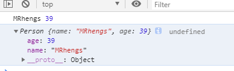
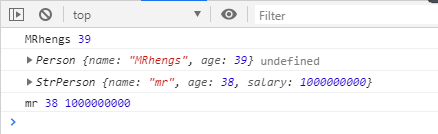

1. 通过class定义类/实现类的继承
2. 在类中通过constructor定义构造方法
3. 通过new来创建类的实例
4. 通过extends来实现类的继承
5. 通过super调用父类的构造方法
6. 重写从父类中继承的一般方法


类：

```
    class Person {
        //调用类的构造方法
        constructor(name, age){//构造方法专门构造函数，底层的实现
            this.name = name;
            this.age = age;
        }
        //定义一般的方法
        showName(){
            console.log(this.name, this.age);
        }
    }
    let person = new Person('MRhengs', 39);
    console.log(person, person.showName());
```




- 子类（继承）

```
 class Person {
        //调用类的构造方法
        constructor(name, age){//构造方法专门构造函数，底层的实现
            this.name = name;
            this.age = age;
        }
        //定义一般的方法
        showName(){
            console.log(this.name, this.age);
        }
    }
    let person = new Person('MRhengs', 39);
    console.log(person, person.showName());

    //定义一个子类
    class StrPerson extends Person{
        constructor(name, age, salary){
            super(name, age);//调用父类的构造方法
            this.salary = salary;
        }
        showName(){//在子类自身定义方法
            console.log(this.name, this.age, this.salary);
        }
    }
    let str = new StrPerson('mr', 38, 1000000000);
    console.log(str);
    str.showName();
```




