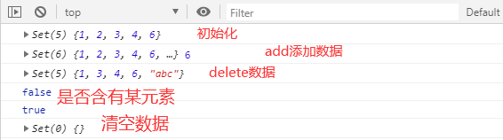
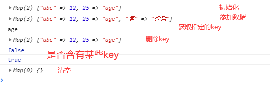

1. Set容器 : 无序**不可重复**的多个value的集合体
  * Set()
  * Set(array)
  * add(value)
  * delete(value)
  * has(value)
  * clear()
  * size
2. Map容器 : 无序的 key**不重复的多个key**-value的集合体
  * Map()
  * Map(array)
  * set(key, value)//添加
  * get(key)
  * delete(key)
  * has(key)
  * clear()
  * size


- set

```
 let set = new Set([1,2,3,4,3,2,1,6]);
    console.log(set );
    set.add('abc');
    console.log(set, set.size);

    //delete(value)
    set.delete(2);
    console.log(set);

    //has(value)
    console.log(set.has(2));//false
    console.log(set.has(1));//true

    //clear()
    set.clear();
    console.log(set);
```




- map

```
    let map = new Map([['abc', 12],[25, 'age']]);
    console.log(map);

    //set(key, value)//添加
    map.set('男', '性别');
    console.log(map);

    //get(key)
    console.log(map.get(25));//age
    //delete(key)
    map.delete('男');
    console.log(map);

    //has(key)
    console.log(map.has('男'));//false
    console.log(map.has('abc'));//true
    map.clear();
    console.log(map);
```



