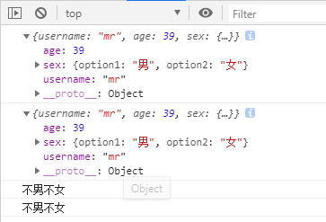

  1、数据类型：
    * 数据分为基本的数据类型(String, Number, boolean, Null, Undefined)和对象数据类型
    - 基本数据类型：
      特点： 存储的是该对象的实际数据
    - 对象数据类型：
      特点： 存储的是该对象在栈中引用，真实的数据存放在堆内存里


  2、复制数据
    - 基本数据类型存放的就是实际的数据，可直接复制
      let number2 = 2;
      let number1 = number2;

    - 克隆数据：对象/数组
      - 1、区别： 浅拷贝/深度拷贝
           判断： 拷贝是否产生了新的数据还是拷贝的是数据的引用
         知识点：对象数据存放的是对象在栈内存的引用，直接复制的是对象的引用
           let obj = {username: 'kobe'}
           let obj1 = obj; // obj1 复制了obj在栈内存的引用
      - 2、常用的拷贝技术
          1). arr.concat(): 数组浅拷贝
          2). arr.slice(): 数组浅拷贝
          3). JSON.parse(JSON.stringify(arr/obj)): 数组或对象深拷贝, 但不能处理函数数据
          4). 浅拷贝包含函数数据的对象/数组
          5). 深拷贝包含函数数据的对象/数组


- 浅度复制

此时的新对象内存地址会指向原对象的地址

修改新对象的同时也会修改原对象的数据

```
  let obj = {username: 'mr', age: 39, sex: {option1: '男', option2: '女'}};
  let obj1 = obj;
  console.log(obj1);
  console.log(obj);
  obj1.sex.option1 = '不男不女'; // 修改复制的对象会影响原对象
  console.log(obj1.sex.option1);//不男不女
  console.log(obj.sex.option1);//不男不女
```




- 浅复制

  修改复制的对象会影响原对象

```

  let obj = {username: 'mr', age: 39, sex: {option1: '男', option2: '女'}};
  // Object.assign();  浅复制
  let obj2 = {};
  Object.assign(obj2, obj);
  console.log(obj2);

  obj2.sex.option1 = '不男不女'; // 修改复制的对象会影响原对象
  console.log( obj);
  console.log(obj2);
```


- 深度克隆(复制)

  ```
  function getObjClass(obj) {
      let result = Object.prototype.toString.call(obj).slice(8, -1);
      if(result === 'Null'){
        return 'Null';
      }else if(result === 'Undefined'){
        return 'Undefined';
      }else {
        return result;
      }
    }
  ```

  


- 深度克隆

  如果是其他数据类型不复制，直接将数据返回

```
  // 深度克隆(复制)
  function getObjClass(obj) {
    let result = Object.prototype.toString.call(obj).slice(8, -1);
    if(result === 'Null'){
      return 'Null';
    }else if(result === 'Undefined'){
      return 'Undefined';
    }else {
      return result;
    }
  }
  // 深度克隆
  function deepClone(obj) {
    let result, objClass = getObjClass(obj);
    if(objClass === 'Object'){
      result = {};
    }else if(objClass === 'Array'){
      result = [];
    }else {
      return obj; // 如果是其他数据类型不复制，直接将数据返回
    }
    // 遍历目标对象
    for(let key in obj){
      let value = obj[key];
      if(getObjClass(value) === "Object" || 'Array'){
        result[key] = deepClone(value);
      }else {
        result[key] = obj[key];
      }
    }
    return result;
  }
  
  
  let obj3 = {username: 'kobe',age: 39, sex: {option1: '男', option2: '女'}};
  let obj4 = deepClone(obj3);
  console.log(obj4);
  obj4.sex.option1 = '不男不女'; // 修改复制后的对象不会影响原对象
  console.log(obj4, obj3);
```


