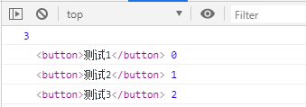

- Array.from(v) : 将伪数组对象或可遍历对象转换为真数组

- Array.of(v1, v2, v3) : 将一系列值转换成数组

- find(function(value, index, arr){return true}) : 找出第一个满足条件返回true的元素

- findIndex(function(value, index, arr){return true}) : 找出第一个满足条件返回true的元素下标


- Array.from(v)

```
<button>测试1</button>

<button>测试2</button>

<button>测试3</button>
```

```
    //Array.from(v) : 将伪数组对象或可遍历对象转换为真数组
    let btns = document.getElementsByTagName('button');
    console.log(btns.length);//3

    Array.from(btns).forEach(function (item, index) {
        console.log(item, index);
    });
```




- Array.of(v1, v2, v3)

```
    //Array.of(v1, v2, v3) : 将一系列值转换成数组
    let arr = Array.of(1, 'abc', true);
    console.log(arr);     //(3) [1, "abc", true]
```


- find(function(value, index, arr){return true})

```
 //find(function(value, index, arr){return true}) : 找出第一个满足条件返回true的元素
    let arr1 = [1,3,5,2,6,7,3];
    let result = arr1.find(function (item, index) {
        return item >3
    });
    console.log(result);//5
```


- findIndex(function(value, index, arr){return true})

```
 	let arr1 = [1,3,5,2,6,7,3];
    let result1 = arr1.findIndex(function (item, index) {
        return item >3
    });
    console.log(result1);//2
```


